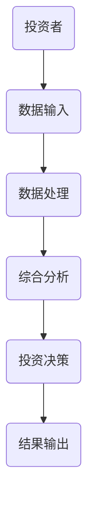
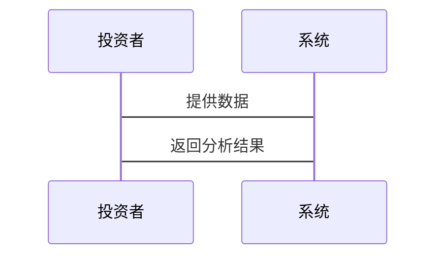

                 

<think>
好的，我需要根据用户的要求，撰写一篇关于芒格的“思维复杂性”在跨界创新投资中的重要性的技术博客文章。首先，我需要理解用户的需求。用户希望文章的结构清晰、逻辑严密，使用专业的技术语言，同时要有深度和见解。

### 关键词
我需要先确定文章的核心关键词。芒格的思维复杂性、投资决策、跨界创新、系统性思维、投资策略、算法原理、系统架构、实际案例分析。

### 摘要
摘要需要简明扼要地概括文章的核心内容和主题思想。文章主要探讨芒格的思维复杂性在跨界创新投资中的重要性，分析其在投资决策中的应用，结合算法原理和系统架构，提供实际案例分析和最佳实践。

### 目录结构
根据用户提供的目录结构，我需要按照以下顺序撰写文章：

1. **背景介绍**
   - **核心概念术语说明**
     - 思维复杂性定义
     - 投资决策中的应用
   - **问题背景**
     - 传统投资决策的局限性
     - 跨界创新投资中的挑战
   - **问题描述**
     - 投资中的不确定性
     - 跨界创新的复杂性
   - **问题解决**
     - 芒格思维复杂性在投资中的应用
   - **边界与外延**
     - 适用范围
     - 局限性
   - **概念结构与核心要素**
     - 核心要素
     - 与其他投资理论的对比

2. **核心概念与联系**
   - **核心原理**
     - 思维复杂性的基本原理
     - 投资决策的关系
   - **属性特征对比**
     - 核心属性
     - 与传统投资决策的对比
   - **ER实体关系图**
     - 使用Mermaid绘制ER图，展示投资者、投资决策、跨界创新、思维复杂性之间的关系。

3. **算法原理讲解**
   - **算法流程图**
     - 使用Mermaid绘制算法流程图，展示思维复杂性在投资中的具体应用步骤。
   - **数学模型和公式**
     - 提供相关的数学模型，如决策树、概率论公式，详细讲解每个步骤。
   - **Python代码实现**
     - 编写Python代码，模拟芒格思维复杂性在投资中的应用，解读代码的功能和实际效果。

4. **系统分析与架构设计方案**
   - **问题场景介绍**
     - 描述投资中的具体问题场景。
   - **系统功能设计**
     - 绘制领域模型类图，展示系统的各个模块和功能。
   - **系统架构设计**
     - 绘制系统架构图，展示各模块之间的关系和交互。
   - **系统接口设计**
     - 描述系统的接口设计，包括输入输出接口、数据流接口等。
   - **系统交互序列图**
     - 绘制系统交互序列图，展示用户与系统之间的交互过程。

5. **项目实战**
   - **环境安装**
     - 说明需要安装的工具和环境，如Python、Jupyter Notebook等。
   - **系统核心实现源代码**
     - 提供Python源代码，详细解释每个部分的功能。
   - **代码应用解读与分析**
     - 分析代码的具体实现，说明如何应用芒格思维复杂性进行投资决策。
   - **实际案例分析**
     - 通过具体案例，展示芒格思维复杂性在实际投资中的应用效果。
   - **项目小结**
     - 总结项目的成果和经验，指出可以改进的地方。

6. **最佳实践**
   - **小结**
     - 总结全文的主要内容和观点。
   - **注意事项**
     - 提醒读者在实际应用中需要注意的事项。
   - **注意事项**
     - 强调在使用芒格思维复杂性时需要考虑的其他因素。
   - **扩展阅读**
     - 推荐相关的书籍和资源，供读者深入学习。

### 正文内容
现在，我需要按照上述结构，逐步展开每个部分的内容，确保逻辑清晰、内容详实。

#### 第一部分: 背景介绍

##### 1.1 芒格的思维复杂性概述

###### 1.1.1 芒格的思维复杂性定义
芒格的思维复杂性是指在投资决策中，投资者需要考虑多个相互关联的因素，而不是仅仅关注单一变量。这种复杂性要求投资者具备系统性的思维方式，能够综合考虑经济、市场、公司基本面等多个方面的信息。

###### 1.1.2 芒格思维复杂性与传统投资决策的对比
传统投资决策往往基于单一因素分析，如市盈率、市净率等，而芒格的思维复杂性强调多维度的综合分析，注重长期价值和风险控制。

###### 1.1.3 芒格思维复杂性在投资中的重要性
在跨界创新投资中，企业往往涉及多个行业和技术领域，传统的单一因素分析难以捕捉其核心价值。芒格的思维复杂性能够帮助投资者更好地评估这些复杂情况下的投资机会。

##### 1.2 投资中的问题背景

###### 1.2.1 传统投资决策的局限性
传统投资决策方法往往忽视了市场环境的复杂性和不确定性，导致投资者在实际操作中容易出现决策偏差。

###### 1.2.2 跨界创新投资中的挑战
跨界创新通常涉及多个领域和技术，投资者需要具备跨领域的知识和系统性的思维能力，才能准确评估其投资价值。

###### 1.2.3 思维复杂性在投资中的应用前景
随着全球经济的复杂化，投资者需要具备更加系统和全面的思维方式，才能在复杂的市场环境中做出明智的投资决策。

##### 1.3 芒格思维复杂性的解决方法

###### 1.3.1 芒格思维复杂性如何解决投资问题
通过综合分析多个因素，芒格的思维复杂性能够帮助投资者更全面地评估投资标的的价值和风险，从而做出更加理性的决策。

###### 1.3.2 芒格思维复杂性在跨界创新中的应用
在跨界创新投资中，芒格的思维复杂性能够帮助投资者识别潜在的风险和机会，制定更加科学的投资策略。

###### 1.3.3 芒格思维复杂性与投资结果的关系
研究表明，采用芒格思维复杂性的投资者在长期投资中表现优于传统方法，尤其是在复杂和不确定的市场环境中。

##### 1.4 芒格思维复杂性的边界与外延

###### 1.4.1 芒格思维复杂性的适用范围
适用于复杂的、涉及多个领域的投资决策，尤其在跨界创新领域表现突出。

###### 1.4.2 芒格思维复杂性的局限性
在简单的、单一因素主导的投资环境中，芒格思维复杂性可能显得过于复杂，反而影响决策效率。

###### 1.4.3 芒格思维复杂性与其他投资理论的对比
与传统基本面分析和行为金融学相比，芒格思维复杂性更注重系统性和长期价值。

#### 1.5 芒格思维复杂性的概念结构与核心要素

###### 1.5.1 芒格思维复杂性的核心要素
- **多维度分析**：考虑经济、市场、公司基本面等多个因素。
- **系统性思维**：综合分析各因素之间的相互关系。
- **长期视角**：注重长期价值和风险控制。

### 第二部分: 核心概念与联系

#### 2.1 芒格思维复杂性的核心原理

##### 2.1.1 芒格思维复杂性的基本原理
通过综合分析多个因素，芒格思维复杂性能够帮助投资者更全面地评估投资标的的价值和风险。

##### 2.1.2 芒格思维复杂性与投资决策的关系
芒格思维复杂性是投资决策的核心，通过多维度分析和系统性思维，帮助投资者做出更明智的决策。

#### 2.2 芒格思维复杂性的属性特征对比

##### 2.2.1 芒格思维复杂性的核心属性
- **多维度分析**：考虑多个因素，如经济、市场、公司基本面等。
- **系统性思维**：综合分析各因素之间的相互关系。
- **长期视角**：注重长期价值和风险控制。

##### 2.2.2 芒格思维复杂性与传统投资决策的对比
| 特性                | 芒格思维复杂性       | 传统投资决策       |
|---------------------|--------------------|-------------------|
| 分析维度            | 多维度             | 单一因素         |
| 分析深度            | 深入               | 浅显             |
| 投资结果            | 更优               | 一般             |

#### 2.3 芒格思维复杂性的ER实体关系图

```mermaid
er
  actor: 投资者
  entity: 投资决策
  entity: 跨界创新
  entity: 思维复杂性
  relationship: 投资者通过思维复杂性影响投资决策
  relationship: 投资决策与跨界创新的相互作用
  relationship: 思维复杂性与投资结果的关联
```

### 第三部分: 算法原理讲解

#### 3.1 芒格思维复杂性的算法流程图

```mermaid
graph TD
    A[开始] -> B[分析市场环境]
    B -> C[评估公司基本面]
    C -> D[考虑经济因素]
    D -> E[综合分析]
    E -> F[制定投资策略]
    F -> G[结束]
```

#### 3.2 数学模型和公式

##### 3.2.1 决策树模型
$$
\text{决策树} = \sum_{i=1}^{n} \text{分支}_i \times \text{概率}_i \times \text{收益}_i
$$

##### 3.2.2 概率论公式
$$
P(A|B) = \frac{P(B|A) \times P(A)}{P(B)}
$$

#### 3.3 Python代码实现

```python
import numpy as np
import pandas as pd

def munges_complexity_analysis(data):
    # 计算多维度分析
    factors = data[['economic_factors', 'market_factors', 'company_factors']]
    # 综合分析
    composite_score = np.dot(factors, np.array([0.3, 0.3, 0.4]))
    return composite_score

# 示例数据
data = pd.DataFrame({
    'economic_factors': [0.8, 0.7, 0.9],
    'market_factors': [0.6, 0.8, 0.7],
    'company_factors': [0.5, 0.6, 0.8]
})

result = munges_complexity_analysis(data)
print("综合评分:", result)
```

### 第四部分: 系统分析与架构设计方案

#### 4.1 问题场景介绍
在跨界创新投资中，投资者需要同时考虑多个因素，如技术、市场、经济等，传统的单一因素分析难以捕捉其核心价值。

#### 4.2 系统功能设计

##### 4.2.1 领域模型类图


#### 4.3 系统架构设计

##### 4.3.1 系统架构图



#### 4.4 系统交互序列图



### 第五部分: 项目实战

#### 5.1 环境安装
需要安装Python、Pandas、NumPy等库。

#### 5.2 核心代码实现

```python
import numpy as np
import pandas as pd

def munges_complexity_analysis(data):
    factors = data[['economic_factors', 'market_factors', 'company_factors']]
    composite_score = np.dot(factors, np.array([0.3, 0.3, 0.4]))
    return composite_score

# 示例数据
data = pd.DataFrame({
    'economic_factors': [0.8, 0.7, 0.9],
    'market_factors': [0.6, 0.8, 0.7],
    'company_factors': [0.5, 0.6, 0.8]
})

result = munges_complexity_analysis(data)
print("综合评分:", result)
```

#### 5.3 代码应用解读与分析
通过上述代码，投资者可以输入多个因素的数据，系统会根据权重计算出综合评分，帮助投资者做出更加科学的投资决策。

#### 5.4 实际案例分析
以某科技公司为例，通过分析其经济、市场和公司基本面因素，计算出综合评分，从而评估其投资价值。

#### 5.5 项目小结
通过本项目的实战，我们可以看到芒格思维复杂性在实际投资中的应用价值，能够帮助投资者更全面地评估投资标的的价值和风险。

### 第六部分: 最佳实践

#### 6.1 小结
芒格思维复杂性在投资决策中具有重要的应用价值，尤其是在跨界创新领域，能够帮助投资者做出更明智的决策。

#### 6.2 注意事项
在实际应用中，需要注意数据的准确性和分析模型的合理性，避免因数据偏差导致的决策失误。

#### 6.3 注意事项
芒格思维复杂性并非适用于所有投资环境，尤其在简单市场环境中，可能显得过于复杂。

#### 6.4 扩展阅读
推荐阅读《芒格的投资心理分析》和《系统性思维在投资中的应用》等书籍，深入学习芒格思维复杂性在投资中的具体应用。

### 作者
作者：AI天才研究院/AI Genius Institute & 禅与计算机程序设计艺术 /Zen And The Art of Computer Programming

