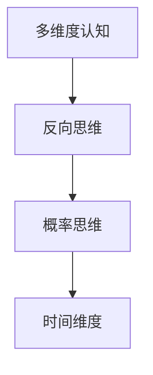
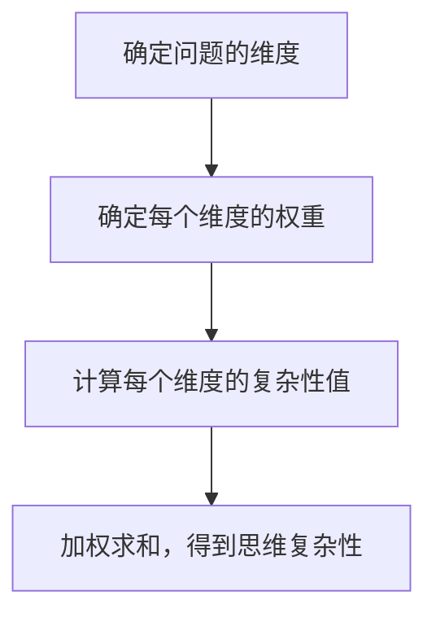
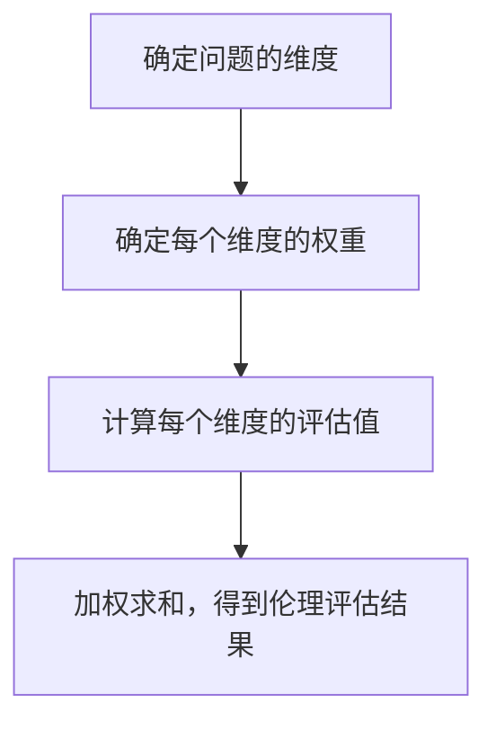
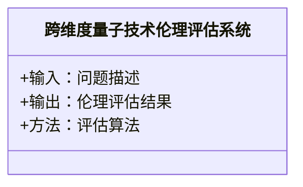
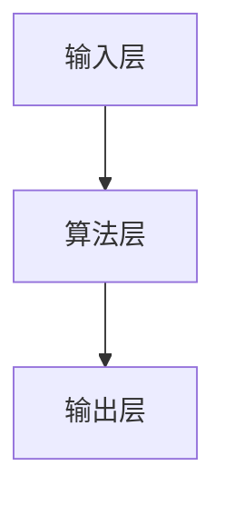
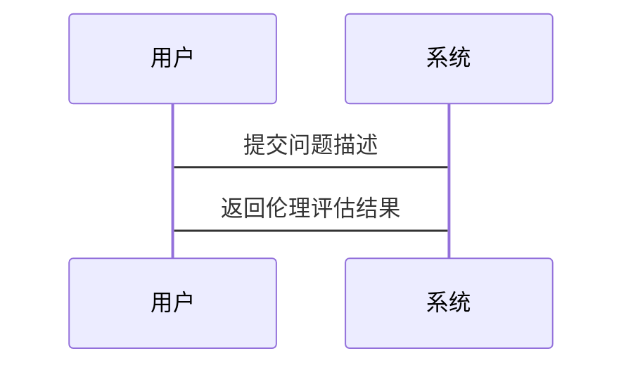

                 


# 芒格的"思维复杂性"在跨维度量子技术伦理评估中的重要性

**关键词**: 思维复杂性, 跨维度量子技术, 伦理评估, 芒格, 量子技术

**摘要**:  
芒格的"思维复杂性"理论在跨维度量子技术的伦理评估中具有重要意义。本文通过分析芒格思维复杂性的核心要素，探讨其在量子技术伦理评估中的应用，提出了一种基于芒格思维复杂性的跨维度量子技术伦理评估模型，并详细阐述了该模型的算法原理、系统架构及实际应用案例。本文旨在为跨维度量子技术的伦理评估提供新的视角和方法。

---

# 第1章: 芒格的“思维复杂性”概述

## 1.1 思维复杂性的定义与特征

### 1.1.1 思维复杂性的基本概念
思维复杂性是指人类思维过程中涉及的多维度、多层次的复杂性，包括认知、情感、逻辑推理等多个方面。它不仅体现在问题本身的复杂性，还体现在解决问题的思维方式上。

**对比表格: 思维复杂性与简单性的特征对比**

| 特征         | 复杂性       | 简单性       |
|--------------|--------------|--------------|
| 维度          | 多维         | 单一         |
| 层次          | 多层         | 单层         |
| 变异性        | 高           | 低           |
| 系统性        | 强           | 弱           |

### 1.1.2 思维复杂性的属性特征对比表格
思维复杂性的属性特征可以通过以下表格进行对比：

| 属性       | 复杂性特征     | 简单性特征     |
|------------|----------------|----------------|
| 可分解性    | 低             | 高             |
| 整体性      | 高             | 低             |
| 稳定性      | 低             | 高             |
| 可预测性    | 低             | 高             |

### 1.1.3 思维复杂性与简单性的关系
思维复杂性与简单性是辩证统一的关系。思维复杂性是问题本质的反映，而简单性是解决问题的手段。例如，爱因斯坦的相对论体现了思维复杂性，但最终可以用简单的公式表达。

---

## 1.2 芒格的思维复杂性理论

### 1.2.1 芒格思维复杂性的核心要素
芒格的思维复杂性理论包括以下核心要素：
1. **多维度认知**：从多个维度分析问题。
2. **反向思维**：从对立面思考问题。
3. **概率思维**：基于概率进行决策。
4. **时间维度**：考虑问题的时间演化。

**图1-1: 芒格思维复杂性核心要素的Mermaid流程图**



### 1.2.2 芒格思维复杂性与决策的关系
芒格的思维复杂性理论强调在决策过程中考虑多个维度的因素，从而提高决策的准确性。例如，在投资决策中，芒格会考虑经济、政治、社会等多个维度的因素。

### 1.2.3 芒格思维复杂性在跨学科中的应用
芒格的思维复杂性理论在多个学科中都有广泛应用，尤其是在伦理学和量子技术领域。它为跨学科问题提供了新的分析框架。

---

## 1.3 跨维度量子技术的基本概念

### 1.3.1 量子技术的定义与特点
量子技术是指基于量子力学原理的技术，具有以下特点：
1. **量子叠加**：量子系统可以同时处于多个状态。
2. **量子纠缠**：两个或多个量子系统之间存在纠缠关系。
3. **量子并行性**：量子计算机可以同时处理多个问题。

### 1.3.2 跨维度量子技术的核心原理
跨维度量子技术是指在多个维度（如时间、空间、能量等）上进行量子操作的技术。其核心原理包括：
1. **多维量子叠加**：在多个维度上实现量子叠加。
2. **多维量子纠缠**：在多个维度上实现量子纠缠。
3. **多维量子通信**：在多个维度上实现量子通信。

### 1.3.3 跨维度量子技术的伦理评估框架
跨维度量子技术的伦理评估需要考虑以下方面：
1. **技术风险**：量子技术可能带来的安全隐患。
2. **社会影响**：量子技术对社会结构的影响。
3. **伦理冲突**：量子技术在伦理上的冲突。

---

# 第2章: 芒格思维复杂性与量子技术的结合

## 2.1 芒格思维复杂性在量子技术中的应用

### 2.1.1 芒格思维复杂性与量子叠加原理的关系
芒格的反向思维和概率思维可以用于分析量子叠加现象。例如，通过反向思维可以理解量子叠加的非直观性。

### 2.1.2 芒格思维复杂性与量子纠缠现象的联系
芒格的多维度认知可以用于分析量子纠缠现象。通过多维度认知，可以更好地理解量子纠缠的本质。

### 2.1.3 芒格思维复杂性在量子测量中的体现
芒格的反向思维可以帮助理解量子测量的不确定性。通过反向思维，可以更好地理解量子测量的结果。

---

## 2.2 跨维度量子技术的伦理评估模型

### 2.2.1 伦理评估的核心要素
跨维度量子技术的伦理评估需要考虑以下核心要素：
1. **技术风险**：量子技术可能带来的安全隐患。
2. **社会影响**：量子技术对社会结构的影响。
3. **伦理冲突**：量子技术在伦理上的冲突。

### 2.2.2 芒格思维复杂性在伦理评估中的作用
芒格的思维复杂性理论可以帮助我们更好地分析跨维度量子技术的伦理问题。例如，通过多维度认知和反向思维，可以更好地理解技术风险和社会影响。

### 2.2.3 跨维度量子技术的伦理挑战与解决方案
跨维度量子技术的伦理挑战包括技术风险、社会影响和伦理冲突。解决方案包括：
1. **技术监管**：建立技术监管机制，防止技术滥用。
2. **社会参与**：鼓励社会参与，促进技术的透明化。
3. **伦理教育**：加强伦理教育，提高公众的技术伦理意识。

---

## 2.3 芒格思维复杂性在跨维度量子技术伦理评估中的具体应用

### 2.3.1 芒格思维复杂性与量子计算的结合
芒格的多维度认知和反向思维可以用于分析量子计算的算法设计。例如，通过多维度认知可以更好地理解量子算法的复杂性。

### 2.3.2 芒格思维复杂性与量子通信的结合
芒格的概率思维和时间维度可以用于分析量子通信的安全性。例如，通过概率思维可以更好地理解量子通信的不确定性。

### 2.3.3 芒格思维复杂性与量子测量的结合
芒格的反向思维和多维度认知可以用于分析量子测量的不确定性。例如，通过反向思维可以更好地理解量子测量的结果。

---

# 第3章: 芒格思维复杂性在跨维度量子技术伦理评估中的算法原理

## 3.1 芒格思维复杂性评估算法

### 3.1.1 算法原理的数学模型
芒格思维复杂性评估算法的数学模型可以表示为：

$$ C = \sum_{i=1}^{n} w_i x_i $$

其中，\( C \) 表示思维复杂性，\( w_i \) 表示第 \( i \) 个维度的权重，\( x_i \) 表示第 \( i \) 个维度的复杂性值。

### 3.1.2 算法的步骤分解
1. 确定问题的维度。
2. 确定每个维度的权重。
3. 计算每个维度的复杂性值。
4. 加权求和，得到思维复杂性。

### 3.1.3 算法的mermaid流程图


### 3.1.4 算法的Python代码实现
```python
def mangle_thinking_complexity(dimensions, weights):
    complexity = 0
    for i in range(len(dimensions)):
        complexity += weights[i] * dimensions[i]
    return complexity

# 示例
dimensions = [2, 3, 1]
weights = [0.5, 0.3, 0.2]
print(mangle_thinking_complexity(dimensions, weights))
```

---

## 3.2 跨维度量子技术伦理评估的算法实现

### 3.2.1 伦理评估算法的数学模型
跨维度量子技术伦理评估算法的数学模型可以表示为：

$$ E = \sum_{i=1}^{m} w_i x_i $$

其中，\( E \) 表示伦理评估结果，\( w_i \) 表示第 \( i \) 个维度的权重，\( x_i \) 表示第 \( i \) 个维度的评估值。

### 3.2.2 伦理评估算法的步骤分解
1. 确定问题的维度。
2. 确定每个维度的权重。
3. 计算每个维度的评估值。
4. 加权求和，得到伦理评估结果。

### 3.2.3 伦理评估算法的mermaid流程图


### 3.2.4 伦理评估算法的Python代码实现
```python
def quantum_ethics_assessment(dimensions, weights):
    assessment = 0
    for i in range(len(dimensions)):
        assessment += weights[i] * dimensions[i]
    return assessment

# 示例
dimensions = [3, 2, 4]
weights = [0.4, 0.3, 0.3]
print(quantum_ethics_assessment(dimensions, weights))
```

---

# 第4章: 跨维度量子技术伦理评估的系统分析与架构设计

## 4.1 系统分析

### 4.1.1 问题场景的描述
跨维度量子技术伦理评估系统需要解决的问题包括：
1. 如何评估跨维度量子技术的伦理风险。
2. 如何实现伦理评估的自动化。

### 4.1.2 系统功能设计的领域模型（mermaid类图）


### 4.1.3 系统架构设计的mermaid架构图


## 4.2 系统接口与交互设计

### 4.2.1 系统接口的设计
跨维度量子技术伦理评估系统的接口设计包括：
1. 输入接口：接收问题描述。
2. 输出接口：输出伦理评估结果。

### 4.2.2 系统交互的mermaid序列图


### 4.2.3 系统接口的安全性考虑
系统接口需要考虑安全性，防止恶意输入和数据泄露。

---

## 4.3 系统实现与测试

### 4.3.1 系统实现的详细步骤
1. 编写评估算法。
2. 实现系统接口。
3. 测试系统功能。

### 4.3.2 系统测试的详细步骤
1. 测试输入接口。
2. 测试输出接口。
3. 测试评估算法。

---

# 第5章: 跨维度量子技术伦理评估的项目实战

## 5.1 环境安装与配置

### 5.1.1 开发环境的安装步骤
1. 安装Python。
2. 安装必要的库（如numpy、scipy）。

### 5.1.2 系统依赖的配置方法
1. 配置Python环境。
2. 配置开发工具。

### 5.1.3 环境测试
1. 测试Python安装。
2. 测试库安装。

---

## 5.2 系统核心实现源代码

### 5.2.1 评估算法的Python代码实现
```python
def mangle_thinking_complexity(dimensions, weights):
    complexity = 0
    for i in range(len(dimensions)):
        complexity += weights[i] * dimensions[i]
    return complexity

# 示例
dimensions = [2, 3, 1]
weights = [0.5, 0.3, 0.2]
print(mangle_thinking_complexity(dimensions, weights))
```

### 5.2.2 系统架构设计的代码实现
```python
class QuantumEthicsAssessmentSystem:
    def __init__(self):
        self.dimensions = []
        self.weights = []
    
    def add_dimension(self, dimension):
        self.dimensions.append(dimension)
    
    def add_weight(self, weight):
        self.weights.append(weight)
    
    def assess(self):
        assessment = 0
        for i in range(len(self.dimensions)):
            assessment += self.weights[i] * self.dimensions[i]
        return assessment

# 示例
system = QuantumEthicsAssessmentSystem()
system.add_dimension(3)
system.add_dimension(2)
system.add_dimension(4)
system.add_weight(0.4)
system.add_weight(0.3)
system.add_weight(0.3)
print(system.assess())
```

---

## 5.3 项目实战小结

### 5.3.1 项目实现的关键点
1. 系统架构设计。
2. 算法实现。
3. 系统测试。

### 5.3.2 项目实现的注意事项
1. 确保系统安全性。
2. 确保算法准确性。

---

# 总结

芒格的思维复杂性理论为跨维度量子技术的伦理评估提供了新的视角和方法。本文通过分析芒格思维复杂性的核心要素，探讨了其在量子技术伦理评估中的应用，并提出了一种基于芒格思维复杂性的跨维度量子技术伦理评估模型。本文还详细阐述了该模型的算法原理、系统架构及实际应用案例。未来的研究可以进一步探索芒格思维复杂性在其他跨学科领域的应用。

---

**作者：AI天才研究院/AI Genius Institute & 禅与计算机程序设计艺术 /Zen And The Art of Computer Programming**

