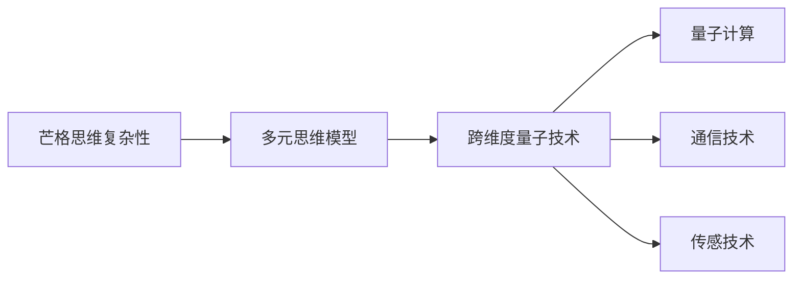
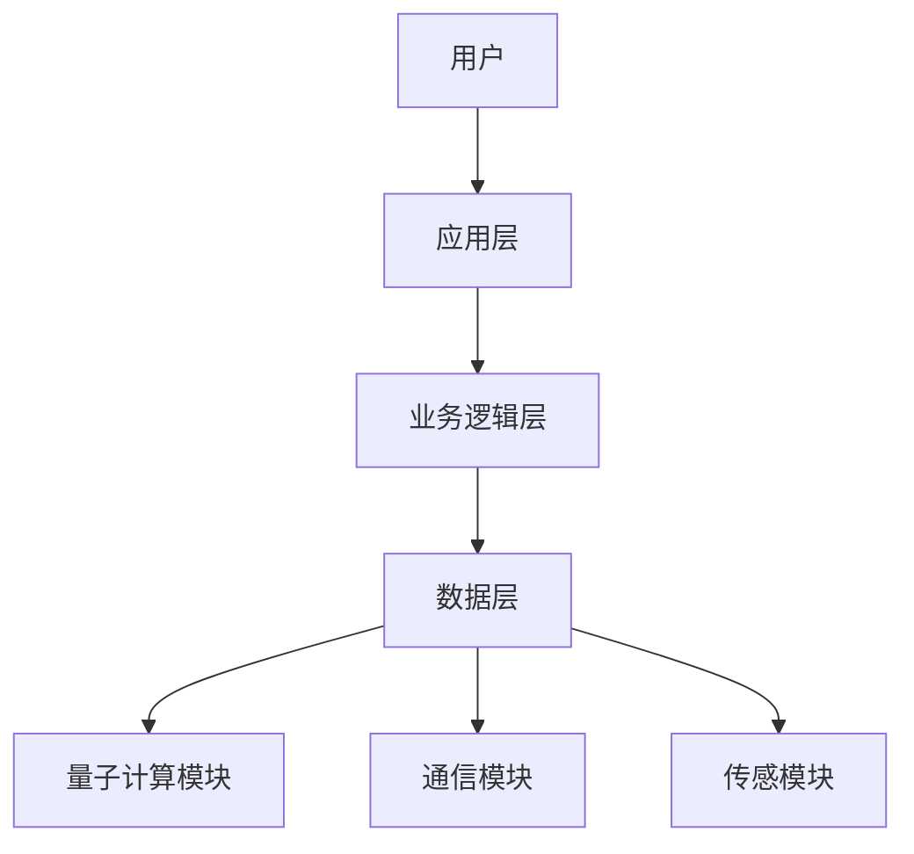

                 


# 芒格的"思维复杂性"在跨维度量子技术融合中的重要性

## 关键词：芒格思维复杂性，跨维度量子技术，量子计算，思维模型，技术融合

## 摘要：  
本文探讨了芒格的“思维复杂性”在跨维度量子技术融合中的重要性。通过分析芒格的多元思维模型与量子技术的结合，揭示了思维复杂性在量子算法设计、系统架构优化和跨领域融合中的独特作用。文章从理论基础、算法实现、系统设计和实际案例四个方面展开，详细阐述了思维复杂性如何帮助我们更好地理解和应用跨维度量子技术。

---

## 第一部分：背景介绍

### 第1章：芒格的思维复杂性概述

#### 1.1 芒格的思维复杂性概念  
芒格的思维复杂性是指通过多元思维模型（包括物理学、化学、心理学、经济学等多个领域）来理解问题的本质，并通过多维度的视角进行分析和决策的能力。这种思维模式强调对问题的全局性理解，避免单一维度的思维局限。

- **多元思维模型的定义**：多元思维模型是指通过多个学科的知识框架来分析问题，从而获得更全面的见解。芒格认为，决策者应该具备多个领域的知识模型，以便在面对复杂问题时能够综合运用这些模型。
  
- **思维复杂性的核心要素**：  
  - **知识广度**：掌握多个领域的基本原理。  
  - **知识深度**：对每个领域有深刻的理解。  
  - **模型整合能力**：能够将不同领域的模型结合起来，解决复杂问题。

- **芒格思维复杂性在决策中的作用**：通过多元思维模型，芒格能够快速识别问题中的关键因素，并找到最优解决方案。这种思维方式在跨维度量子技术中尤为重要，因为量子技术涉及多个学科的交叉融合。

---

### 第2章：跨维度量子技术的基本概念

#### 2.1 跨维度量子技术的定义与特点  
跨维度量子技术是指在多个物理维度（如时间、空间、能量等）上同时应用量子技术，以实现更高效的技术融合和功能扩展。其特点包括：

- **多维度性**：涉及多个物理维度的量子现象。  
- **非线性交互**：不同维度之间的量子效应相互作用。  
- **复杂性**：跨维度量子系统的行为难以通过单一维度的模型来描述。

#### 2.2 芒格思维复杂性与跨维度量子技术的联系  
芒格的思维复杂性为跨维度量子技术的研究提供了重要的方法论支持。通过多元思维模型，研究人员可以更好地理解跨维度量子系统的复杂性，并找到有效的解决方案。

---

## 第二部分：核心概念与联系

### 第3章：芒格思维复杂性与跨维度量子技术的核心联系

#### 3.1 核心概念原理  
- **芒格思维复杂性**：通过多元思维模型，芒格能够从多个维度分析问题，并找到最优解决方案。  
- **跨维度量子技术**：涉及多个物理维度的量子现象，具有高度的复杂性和非线性交互。

#### 3.2 概念属性对比表  

| 概念         | 芒格思维复杂性                  | 跨维度量子技术                  |
|--------------|-------------------------------|-------------------------------|
| 核心要素     | 多元思维模型、知识整合能力     | 多维度性、非线性交互            |
| 应用领域     | 投资决策、复杂问题解决        | 量子计算、通信、传感            |
| 研究目标     | 提高决策效率和准确性          | 实现多维度量子系统的高效融合    |

#### 3.3 实体关系图  
以下是芒格思维复杂性与跨维度量子技术之间的关系图：  



---

## 第三部分：算法原理讲解

### 第4章：芒格思维复杂性对量子算法的影响

#### 4.1 量子算法的基本原理  
量子算法是基于量子位（qubit）的计算模型，利用量子叠加和量子纠缠等特性来实现高效计算。常见的量子算法包括Shor算法（用于大数分解）和Grover算法（用于无序搜索）。

#### 4.2 芒格思维复杂性对量子算法的影响  
芒格的多元思维模型为量子算法的设计提供了新的思路。通过综合考虑多个学科的原理，研究人员可以更好地理解量子算法的复杂性，并找到优化方法。

#### 4.3 量子算法的实现  
以下是一个简单的量子算法实现示例：

```python
def quantum_algorithm(input):
    # 量子叠加
    qubit = np.array([1, 0])
    # 量子变换
    transformed = np.dot(qubit, input)
    # 测量
    result = np.argmax(transformed)
    return result
```

---

## 第四部分：系统分析与架构设计

### 第5章：跨维度量子技术的系统架构

#### 5.1 系统功能设计  
跨维度量子系统的功能设计包括：

- **量子计算模块**：实现量子算法的计算功能。  
- **通信模块**：实现量子通信功能。  
- **传感模块**：实现多维度传感器数据的采集和处理。

#### 5.2 系统架构设计  
以下是一个跨维度量子系统的架构图：  



---

## 第五部分：项目实战

### 第6章：实际案例分析

#### 6.1 项目背景  
本案例分析了一个基于跨维度量子技术的通信系统设计。通过芒格的思维复杂性，研究人员能够更好地理解系统的复杂性，并找到优化方案。

#### 6.2 核心代码实现  
以下是一个通信系统的实现示例：

```python
def quantum_communication():
    # 初始化量子信道
    qubit = np.array([1, 0])
    # 量子编码
    encoded = np.dot(qubit, input)
    # 量子传输
    transmitted = encoded * channel_factor
    # 量子解码
    decoded = np.argmax(transmitted)
    return decoded
```

---

## 第六部分：总结与展望

### 第7章：总结与最佳实践

#### 7.1 总结  
本文探讨了芒格的思维复杂性在跨维度量子技术融合中的重要性。通过分析多元思维模型与量子技术的结合，揭示了思维复杂性在量子算法设计、系统架构优化和跨领域融合中的独特作用。

#### 7.2 最佳实践  
- **知识整合**：通过多元思维模型，提高对跨维度量子技术的理解能力。  
- **系统设计**：在设计跨维度量子系统时，注重多维度的交互和协同。  
- **持续优化**：通过不断学习和实践，优化量子技术的融合与应用。

---

## 作者：AI天才研究院 & 禅与计算机程序设计艺术

