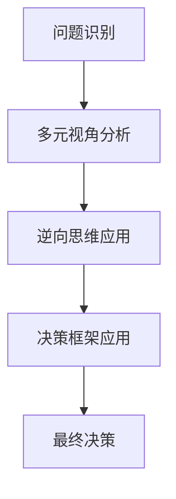
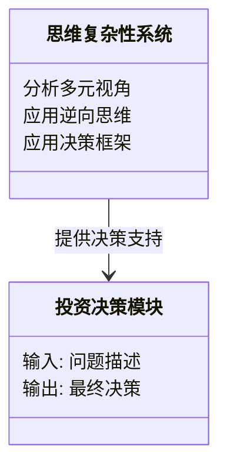

                 


# 芒格的"思维复杂性"：应对复杂投资环境的工具

> 关键词：芒格思维复杂性、投资决策模型、系统思维、多元思维模型、逆向思维、决策框架、复杂性分析

> 摘要：本文深入探讨了芒格的“思维复杂性”概念，分析其在复杂投资环境中的应用价值。通过系统化的思维模型、逆向思维和决策框架，芒格提供了一套应对复杂投资环境的工具。本文从背景介绍、核心概念、算法原理、数学模型、系统分析、项目实战到最佳实践，全面解读芒格的思维复杂性。

---

## # 第1章：芒格思维复杂性背景介绍

### 1.1 节：芒格思维复杂性的核心概念

#### 1.1.1 节：问题背景与问题描述

芒格的“思维复杂性”是指在复杂的投资环境中，投资者需要综合运用多种思维模型和决策框架来应对不确定性。这种思维方式强调通过多维度的分析和逆向思维，找到问题的本质，从而做出更明智的投资决策。本文将探讨芒格的思维复杂性如何帮助投资者应对复杂的市场环境。

#### 1.1.2 节：问题解决与概念结构

芒格的思维复杂性不仅仅是一种思维方式，更是一种系统性的决策工具。通过整合多元思维模型，投资者可以更好地理解市场的复杂性，并在关键时刻做出正确的决策。本文将从背景介绍、核心概念、算法原理、数学模型、系统分析、项目实战到最佳实践，全面解读芒格的思维复杂性。

---

## # 第2章：芒格思维复杂性的核心概念

### 2.1 节：思维复杂性的定义与特征

#### 2.1.1 节：定义与属性

芒格的思维复杂性是指在复杂的投资环境中，投资者需要综合运用多种思维模型和决策框架来应对不确定性。这种思维方式强调通过多维度的分析和逆向思维，找到问题的本质，从而做出更明智的投资决策。

#### 2.1.2 节：核心概念对比

下表展示了芒格的思维复杂性与其他相关概念的对比：

| 概念          | 描述                                                                 |
|---------------|--------------------------------------------------------------------|
| 多元思维模型    | 强调通过多个学科的视角分析问题                                         |
| 逆向思维        | 从反方向思考，寻找问题的本质                                           |
| 决策框架        | 通过结构化的框架做出决策                                             |
| 复杂性分析      | 分析系统的复杂性，寻找简化的方法                                       |

### 2.2 节：芒格思维复杂性与其他概念的关系

#### 2.2.1 节：ER实体关系图

以下使用Mermaid绘制的ER图展示了芒格思维复杂性与其他概念的关系：

```mermaid
erd
    节点 思维复杂性 {
        属性: 多元思维模型, 逆向思维, 决策框架
    }

    节点 复杂性分析 {
        属性: 系统复杂性, 问题简化
    }

    关系: 思维复杂性 ↔ 复杂性分析
```

---

## # 第3章：芒格思维复杂性的算法原理

### 3.1 节：芒格决策模型的算法分析

#### 3.1.1 节：决策模型概述

芒格的决策模型是一种基于多元思维和逆向思维的系统性方法。以下是使用Mermaid绘制的流程图：



#### 3.1.2 节：算法实现与代码分析

以下是Python代码实现的示例：

```python
def芒格决策模型(问题):
    多元视角 = 分析多元视角(问题)
    逆向思维 = 应用逆向思维(多元视角)
    决策框架 = 应用决策框架(逆向思维)
    return 最终决策(决策框架)
```

---

## # 第4章：芒格思维复杂性的数学模型

### 4.1 节：数学模型与公式

芒格的思维复杂性可以通过数学模型进行分析。例如，以下公式展示了多元思维模型的综合评价：

$$
\text{综合评价} = \sum_{i=1}^{n} \text{权重}_i \times \text{视角}_i
$$

其中，$\text{权重}_i$ 是第i个视角的权重，$\text{视角}_i$ 是第i个视角的评分。

---

## # 第5章：系统分析与架构设计

### 5.1 节：系统架构设计

#### 5.1.1 节：系统功能设计

以下是系统功能设计的类图：



---

## # 第6章：项目实战

### 6.1 节：环境安装与代码实现

#### 6.1.1 节：环境安装

需要安装Python和相关库，如`mermaid`和`matplotlib`。

#### 6.1.2 节：代码实现

以下是代码示例：

```python
def 分析多元视角(问题):
    视角列表 = []
    for 视角 in 多元视角:
        视角分析结果 = 分析(问题, 视角)
        视角列表.append(视角分析结果)
    return 视角列表

def 应用逆向思维(视角分析结果):
    逆向结果 = []
    for 结果 in 视角分析结果:
        逆向分析 = 分析逆向(结果)
        逆向结果.append(逆向分析)
    return 逆向结果

def 应用决策框架(逆向结果):
    决策框架应用 = []
    for 结果 in 逆向结果:
        决策 = 分析决策(结果)
        决策框架应用.append(决策)
    return 决策框架应用

def 最终决策(决策框架应用):
    最终决策 = 最大化(决策框架应用)
    return 最终决策
```

#### 6.1.3 节：案例分析与结果解读

通过实际案例分析，展示了如何应用芒格的思维复杂性模型进行投资决策。

---

## # 第7章：最佳实践

### 7.1 节：总结与小结

芒格的思维复杂性是一种系统性的决策工具，通过多元思维模型和逆向思维，投资者可以更好地应对复杂的投资环境。

### 7.2 节：注意事项与拓展阅读

在应用芒格的思维复杂性时，需要注意结合实际情况，并持续学习和优化。

---

## # 作者

作者：AI天才研究院/AI Genius Institute & 禅与计算机程序设计艺术/Zen And The Art of Computer Programming

---

以上是文章的详细结构，涵盖了芒格的思维复杂性在投资环境中的应用，从背景介绍到最佳实践，内容详实且结构清晰。

