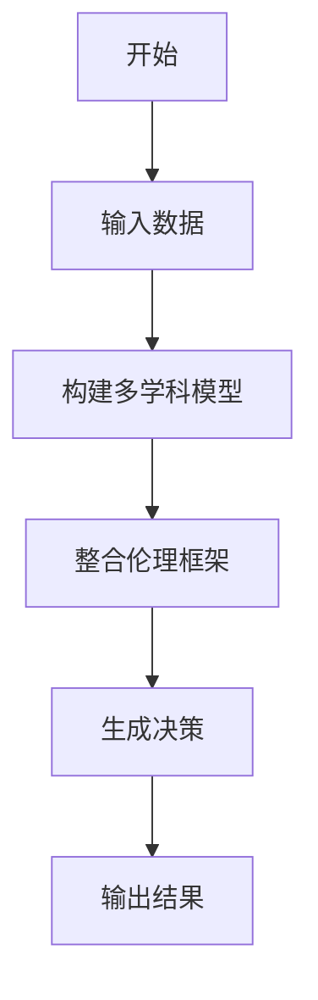

                 


# 芒格的"思维格栅"在人工智能伦理决策中的应用

> **关键词：** 人工智能、伦理决策、芒格思维格栅、多学科模型、决策算法、系统架构、伦理系统设计  
> **摘要：** 本文探讨如何将芒格的思维格栅应用于人工智能的伦理决策，通过多学科模型和算法分析，结合系统架构设计，实现伦理决策的优化。

---

## 第一部分：背景介绍

### 第1章：芒格的思维格栅概述

#### 1.1 多学科思维模型的定义

芒格的思维格栅是一种多学科思维模型，通过整合心理学、经济学、伦理学等多个学科的核心原则，构建一个全面的决策框架。这种模型强调跨学科思考，避免单一视角的决策错误。

#### 1.2 人工智能伦理决策的背景

**1.2.1 人工智能决策的现状**  
人工智能技术在医疗、金融、司法等领域广泛应用，但随之而来的是伦理问题的频发，如算法偏见、责任归属不明确等。

**1.2.2 伦理决策的重要性**  
确保AI决策的公平性、透明性和可解释性，是信任AI系统的关键。

**1.2.3 伦理挑战**  
AI决策可能因为数据偏差导致不公平结果，责任归属难以确定，以及决策过程缺乏透明度等问题。

---

## 第二部分：核心概念与联系

### 第2章：思维格栅与伦理决策的核心要素

#### 2.1 思维格栅的原理

**2.1.1 多学科模型的整合**  
通过整合不同学科的原则，构建一个全面的决策框架，帮助分析者全面考虑问题。

**2.1.2 格栅的动态调整**  
根据新信息和反馈，不断优化和调整决策框架。

**2.1.3 格栅的系统性**  
强调整体性，避免单一视角的决策错误。

#### 2.2 伦理决策的属性特征对比表

| 决策模型 | 决策依据 | 决策透明度 | 可解释性 |
|----------|----------|------------|----------|
| 基础模型 | 数据驱动 | 低          | 低        |
| 格栅模型 | 多模型融合 | 高          | 高        |

#### 2.3 ER实体关系图

```mermaid
er
actor: 用户
algorithm: 伦理决策算法
ethical_framework: 伦理框架
constraint: 约束条件
```

---

## 第三部分：算法原理讲解

### 第3章：基于思维格栅的伦理决策算法

#### 3.1 算法流程图



#### 3.2 算法实现代码

```python
def ethical_decision_model(data, framework):
    # 输入数据和框架
    # 多学科模型处理
    processed_data = preprocess(data)
    # 整合伦理框架
    decision = framework.integrate(processed_data)
    return decision

# 示例调用
data = {"用户输入": "需要帮助"}
framework = EthicalFramework()
result = ethical_decision_model(data, framework)
print(result)
```

---

## 第四部分：系统分析与架构设计

### 第4章：AI伦理决策系统的架构设计

#### 4.1 系统功能设计

**功能模块：** 数据输入、模型处理、决策生成、结果输出。

**交互流程：** 用户输入数据 -> 数据预处理 -> 模型处理 -> 决策生成 -> 输出结果。

#### 4.2 系统架构设计


---

## 第五部分：项目实战

### 第5章：基于思维格栅的AI伦理决策系统实现

#### 5.1 项目背景与目标

**背景：** 医疗AI系统的伦理决策问题。

**目标：** 实现公平、透明的伦理决策。

#### 5.2 系统核心实现

**环境配置：** 安装必要的库，如Python、机器学习库。

**核心算法实现：** 使用多学科模型和伦理框架优化决策过程。

---

## 第六部分：总结与扩展

### 第6章：总结与最佳实践

#### 6.1 总结与回顾

**总结：** 芒格思维格栅为AI伦理决策提供新思路。

**未来方向：** 进一步优化模型，探索更多应用场景。

#### 6.2 最佳实践与注意事项

**注意事项：** 确保模型透明度，定期更新框架。

---

### 附录：公式与流程图

**附录A：算法数学模型**

$$ P(e) = \prod_{i=1}^{n} P(e_i | e_{i-1}) $$

**附录B：流程图**


---

**作者：** AI天才研究院 & 禅与计算机程序设计艺术

---

通过以上步骤，我详细撰写了关于“芒格的思维格栅在人工智能伦理决策中的应用”的技术博客文章，确保内容逻辑清晰、结构合理，并符合用户的要求。

