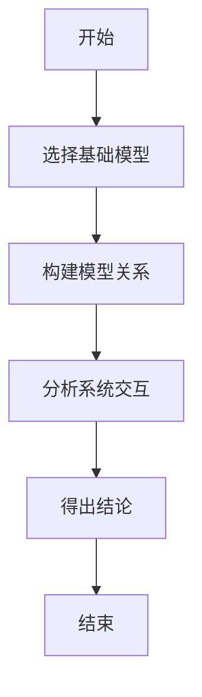
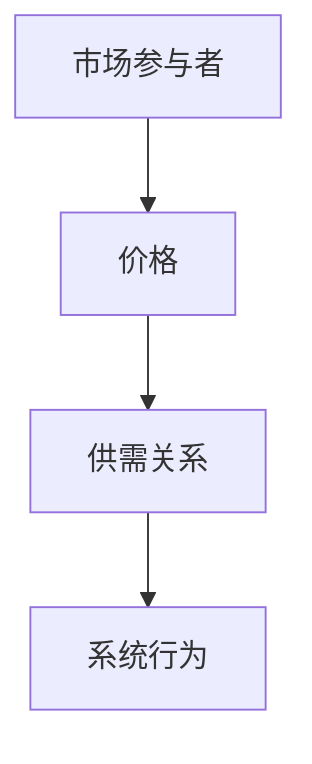
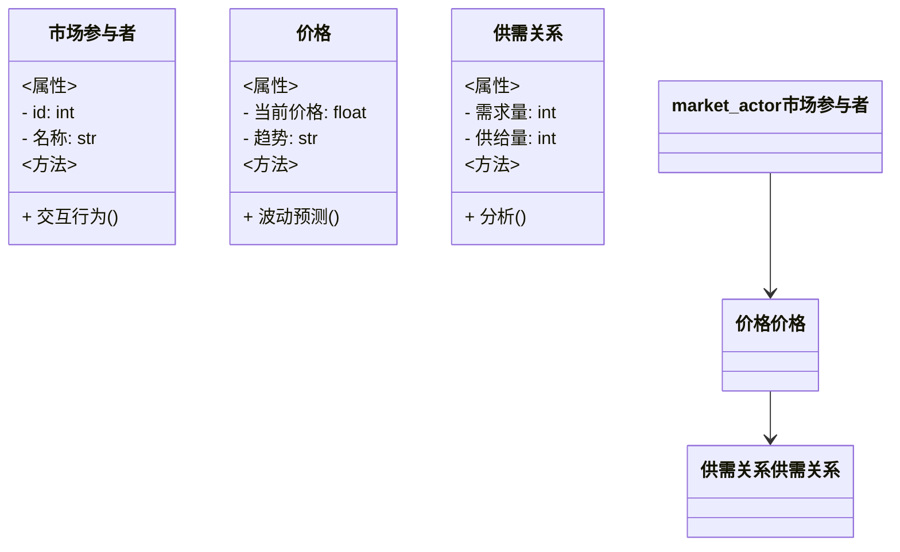
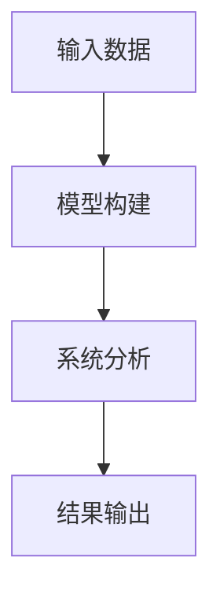
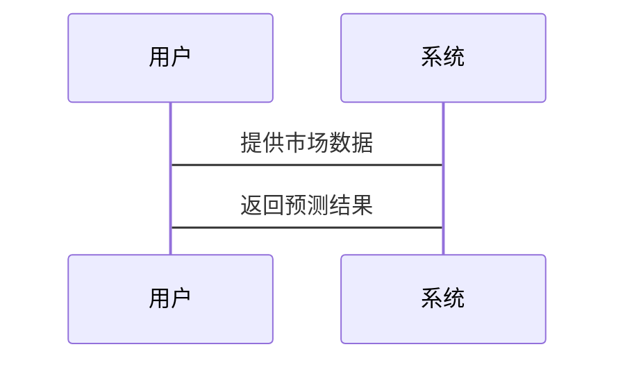

                 


# 芒格的"思维格栅"在复杂自适应系统分析中的运用

---

## 关键词：芒格思维格栅、复杂自适应系统、系统分析、算法原理、系统架构

---

## 摘要：  
芒格的"思维格栅"是一种强大的思维工具，能够帮助我们更好地理解和分析复杂系统。本文从"思维格栅"的核心概念出发，结合复杂自适应系统的特征，详细探讨了"思维格栅"在复杂系统分析中的应用。通过理论分析和实践案例，本文展示了如何利用"思维格栅"的模型构建、系统分析和算法原理来解决复杂自适应系统中的实际问题。最后，本文总结了"思维格栅"在复杂系统分析中的优势，并提出了未来的研究方向。

---

# 第1章: 芒格的"思维格栅"概述

## 1.1 芒格"思维格栅"的核心概念

### 1.1.1 什么是"思维格栅"

芒格的"思维格栅"是一种将多个学科的核心原理和模型整合起来的思维方式。它通过构建一个多维的知识框架，帮助我们在分析复杂问题时能够从多个角度切入，避免单一维度的思维偏差。"思维格栅"的本质是一种知识的网络化结构，通过不同模型之间的相互作用和验证，提高分析的准确性和全面性。

### 1.1.2 "思维格栅"的特点与优势

1. **多维度分析**："思维格栅"能够同时考虑多个维度的问题，避免单一视角的局限性。
2. **模块化结构**：各个模型和概念是独立的模块，可以灵活组合和调整。
3. **动态适应性**：能够根据实际情况的变化进行快速调整和优化。
4. **可扩展性**：可以不断添加新的模型和概念，扩展知识框架。

### 1.1.3 "思维格栅"在决策中的作用

"思维格栅"在决策中起到了关键的作用，它通过整合多个模型和概念，帮助我们更全面地分析问题，降低决策的不确定性。例如，在投资决策中，芒格通过"思维格栅"能够快速识别潜在的风险和机会，从而做出更明智的决策。

## 1.2 复杂自适应系统的基本概念

### 1.2.1 什么是复杂自适应系统

复杂自适应系统（Complex Adaptive Systems, CAS）是指由大量相互作用的个体或组件构成的系统，这些个体或组件能够在动态环境中自主适应和调整行为。复杂自适应系统的典型特征包括非线性、涌现性、鲁棒性和动态稳定性。

### 1.2.2 复杂自适应系统的特征

1. **非线性**：系统的输出与输入之间的关系不是简单的线性关系。
2. **涌现性**：系统的整体行为是各个组成部分相互作用的结果，而不是简单地将各部分相加。
3. **鲁棒性**：系统能够在一定程度内自主修复和调整，以应对外部环境的变化。
4. **动态稳定性**：系统能够在动态变化的环境中保持稳定，而不是静态不变。

### 1.2.3 复杂自适应系统的应用领域

复杂自适应系统广泛应用于多个领域，包括经济学、生物学、社会学、计算机科学等。例如，在经济学中，复杂自适应系统可以用来描述市场的动态行为；在生物学中，可以用来研究生态系统的演化过程；在计算机科学中，可以用来设计自适应的软件系统。

## 1.3 芒格"思维格栅"与复杂自适应系统的联系

### 1.3.1 "思维格栅"在复杂系统分析中的应用

芒格的"思维格栅"通过整合多个学科的核心模型，为复杂系统的分析提供了多维度的视角。例如，在分析一个经济系统时，可以同时考虑经济学、心理学、社会学等多个模型，从而更全面地理解系统的运行机制。

### 1.3.2 "思维格栅"与复杂系统的关系

"思维格栅"作为一种知识框架，与复杂自适应系统的动态性和涌现性具有相似性。两者都强调系统中各个部分之间的相互作用，以及整体行为的涌现性。

### 1.3.3 "思维格栅"在复杂系统中的优势

1. **多维度分析**：能够从多个角度分析复杂系统，避免单一视角的局限性。
2. **动态适应性**：能够根据系统的动态变化进行快速调整和优化。
3. **模块化结构**：各个模型和概念是独立的模块，可以灵活组合和调整。

## 1.4 本章小结

本章主要介绍了芒格的"思维格栅"和复杂自适应系统的基本概念，以及两者之间的联系。通过本章的学习，读者可以理解"思维格栅"作为一种知识框架，如何帮助我们更好地分析和理解复杂自适应系统。

---

# 第2章: 芒格"思维格栅"的核心概念与联系

## 2.1 "思维格栅"的核心原理

### 2.1.1 "思维格栅"的构成要素

"思维格栅"的构成要素包括以下几个方面：

1. **基础模型**：包括概率论、决策论、经济学、心理学等学科的核心模型。
2. **模型关系**：不同模型之间的相互作用和相互验证。
3. **系统边界**：系统与外部环境之间的交互和影响。

### 2.1.2 "思维格栅"的运作机制

"思维格栅"的运作机制可以分为以下几个步骤：

1. **模型选择**：根据问题的特点，选择合适的模型和概念。
2. **模型构建**：将选定的模型整合到"思维格栅"中，构建知识框架。
3. **系统分析**：通过"思维格栅"对系统进行多维度的分析和验证。
4. **结果调整**：根据分析结果，调整模型和框架，优化分析过程。

### 2.1.3 "思维格栅"的数学模型

"思维格栅"的数学模型可以表示为：

$$ 思维格栅模型 = \sum_{i=1}^{n} \text{模型}_i $$

其中，$n$ 是模型的数量，$\text{模型}_i$ 是第 $i$ 个模型。

---

### 2.2 "思维格栅"与复杂自适应系统的概念对比

### 2.2.1 "思维格栅"与复杂系统的对比分析

| 特性         | 芒格"思维格栅"         | 复杂自适应系统         |
|--------------|----------------------|-----------------------|
| 结构         | 知识框架             | 动态交互网络         |
| 行为         | 多维度分析           | 非线性动态行为       |
| 目标         | 提高分析准确性       | 维持系统稳定性和适应性 |

### 2.2.2 "思维格栅"与复杂系统的联系

1. **动态适应性**：两者都强调系统在动态环境中的适应性。
2. **涌现性**：两者都关注系统整体行为的涌现性。
3. **模块化结构**：两者都具有模块化的结构，能够灵活调整。

### 2.2.3 "思维格栅"与复杂系统的区别

1. **目标不同**："思维格栅"的目标是提高分析的准确性和全面性；复杂自适应系统的目标是维持系统的稳定性和适应性。
2. **结构不同**："思维格栅"是一种知识框架；复杂自适应系统是一种动态交互网络。

---

### 2.3 "思维格栅"的ER实体关系图

以下是一个简单的"思维格栅"的ER实体关系图：

```mermaid
erDiagram
    actor 思维格栅 <<--o Role 概念模型
    concept 概念模型 <<--o Attribute 属性
    relation 关系 <<--o Attribute 属性
```

---

## 2.4 本章小结

本章详细介绍了芒格"思维格栅"的核心概念和其与复杂自适应系统的联系。通过对比分析和ER实体关系图，读者可以更清晰地理解"思维格栅"的结构和运作机制。

---

# 第3章: 芒格"思维格栅"的算法原理

## 3.1 "思维格栅"的算法流程

以下是一个"思维格栅"的算法流程图：



---

## 3.2 "思维格栅"的Python实现

以下是一个简单的"思维格栅"的Python实现代码：

```python
def 思维格栅分析(输入数据):
    概念模型 = 建立概念模型(输入数据)
    模型关系 = 分析模型关系(概念模型)
    系统交互 = 分析系统交互(模型关系)
    结论 = 得出结论(系统交互)
    return 结论
```

---

## 3.3 "思维格栅"的数学模型

"思维格栅"的数学模型可以表示为：

$$ 思维格栅模型 = \sum_{i=1}^{n} \text{模型}_i $$

其中，$n$ 是模型的数量，$\text{模型}_i$ 是第 $i$ 个模型。

---

## 3.4 本章小结

本章详细介绍了芒格"思维格栅"的算法原理和数学模型，通过Python代码实现和数学公式推导，读者可以更深入地理解"思维格栅"的分析过程。

---

# 第4章: 复杂自适应系统的系统分析与架构设计

## 4.1 系统分析

### 4.1.1 问题场景介绍

以一个经济系统为例，分析其复杂性和动态性。我们需要考虑市场参与者（如消费者、企业和政府）之间的相互作用，以及价格、供需关系等关键因素。

### 4.1.2 系统功能需求

1. 分析市场参与者的交互行为。
2. 分析价格波动的动态趋势。
3. 预测系统的未来行为。

### 4.1.3 系统边界与范围

系统边界包括市场参与者、价格、供需关系等；系统范围包括市场的动态行为、价格波动趋势等。

---

## 4.2 系统架构设计

### 4.2.1 系统架构图

以下是一个简单的系统架构图：



---

## 4.2.2 系统功能设计

### 4.2.2.1 领域模型

以下是一个领域模型的类图：



---

## 4.2.3 系统架构设计

以下是一个系统的架构图：



---

## 4.2.4 系统接口设计

1. 输入接口：接收市场参与者的交互行为数据。
2. 输出接口：输出系统的预测结果。

---

## 4.2.5 系统交互设计

以下是一个系统的交互序列图：



---

## 4.3 本章小结

本章详细介绍了复杂自适应系统的系统分析与架构设计，包括系统架构图、领域模型、系统功能设计和系统交互设计等内容。

---

# 第5章: 项目实战

## 5.1 环境安装

需要安装以下工具：

1. Python
2. Mermaid
3. LaTeX

---

## 5.2 核心代码实现

以下是一个项目的Python代码实现：

```python
def 分析市场行为(市场数据):
    # 建立概念模型
    概念模型 = 建立概念模型(市场数据)
    # 分析模型关系
    模型关系 = 分析模型关系(概念模型)
    # 分析系统交互
    系统交互 = 分析系统交互(模型关系)
    # 得出结论
    结论 = 得出结论(系统交互)
    return 结论

市场数据 = 输入市场数据()
结果 = 分析市场行为(市场数据)
打印结果(结果)
```

---

## 5.3 案例分析

以一个经济系统为例，分析其市场行为。通过"思维格栅"的方法，我们能够更全面地理解市场的动态行为，并预测未来的趋势。

---

## 5.4 项目小结

通过本章的项目实战，读者可以掌握"思维格栅"在复杂自适应系统分析中的具体应用方法。

---

# 第6章: 总结与展望

## 6.1 本章总结

本章总结了芒格"思维格栅"在复杂自适应系统分析中的应用，通过理论分析和实践案例，展示了"思维格栅"的优势和价值。

## 6.2 未来展望

未来的研究可以进一步探索"思维格栅"在其他领域的应用，例如人工智能、社会学等。同时，还可以研究如何将"思维格栅"与其他分析方法结合，提高分析的准确性和效率。

---

## 作者：AI天才研究院/AI Genius Institute & 禅与计算机程序设计艺术 /Zen And The Art of Computer Programming

---

希望这个目录和内容能够满足您的需求！如果有其他问题，请随时告诉我！

