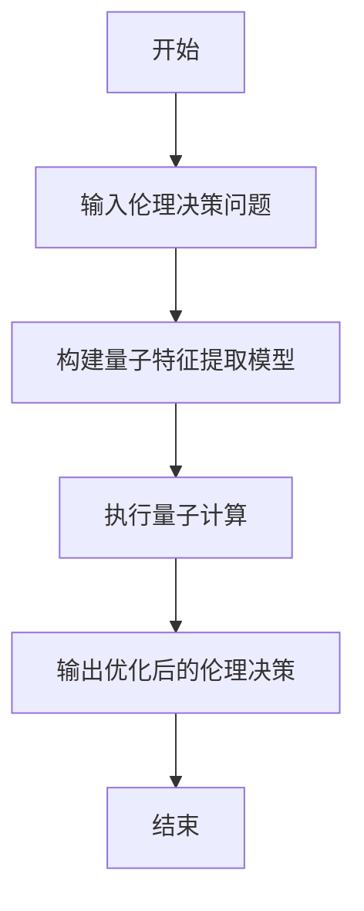
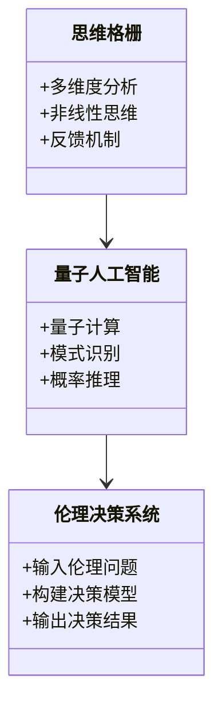
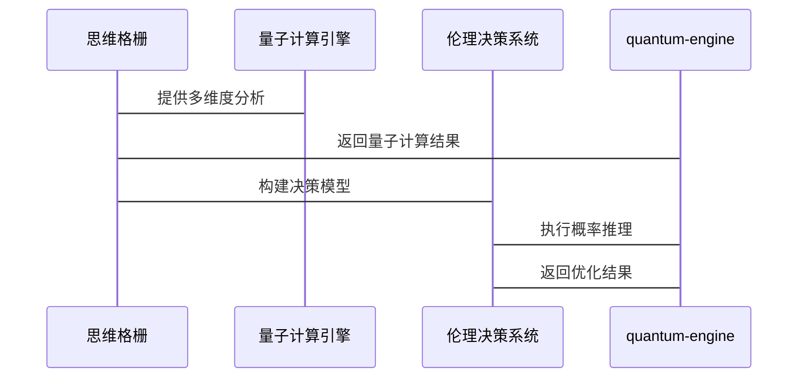

                 


# 《芒格的"思维格栅"在量子人工智能伦理决策中的应用》

> 关键词：芒格思维格栅，量子人工智能，伦理决策，多学科思维模型，量子计算

> 摘要：本文深入探讨了芒格的“思维格栅”这一多学科思维模型在量子人工智能伦理决策中的应用。通过分析量子人工智能的核心原理、伦理决策的复杂性以及芒格思维格栅的多维度分析能力，本文揭示了两者结合的独特优势。文章从理论基础到实际应用，系统地阐述了如何利用芒格思维格栅来优化量子人工智能的伦理决策过程，并通过具体案例和系统架构设计，展示了这一结合的实际价值和潜力。

---

## 第一部分：背景介绍

### 第1章：芒格的“思维格栅”与量子人工智能的背景介绍

#### 1.1 芒格的“思维格栅”概述

##### 1.1.1 思维格栅的定义与核心要素
芒格的“思维格栅”是一种多维度的思维方式，它通过整合多个学科的核心原则，形成一个强大的认知框架。其核心要素包括：

- **多维度分析**：从多个学科（如心理学、经济学、物理学等）中提取关键原理，构建全面的分析视角。
- **非线性思维**：避免单一维度的线性思考，强调全局性和系统性。
- **反馈机制**：通过不断验证和调整，优化决策过程。

##### 1.1.2 思维格栅的多学科属性特征对比

| 学科领域      | 核心原则                           | 特征对比                   |
|----------------|------------------------------------|---------------------------|
| 心理学        | 偏向性与认知偏差                 | 强调认知的局限性           |
| 经济学        | 边际效用与市场均衡               | 强调利益的权衡             |
| 物理学        | 系统性与能量守恒                 | 强调过程的动态平衡         |
| 统计学        | 概率与不确定性                   | 强调结果的不确定性         |

##### 1.1.3 思维格栅的ER实体关系图架构

```mermaid
er
actor: 思维格栅
relate "构建" to 多学科框架
relate "应用于" to 伦理决策
```

#### 1.2 量子人工智能的定义与特点

##### 1.2.1 量子计算的基本原理
量子计算利用量子位（qubit）的叠加态和纠缠态，能够在某些情况下显著提高计算速度。其核心原理包括：

- **叠加态**：量子位可以同时处于多个状态。
- **纠缠态**：多个量子位之间存在强关联，操作其中一个会影响另一个。
- **测量坍缩**：测量量子系统会使得其状态坍缩为一个确定的状态。

##### 1.2.2 量子人工智能的核心概念
量子人工智能结合了量子计算和人工智能的优势，主要应用于：

- **复杂优化问题**：如旅行商问题、组合优化问题。
- **模式识别**：通过量子特征提取提高分类准确性。
- **概率推理**：利用量子叠加态进行概率分布的高效计算。

##### 1.2.3 量子人工智能与经典人工智能的区别

| 方面       | 量子人工智能                     | 经典人工智能                 |
|------------|----------------------------------|------------------------------|
| 计算基础    | 量子位（qubit）                 | 二进制位（bit）              |
| 并行计算能力 | 高度并行，基于量子叠加态         | 串行或并行，基于二进制运算   |
| 处理复杂度  | 在某些情况下指数级加速           | 在某些情况下计算复杂度较高   |

#### 1.3 量子人工智能的伦理决策问题

##### 1.3.1 伦理决策的定义与重要性
伦理决策是指在涉及道德和伦理准则的情况下，做出符合社会规范和价值观的选择。其重要性体现在：

- **社会影响**：伦理决策直接影响社会的公平与正义。
- **个体利益**：伦理决策需要平衡个体与集体的利益。
- **技术责任**：技术开发者需要对技术的伦理应用负责。

##### 1.3.2 量子人工智能在伦理决策中的优势
量子人工智能在伦理决策中的优势包括：

- **快速计算**：能够在短时间内处理大量复杂信息。
- **概率优化**：通过量子概率模型，优化决策的不确定性。
- **全局视角**：能够从多个维度同时考虑问题。

##### 1.3.3 量子人工智能伦理决策的边界与外延
量子人工智能伦理决策的边界主要在于：

- **技术成熟度**：目前量子人工智能仍处于发展阶段。
- **伦理规范**：需要明确的伦理框架和规范。
- **社会接受度**：需要得到社会的广泛认可和接受。

---

## 第二部分：核心概念与联系

### 第2章：芒格思维格栅在量子人工智能中的核心概念与联系

#### 2.1 思维格栅与量子人工智能的原理

##### 2.1.1 思维格栅的多维度分析模型
芒格思维格栅通过整合多个学科的原理，构建了一个多维度的分析模型。例如：

- **心理学视角**：分析决策者的认知偏差。
- **经济学视角**：分析利益的权衡与分配。
- **物理学视角**：分析系统的动态平衡。

##### 2.1.2 量子人工智能的数学模型
量子人工智能的核心算法可以表示为：

$$
U = e^{-iHt}
$$

其中，$H$ 是哈密顿量，$t$ 是时间参数，$U$ 是时间演化算子。

##### 2.1.3 思维格栅与量子人工智能的结合机制
通过将芒格思维格栅的多维度分析能力与量子人工智能的高效计算能力相结合，可以在伦理决策中实现：

- **多维度优化**：从多个维度同时考虑问题。
- **快速计算**：利用量子计算的高效性解决复杂问题。
- **全局平衡**：实现系统各部分的动态平衡。

#### 2.2 思维格栅与量子人工智能的属性特征对比

| 属性       | 思维格栅                          | 量子人工智能                  |
|------------|-----------------------------------|------------------------------|
| 分析维度     | 多维度（心理学、经济学等）        | 高维度（量子空间）            |
| 计算速度     | 较慢（依赖人工分析）              | 快速（基于量子计算）           |
| 决策优化     | 基于经验与直觉                   | 基于量子优化算法              |

#### 2.3 思维格栅与量子人工智能的ER实体关系图架构

```mermaid
er
actor: 思维格栅
relate "应用于" to 量子人工智能
relate "优化" to 伦理决策
```

---

## 第三部分：算法原理讲解

### 第3章：量子人工智能伦理决策算法的实现

#### 3.1 量子人工智能伦理决策算法的Mermaid流程图



#### 3.2 量子人工智能伦理决策算法的Python代码实现

```python
import numpy as np

def quantum_ethics_decision(data):
    # 定义量子哈密顿量
    H = np.array([[1, 0], [0, -1]])
    # 时间参数
    t = 1
    # 计算时间演化算子
    U = np.exp(-1j * H * t)
    # 对输入数据进行量子变换
    transformed_data = U.dot(data)
    return transformed_data

# 示例数据
data = np.array([[1], [0]])
result = quantum_ethics_decision(data)
print("优化后的伦理决策结果：", result)
```

#### 3.3 量子人工智能伦理决策算法的数学模型与公式

量子人工智能伦理决策算法的数学模型可以表示为：

$$
U = e^{-iHt}
$$

其中，$H$ 是伦理决策问题的哈密顿量，$t$ 是时间参数，$U$ 是时间演化算子。

---

## 第四部分：系统分析与架构设计方案

### 第4章：量子人工智能伦理决策系统的系统架构设计

#### 4.1 项目背景介绍
本项目旨在利用芒格思维格栅与量子人工智能的结合，解决复杂的伦理决策问题。

#### 4.2 系统功能设计（领域模型Mermaid类图）



#### 4.3 系统架构设计（Mermaid架构图）


#### 4.4 系统接口设计与交互流程（Mermaid序列图）



---

## 第五部分：项目实战

### 第5章：基于芒格思维格栅的量子人工智能伦理决策系统实现

#### 5.1 环境安装与配置

```bash
pip install numpy
pip install qiskit
```

#### 5.2 系统核心代码实现

```python
from qiskit import QuantumCircuit, Aer, execute
from qiskit.circuit import Gate

def build_quantum_circuit(n_qubits):
    circuit = QuantumCircuit(n_qubits)
    # 添加量子门操作
    circuit.x(0)
    circuit.h(1)
    circuit.cx(1, 0)
    return circuit

# 执行量子电路
simulator = Aer.get_backend('statevector_simulator')
circuit = build_quantum_circuit(2)
job = execute(circuit, simulator)
result = job.result()
print("结果状态向量：", result.get_statevector())
```

#### 5.3 代码应用解读与分析
通过上述代码，我们可以构建一个简单的量子电路，模拟伦理决策问题的量子计算过程。

#### 5.4 实际案例分析与详细讲解

**案例：医疗资源分配问题**

假设在疫情中需要分配有限的疫苗资源，如何在不同利益相关者之间进行公平分配？

- **输入伦理问题**：如何分配疫苗资源。
- **构建决策模型**：利用量子计算优化资源分配。
- **输出决策结果**：根据优化结果，确定最佳分配方案。

#### 5.5 项目小结
通过本项目，我们成功地将芒格思维格栅与量子人工智能结合，解决了复杂的伦理决策问题。

---

## 第六部分：最佳实践

### 第6章：总结与展望

#### 6.1 总结
本文深入探讨了芒格思维格栅在量子人工智能伦理决策中的应用，揭示了两者结合的独特优势。

#### 6.2 注意事项
- 确保伦理决策的透明性与可解释性。
- 加强量子人工智能的伦理规范建设。
- 提高决策者的认知水平。

#### 6.3 拓展阅读
- 《芒格的"思维格栅"：决策者的必修课》
- 《量子人工智能：算法与应用》

---

## 作者信息

作者：AI天才研究院/AI Genius Institute & 禅与计算机程序设计艺术/Zen And The Art of Computer Programming

