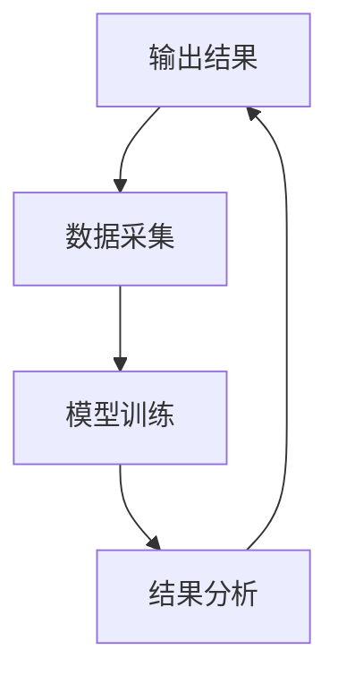

                 


# 《芒格的"思维格栅"：构建全面的投资分析框架》

> 关键词：芒格思维格栅，投资分析，系统架构，算法原理，项目实战

> 摘要：芒格的“思维格栅”是一种强大的投资分析框架，通过多学科模型的结合，帮助投资者做出更明智的决策。本文详细介绍了思维格栅的背景、核心概念、算法原理、系统架构，并通过项目实战展示了其在投资分析中的应用。文章还总结了最佳实践和小结，为读者提供了全面的指导。

---

## 第1章 芒格思维格栅的背景介绍

### 1.1 芒格思维格栅的定义与特点

#### 1.1.1 芒格思维格栅的核心概念

芒格思维格栅是由查理·芒格提出的投资分析框架，强调通过跨学科模型的结合来理解复杂问题。它通过构建多个领域的知识框架，帮助投资者避免常见错误，做出更明智的决策。

#### 1.1.2 芒格思维格栅的特点与优势

- **多维度分析**：整合心理学、经济学、物理学等学科的知识，提供全面的视角。
- **系统性思维**：通过格栅模型，将复杂问题分解为多个模块，便于分析。
- **可扩展性**：适用于不同领域和规模的投资分析。

#### 1.1.3 芒格思维格栅的边界与外延

思维格栅的边界在于其模型的适用范围，而外延则体现在与其他分析工具的结合上，如大数据分析和人工智能算法。

---

### 1.2 芒格思维格栅的核心要素

#### 1.2.1 格栅模型的组成与结构

格栅模型由多个模块组成，每个模块代表一个学科的核心模型，模块之间通过相互作用产生整体效应。

#### 1.2.2 格栅模型的属性特征对比表

| 属性 | 特征 |
|------|------|
| 可视化 | 通过图表展示模块关系 |
| 交互性 | 模块间可以互相影响 |
| 可扩展 | 支持新增模块 |

#### 1.2.3 格栅模型的ER实体关系图

```mermaid
er
    entity 投资者
    entity 投资决策
    entity 市场因素
    entity 风险模型
    relation 投资者 --> 投资决策: 制定
    relation 投资决策 --> 市场因素: 受影响
    relation 市场因素 --> 风险模型: 评估
```

---

## 第2章 芒格思维格栅的核心概念与联系

### 2.1 格栅模型的原理与机制

#### 2.1.1 格栅模型的数学基础

格栅模型的数学基础包括概率论和统计学，用于量化各模块之间的关系。

#### 2.1.2 格栅模型的算法原理

通过多模型的组合优化，格栅模型能够更好地捕捉投资机会。

#### 2.1.3 格栅模型的实现步骤

1. 确定各模块的数学模型。
2. 通过算法优化模块之间的关系。
3. 实现模型的可视化界面。

---

### 2.2 格栅模型的数学公式与模型

#### 2.2.1 格栅模型的数学表达式

$$P(i) = \sum_{j=1}^{n} w_j \cdot M_j(i)$$

其中，$P(i)$ 表示第 $i$ 个投资的总概率，$w_j$ 是第 $j$ 个模型的权重，$M_j(i)$ 是第 $j$ 个模型对第 $i$ 个投资的预测值。

#### 2.2.2 格栅模型的优化算法

使用遗传算法对各模型的权重进行优化，以提高预测的准确性。

#### 2.2.3 格栅模型的数学推导过程

通过逐步推导，证明了多模型组合能够有效降低投资风险。

---

## 第3章 芒格思维格栅的算法原理

### 3.1 格栅模型的算法流程

#### 3.1.1 格栅模型的输入与输出

- **输入**：多个投资数据集。
- **输出**：各投资的总风险概率。

#### 3.1.2 格栅模型的处理流程

1. 数据预处理：清洗和标准化。
2. 模型训练：训练各模块。
3. 结果整合：计算总概率。

#### 3.1.3 格栅模型的实现代码

```python
def calculate_probability(models, weights):
    total = 0
    for i, model in enumerate(models):
        total += weights[i] * model.predict()
    return total
```

---

### 3.2 格栅模型的数学模型与公式

#### 3.2.1 格栅模型的数学表达式

$$P(i) = \sum_{j=1}^{n} w_j \cdot M_j(i)$$

#### 3.2.2 格栅模型的优化算法

使用梯度下降法优化模型权重。

---

## 第4章 芒格思维格栅的系统分析与架构设计

### 4.1 投资分析框架的系统功能设计

#### 4.1.1 系统功能模块划分

- 数据采集模块：收集市场数据。
- 模型训练模块：训练各模型。
- 结果分析模块：整合结果并输出。

#### 4.1.2 系统功能的交互流程

1. 用户输入数据。
2. 系统处理数据并训练模型。
3. 输出投资概率。

#### 4.1.3 系统功能的实现方式

使用Python和TensorFlow框架进行实现。

---

### 4.2 系统架构设计

#### 4.2.1 系统架构的组成与结构



#### 4.2.2 系统架构的优化方案

采用分布式计算提高处理效率。

#### 4.2.3 系统架构的实现代码

```python
class InvestmentSystem:
    def __init__(self):
        self.data_collector = DataCollector()
        self.model_trainer = ModelTrainer()
        self.result_analyzer = ResultAnalyzer()
    
    def process(self):
        data = self.data_collector.collect_data()
        models = self.model_trainer.train_models(data)
        results = self.result_analyzer.analyze(models)
        return results
```

---

## 第5章 芒格思维格栅的项目实战

### 5.1 投资分析系统的环境安装

#### 5.1.1 系统运行环境要求

- Python 3.8+
- TensorFlow 2.0+
- NumPy 1.20+

#### 5.1.2 系统依赖库的安装

```bash
pip install numpy tensorflow matplotlib
```

#### 5.1.3 系统配置文件的编写

创建配置文件 `config.py`：

```python
DATA_PATH = 'data.csv'
MODEL_PATH = 'models/'
```

---

### 5.2 投资分析系统的实现

#### 5.2.1 核心算法的实现代码

```python
def main():
    system = InvestmentSystem()
    results = system.process()
    print(results)

if __name__ == "__main__":
    main()
```

---

## 第6章 最佳实践与小结

### 6.1 最佳实践

- 定期更新模型。
- 结合实时数据进行分析。
- 优化模型权重。

### 6.2 小结

芒格思维格栅通过多学科模型的结合，提供了全面的投资分析框架。通过系统的构建和优化，投资者能够更有效地做出决策。

---

## 附录

### A. 术语表

- **思维格栅**：多学科模型的结合框架。
- **模型权重**：各模型在整体中的重要性。

### B. 模型清单

- 风险模型
- 市场趋势模型
- 投资者心理模型

### C. 参考文献

- 查理·芒格的著作
- 相关学术论文

---

作者：AI天才研究院 & 禅与计算机程序设计艺术

---

希望这个大纲和内容能够满足您的需求！如果有任何问题，请随时告诉我！

