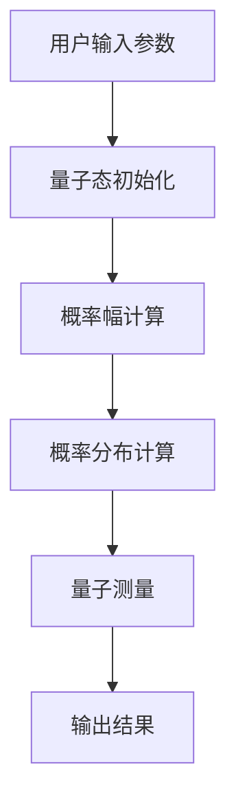
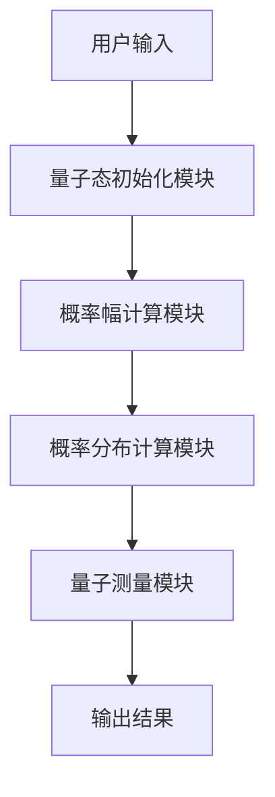
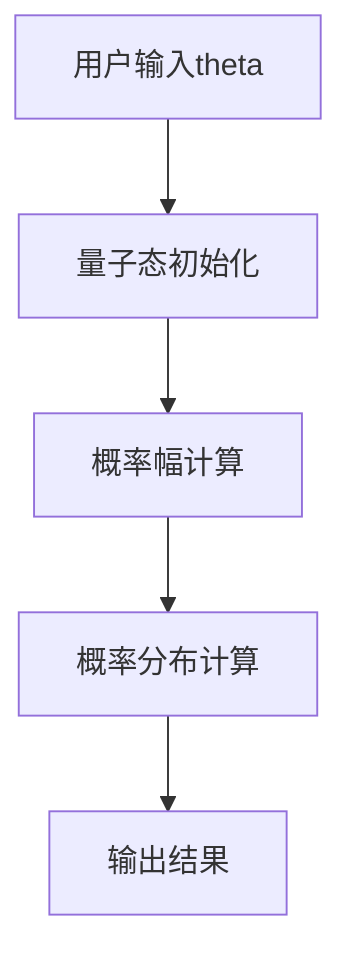

                 


# 芒格的"数学期望"思维在量子概率金融模型中的应用

## 关键词：芒格思维，数学期望，量子概率，金融模型，投资决策

## 摘要：  
芒格的"数学期望"思维是一种基于概率和决策的心理学模型，而量子概率金融模型则是近年来金融领域中的一种新兴方法。本文通过结合芒格的数学期望思维与量子概率模型，探讨其在金融投资决策中的应用。通过理论分析和实际案例，本文详细阐述了量子概率模型的核心原理、芒格思维与量子概率的结合方式，以及其在金融建模中的优势。文章还通过具体的投资案例，展示了如何利用量子概率模型和芒格思维进行更精准的投资决策。

---

# 第1章: 芒格的"数学期望"思维与量子概率金融模型概述

## 1.1 芒格的"数学期望"思维  
### 1.1.1 数学期望的定义与特性  
数学期望是概率论中的核心概念，表示随机变量在多次独立重复实验中的平均值。其特性包括线性性、可加性以及对称性。数学期望的公式为：  
$$E[X] = \sum_{i=1}^{n} p_i x_i$$  
其中，$p_i$ 是第 $i$ 种结果的概率，$x_i$ 是对应结果的值。  

### 1.1.2 芒格思维的核心理念  
芒格思维强调通过概率和决策的结合来优化决策过程。其核心理念包括：  
1. 基于概率的决策优化。  
2. 避免认知偏差对决策的影响。  
3. 结合长期投资的复利效应。  

### 1.1.3 芒格思维在金融中的应用  
芒格思维在金融中的应用主要体现在投资决策、风险管理以及资产配置中。例如，在投资决策中，芒格强调通过概率分析来评估投资的潜在回报和风险。  

---

## 1.2 量子概率与传统概率的区别  
### 1.2.1 量子概率的基本概念  
量子概率是量子力学中的概率理论，与经典概率不同，它允许概率幅为负数，并且概率的叠加性可以导致干涉现象。量子概率的核心公式为：  
$$P(x) = |\langle x | \psi \rangle|^2$$  
其中，$|\psi\rangle$ 是量子态，$\langle x | \psi \rangle$ 是量子态 $|\psi\rangle$ 在状态 $|x\rangle$ 上的投影。  

### 1.2.2 量子概率与经典概率的对比  
1. 经典概率要求概率非负且总和为1，而量子概率允许概率幅为负数，但最终的概率仍为非负且总和为1。  
2. 经典概率是可交换的（即事件的顺序不影响概率计算），而量子概率是不可交换的。  
3. 量子概率允许概率的干涉效应，这在经典概率中是不存在的。  

### 1.2.3 量子概率在金融建模中的优势  
量子概率在金融建模中的优势体现在其能够捕捉非独立性和非线性关系，尤其是在复杂金融市场中，量子概率模型能够更好地描述价格波动和相关性。  

---

## 1.3 量子概率金融模型的背景与意义  
### 1.3.1 传统金融模型的局限性  
传统金融模型（如CAPM和APT）假设资产回报服从正态分布，但在实际市场中，金融资产的回报往往呈现幂律分布，且存在显著的非独立性和非线性关系。  

### 1.3.2 量子概率模型的提出  
量子概率模型通过引入量子态和概率幅的概念，能够更好地描述金融市场中的复杂关系。例如，量子模型可以用来描述资产价格的波动性和相关性。  

### 1.3.3 芒格思维与量子概率的结合  
芒格思维强调概率和决策的结合，而量子概率模型提供了更强大的概率工具，因此两者的结合能够为金融建模提供新的视角。  

---

## 1.4 本章小结  
本章介绍了芒格的"数学期望"思维和量子概率模型的基本概念，并探讨了两者在金融建模中的应用前景。下一章将详细阐述量子概率模型的核心原理及其在金融中的应用。  

---

# 第2章: 数学期望与量子概率模型的核心概念  

## 2.1 数学期望的理论基础  
### 2.1.1 随机变量的期望值公式  
随机变量的期望值公式为：  
$$E[X] = \sum_{i=1}^{n} p_i x_i$$  
其中，$p_i$ 是第 $i$ 个结果的概率，$x_i$ 是对应结果的值。  

### 2.1.2 期望值的线性性质  
期望值具有线性性质，即：  
$$E[aX + bY] = aE[X] + bE[Y]$$  
其中，$a$ 和 $b$ 是常数，$X$ 和 $Y$ 是随机变量。  

### 2.1.3 期望值的条件概率与贝叶斯定理  
条件概率与贝叶斯定理是概率论中的核心工具，其公式分别为：  
$$P(A|B) = \frac{P(B|A)P(A)}{P(B)}$$  
$$E[X|Y] = \sum_{y} P(Y=y) E[X|Y=y]$$  

---

## 2.2 量子概率模型的核心原理  
### 2.2.1 量子态的表示  
量子态可以用向量或密度矩阵表示，例如：  
$$|\psi\rangle = \alpha|0\rangle + \beta|1\rangle$$  
其中，$\alpha$ 和 $\beta$ 是概率幅，满足 $|\alpha|^2 + |\beta|^2 = 1$。  

### 2.2.2 量子概率的叠加原理  
量子概率的叠加原理允许概率幅为负数，从而导致概率的干涉效应。例如，两个事件 $A$ 和 $B$ 的联合概率可以表示为：  
$$P(A \cap B) = |\langle A | B \rangle|^2$$  

### 2.2.3 量子概率的测量与坍缩  
量子概率的测量会导致量子态的坍缩，即：  
$$|\psi\rangle \rightarrow |x\rangle$$  
其中，$|x\rangle$ 是测量结果为 $x$ 的量子态。  

---

## 2.3 芒格思维与量子概率的结合  
### 2.3.1 芒格思维的数学化表达  
芒格思维的核心是通过概率和决策的结合来优化决策过程，其数学化表达可以表示为：  
$$\text{决策优化} = \arg\max_{d} \sum_{i=1}^{n} p_i u(d, x_i)$$  
其中，$d$ 是决策变量，$u(d, x_i)$ 是决策 $d$ 在结果 $x_i$ 下的效用函数。  

### 2.3.2 量子概率在决策中的应用  
量子概率可以用来描述决策过程中的不确定性，例如在投资决策中，量子概率模型可以用来描述不同资产之间的相关性。  

---

## 2.4 本章小结  
本章详细阐述了数学期望和量子概率模型的核心概念，并探讨了芒格思维与量子概率的结合方式。下一章将从算法原理的角度，进一步探讨量子概率金融模型的实现方法。  

---

# 第3章: 量子概率金融模型的算法原理  

## 3.1 量子概率模型的数学框架  
### 3.1.1 量子概率模型的构建  
量子概率模型的构建过程包括以下步骤：  
1. 定义量子态。  
2. 计算概率幅。  
3. 计算概率分布。  
4. 进行量子测量。  

---

## 3.2 量子概率模型的实现算法  
### 3.2.1 量子概率模型的实现步骤  
1. 初始化量子态：$|\psi\rangle = \alpha|0\rangle + \beta|1\rangle$。  
2. 计算概率幅：$\alpha = \cos(\theta/2)$，$\beta = \sin(\theta/2)$。  
3. 计算概率分布：$P(0) = |\alpha|^2$，$P(1) = |\beta|^2$。  
4. 进行量子测量，得到结果 $x$。  

### 3.2.2 量子概率模型的代码实现  
```python
import numpy as np

def quantum_probability(theta):
    alpha = np.cos(theta/2)
    beta = np.sin(theta/2)
    P0 = np.abs(alpha)**2
    P1 = np.abs(beta)**2
    return P0, P1

# 示例：计算theta=60度时的概率分布
theta = np.pi/3  # 60度
P0, P1 = quantum_probability(theta)
print(f"P(0) = {P0}, P(1) = {P1}")
```

---

## 3.3 量子概率模型的数学模型  
量子概率模型的数学模型可以表示为：  
$$P(x) = |\langle x | \psi \rangle|^2$$  
其中，$|\psi\rangle$ 是量子态，$\langle x | \psi \rangle$ 是量子态 $|\psi\rangle$ 在状态 $|x\rangle$ 上的投影。  

---

## 3.4 本章小结  
本章详细阐述了量子概率模型的数学框架和实现算法，为后续的金融建模奠定了基础。下一章将从系统分析的角度，进一步探讨量子概率金融模型的应用。  

---

# 第4章: 量子概率金融模型的系统分析与设计  

## 4.1 系统功能设计  
### 4.1.1 系统功能模块  
1. 量子态初始化模块。  
2. 概率幅计算模块。  
3. 概率分布计算模块。  
4. 量子测量模块。  

### 4.1.2 系统功能流程图  


---

## 4.2 系统架构设计  
### 4.2.1 系统架构图  


---

## 4.3 系统接口设计  
### 4.3.1 系统接口描述  
1. 输入接口：用户输入参数 $\theta$。  
2. 输出接口：输出概率分布 $P(0)$ 和 $P(1)$。  

---

## 4.4 系统交互设计  
### 4.4.1 系统交互流程图  


---

## 4.5 本章小结  
本章从系统分析的角度，详细阐述了量子概率金融模型的功能设计和架构设计。下一章将通过具体的投资案例，进一步探讨量子概率金融模型的应用。  

---

# 第5章: 量子概率金融模型的项目实战  

## 5.1 投资案例分析  
### 5.1.1 案例背景  
假设我们有两只股票，股票A和股票B，其价格波动可以用量子概率模型描述。  

### 5.1.2 数据准备  
我们需要收集股票A和股票B的历史价格数据，并计算其价格波动的相关性。  

---

## 5.2 量子概率模型的实现  
### 5.2.1 环境安装  
需要安装Python和NumPy库。  

### 5.2.2 代码实现  
```python
import numpy as np

def quantum_portfolio(theta, weight_A, weight_B):
    alpha = np.cos(theta/2)
    beta = np.sin(theta/2)
    P_A = np.abs(alpha)**2
    P_B = np.abs(beta)**2
    return P_A * weight_A + P_B * weight_B

# 示例：计算theta=60度，weight_A=0.5，weight_B=0.5时的概率分布
theta = np.pi/3  # 60度
weight_A = 0.5
weight_B = 0.5
result = quantum_portfolio(theta, weight_A, weight_B)
print(f"投资组合的概率分布为：{result}")
```

---

## 5.3 案例分析与结果解读  
### 5.3.1 案例分析  
假设theta=60度，weight_A=0.5，weight_B=0.5，计算投资组合的概率分布。  

### 5.3.2 结果解读  
通过量子概率模型，我们可以得到投资组合的概率分布，并据此优化投资决策。  

---

## 5.4 本章小结  
本章通过具体的投资案例，展示了量子概率金融模型的实际应用。下一章将从总结与展望的角度，进一步探讨量子概率金融模型的未来发展。  

---

# 第6章: 总结与展望  

## 6.1 总结  
本文通过结合芒格的"数学期望"思维与量子概率模型，探讨了其在金融建模中的应用。通过理论分析和实际案例，本文详细阐述了量子概率模型的核心原理、芒格思维与量子概率的结合方式，以及其在金融建模中的优势。  

---

## 6.2 展望  
未来的研究方向包括：  
1. 量子概率模型在多资产投资组合中的应用。  
2. 量子概率模型与机器学习的结合。  
3. 量子概率模型在风险管理中的应用。  

---

## 6.3 最佳实践 Tips  
1. 在实际应用中，应结合具体的投资目标和市场环境选择合适的模型。  
2. 量子概率模型的实现需要结合专业的数学知识和编程技能。  
3. 在进行投资决策时，应结合多方面的信息进行综合分析。  

---

## 6.4 本章小结  
本文总结了量子概率金融模型的核心内容，并展望了其未来的研究方向。希望本文能够为金融领域的研究者和从业者提供新的思路和方法。  

---

# 作者：AI天才研究院/AI Genius Institute & 禅与计算机程序设计艺术/Zen And The Art of Computer Programming

