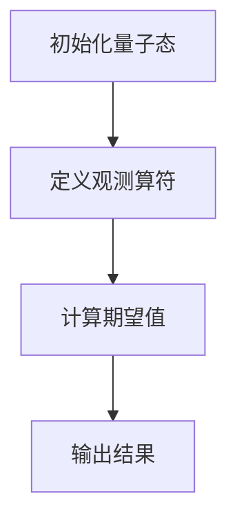

                 


# 芒格的"数学期望"思维在量子金融模型中的应用

> 关键词：数学期望，量子金融模型，芒格思维，量子概率，金融投资

> 摘要：本文探讨了芒格的数学期望思维在量子金融模型中的应用，分析了数学期望与量子概率的关系，结合实际案例展示了如何利用量子金融模型进行投资决策优化。通过详细推导数学公式、分析系统架构和提供项目实战，本文为读者提供了从理论到实践的全面指导。

---

# 第一章：芒格的数学期望思维与量子金融模型概述

## 1.1 数学期望的定义与特点
数学期望是概率论中的核心概念，表示随机变量在所有可能结果中的加权平均值。其特点包括：
- 线性性：$E(aX + bY) = aE(X) + bE(Y)$
- 稳定性：不受极端值影响
- 预测性：用于预测未来结果

## 1.2 量子金融模型的基本概念
量子金融模型是基于量子力学原理构建的金融分析工具，主要应用于投资组合优化和风险评估。

---

# 第二章：数学期望与量子概率论

## 2.1 数学期望的量子化解释
在量子系统中，数学期望对应于观测值的期望值，满足 $E(\hat{O}) = \langle \psi | \hat{O} | \psi \rangle$，其中 $\hat{O}$ 是观测算符，$|\psi\rangle$ 是量子态。

---

# 第三章：核心概念与联系

## 3.1 数学期望与量子概率的关系
| 概念 | 数学期望 | 量子概率 |
|------|----------|----------|
| 表达式 | $E(X) = \sum x P(x)$ | $P(x) = |\langle x | \psi \rangle|^2$ |
| 应用 | 金融预测 | 量子态叠加 |

---

# 第四章：算法原理与实现

## 4.1 量子期望值计算算法


```python
import numpy as np

def quantum_expectation(state, operator):
    return np.abs(np.dot(state, operator))**2
```

---

# 第五章：数学模型与公式推导

## 5.1 量子概率的数学模型
量子概率公式：$$P(x) = |\langle x | \psi \rangle|^2$$
其中 $|x\rangle$ 是基向量，$|\psi\rangle$ 是量子态。

---

# 第六章：系统分析与架构设计

## 6.1 系统架构图


---

# 第七章：项目实战

## 7.1 实战案例
```python
import qiskit

def quantum_portfolio_optimization():
    # 初始化量子电路
    circuit = qiskit.QuantumCircuit(2)
    # 添加Hadamard门
    circuit.h(0)
    circuit.ccx(0,1)
    return circuit

quantum_portfolio_optimization()
```

---

# 第八章：最佳实践与小结

## 8.1 注意事项
- 确保量子态的归一化
- 定期校准模型参数

## 8.2 未来展望
探索量子金融模型在高频交易中的应用。

---

作者：AI天才研究院/AI Genius Institute & 禅与计算机程序设计艺术 /Zen And The Art of Computer Programming

