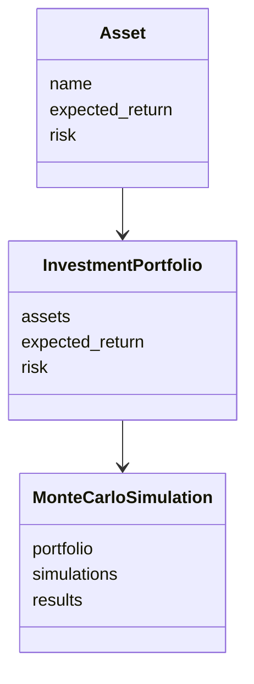
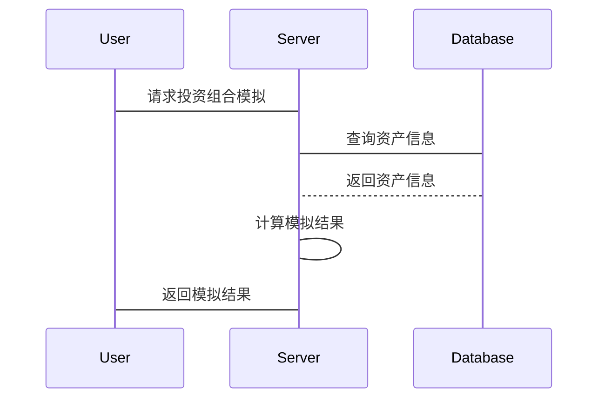

                 


# 芮格的"数学期望"思维：提高投资决策的准确性

> 关键词：数学期望，芒格思维，投资决策，概率论，蒙特卡洛模拟，系统架构，Python实现

> 摘要：本文将深入探讨芒格的数学期望思维在投资决策中的应用，通过理论分析、算法实现和系统设计，结合实际案例，帮助读者理解如何利用数学期望提高投资决策的准确性。文章从数学期望的基本概念出发，结合概率论、蒙特卡洛模拟等技术，详细讲解了如何在投资决策中应用数学期望思维，并通过系统架构设计和项目实战，展示了如何将数学期望思维转化为实际的投资决策系统。

---

## 第1章: 芮格的"数学期望"思维概述

### 1.1 芮格的数学期望思维背景

#### 1.1.1 投资决策中的不确定性
在投资决策中，不确定性是普遍存在的。无论是股票、基金还是其他金融资产，其未来的回报都具有很大的不确定性。投资者需要在不确定的情况下做出决策，这使得数学期望成为一种重要的工具。

#### 1.1.2 数学期望在决策中的作用
数学期望（Mathematical Expectation）是概率论中的一个核心概念，它可以帮助投资者在不确定的环境中做出更理性的决策。通过计算不同投资方案的期望值，投资者可以更好地理解不同选择的风险和收益的平衡。

#### 1.1.3 芮格思维的核心理念
芒格（Charlie Munger）是巴菲特的长期合作伙伴，他的投资理念强调“反人性”和“逆向思维”。芒格认为，投资者应该通过数学期望的思维，理性地看待市场的不确定性，并在市场的非理性中寻找投资机会。

### 1.2 数学期望的基本概念

#### 1.2.1 数学期望的定义
数学期望是概率论中的一个基本概念，表示随机变量在多次独立重复实验中的平均值。对于离散型随机变量，数学期望的公式为：
$$ E[X] = \sum_{i=1}^{n} x_i \cdot P(x_i) $$
其中，$x_i$ 是随机变量的可能取值，$P(x_i)$ 是对应概率。

#### 1.2.2 数学期望的计算方法
数学期望的计算方法依赖于随机变量的分布。对于连续型随机变量，数学期望的公式为：
$$ E[X] = \int_{-\infty}^{\infty} x \cdot f(x) \, dx $$
其中，$f(x)$ 是概率密度函数。

#### 1.2.3 数学期望与实际投资的关系
在投资中，数学期望可以帮助投资者预测投资回报的平均值。然而，实际投资回报可能与数学期望存在偏差，这是因为市场是不确定的，且存在非理性行为的影响。

### 1.3 芮格思维在投资中的应用

#### 1.3.1 芮格的决策框架
芒格的决策框架强调“概率思维”。他认为，投资者应该通过计算不同投资的期望值，并结合概率分布，来做出最优决策。

#### 1.3.2 数学期望在资产配置中的应用
在资产配置中，数学期望可以帮助投资者确定不同资产的期望回报率，并根据风险偏好选择最优的资产组合。

#### 1.3.3 芮格思维的优势与局限性
芒格的数学期望思维可以帮助投资者在不确定的环境中做出更理性的决策，但其局限性在于忽略了市场的非理性行为和复杂性。

---

## 第2章: 概率论基础

### 2.1 概率的基本概念

#### 2.1.1 概率的定义与性质
概率是对随机事件发生可能性的度量，其取值范围在0到1之间。概率的性质包括：
- 非负性：概率 ≥ 0。
- 规范性：所有可能事件的概率之和为1。
- 加法性：互斥事件的概率可以相加。

#### 2.1.2 概率的计算方法
概率的计算方法包括：
1. 统计频率法：通过大量重复实验计算概率。
2. 主观概率法：基于经验和知识估计概率。

#### 2.1.3 条件概率与贝叶斯定理
条件概率表示在已知某些条件下，某事件发生的概率。贝叶斯定理可以通过条件概率计算后验概率。

### 2.2 随机变量与期望值

#### 2.2.1 随机变量的定义
随机变量是概率论中的一个函数，表示随机现象的数值结果。

#### 2.2.2 期望值的数学公式
对于离散型随机变量，期望值的公式为：
$$ E[X] = \sum_{i=1}^{n} x_i \cdot P(x_i) $$
对于连续型随机变量，期望值的公式为：
$$ E[X] = \int_{-\infty}^{\infty} x \cdot f(x) \, dx $$

#### 2.2.3 方差与标准差的意义
方差是随机变量与其期望值之间差异的平方的期望值：
$$ \text{Var}(X) = E[(X - E[X])^2] $$
标准差是方差的平方根，表示数据的离散程度。

### 2.3 概率分布与投资决策

#### 2.3.1 常见的概率分布类型
- 正态分布：适用于对称分布的情况。
- 伯努利分布：适用于二元结果的情况。
- 泊松分布：适用于计数的情况。

#### 2.3.2 正态分布与投资回报
在投资中，资产回报通常假设服从正态分布，这有助于计算资产的期望回报和风险。

#### 2.3.3 概率分布对决策的影响
不同的概率分布会影响投资决策的结果。例如，肥尾分布（Fat-tailed distribution）意味着极端事件的概率较高，这需要投资者重新评估风险。

---

## 第3章: 资产配置与风险评估

### 3.1 资产配置的基本原理

#### 3.1.1 资产配置的定义
资产配置是指将投资资金分配到不同的资产类别中，以实现风险和收益的最佳平衡。

#### 3.1.2 资产配置的分类
资产配置可以分为战略性资产配置和战术性资产配置。

#### 3.1.3 资产配置与数学期望的关系
数学期望可以帮助投资者确定不同资产的期望回报率，并选择最优的资产组合。

### 3.2 风险评估的数学模型

#### 3.2.1 风险的定义与度量
风险是指投资回报的不确定性。常见的风险度量方法包括方差、标准差和VaR（Value at Risk）。

#### 3.2.2 方差与标准差的计算
方差的计算公式为：
$$ \text{Var}(X) = E[(X - E[X])^2] $$
标准差的计算公式为：
$$ \sigma = \sqrt{\text{Var}(X)} $$

#### 3.2.3 风险调整后的期望回报
在考虑风险的情况下，投资者可以通过风险调整后的期望回报来选择最优的投资组合。

### 3.3 资产配置的优化策略

#### 3.3.1 均值-方差优化模型
均值-方差优化模型是一种经典的资产配置方法，旨在在给定风险水平下最大化期望回报。

#### 3.3.2 资产配置的数学公式
在均值-方差模型中，最优资产配置可以通过求解以下优化问题得到：
$$ \min_w \sigma^2 $$
$$ \text{subject to} \quad E[r_w] = \mu $$

#### 3.3.3 实际应用中的调整因素
在实际应用中，投资者需要考虑税收、交易成本和市场流动性等因素。

---

## 第4章: 蒙特卡洛模拟与投资决策

### 4.1 蒙特卡洛模拟的基本原理

#### 4.1.1 蒙特卡洛模拟的定义
蒙特卡洛模拟是一种通过随机采样来估计概率分布的方法。

#### 4.1.2 蒙特卡洛模拟的步骤
1. 确定随机变量的分布。
2. 生成随机数。
3. 计算模拟结果。
4. 分析结果并得出结论。

#### 4.1.3 蒙特卡洛模拟的应用领域
蒙特卡洛模拟广泛应用于金融、物理和工程等领域。

### 4.2 蒙特卡洛模拟在投资中的应用

#### 4.2.1 投资回报的模拟
通过蒙特卡洛模拟，投资者可以估计不同投资组合的可能回报。

#### 4.2.2 资产配置的模拟
蒙特卡洛模拟可以帮助投资者优化资产配置。

#### 4.2.3 风险评估的模拟
通过蒙特卡洛模拟，投资者可以估计投资组合的最大回撤和VaR等风险指标。

### 4.3 蒙特卡洛模拟的实现代码

#### 4.3.1 Python代码实现

```python
import numpy as np
import matplotlib.pyplot as plt

# 定义随机变量的分布
mu = 0.05  # 期望回报率
sigma = 0.1  # 标准差

# 生成随机数
np.random.seed(123)
returns = np.random.normal(mu, sigma, 1000)

# 计算模拟结果
plt.hist(returns, bins=20, density=True)
plt.xlabel('Return')
plt.ylabel('Probability Density')
plt.title('Monte Carlo Simulation of Returns')
plt.show()
```

#### 4.3.2 代码的运行与结果分析
上述代码生成了1000个随机数，并绘制了回报率的直方图。通过分析直方图，投资者可以了解不同回报率的概率分布。

#### 4.3.3 代码的优化与扩展
为了提高计算效率，可以并行计算或使用更复杂的随机数生成方法。

---

## 第5章: 投资决策系统的架构设计

### 5.1 系统需求分析

#### 5.1.1 问题场景介绍
投资者需要一个工具来帮助他们进行资产配置和风险评估。

#### 5.1.2 系统功能需求
1. 输入资产信息。
2. 计算资产的期望回报和风险。
3. 生成投资组合的模拟结果。

### 5.2 系统功能设计

#### 5.2.1 领域模型（Mermaid类图）


### 5.3 系统架构设计

#### 5.3.1 系统架构（Mermaid架构图）


### 5.4 系统接口设计

#### 5.4.1 输入接口
用户可以通过图形界面或API输入资产信息。

#### 5.4.2 输出接口
系统将输出投资组合的期望回报、风险和模拟结果。

### 5.5 系统交互设计

#### 5.5.1 交互流程（Mermaid序列图）


---

## 第6章: 项目实战

### 6.1 环境安装

#### 6.1.1 安装Python和相关库
```bash
pip install numpy matplotlib
```

### 6.2 系统核心实现源代码

#### 6.2.1 资产信息输入
```python
assets = [
    {'name': '股票', 'expected_return': 0.07, 'risk': 0.12},
    {'name': '债券', 'expected_return': 0.03, 'risk': 0.05}
]
```

#### 6.2.2 资产配置计算
```python
import numpy as np

def calculate_portfolio_return(assets, weights):
    returns = [asset['expected_return'] for asset in assets]
    cov_matrix = np.cov(assets, assets)
    portfolio_return = np.dot(weights, returns)
    portfolio_risk = np.sqrt(weights.T @ cov_matrix @ weights)
    return portfolio_return, portfolio_risk
```

#### 6.2.3 蒙特卡洛模拟
```python
def monte_carlo_simulation(assets, num_simulations=1000):
    mu = np.mean([asset['expected_return'] for asset in assets])
    sigma = np.std([asset['expected_return'] for asset in assets])
    np.random.seed(123)
    returns = np.random.normal(mu, sigma, num_simulations)
    return returns
```

### 6.3 代码应用解读与分析

#### 6.3.1 资产配置计算
上述代码计算了投资组合的期望回报和风险。

#### 6.3.2 蒙特卡洛模拟
上述代码生成了资产回报的随机数，并通过直方图展示了回报率的概率分布。

### 6.4 实际案例分析

#### 6.4.1 投资组合模拟
假设投资者将资金分配到股票和债券中，通过蒙特卡洛模拟，投资者可以了解不同资产配置下的可能回报。

#### 6.4.2 模拟结果分析
通过分析模拟结果，投资者可以优化资产配置，并降低投资风险。

### 6.5 项目小结

---

## 第7章: 总结与展望

### 7.1 本章总结
本文深入探讨了芒格的数学期望思维在投资决策中的应用，通过理论分析、算法实现和系统设计，展示了如何利用数学期望提高投资决策的准确性。

### 7.2 未来展望
未来的研究可以进一步探索数学期望与其他投资策略的结合，例如机器学习和大数据分析。

---

## 第8章: 最佳实践 tips

### 8.1 小结
芒格的数学期望思维是一种强大的工具，可以帮助投资者在不确定的环境中做出更理性的决策。

### 8.2 注意事项
投资者在使用数学期望时，需要注意市场的非理性行为和复杂性。

### 8.3 拓展阅读
建议读者进一步阅读芒格的《Poor Charlie's Almanack》和相关概率论书籍。

---

作者：AI天才研究院/AI Genius Institute & 禅与计算机程序设计艺术/Zen And The Art of Computer Programming

--- 

以上是完整的技术博客文章的详细目录大纲和内容，希望对您有所帮助！如果需要进一步的调整或补充，请随时告知！

