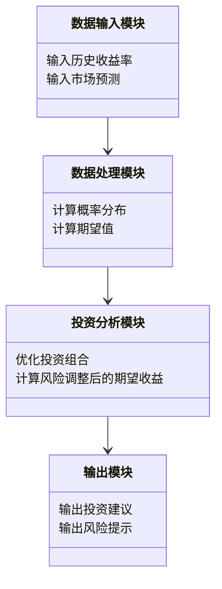
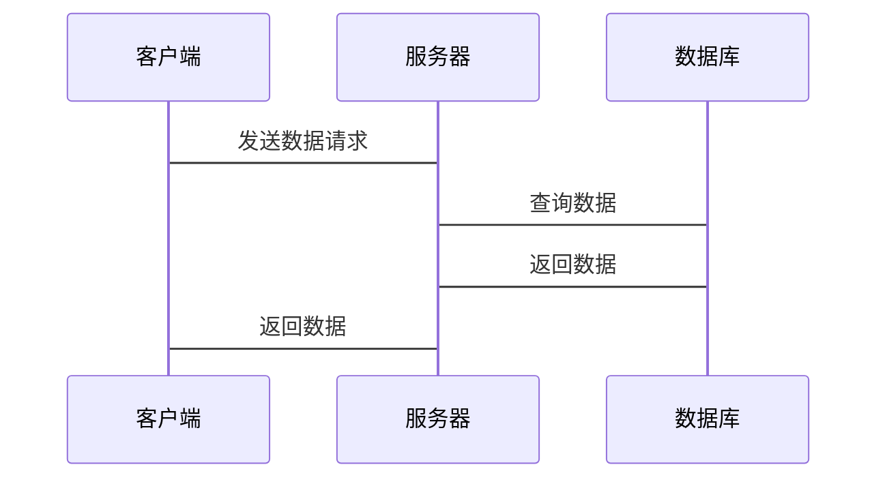
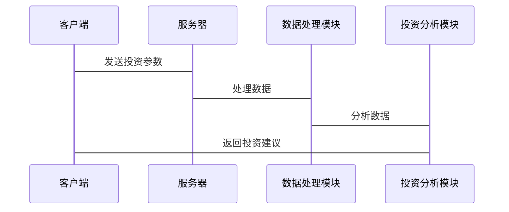

                 


# 芒格的"数学期望"思维：提高投资决策的科学性

> **关键词**：芒格思维，数学期望，投资决策，概率论，统计学

> **摘要**：芒格的“数学期望”思维是一种基于概率论和统计学的投资决策方法，通过计算期望值来优化投资组合。本文从数学期望的基本原理出发，结合芒格的投资哲学，详细探讨了其在投资决策中的应用，包括资产配置、风险管理以及长期投资策略等方面。

---

## 第1章：芒格的“数学期望”思维背景与核心概念

### 1.1 芒格“数学期望”思维的背景

芒格的“数学期望”思维源于他对投资决策科学性的追求。他认为，投资决策不仅仅是对市场的理解和对公司的分析，更需要基于概率和统计学的方法，通过计算“数学期望值”来优化投资组合。这种方法能够帮助投资者在不确定性中做出更科学的决策。

**1.1.1 投资决策的科学性问题**

投资决策的核心在于如何在不确定的市场中找到最优的资产配置策略。传统投资方法往往依赖于对市场的直觉和经验判断，而芒格则强调引入数学模型，通过概率和统计学的方法来量化投资的期望收益和风险。

**1.1.2 芒格思维的核心理念**

芒格的思维理念可以总结为“概率驱动决策”。他认为，任何投资决策都可以通过计算概率分布和期望值来量化，从而避免过度依赖主观判断。这种思维方式在投资中被称为“芒格思维”。

**1.1.3 数学期望在投资中的应用**

数学期望是概率论中的一个核心概念，表示所有可能结果的加权平均值。在投资中，数学期望可以用来计算资产的期望收益和风险，从而帮助投资者做出更科学的投资决策。

### 1.2 数学期望的基本概念与属性

**1.2.1 数学期望的定义与公式**

数学期望，又称期望值，是概率论中的一个基本概念，表示随机变量在多次独立重复试验中的平均结果。对于离散型随机变量，数学期望的公式为：

$$ E[X] = \sum_{i=1}^{n} x_i \cdot P(x_i) $$

其中，$x_i$ 是随机变量的可能取值，$P(x_i)$ 是对应概率。

对于连续型随机变量，数学期望的公式为：

$$ E[X] = \int_{-\infty}^{\infty} x \cdot f(x) dx $$

其中，$f(x)$ 是概率密度函数。

**1.2.2 数学期望的属性特征对比**

以下是数学期望与实际值的对比：

| 特性       | 数学期望          | 实际值          |
|------------|-------------------|-----------------|
| 基础       | 概率分布          | 确定性结果      |
| 计算方式    | 加权平均值         | 单一结果        |
| 适用场景    | 不确定性分析       | 确定性分析       |

**1.2.3 期望值与实际值的差异**

虽然数学期望是基于概率分布计算的理论值，但它与实际值之间可能存在偏差。这种偏差在短期投资中尤为明显，但在长期投资中，根据大数定律，实际值会趋近于数学期望。

### 1.3 芒格思维与数学期望的关系

**1.3.1 芒格思维的核心要素**

芒格思维的核心要素包括：

1. 基于概率的投资决策。
2. 数学期望值的计算与优化。
3. 风险与收益的平衡。

**1.3.2 数学期望在芒格思维中的地位**

数学期望是芒格思维的核心工具，用于量化投资的收益和风险。芒格认为，通过计算数学期望值，投资者可以更好地理解市场的不确定性，并在此基础上做出更科学的投资决策。

**1.3.3 芒格思维的外延与边界**

芒格思维不仅局限于数学期望的计算，还包括对市场规律的理解和对人类行为的分析。芒格认为，投资决策不仅仅是对市场的量化分析，还需要对人性的深刻理解。

### 1.4 本章小结

本章介绍了芒格“数学期望”思维的背景、核心概念以及其在投资中的应用。通过概率论和统计学的方法，芒格将投资决策从传统的经验判断转化为科学的数学计算，从而提高了投资决策的科学性和准确性。

---

## 第2章：数学期望的原理与计算方法

### 2.1 数学期望的原理与计算方法

**2.1.1 离散型随机变量的期望计算**

假设我们有一个离散型随机变量 $X$，其可能取值为 $x_1, x_2, x_3$，对应的概率为 $P(X=x_1)=0.3$, $P(X=x_2)=0.5$, $P(X=x_3)=0.2$。那么 $X$ 的数学期望为：

$$ E[X] = 0.3 \cdot x_1 + 0.5 \cdot x_2 + 0.2 \cdot x_3 $$

**2.1.2 连续型随机变量的期望计算**

对于一个连续型随机变量 $X$，其概率密度函数为 $f(x)$，数学期望为：

$$ E[X] = \int_{-\infty}^{\infty} x \cdot f(x) dx $$

**2.1.3 实际问题中的期望值估算**

在实际投资中，我们通常需要根据历史数据或市场预测来估算概率分布。例如，计算某只股票的期望收益时，我们需要先估算其不同收益水平的概率，然后根据上述公式计算期望值。

### 2.2 数学期望在投资中的应用

**2.2.1 资产配置的期望收益计算**

假设我们有两只股票，A 和 B，它们的收益概率分布如下：

| 收益（%） | 股票A概率 | 股票B概率 |
|-----------|------------|------------|
| 5         | 0.2        | 0.1        |
| 10        | 0.5        | 0.6        |
| 15        | 0.3        | 0.3        |

股票A的期望收益为：

$$ E[A] = 5 \cdot 0.2 + 10 \cdot 0.5 + 15 \cdot 0.3 = 10\% $$

股票B的期望收益为：

$$ E[B] = 5 \cdot 0.1 + 10 \cdot 0.6 + 15 \cdot 0.3 = 11.5\% $$

从上述计算结果可以看出，股票B的期望收益高于股票A，因此在资产配置中可以考虑增加股票B的权重。

**2.2.2 投资组合的风险与期望收益**

在投资组合中，我们需要同时考虑收益和风险。数学期望可以帮助我们计算投资组合的期望收益和风险（如波动率）。例如，通过计算投资组合的期望收益和标准差，我们可以更好地理解其风险收益特征。

**2.2.3 期望值与实际投资结果的偏差**

尽管数学期望是一个重要的工具，但需要注意的是，它只是一个理论值。实际投资结果可能会因为市场的不确定性而与期望值存在偏差。因此，在实际投资中，我们需要结合风险管理和概率分析来应对这种偏差。

---

## 第3章：概率论与统计学基础

### 3.1 概率分布与随机变量

**3.1.1 概率分布的定义与类型**

概率分布是描述随机变量取值及其对应概率的函数。常见的概率分布包括：

- 离散型分布：如二项分布、泊松分布。
- 连续型分布：如正态分布、指数分布。

**3.1.2 离散型与连续型随机变量**

离散型随机变量的取值为可数个，如掷骰子的结果；连续型随机变量的取值为不可数个，如股票价格。

**3.1.3 常见概率分布及其应用**

- 正态分布：常用于描述资产收益率。
- 二项分布：常用于描述成功的概率。

### 3.2 统计学基础与期望值

**3.2.1 统计学在投资中的作用**

统计学可以帮助我们从历史数据中提取信息，估算概率分布和期望值。例如，通过历史收益率数据，我们可以估算某只股票的期望收益。

**3.2.2 样本均值与总体期望值的关系**

样本均值是总体期望值的无偏估计量。随着样本量的增加，样本均值会趋近于总体期望值。

**3.2.3 投资数据的统计分析方法**

在实际投资中，我们通常需要对历史数据进行统计分析，以估算概率分布和期望值。例如，计算某只股票的历史收益率均值和标准差。

### 3.3 数学期望与投资决策的关系

**3.3.1 期望值在投资决策中的重要性**

数学期望可以帮助我们量化投资的收益和风险，从而做出更科学的投资决策。

**3.3.2 期望值与风险的平衡**

在投资决策中，我们需要在期望收益和风险之间找到平衡。例如，通过计算风险调整后的期望收益，我们可以更好地理解不同投资标的的风险收益特征。

**3.3.3 期望值的局限性与改进方法**

尽管数学期望是一个有用的工具，但它也有一些局限性。例如，它忽略了尾部风险（即极端事件的概率）。为了克服这些局限性，我们可以引入其他风险度量方法，如VaR（在险值）和CVaR（条件在险值）。

---

## 第4章：投资决策中的数学期望分析

### 4.1 投资决策的数学期望分析

**4.1.1 资产配置的数学期望分析**

在资产配置中，我们需要计算不同资产的期望收益和风险，并在此基础上优化投资组合。例如，通过计算两只股票的期望收益和标准差，我们可以比较它们的风险收益特征。

**4.1.2 投资组合的期望收益与风险**

投资组合的期望收益是其组成部分资产期望收益的加权平均值。投资组合的风险可以通过标准差来衡量。

**4.1.3 数学期望在投资组合优化中的应用**

通过数学期望，我们可以优化投资组合的收益与风险。例如，通过计算不同资产配置下的期望收益和标准差，我们可以找到最优的投资组合。

### 4.2 实际投资中的数学期望分析

**4.2.1 股票投资中的数学期望分析**

假设我们有两只股票，A 和 B，它们的期望收益分别为10%和12%，标准差分别为15%和20%。通过比较它们的期望收益和标准差，我们可以选择期望收益更高且风险可接受的股票。

**4.2.2 债券投资中的数学期望分析**

债券的期望收益可以通过计算其到期收益率和息票率来估算。例如，一只票面利率为5%，剩余期限为5年的债券，其期望收益可以通过计算其到期收益率来估算。

**4.2.3 其他投资标的数学期望分析**

除了股票和债券，我们还可以通过数学期望来分析其他投资标的，如房地产、黄金等。例如，通过计算房地产市场的历史收益率和概率分布，我们可以估算其期望收益。

---

## 第5章：系统分析与架构设计方案

### 5.1 问题场景介绍

在实际投资中，我们需要构建一个基于数学期望的投资决策系统。该系统需要能够：

1. 输入市场数据（如历史收益率）。
2. 计算不同资产的期望收益和风险。
3. 优化投资组合。
4. 输出投资建议。

### 5.2 项目介绍

本项目旨在开发一个基于数学期望的投资决策系统，帮助投资者做出更科学的投资决策。

### 5.3 系统功能设计（领域模型）

以下是系统功能设计的领域模型：



### 5.4 系统架构设计

以下是系统的架构设计：


### 5.5 系统接口设计

以下是系统的接口设计：



### 5.6 系统交互设计

以下是系统的交互设计：



---

## 第6章：项目实战

### 6.1 环境安装

为了运行本项目，您需要安装以下工具：

1. Python 3.x
2. NumPy 和 Pandas 库
3. Matplotlib 库

安装命令：

```bash
pip install numpy pandas matplotlib
```

### 6.2 系统核心实现源代码

以下是系统核心实现的源代码：

```python
import numpy as np
import pandas as pd
import matplotlib.pyplot as plt

# 示例数据
returns = np.array([0.1, 0.12, 0.08, 0.15, 0.11])

# 计算期望收益
expected_return = np.mean(returns)
print("期望收益：", expected_return)

# 计算标准差
std_deviation = np.std(returns)
print("标准差：", std_deviation)

# 绘制概率分布图
plt.hist(returns, bins=5, alpha=0.5)
plt.title('概率分布图')
plt.xlabel('收益')
plt.ylabel('概率')
plt.show()
```

### 6.3 代码应用解读与分析

上述代码的功能如下：

1. 导入所需的库（NumPy、Pandas、Matplotlib）。
2. 定义历史收益率数组。
3. 计算历史收益率的平均值（期望收益）。
4. 计算历史收益率的标准差（风险）。
5. 绘制历史收益率的概率分布图。

通过上述代码，我们可以计算出投资标的期望收益和风险，并通过图表直观地展示其概率分布。

### 6.4 实际案例分析

假设我们有两只股票，A 和 B，它们的历史收益率如下：

| 股票 | 收益率 |
|------|--------|
| A    | 0.1, 0.12, 0.08, 0.15, 0.11 |
| B    | 0.15, 0.1, 0.18, 0.08, 0.13 |

通过上述代码，我们可以计算出股票A和B的期望收益和标准差，从而比较它们的风险收益特征。

### 6.5 项目小结

本章通过实际案例分析，展示了如何将数学期望应用于投资决策。通过编写Python代码，我们可以量化投资标的的期望收益和风险，并通过图表直观地展示其概率分布。

---

## 第7章：结论

### 7.1 总结

芒格的“数学期望”思维是一种基于概率论和统计学的投资决策方法，通过计算数学期望值，我们可以量化投资的收益和风险，从而做出更科学的投资决策。

### 7.2 最佳实践

1. 在实际投资中，建议结合市场预测和历史数据，估算概率分布和期望值。
2. 注意数学期望的局限性，尤其是尾部风险。
3. 在实际投资中，建议结合其他风险度量方法（如VaR和CVaR）来优化投资组合。

### 7.3 注意事项

1. 数学期望是一个理论值，实际投资结果可能会与期望值存在偏差。
2. 在实际投资中，需要注意市场的不确定性，尤其是尾部风险。

### 7.4 拓展阅读

1. 《投资学原理》
2. 《概率论与数理统计》
3. 《投资组合管理》

---

## 作者：AI天才研究院 & 禅与计算机程序设计艺术

---

通过以上内容，我们详细探讨了芒格的“数学期望”思维在投资决策中的应用，从理论到实践，帮助投资者更好地理解如何通过数学期望来优化投资组合。

