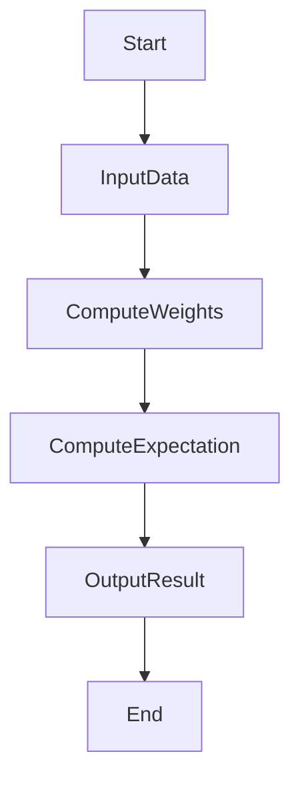
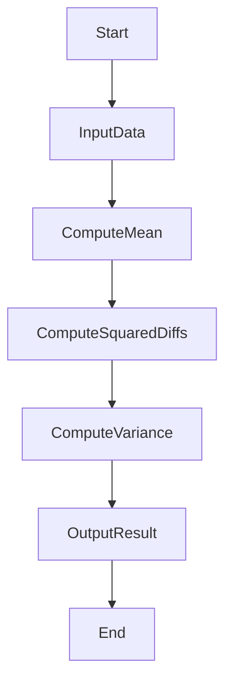
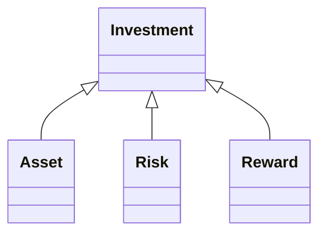
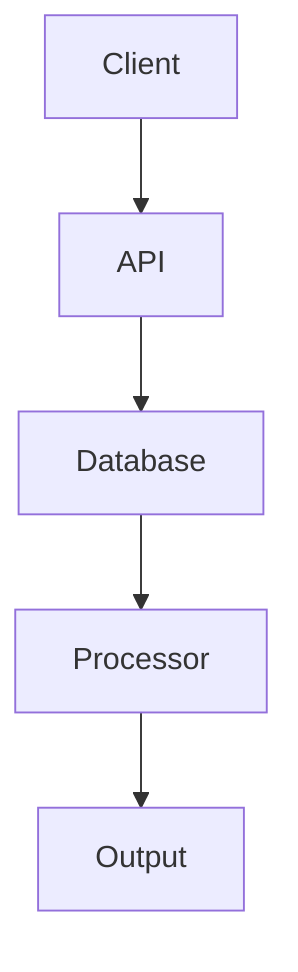

                 


# 芒格的"数学期望"思维：提高投资决策质量

## 关键词：芒格、数学期望、投资决策、理性决策、资产配置、风险管理

## 摘要：  
芒格的"数学期望"思维是一种以概率论为基础的投资决策方法，强调通过计算期望值和方差等指标，理性分析投资风险与收益的平衡关系。本文深入解析芒格的数学期望思维，结合实际案例，探讨其在投资决策中的应用，帮助投资者提升决策质量，降低风险，实现长期稳健收益。

---

# 第1章: 引言

## 1.1 芒格的数学期望思维概述  
芒格的数学期望思维是一种以概率论为基础的投资决策方法，强调通过计算期望值和方差等指标，理性分析投资风险与收益的平衡关系。这种思维模式不仅适用于投资领域，还可广泛应用于其他决策场景。

---

# 第2章: 芒格的数学期望思维背景

## 2.1 芒格的生平与投资理念  
- 2.1.1 芒格的生平简介：芒格是投资界的传奇人物，以其独特的投资哲学闻名。  
- 2.1.2 芒格的投资哲学：强调安全边际、长期投资和理性决策。  
- 2.1.3 数学期望思维的特点：芒格将数学期望应用于投资决策，注重概率和风险控制。  

## 2.2 数学期望的基本概念  
- 2.2.1 数学期望的定义：期望值是随机变量可能取值的加权平均值，权重为概率。  
- 2.2.2 数学期望的计算公式：$$E[X] = \sum_{i=1}^{n} p_i x_i$$，其中$p_i$是第$i$个结果的概率，$x_i$是第$i$个结果的值。  
- 2.2.3 数学期望与投资决策的关系：期望值帮助投资者预测未来收益，指导投资决策。  

## 2.3 芒格数学期望思维的特点  
- 2.3.1 理性决策的核心：芒格强调基于概率和数据的理性决策，而非情绪化决策。  
- 2.3.2 风险与收益的平衡：通过计算方差和标准差，芒格量化投资风险，平衡收益与风险。  
- 2.3.3 长期视角：芒格的数学期望思维注重长期投资，而非短期波动。  

---

# 第3章: 数学期望与投资决策的结合

## 3.1 投资中的期望收益  
- 3.1.1 期望收益的计算公式：$$E[R] = \sum_{i=1}^{n} p_i R_i$$，其中$R_i$是第$i$种资产的收益，$p_i$是其概率。  
- 3.1.2 投资组合的期望收益：通过权重和期望收益计算投资组合的期望收益。  
- 3.1.3 期望收益与实际收益的关系：期望收益是理论值，实际收益受市场波动影响。  

## 3.2 风险与方差  
- 3.2.1 方差的定义与计算：方差是收益与期望收益的平方差的期望值，公式为$$Var(X) = E[(X - E[X])^2]$$。  
- 3.2.2 标准差的意义：标准差是方差的平方根，表示收益的波动性。  
- 3.2.3 风险与收益的权衡：高期望收益通常伴随着高风险，投资者需在两者之间找到平衡点。  

## 3.3 数学期望在资产配置中的应用  
- 3.3.1 资产配置的基本原理：通过分配资金到不同资产类别，降低风险，提高收益。  
- 3.3.2 数学期望在组合优化中的作用：通过计算各资产的期望收益和方差，优化投资组合。  
- 3.3.3 长期视角的资产配置：芒格强调长期投资，通过时间分散风险，提高期望收益。  

---

# 第4章: 数学期望的原理与属性

## 4.1 数学期望的原理  
- 4.1.1 线性性：数学期望满足线性性质，即$$E[aX + b] = aE[X] + b$$。  
- 4.1.2 乘积的期望：$$E[XY] \neq E[X]E[Y]$$，除非$X$和$Y$独立。  

## 4.2 数学期望的属性特征对比  
| 属性       | 期望收益 | 方差 | 标准差 |  
|------------|----------|------|--------|  
| 定义       | 各结果的加权平均收益 | 各结果与期望收益的平方差的期望值 | 方差的平方根 |  
| 作用       | 衡量投资的预期收益 | 衡量投资的波动性和风险 | 衡量收益的离散程度 |  

## 4.3 数学期望的ER实体关系图  
```mermaid
graph TD
    I[投资结果] --> E[X](期望值)
    I --> Var(X)(方差)
    Var(X) --> StdDev(X)(标准差)
```

---

# 第5章: 算法原理讲解

## 5.1 期望值的计算算法  
- 5.1.1 算法流程图：  


- 5.1.2 Python代码实现：  
```python
def compute_expectation(values, probabilities):
    return sum(v * p for v, p in zip(values, probabilities))
```

## 5.2 方差的计算算法  
- 5.2.1 算法流程图：  


- 5.2.2 Python代码实现：  
```python
def compute_variance(values, probabilities, mean):
    return sum((v - mean) ** 2 * p for v, p in zip(values, probabilities))
```

## 5.3 数学模型与公式  
- 期望值公式：$$E[X] = \sum_{i=1}^{n} p_i x_i$$  
- 方差公式：$$Var(X) = \sum_{i=1}^{n} p_i (x_i - E[X])^2$$  
- 标准差公式：$$\sigma = \sqrt{Var(X)}$$  

---

# 第6章: 系统分析与架构设计

## 6.1 投资决策系统的功能设计  
- 6.1.1 领域模型类图：  


## 6.2 系统架构设计  
- 6.2.1 系统架构图：  


## 6.3 系统接口设计  
- 输入接口：接收资产价格数据和概率分布。  
- 输出接口：输出投资组合的期望收益和风险指标。  

---

# 第7章: 项目实战

## 7.1 股票投资的数学期望分析  
- 7.1.1 项目环境安装：安装Python和相关库（如NumPy、Pandas）。  
- 7.1.2 核心代码实现：  
```python
import numpy as np
import pandas as pd

def compute_portfolio_expectation(weights, returns):
    return np.dot(weights, returns)

def compute_portfolio_risk(weights, returns, covariance_matrix):
    return np.sqrt(np.dot(weights.T, np.dot(covariance_matrix, weights)))
```

## 7.2 投资组合优化案例分析  
- 通过优化权重，找到期望收益最高且风险最低的投资组合。  
- 使用实际股票数据进行计算，展示结果的可视化图表。

---

# 第8章: 总结与展望

## 8.1 总结  
芒格的数学期望思维为投资决策提供了科学的分析框架，通过计算期望值和方差等指标，帮助投资者理性决策，平衡风险与收益。

## 8.2 展望  
随着人工智能和大数据技术的发展，数学期望思维将得到更广泛的应用，投资者可以利用这些技术进一步提升决策质量。

---

# 作者：AI天才研究院 & 禅与计算机程序设计艺术

