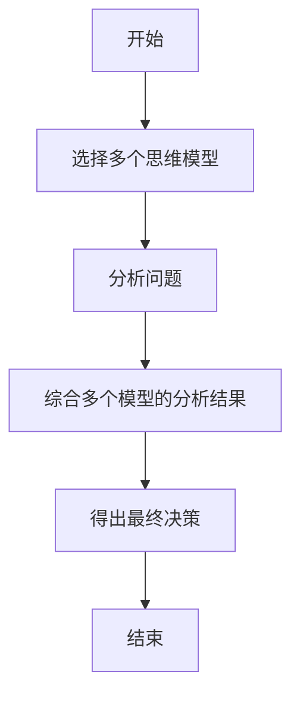
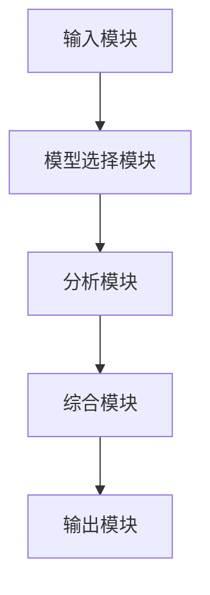

                 


# 芒格的"智力组合"理念：多元化思维在投资中的应用

## 关键词：芒格，智力组合，多元化思维，投资决策，思维模型

## 摘要：芒格的“智力组合”理念强调通过多元化思维模型来优化投资决策。本文从芒格的背景出发，详细探讨了“智力组合”理念的核心概念、算法原理、系统架构及实际应用，为投资者提供了全新的思维方式和决策工具。

---

## 第一部分: 芒格的"智力组合"理念概述

### 第1章: 芒格的生平与"智力组合"理念的起源

#### 1.1 芒格的生平简介
查理·芒格（Charlie Munger）是世界著名投资者和伯克希尔哈撒韦公司副董事长，1924年出生于美国密歇根州。他不仅是投资领域的权威，还是一位哲学家和思想家。芒格的思维方式深受父亲的影响，父亲是一位律师，注重逻辑和推理能力的培养。芒格的哲学思维和对人类心理学的理解，使他能够从多个角度分析问题。

#### 1.2 "智力组合"理念的提出背景
在传统的投资方法中，投资者往往依赖于单一的分析框架，如财务指标或市场趋势。然而，这种方法在面对复杂多变的市场环境时，往往显得力不从心。芒格意识到，仅仅依靠单一的思维模型是不够的，投资者需要从多个角度分析问题，才能做出更明智的决策。因此，他提出了“智力组合”理念，强调通过多元化思维模型来优化投资决策。

#### 1.3 "智力组合"理念的核心思想
“智力组合”理念的核心思想是通过整合多个学科的知识和思维模型，来优化投资决策。芒格认为，投资者应该具备跨学科的知识，能够从数学、物理学、心理学等多个角度分析问题，从而避免单一思维的局限性。这种多元化的思维方式能够帮助投资者更好地识别风险、抓住机会，并做出更明智的投资决策。

---

## 第二部分: 多元化思维模型的核心概念与联系

### 第2章: 多元化思维模型的构成与特点

#### 2.1 多元化思维模型的核心概念
多元化思维模型是一种通过整合多个学科的知识和思维模型，来优化决策的思维方式。以下是多元化思维模型的三个核心概念：
1. **跨学科整合**：将不同学科的知识和方法整合起来，形成一个综合的分析框架。
2. **思维模型的多样性**：使用多个思维模型来分析问题，避免单一思维的局限性。
3. **动态调整**：根据实际情况不断调整和优化思维模型的组合。

#### 2.2 多元化思维模型的数学模型与公式
为了更好地理解多元化思维模型的数学基础，我们可以使用以下公式：
$$
\text{投资收益} = \sum_{i=1}^{n} w_i \times r_i
$$
其中，$w_i$ 是第$i$个思维模型的权重，$r_i$ 是第$i$个思维模型的收益。这个公式表明，投资收益是多个思维模型的加权平均值，权重反映了每个思维模型的重要性。

#### 2.3 多元化思维模型的算法原理
以下是多元化思维模型的算法流程图：



通过这个流程图，我们可以看到，多元化思维模型的核心是将多个思维模型的分析结果综合起来，得出最终的决策。

---

## 第三部分: 多元化思维模型在投资中的应用

### 第3章: 多元化思维模型在投资决策中的应用

#### 3.1 多元化思维模型在投资决策中的核心作用
多元化思维模型在投资决策中的核心作用体现在以下几个方面：
1. **识别潜在风险**：通过多个思维模型的分析，可以更全面地识别潜在的风险因素。
2. **抓住投资机会**：多元化思维模型能够帮助投资者发现更多的投资机会，尤其是在市场变化莫测的情况下。
3. **优化投资组合**：通过整合多个思维模型的分析结果，投资者可以优化投资组合，降低投资风险。

#### 3.2 多元化思维模型在投资组合管理中的应用
在投资组合管理中，多元化思维模型可以帮助投资者制定更科学的投资策略。以下是具体步骤：
1. **选择多个思维模型**：根据投资目标选择多个相关的思维模型。
2. **分析市场环境**：使用这些思维模型分析当前的市场环境。
3. **综合分析结果**：将多个模型的分析结果综合起来，制定投资策略。
4. **动态调整组合**：根据市场变化和模型分析结果，动态调整投资组合。

#### 3.3 多元化思维模型在风险管理中的应用
风险管理是投资过程中非常重要的一部分。以下是多元化思维模型在风险管理中的应用：
1. **识别潜在风险**：通过多个思维模型的分析，识别可能的风险因素。
2. **评估风险影响**：评估每个风险对投资组合的影响程度。
3. **制定应对策略**：根据风险分析结果，制定相应的风险管理策略。

---

## 第四部分: 多元化思维模型的系统分析与架构设计

### 第4章: 多元化思维模型的系统分析

#### 4.1 多元化思维模型的系统功能设计
以下是多元化思维模型的系统功能设计：
1. **输入模块**：输入需要分析的问题和相关数据。
2. **模型选择模块**：选择适合的思维模型。
3. **分析模块**：使用选择的思维模型进行分析。
4. **综合模块**：将多个模型的分析结果综合起来，得出最终的决策。
5. **输出模块**：输出分析结果和决策建议。

#### 4.2 多元化思维模型的系统架构设计
以下是多元化思维模型的系统架构图：



通过这个架构图，我们可以看到，多元化思维模型的系统设计非常简洁，主要由输入模块、模型选择模块、分析模块、综合模块和输出模块组成。

---

## 第五部分: 项目实战与最佳实践

### 第5章: 项目实战

#### 5.1 环境安装
为了实现多元化思维模型，我们需要安装以下工具：
1. **Python**：用于编写和运行代码。
2. **Mermaid**：用于绘制流程图和架构图。
3. **LaTeX**：用于编写数学公式。

#### 5.2 系统核心实现源代码
以下是实现多元化思维模型的Python代码示例：

```python
def diverse_thinking_models(models, weights):
    return sum(w * r for w, r in zip(weights, models))
```

这个函数接受多个思维模型和它们的权重作为输入，计算出加权平均值，即最终的决策结果。

#### 5.3 实际案例分析
假设我们有一个投资组合，包括股票和债券两种资产。我们使用数学模型和心理学模型来分析投资组合的风险和收益。

1. **数学模型分析**：计算股票和债券的期望收益和标准差。
2. **心理学模型分析**：分析投资者的心理预期和市场情绪。

通过这两个模型的综合分析，我们可以得出最优的投资组合。

---

## 第六部分: 最佳实践与总结

### 第6章: 最佳实践

#### 6.1 小结
通过本文的介绍，我们可以看到，芒格的“智力组合”理念是一种非常有效的投资思维方式。它通过整合多个学科的知识和思维模型，帮助投资者做出更明智的决策。

#### 6.2 注意事项
在实际应用中，投资者需要注意以下几点：
1. **选择合适的思维模型**：根据具体问题选择适合的思维模型。
2. **动态调整模型组合**：根据市场变化和实际情况，动态调整思维模型的组合。
3. **避免过度复杂化**：虽然多元化思维模型可以提高投资决策的准确性，但过于复杂的模型可能会增加分析难度。

#### 6.3 拓展阅读
对于感兴趣的投资和思维模型，读者可以进一步阅读以下书籍：
1. 《穷查理宝典》（Poor Charlie's Almanack）
2. 《思考，快与慢》（Thinking, Fast and Slow）

---

## 作者：AI天才研究院/AI Genius Institute & 禅与计算机程序设计艺术/Zen And The Art of Computer Programming

---

以上是关于芒格的“智力组合”理念的详细文章结构和内容。

