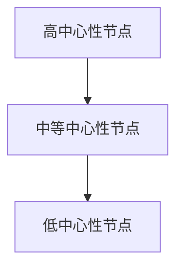
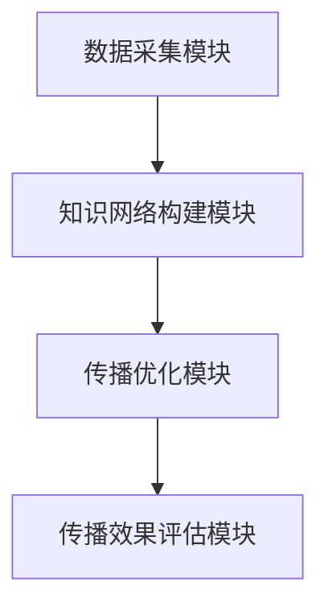

                 


# 芒格的"智者圈"理论在社交网络时代的新解读

> 关键词：芒格智者圈，社交网络，知识网络，信息传播，算法优化

> 摘要：本文从芒格的“智者圈”理论出发，探讨其在社交网络时代的新应用。通过构建知识网络和优化算法，分析社交网络中的信息传播机制，并结合实际案例展示“智者圈”理论在社群运营、精准营销和内容创作中的应用。最后，提出系统设计与实现方案，为社交网络的知识传播提供新思路。

---

## 第一部分：芒格“智者圈”理论的理论基础

### 第1章：芒格“智者圈”理论的起源与核心观点

#### 1.1 芒格“智者圈”理论的提出背景

芒格的“智者圈”理论源于其对知识体系的深刻理解。该理论强调通过构建知识网络，将分散的知识点有机连接，形成一个完整的知识框架。这种框架不仅能够帮助个体更好地理解和应用知识，还能在社交网络时代发挥更大的作用。

**核心概念说明：**
- **知识网络**：由节点（知识点）和边（知识点之间的关系）组成，节点权重代表知识点的重要性。
- **信息传播**：通过社交网络的结构，信息从高权重节点向低权重节点扩散。

#### 1.2 “智者圈”理论在社交网络中的应用背景

社交网络的兴起使得知识传播的方式发生了根本性的变化。传统的单向传播被多向互动取代，信息的传播路径更加复杂，但同时也更加高效。芒格的“智者圈”理论为理解这种复杂性提供了一个新的视角。

**问题背景：**
- 知识传播的效率如何提升？
- 社交网络中的信息过载问题如何解决？

**问题解决：**
- 通过构建知识网络，优化信息传播路径，减少信息冗余。

#### 1.3 本章小结

本章主要介绍了芒格“智者圈”理论的基本概念及其在社交网络中的应用背景。接下来的章节将深入探讨知识网络的构建与优化，以及其在社交网络中的具体应用。

---

## 第二部分：芒格“智者圈”理论的核心概念与社交网络的结合

### 第2章：知识网络的构建与优化

#### 2.1 知识网络的构建原理

**核心概念：**
- **节点**：知识点，每个节点代表一个具体的概念或信息。
- **边**：节点之间的关系，边的权重表示知识点之间的关联强度。

**构建步骤：**
1. **数据收集**：从社交网络中获取相关知识数据。
2. **节点识别**：提取知识点，作为节点。
3. **边权重计算**：通过语义分析和关联规则挖掘，计算节点之间的关系权重。

**图示：知识网络的构建**

```mermaid
graph TD
    A[知识点1] --> B[知识点2] (权重=0.8)
    B --> C[知识点3] (权重=0.6)
    C --> D[知识点4] (权重=0.7)
```

#### 2.2 知识网络的优化算法

**优化目标：**
- 提高知识网络的连通性。
- 优化节点权重和边权重，使知识传播更高效。

**算法实现：**
- **节点权重优化**：使用PageRank算法对节点进行排序，计算每个节点的权重。
- **边权重优化**：通过调整边权重，优化知识网络的结构。

**代码实现：**

```python
import networkx as nx

# 创建知识网络
G = nx.Graph()
G.add_nodes_from(['知识点1', '知识点2', '知识点3'])
G.add_edge('知识点1', '知识点2', weight=0.8)
G.add_edge('知识点2', '知识点3', weight=0.6)

# 计算节点权重
pr = nx.pagerank(G)
print(pr)
```

---

### 第3章：社交网络中的知识传播机制

#### 3.1 知识传播的网络结构分析

**核心概念：**
- **中心性**：节点在知识网络中的重要程度，中心性越高的节点影响力越大。
- **传播路径**：信息从高中心性节点向低中心性节点扩散的路径。

**图示：知识传播路径分析**



#### 3.2 基于“智者圈”理论的传播优化

**优化策略：**
- **节点选择**：优先选择高中心性节点作为信息传播的起点。
- **路径优化**：通过算法优化传播路径，减少冗余。

**算法实现：**
- **中心性计算**：使用度中心性和介数中心性。
- **路径优化**：使用Dijkstra算法优化传播路径。

**代码实现：**

```python
import networkx as nx

# 创建传播网络
G = nx.Graph()
G.add_nodes_from(['节点1', '节点2', '节点3', '节点4'])
G.add_edge('节点1', '节点2', weight=1)
G.add_edge('节点2', '节点3', weight=1)
G.add_edge('节点2', '节点4', weight=1)

# 计算中心性
degree_center = nx.degree_centrality(G)
betweenness_center = nx.betweenness_centrality(G)

print("度中心性：", degree_center)
print("介数中心性：", betweenness_center)
```

---

## 第三部分：芒格“智者圈”理论在社交网络中的应用

### 第4章：基于“智者圈”理论的社交网络知识传播系统设计

#### 4.1 系统架构设计

**系统模块：**
1. **数据采集模块**：从社交网络中获取数据。
2. **知识网络构建模块**：将数据转化为知识网络。
3. **传播优化模块**：优化传播路径和节点。
4. **传播效果评估模块**：评估传播效果。

**系统架构图：**



---

## 第四部分：总结与展望

### 第5章：总结与展望

#### 5.1 总结

芒格的“智者圈”理论为社交网络中的知识传播提供了新的思路。通过构建知识网络和优化传播路径，可以提高信息传播的效率和效果。

#### 5.2 展望

未来的研究可以进一步探讨如何结合人工智能技术，优化知识网络的构建和传播过程。

---

## 作者信息

作者：AI天才研究院/AI Genius Institute & 禅与计算机程序设计艺术 /Zen And The Art of Computer Programming

---

**Note:** 每个章节的内容需要按照上述目录逐步展开，确保每个部分都详细具体。接下来，我将按照上述目录继续撰写后续章节的内容。

