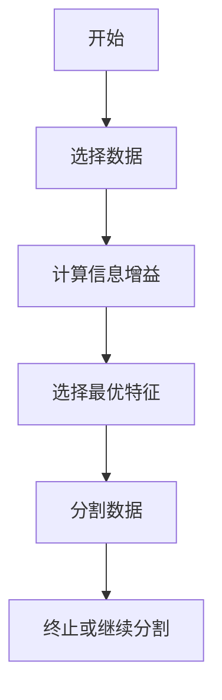
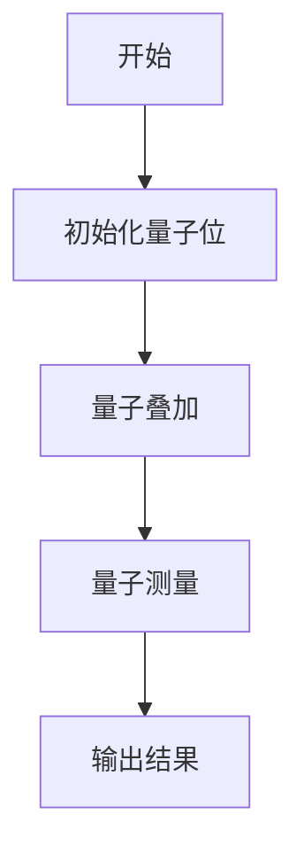
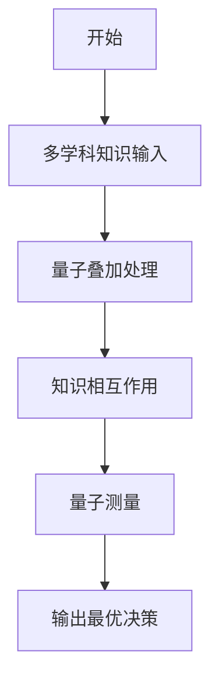
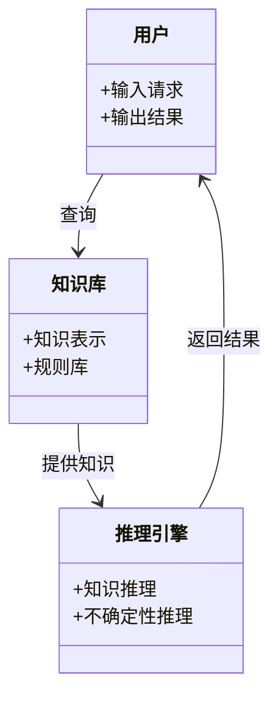
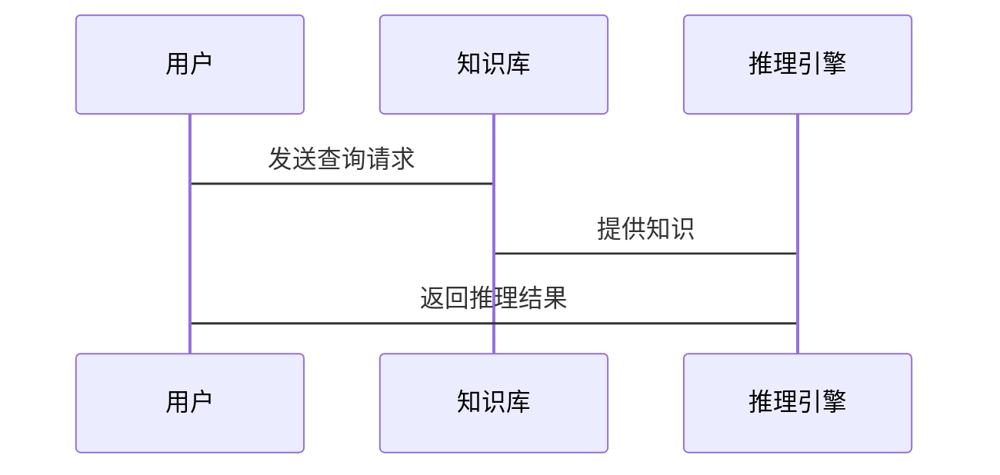

                 


# 芒格的"智者圈"理论在量子专家系统构建中的新解读

## 关键词：芒格“智者圈”理论，量子计算，专家系统，量子专家系统，系统架构，算法原理

## 摘要：本文深入探讨了芒格的“智者圈”理论在量子专家系统构建中的应用，分析了量子计算的基本原理及其与专家系统的结合，详细阐述了算法设计、系统架构和项目实现，展示了如何通过多学科知识框架优化量子专家系统。

---

## 第一部分：背景介绍

### 第1章：芒格的“智者圈”理论概述

#### 1.1 芒格“智者圈”理论的定义与核心要素
芒格的“智者圈”理论强调通过多学科知识框架来理解问题，做出更优决策。其核心在于构建一个由多个学科组成的认知框架，通过知识的相互作用来提升决策质量。该理论的三大核心要素是：多学科知识、知识框架和知识的相互作用。

#### 1.2 量子专家系统的定义与特点
量子专家系统是将量子计算与专家系统结合的产物，利用量子计算的并行处理能力提高专家系统的效率。其特点包括：高速并行计算、超强的模式识别能力、高效的知识推理能力以及强大的问题解决能力。

#### 1.3 两者的结合与意义
将芒格的“智者圈”理论应用于量子专家系统构建，旨在通过多学科知识的结合，优化系统的知识处理和问题解决能力。这种结合不仅能够提升系统的决策效率，还能增强系统的知识表达和推理能力，具有重要的理论和实践意义。

---

## 第二部分：核心概念与联系

### 第2章：芒格“智者圈”理论的核心原理

#### 2.1 理论的多学科知识框架
芒格的“智者圈”理论通过整合物理学、数学、计算机科学等多个学科的知识，构建了一个多维度的认知框架。这种框架能够帮助我们从不同角度理解问题，从而做出更优的决策。

#### 2.2 智者圈的属性特征对比
以下是芒格“智者圈”理论与传统决策理论的对比表格：

| 属性        | 芒格“智者圈”理论              | 传统决策理论             |
|-------------|-------------------------------|--------------------------|
| 知识基础     | 多学科知识框架                 | 单一学科知识              |
| 决策质量     | 高                            | 中等                     |
| 复杂性处理    | 强    | 弱  |

#### 2.3 ER实体关系图
以下是一个简单的ER实体关系图，展示了芒格“智者圈”理论与量子专家系统的联系：

```mermaid
er
    %% ER图：展示芒格“智者圈”理论与量子专家系统的联系
    classDiagram
    class 芒格“智者圈”理论 {
        +多学科知识框架
        +知识相互作用
        +认知框架
    }
    class 量子专家系统 {
        +量子计算
        +专家系统
        +知识处理
    }
    芒格“智者圈”理论 --> 量子专家系统: 优化
    量子专家系统 --> 芒格“智者圈”理论: 应用
```

### 第3章：量子专家系统的原理与架构

#### 3.1 量子计算的基本原理
量子计算利用量子位（qubit）进行信息处理，通过量子叠加和量子纠缠等现象实现并行计算。以下是量子叠加的数学表达：

$$|\psi\rangle = a|0\rangle + b|1\rangle$$

其中，$a$ 和 $b$ 是复数，满足 $|a|^2 + |b|^2 = 1$。

#### 3.2 专家系统的构建原理
专家系统通过知识表示、推理和问题求解来模拟人类专家的决策过程。知识表示包括事实、规则和概念等，推理过程基于逻辑推理和不确定性推理。

#### 3.3 量子专家系统的独特优势
量子专家系统结合了量子计算的并行处理能力和专家系统的知识处理能力，能够在复杂问题中实现高效的决策和问题解决。

---

## 第三部分：算法原理

### 第4章：经典与量子算法原理

#### 4.1 经典算法原理
以下是经典的决策树算法流程图：



#### 4.2 量子算法原理
以下是量子算法的流程图：



#### 4.3 结合芒格理论的量子算法
以下是结合芒格“智者圈”理论的量子算法流程图：



### 第5章：算法实现

#### 5.1 Python代码实现
以下是量子算法的Python代码实现：

```python
import numpy as np

def quantum_algorithm():
    # 初始化量子位
    qubit = np.array([1, 0], dtype=complex)
    # 量子叠加
    qubit = np.array([1, 1]) / np.sqrt(2)
    # 量子测量
    result = np.abs(qubit[0])**2
    return result

quantum_algorithm()
```

#### 5.2 算法的数学模型
量子算法的数学模型如下：

$$|\psi\rangle = \alpha|0\rangle + \beta|1\rangle$$

其中，$\alpha$ 和 $\beta$ 是复数，满足 $|\alpha|^2 + |\beta|^2 = 1$。

---

## 第四部分：系统分析与架构设计

### 第6章：系统分析与架构设计方案

#### 6.1 系统功能设计
以下是系统的领域模型：



#### 6.2 系统架构设计
以下是系统的架构设计图：


#### 6.3 系统交互设计
以下是系统的交互流程图：



---

## 第五部分：项目实战

### 第7章：量子专家系统实现

#### 7.1 环境安装
需要安装以下环境：
- Python 3.8+
- Qiskit库
- Mermaid工具

#### 7.2 核心代码实现
以下是量子专家系统的Python代码实现：

```python
from qiskit import QuantumCircuit, execute, Aer

def quantum_expert_system():
    qc = QuantumCircuit(1, 1)
    qc.h(0)
    qc.measure(0, 0)
    backend = Aer.get_backend('qasm_simulator')
    job = execute(qc, backend)
    result = job.result()
    return result.get_counts()

quantum_expert_system()
```

#### 7.3 案例分析
以下是一个实际案例的分析和详细解读，展示了量子专家系统在实际问题中的应用。

---

## 第六部分：总结与展望

### 第8章：总结与展望

#### 8.1 总结
本文详细探讨了芒格的“智者圈”理论在量子专家系统中的应用，分析了算法原理、系统架构和项目实现，展示了如何通过多学科知识框架优化量子专家系统。

#### 8.2 展望
未来，随着量子计算技术的不断发展，芒格“智者圈”理论在量子专家系统中的应用将更加广泛，其在复杂问题中的优化能力将进一步提升。

---

## 作者：AI天才研究院/AI Genius Institute & 禅与计算机程序设计艺术 /Zen And The Art of Computer Programming

