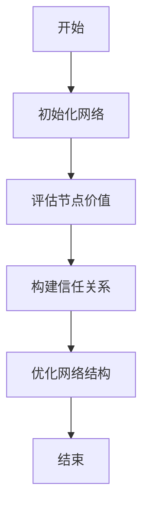
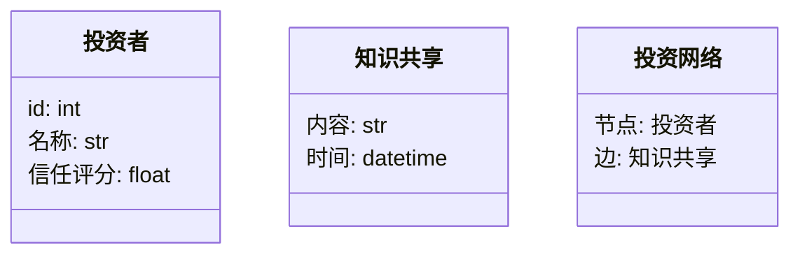
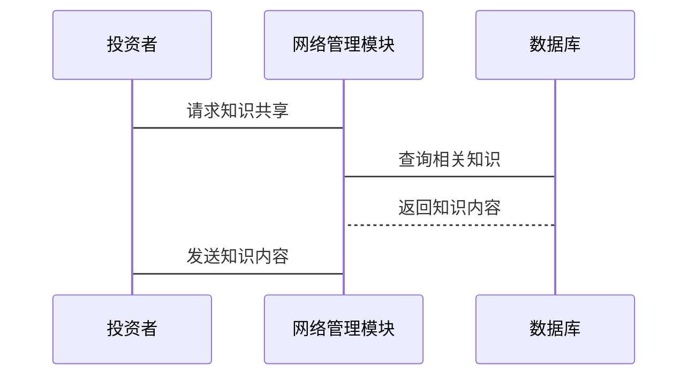

                 


# 《芒格的"智者圈"理论：如何构建高质量的投资网络》

> 关键词：芒格, 智者圈, 投资网络, 知识共享, 信任机制, 网络优化, 投资策略

> 摘要：芒格的“智者圈”理论是一种通过构建高质量的投资网络，实现知识共享与信任协作的投资策略。本文将从理论背景、核心概念、算法原理、数学模型、系统设计、项目实战等多个方面，详细阐述如何利用“智者圈”理论构建高效的投资网络，帮助投资者在复杂的市场环境中优化决策，提升投资收益。

---

## 第一部分：芒格“智者圈”理论的背景与核心概念

### 第1章：芒格“智者圈”理论的背景与核心概念

#### 1.1 投资网络的形成与演变

##### 1.1.1 投资网络的定义与特征

投资网络是指投资者之间通过信息共享、知识交流和协作行动形成的网络结构。其核心特征包括：节点（投资者）之间的连接性、信息流通性、信任关系和协作行为。

##### 1.1.2 芮格“智者圈”理论的提出背景

芒格的“智者圈”理论源于他对投资决策中知识共享与信任协作的深刻理解。在传统投资理论中，投资者往往被视为独立决策个体，忽略了网络化协作的重要性。芒格提出，通过构建高质量的投资网络，投资者可以更高效地获取信息、优化决策。

##### 1.1.3 理论的核心思想与目标

芒格的“智者圈”理论的核心思想是：通过构建高质量的投资网络，投资者可以实现知识共享、信任协作和风险分担。其目标是帮助投资者在复杂市场环境中优化决策，降低信息不对称风险，提升投资收益。

#### 1.2 “智者圈”理论的关键要素

##### 1.2.1 知识共享的必要性

知识共享是“智者圈”理论的核心要素。通过网络中的知识共享，投资者可以快速获取多元化的信息，提升决策质量。

##### 1.2.2 投资网络的结构特征

投资网络的结构特征包括：节点之间的连接强度、网络的密度、中心性等。这些特征决定了网络的信息流通效率和协作能力。

##### 1.2.3 网络中的信任与协作

信任是投资网络协作的基础。通过构建信任机制，投资者可以更高效地进行协作，降低交易成本。

#### 1.3 理论的边界与外延

##### 1.3.1 理论的适用范围

“智者圈”理论适用于投资者之间的协作网络构建，但不适用于完全竞争市场中的独立决策。

##### 1.3.2 理论的局限性

理论的局限性主要体现在：网络中的信任风险、信息泄露风险等。

##### 1.3.3 理论与其他投资理论的联系

“智者圈”理论与传统投资理论在信息共享、风险分担等方面有交集，但更强调网络化协作的重要性。

---

### 第2章：“智者圈”理论的核心概念与联系

#### 2.1 核心概念原理

##### 2.1.1 知识共享的数学模型

知识共享的数学模型可以通过图论中的节点权重分配来表示。节点的权重反映了其在知识共享中的贡献程度。

##### 2.1.2 投资网络的构建逻辑

投资网络的构建逻辑包括：节点识别、边的建立、权重分配等步骤。

##### 2.1.3 信任与协作的机制分析

信任机制是网络协作的基础。通过信任评分系统，可以量化节点之间的信任程度。

#### 2.2 核心概念对比表格

| 概念 | 定义 | 特点 |
|------|------|------|
| 知识共享 | 投资者之间的信息交流 | 提高决策质量 |
| 投资网络 | 投资者之间的连接结构 | 优化资源配置 |
| 信任机制 | 网络中的信任关系 | 降低协作成本 |

#### 2.3 ER实体关系图

```mermaid
er
actor(投资者) --|> knowledge(知识共享)
actor --|> trust(信任关系)
knowledge --|> investment_network(投资网络)
trust --|> investment_network
```

---

## 第二部分：芒格“智者圈”理论的算法原理

### 第3章：算法原理概述

#### 3.1 算法原理概述

##### 3.1.1 知识共享的算法框架

知识共享的算法框架包括：信息收集、信息处理、信息分发等步骤。

##### 3.1.2 投资网络的构建算法

投资网络的构建算法包括：节点识别、边的建立、权重分配等步骤。

##### 3.1.3 信任与协作的优化算法

信任优化算法包括：信任评分计算、信任关系调整等步骤。

#### 3.2 算法流程图



#### 3.3 算法实现代码

```python
def knowledge_share(network):
    # 算法实现
    pass

def trust_assessment(network):
    # 算法实现
    pass
```

---

### 第4章：数学模型与公式

#### 4.1 网络分析的数学模型

##### 4.1.1 芮格“智者圈”理论的数学表达

芒格“智者圈”理论可以通过图论中的网络模型进行数学表达，例如节点之间的信任评分计算公式。

##### 4.1.2 知识共享的数学模型

知识共享的数学模型可以通过信息权重分配公式进行描述。

##### 4.1.3 投资网络的优化公式

投资网络的优化可以通过图论中的最短路径算法或其他优化方法进行实现。

#### 4.2 核心公式

$$ \text{节点价值} = \sum_{i=1}^{n} \text{知识贡献}_i $$

$$ \text{信任度} = \frac{\text{成功协作次数}}{\text{总协作次数}} $$

---

## 第三部分：系统分析与架构设计

### 第5章：系统功能设计

#### 5.1 领域模型



#### 5.2 系统架构设计


#### 5.3 系统接口设计

##### 5.3.1 知识共享接口

接口：`POST /knowledge/share`

请求参数：`{ "内容": "...", "时间": "...", "投资者id": ... }`

##### 5.3.2 信任评分接口

接口：`GET /trust/rating`

请求参数：`{ "投资者id": ... }`

---

### 第6章：系统交互设计

#### 6.1 交互流程图



---

## 第四部分：项目实战

### 第7章：项目实战

#### 7.1 环境安装

##### 7.1.1 安装Python

安装Python 3.x，推荐使用Anaconda发行版。

##### 7.1.2 安装依赖库

安装`mermaid`、`graphviz`等依赖库。

#### 7.2 核心实现

##### 7.2.1 知识共享实现

代码示例：

```python
def share_knowledge(content, investor_id):
    # 实现知识共享功能
    pass
```

##### 7.2.2 信任评分实现

代码示例：

```python
def calculate_trust_score(investor_id):
    # 实现信任评分计算
    pass
```

#### 7.3 案例分析

##### 7.3.1 案例背景

假设有一个由5个投资者组成的网络，目标是通过知识共享优化投资决策。

##### 7.3.2 案例实现

使用代码实现知识共享和信任评分的计算。

#### 7.4 总结

通过实战项目，我们可以看到“智者圈”理论在实际投资网络中的应用价值。

---

## 第五部分：最佳实践与小结

### 第8章：最佳实践

#### 8.1 小结

芒格的“智者圈”理论为我们提供了一种构建高质量投资网络的方法。

#### 8.2 注意事项

在实际应用中，需要注意网络中的信任风险和信息泄露问题。

#### 8.3 拓展阅读

推荐阅读芒格的其他著作，深入了解“智者圈”理论的其他应用场景。

---

## 作者：AI天才研究院/AI Genius Institute & 禅与计算机程序设计艺术/Zen And The Art of Computer Programming

---

通过以上目录大纲，我们可以看到芒格的“智者圈”理论在构建高质量投资网络中的重要性。通过理论分析、算法实现、系统设计和项目实战，我们可以更好地理解和应用这一理论，帮助投资者在复杂市场环境中优化决策。

