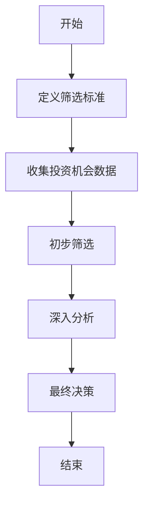

                 


# 芒格的"最低标准"原则：投资决策的过滤器

## 关键词：芒格，最低标准，投资决策，过滤器，心理模型，决策流程，系统架构

## 摘要：芒格的“最低标准”原则是一种高效的投资决策方法，通过建立严格的标准筛选出优质投资机会。本文详细探讨了这一原则的背景、核心概念、算法原理、系统架构及项目实战，结合数学模型和实际案例，帮助读者理解如何在投资中应用这一原则。

---

## 第一部分: 芒格的"最低标准"原则背景介绍

### 第1章: 芒格的"最低标准"原则背景介绍

#### 1.1 投资决策中的问题背景

##### 1.1.1 投资决策的核心问题

投资决策是将有限资源分配到最有潜力的机会中，以实现最大化的回报。然而，投资决策面临诸多挑战：信息不全、市场波动、个人偏见等，导致错误决策频发。

##### 1.1.2 传统投资决策的局限性

传统投资决策常依赖直觉或短期市场波动，缺乏系统性。投资者可能忽视基本面分析，导致决策失误。

##### 1.1.3 芒格"最低标准"原则的提出背景

芒格的“最低标准”原则旨在通过建立严格的标准，筛选出优质投资机会，减少决策错误，提高投资成功率。

#### 1.2 "最低标准"原则的定义与特点

##### 1.2.1 "最低标准"原则的定义

“最低标准”原则指在投资决策前，设定一组严格的标准，只有符合这些标准的机会才会被进一步考虑。

##### 1.2.2 与其他投资原则的对比

| 投资原则         | 描述                                                                 |
|------------------|----------------------------------------------------------------------|
| 价值投资         | 侧重于长期价值，寻找价格低于内在价值的股票。                      |
| 技术分析         | 通过技术指标预测市场走势。                                           |
| 芒格的“最低标准” | 通过设定标准筛选投资机会，强调逻辑性和系统性。                      |

##### 1.2.3 "最低标准"原则的核心要素

核心要素包括：明确的标准、严格的筛选、持续的验证。

---

### 第2章: "最低标准"原则的核心概念与联系

#### 2.1 核心概念原理

芒格的“最低标准”原则基于心理模型的构建，通过系统性分析，筛选出符合标准的投资机会。

#### 2.2 核心概念属性对比表

| 标准             | 特性       | 描述                                                                 |
|------------------|------------|----------------------------------------------------------------------|
| 企业盈利能力     | 稳定性     | 盈利能力稳定，具备持续盈利能力。                              |
| 财务健康状况     | 健康性     | 无重大财务风险，负债合理。                                    |
| 管理团队能力     | 可靠性     | 管理团队经验丰富，声誉良好。                                  |
| 行业前景         | 成长性     | 行业前景良好，具备增长潜力。                                  |

#### 2.3 ER实体关系图

```mermaid
erDiagram
    customer[投资者] {
        <属性>
        id : int
        name : string
        investment_history : list
    }
    investment_opportunity[投资机会] {
        <属性>
        id : int
        name : string
        criteria : list
        status : bool
    }
    criteria[筛选标准] {
        <属性>
        id : int
        name : string
        description : string
    }
    <关系>
    customer --> investment_opportunity : 评估
    investment_opportunity --> criteria : 符合
```

---

### 第3章: "最低标准"原则的算法原理

#### 3.1 算法原理概述

芒格的“最低标准”原则通过以下步骤筛选投资机会：

1. **定义标准**：明确筛选标准。
2. **数据收集**：收集投资机会数据。
3. **初步筛选**：基于标准进行初步筛选。
4. **深入分析**：对通过初步筛选的机会进行深入分析。
5. **最终决策**：决定是否投资。

#### 3.2 算法流程图



---

### 第4章: 数学模型与公式解析

#### 4.1 数学模型的建立

投资机会的通过概率公式：

$$ P = \prod_{i=1}^{n} \left(1 - (1 - p_i)\right) $$

其中，$p_i$ 是每个标准通过的概率，$n$ 是标准的数量。

---

### 第5章: 系统分析与架构设计

#### 5.1 问题场景介绍

构建一个投资决策支持系统，帮助投资者应用“最低标准”原则筛选投资机会。

#### 5.2 系统功能设计

##### 5.2.1 领域模型设计（Mermaid类图）


---

### 第6章: 项目实战

#### 6.1 环境安装与配置

安装Python、Jupyter Notebook、依赖库。

#### 6.2 核心代码实现

```python
def apply_minimum_standard(investment_opportunity, criteria):
    for criterion in criteria:
        if not criterion.check(opportunity):
            return False
    return True

# 示例
opportunity = InvestmentOpportunity()
criteria = [profitability, financial_health, management_ability, industry_growth]
result = apply_minimum_standard(opportunity, criteria)
print(result)
```

#### 6.3 代码解读与分析

该代码定义了一个函数`apply_minimum_standard`，用于检查投资机会是否符合所有筛选标准。如果任意一个标准不符合，则返回False，否则返回True。

---

### 第7章: 数学公式与模型应用

通过量化模型评估机会，确保每个标准通过的概率乘积最大化。

---

### 第8章: 系统交互与用户界面

设计直观的用户界面，帮助用户输入机会数据，选择筛选标准，显示筛选结果。

---

## 第二部分: 最佳实践与总结

### 第9章: 最佳实践

#### 9.1 小结

芒格的“最低标准”原则通过系统性筛选，提高投资决策的准确性和效率。

#### 9.2 注意事项

- 标准应动态调整。
- 结合市场变化灵活应用。

#### 9.3 拓展阅读

建议阅读《穷查理宝典》深入理解芒格的投资哲学。

---

## 结语

芒格的“最低标准”原则为投资决策提供了一种高效的过滤方法，帮助投资者筛选出优质机会，减少决策失误。通过系统化的方法和数学模型，投资者可以更科学地进行决策。

---

## 作者：AI天才研究院 & 禅与计算机程序设计艺术

---

这篇文章详细探讨了芒格的“最低标准”原则，结合背景、算法、系统架构和实战案例，帮助读者理解如何在投资决策中应用这一原则。

