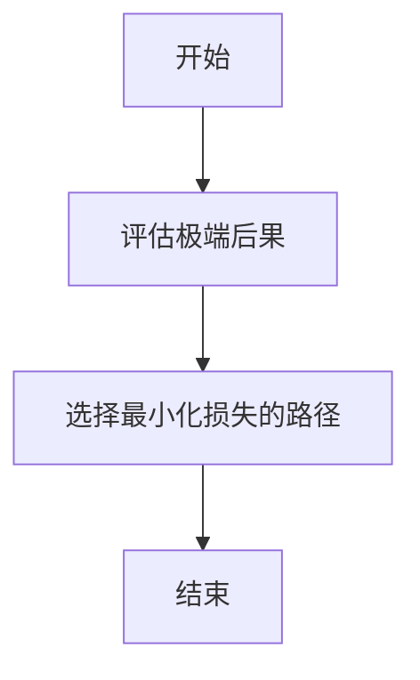
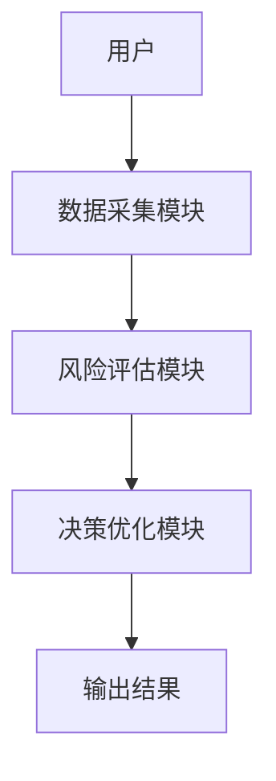
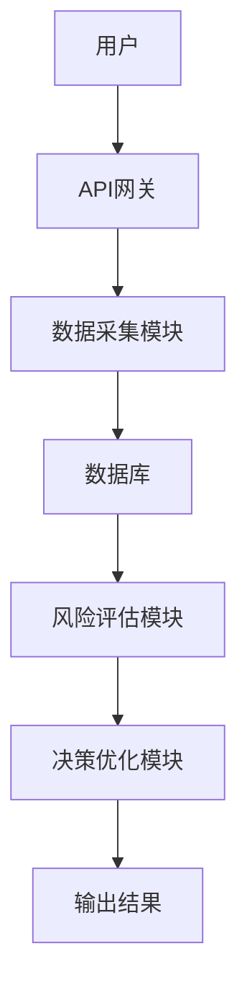

                 


# 芒格的"极端后果"思维在星际殖民投资决策中的应用

> 关键词：芒格思维，极端后果，星际殖民，投资决策，风险管理

> 摘要：本文探讨了芒格的"极端后果"思维在星际殖民投资决策中的应用，通过背景介绍、核心概念、算法原理、系统架构设计、项目实战和最佳实践等部分，详细分析了极端后果思维如何帮助投资者在高风险的星际殖民项目中做出更明智的决策。

---

## 第一部分：背景介绍

### 第1章：芒格的"极端后果"思维概述

#### 1.1 芒格的思维模式

**1.1.1 芒格的"极端后果"思维的起源**

芒格的"极端后果"思维源于他对投资的深刻理解。他认为，在决策时必须考虑最坏情况下的后果，以避免重大损失。这种思维方式强调在风险极高的情况下，如何通过预见到极端情况来做出更稳健的决策。

**1.1.2 极端后果思维的核心理念**

极端后果思维的核心理念是：在决策时，不仅要考虑最佳和最可能的情况，还要考虑最糟糕的情况。这种思维方式帮助投资者在面对不确定性和高风险时，做出更谨慎和理性的选择。

**1.1.3 芒格思维在投资决策中的应用**

芒格的思维在投资决策中的应用非常广泛，尤其是在面对高风险项目时。他建议投资者在决策前，先问自己："如果这个决策失败，最坏的情况是什么？我是否能够承受这种后果？"

---

### 第2章：星际殖民的背景与挑战

#### 2.1 星际殖民的背景与目标

**2.1.1 星际殖民的概念**

星际殖民是指人类在地球以外的星球上建立永久性居民点的过程。这种活动的目标是确保人类的生存和扩张，同时探索新的资源和技术。

**2.1.2 星际殖民的挑战**

星际殖民面临的技术、经济和伦理等多方面的挑战。例如：

- **技术挑战**：星际旅行和殖民需要突破现有技术的极限，如开发高效的推进系统、解决长期太空生存问题等。
- **经济挑战**：星际殖民需要巨大的资金投入，如何确保项目的可持续性是一个关键问题。
- **伦理挑战**：殖民其他星球是否会影响当地生态系统，是否尊重其他生命的权益等。

**2.1.3 极端后果思维在星际殖民中的重要性**

在星际殖民的投资决策中，极端后果思维可以帮助投资者在面对高风险和不确定性时，做出更稳健的选择。例如，在选择殖民目标星球时，投资者需要考虑最坏情况下的后果，如星球上的极端环境是否会导致殖民失败。

---

## 第二部分：核心概念与联系

### 第2章：极端后果思维的数学框架

#### 2.1 极端后果思维的决策模型

**2.1.1 决策树模型**

决策树是一种用于分析决策过程的工具。在极端后果思维中，决策树可以帮助投资者分析不同决策路径下的潜在后果。

**示例：**
假设投资者正在考虑投资两个星际殖民项目：A和B。

- **项目A**：成功概率为70%，回报为100亿元；失败概率为30%，损失为50亿元。
- **项目B**：成功概率为40%，回报为200亿元；失败概率为60%，损失为100亿元。

使用决策树模型，投资者可以计算每个项目的期望值：

$$E_A = 0.7 \times 100 + 0.3 \times (-50) = 70 - 15 = 55 \text{亿元}$$

$$E_B = 0.4 \times 200 + 0.6 \times (-100) = 80 - 60 = 20 \text{亿元}$$

从期望值来看，项目A的期望值更高，因此在极端后果思维下，投资者可能会选择项目A。

**2.1.2 风险评估公式**

风险评估是极端后果思维的重要组成部分。以下是常用的风崄评估公式：

$$R = \sum p_i \times |x_i - E|$$

其中：
- \(R\) 表示风险值
- \(p_i\) 表示第\(i\)种情况发生的概率
- \(x_i\) 表示第\(i\)种情况的后果
- \(E\) 表示期望值

**2.1.3 期望值计算**

期望值（Expected Value）是概率论中的一个重要概念，用于评估多个可能结果的加权平均值。公式为：

$$E = \sum p_i \times x_i$$

---

## 第三部分：算法原理讲解

### 第3章：基于极端后果思维的投资决策算法

#### 3.1 极端后果思维的决策树

**决策树算法流程图**



#### 3.2 投资决策的数学模型

**3.2.1 优化算法**

以下是一个优化算法的伪代码示例：

```python
def extreme_consequences_optimization(projects):
    max_return = -infinity
    best_project = None
    for project in projects:
        expected_value = 0
        for scenario in project.scenarios:
            expected_value += scenario.probability * scenario.consequence
        if expected_value > max_return:
            max_return = expected_value
            best_project = project
    return best_project
```

---

## 第四部分：系统分析与架构设计方案

### 第4章：星际殖民投资决策系统的架构

#### 4.1 系统功能设计

**4.1.1 系统功能模块**

- **数据采集模块**：收集星际殖民项目的相关信息，如成功率、成本、回报等。
- **风险评估模块**：评估每个项目的潜在风险。
- **决策优化模块**：根据极端后果思维，优化投资决策。

#### 4.2 系统架构设计



#### 4.3 系统接口设计

以下是系统接口设计的示意图：



---

## 第五部分：项目实战

### 第5章：基于极端后果思维的星际殖民投资决策案例分析

#### 5.1 环境配置

以下是Python环境的配置步骤：

1. 安装Python和必要的库（如numpy、pandas、scikit-learn）。
2. 下载星际殖民项目的相关数据集。

#### 5.2 核心代码实现

以下是一个简单的Python实现示例：

```python
import numpy as np

def calculate_expected_value(probabilities, consequences):
    return np.sum(probabilities * consequences)

# 示例数据
probabilities = [0.7, 0.3]
consequences = [100, -50]

expected_value = calculate_expected_value(probabilities, consequences)
print("期望值为：", expected_value)
```

#### 5.3 案例分析

假设我们有两个星际殖民项目，A和B，具体数据如下：

- **项目A**：成功概率70%，回报100亿元；失败概率30%，损失50亿元。
- **项目B**：成功概率40%，回报200亿元；失败概率60%，损失100亿元。

根据前面的计算，项目A的期望值为55亿元，项目B的期望值为20亿元。因此，基于极端后果思维，投资者应选择项目A。

---

## 第六部分：最佳实践与总结

### 第6章：总结与注意事项

#### 6.1 总结

通过本文的分析，我们可以看到，芒格的"极端后果"思维在星际殖民投资决策中具有重要的应用价值。它可以帮助投资者在高风险的环境中，做出更稳健和理性的决策。

#### 6.2 注意事项

在实际应用中，需要注意以下几点：

1. **数据的准确性**：确保输入的数据准确可靠。
2. **模型的适用性**：根据实际情况调整模型参数。
3. **伦理问题**：在追求利益的同时，必须考虑伦理和道德问题。

#### 6.3 拓展阅读

以下是一些推荐阅读的书籍和资源：

- 《Poor Charlie's Algebra》
- 《The Intelligent Investor》
- 《The Theory of Investment Value》

---

## 作者：AI天才研究院 & 禅与计算机程序设计艺术

---

以上是《芒格的"极端后果"思维在星际殖民投资决策中的应用》的完整大纲和内容。

