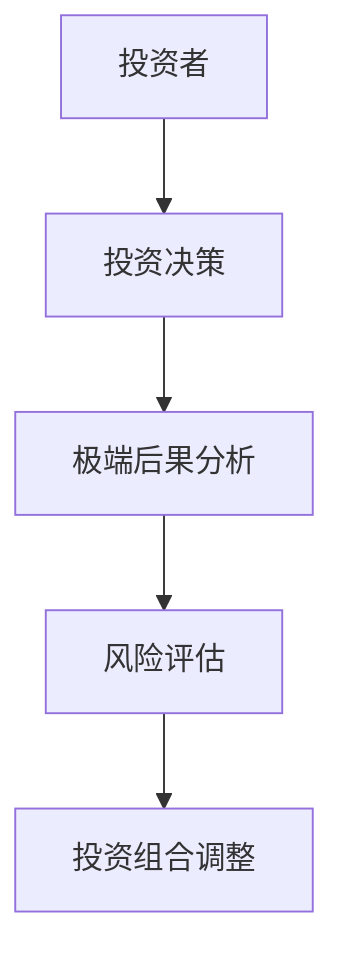
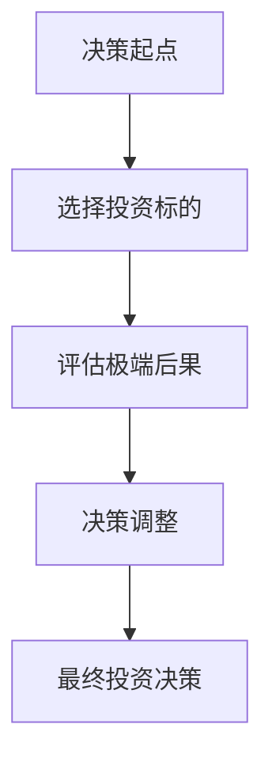
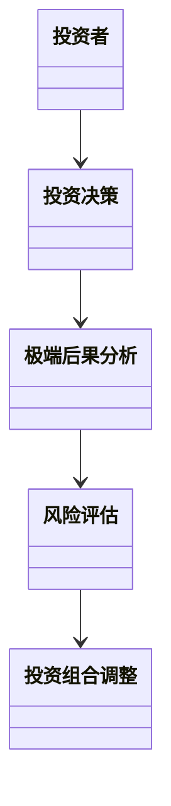
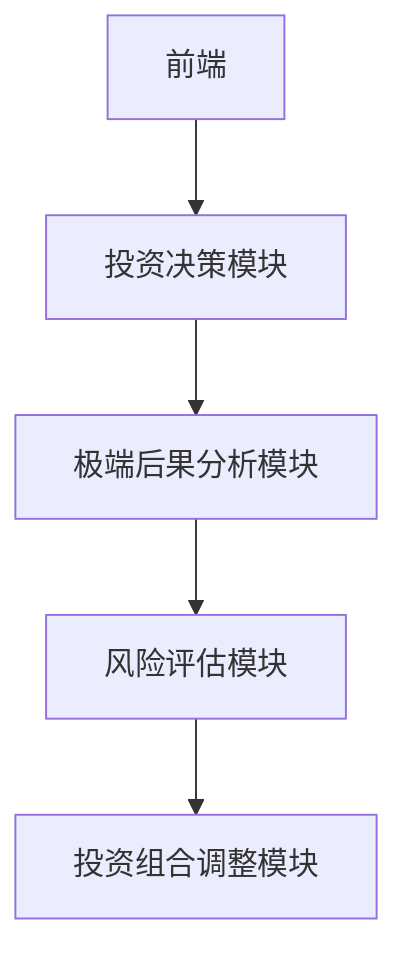
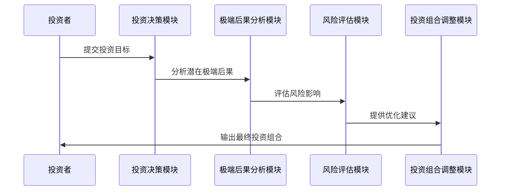

                 


# 芒格的"极端后果"思维：在投资中考虑最坏情况

> 关键词：芒格投资理念，极端后果思维，风险管理，决策树模型，投资决策支持系统

> 摘要：本文深入探讨了芒格的“极端后果”思维在投资决策中的应用，通过系统分析、算法模型和实际案例，详细阐述了如何通过考虑最坏情况来优化投资策略，降低风险，提高投资回报。

---

## 第一部分: 芒格的"极端后果"思维概述

### 第1章: 芒格投资理念与"极端后果"思维的背景

#### 1.1 芒格的生平与投资哲学

- **1.1.1 芒格的生平简介**  
  查理·芒格（Charlie Munger）是美国著名投资者和作家，巴菲特的长期合作伙伴。他不仅是伯克希尔·哈撒韦公司的副主席，还是芒格投资理念的代表人物。芒格的思想深受心理学、经济学和决策理论的影响。

- **1.1.2 芒格的投资哲学核心**  
  芒格强调“逆向思维”和“多元思维模型”，认为投资者应具备跨学科的知识，以避免认知偏差和错误决策。他倡导长期投资和价值投资，注重企业基本面和管理层质量。

- **1.1.3 芒格与巴菲特的合作关系**  
  芒格与巴菲特的合作始于1971年，两人共同创立了伯克希尔·哈撒韦公司。芒格的投资理念对巴菲特产生了深远影响，尤其是其对安全边际和风险管理的重视。

#### 1.2 "极端后果"思维的定义与背景

- **1.2.1 什么是"极端后果"思维**  
  极端后果思维是一种以最坏情况为导向的决策方法，要求投资者在决策时考虑可能出现的最极端负面结果，并评估其对投资组合的影响。

- **1.2.2 极端后果思维的起源与演变**  
  芒格的极端后果思维起源于他对心理学和决策理论的研究。他认为，人在面对不确定性时，往往会低估极端事件的可能性，导致重大损失。因此，提前考虑极端后果可以帮助投资者做好准备。

- **1.2.3 极端后果思维在投资中的重要性**  
  在投资领域，极端后果思维可以帮助投资者识别潜在风险，制定应对策略，从而在市场崩盘或经济危机中减少损失，确保投资组合的稳定性。

#### 1.3 投资中的风险与不确定性

- **1.3.1 投资中的主要风险类型**  
  投资风险包括市场风险、流动性风险、信用风险和操作风险等。极端后果思维尤其关注市场风险和信用风险，因为它们可能引发系统性危机。

- **1.3.2 不确定性对投资决策的影响**  
  不确定性会导致投资者决策的模糊性和风险厌恶。极端后果思维通过明确最坏情况，帮助投资者在高度不确定性下做出更理性的决策。

- **1.3.3 极端后果思维在风险管理中的作用**  
  通过识别和评估极端后果，投资者可以制定更为稳健的投资策略，避免因市场波动而遭受重大损失。

---

## 第2章: 极端后果思维的核心概念与框架

### 2.1 极端后果思维的核心要素

- **2.1.1 极端后果思维的三要素模型**  
  极端后果思维可以分解为三个核心要素：问题背景、目标与约束条件，以及逻辑结构。

- **2.1.2 问题背景**  
  投资者需要明确投资问题的背景，包括市场环境、投资目标和时间 horizon。

- **2.1.3 目标与约束条件**  
  投资目标是投资者希望通过投资实现的收益目标，而约束条件则包括资金限制、风险承受能力和投资期限。

- **2.1.4 逻辑结构**  
  极端后果思维通过构建逻辑框架，帮助投资者系统地分析问题，从最坏情况出发，逐步推导出最优决策。

### 2.2 极端后果思维与其他投资策略的对比

- **2.2.1 传统价值投资与极端后果思维的异同**  
  传统价值投资注重企业基本面分析，寻找被市场低估的投资标的。而极端后果思维则更关注潜在风险和极端情况下的损失。

- **2.2.2 技术分析与极端后果思维的对比**  
  技术分析依赖价格和成交量数据，预测未来市场走势。而极端后果思维则侧重于风险管理和最坏情况的应对策略。

- **2.2.3 其他风险管理策略的比较分析**  
  其他风险管理策略如分散投资、对冲策略等，虽然也能降低风险，但极端后果思维更强调事前规划和极端情况的应对。

### 2.3 极端后果思维的实体关系图



---

## 第3章: 极端后果思维的算法与数学模型

### 3.1 极端后果思维的决策树模型



### 3.2 数学模型与公式

- **3.2.1 风险概率计算公式**  
  $$ P = \frac{\text{极端后果事件发生次数}}{\text{总事件次数}} $$  
  其中，$P$ 表示极端后果发生的概率，分子是极端后果事件的频率，分母是总事件次数。

- **3.2.2 风险影响程度评估公式**  
  $$ I = \sum_{i=1}^{n} (P_i \times C_i) $$  
  其中，$P_i$ 是第 $i$ 种极端后果发生的概率，$C_i$ 是第 $i$ 种后果的影响程度，$I$ 表示总体风险影响程度。

### 3.3 举例说明

- **3.3.1 案例一：某股票的极端后果分析**  
  假设投资某股票，极端后果是公司破产，概率为 $P_1 = 0.05$，影响程度 $C_1 = -100\%$。则该极端后果的风险影响为 $0.05 \times (-100\%) = -5\%$。

- **3.3.2 案例二：某行业的极端后果预测**  
  对于整个行业，极端后果是行业崩溃，概率 $P_2 = 0.02$，影响程度 $C_2 = -80\%$，则风险影响为 $0.02 \times (-80\%) = -1.6\%$。

---

## 第4章: 系统分析与架构设计方案

### 4.1 投资决策支持系统的功能设计

#### 4.1.1 系统功能模块划分

- 数据采集模块：收集市场数据、企业财务数据等。
- 极端后果分析模块：识别和评估潜在极端后果。
- 风险评估模块：计算投资组合的风险程度。
- 决策支持模块：提供优化投资组合的建议。

#### 4.1.2 领域模型设计



### 4.2 系统架构设计



### 4.3 系统接口设计

- 输入接口：市场数据、企业基本面数据。
- 输出接口：极端后果分析结果、风险评估报告、优化后的投资组合。

### 4.4 系统交互流程



---

## 第5章: 项目实战

### 5.1 环境安装

- 需要安装Python、Pandas、NumPy、Matplotlib等库。

### 5.2 系统核心实现源代码

```python
import pandas as pd
import numpy as np
import matplotlib.pyplot as plt

def extreme_consequences_analysis(data, threshold=0.05):
    extreme_outcomes = data[data < -threshold]
    return extreme_outcomes

def risk_assessment(data):
    probabilities = data.value_counts(normalize=True)
    impact = probabilities * data.abs()
    return impact.sum()

# 示例数据
returns = pd.Series(np.random.normal(0, 0.2, 100))
extreme_consequences = extreme_consequences_analysis(returns, 0.05)
risk = risk_assessment(extreme_consequences)
```

### 5.3 代码应用解读与分析

- 上述代码首先定义了极端后果分析和风险评估的函数。
- `extreme_consequences_analysis`函数识别出低于阈值的极端事件。
- `risk_assessment`函数计算极端事件的概率和影响程度。
- 示例中使用随机数生成投资回报，分析极端后果并计算总体风险。

### 5.4 实际案例分析

- **案例分析：2008年金融危机**  
  在2008年金融危机中，极端后果思维可以帮助投资者提前识别房地产市场的崩盘风险，避免投资高杠杆的金融产品。

### 5.5 项目小结

- 通过代码实现，可以系统地分析投资组合的极端后果，评估风险，并根据结果优化投资策略。

---

## 第6章: 总结与最佳实践

### 6.1 小结

- 极端后果思维是一种以最坏情况为导向的投资决策方法，通过识别和评估潜在的极端后果，帮助投资者制定更为稳健的投资策略。

### 6.2 注意事项

- 投资者应结合市场环境和自身风险承受能力，灵活运用极端后果思维。
- 定期评估和调整投资组合，确保策略的有效性。

### 6.3 拓展阅读

- 《逆向思维：芒格的投资哲学》
- 《风险管理与极端后果分析》

---

## 作者：AI天才研究院/AI Genius Institute & 禅与计算机程序设计艺术 /Zen And The Art of Computer Programming

---

通过系统分析和实际案例，我们展示了芒格的“极端后果”思维在投资中的应用，帮助投资者在复杂多变的市场中降低风险，提高投资回报。

