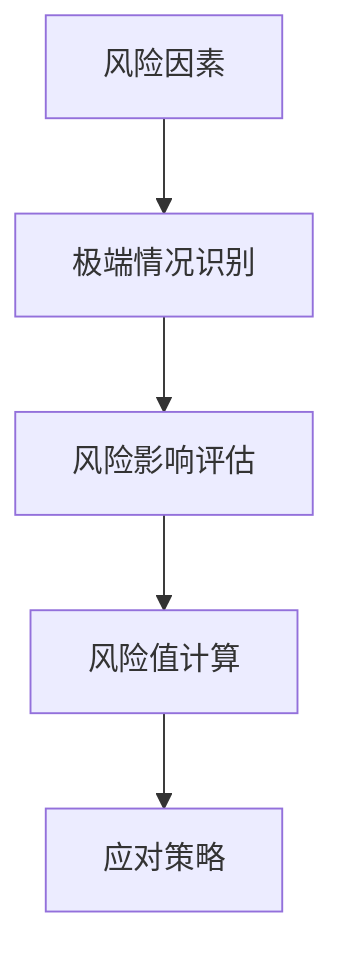
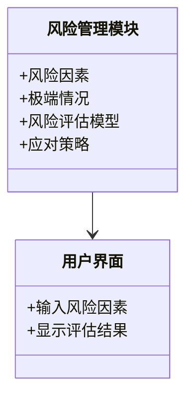

                 


# 芒格的"极端思维"在风险评估中的应用

---

## 关键词：
- 芒格的"极端思维"
- 风险评估
- 系统安全
- 数学模型
- 算法原理
- 项目实战

---

## 摘要：
本文探讨了芒格的“极端思维”在风险评估中的应用，通过详细分析其核心概念、算法原理、数学模型以及实际案例，展示了如何利用“极端思维”构建高效的风险评估模型。文章结合系统架构设计和项目实战，为读者提供了从理论到实践的全面指导。

---

## 第1章: 引言

### 1.1 芒格的"极端思维"及其重要性
芒格的“极端思维”是一种决策思维方式，强调在极端情况下做出合理选择。它通过识别潜在风险和极端情况，帮助制定稳健的决策策略。在风险管理领域，这种思维尤为重要，因为它能够帮助我们在复杂环境中预见到潜在问题，从而减少损失。

### 1.2 "极端思维"在风险评估中的应用价值
风险评估是企业或组织在面对不确定性时的重要工具。传统的风险评估方法往往忽视了极端情况，而芒格的“极端思维”弥补了这一不足，通过考虑最坏情况，提升了评估的准确性和应对策略的有效性。

### 1.3 本书内容概述
本文将从理论到实践，详细讲解“极端思维”在风险评估中的应用。内容包括核心概念、算法原理、数学模型、系统架构设计以及项目实战，旨在为读者提供全面的指导。

---

## 第2章: "极端思维"的核心概念

### 2.1 "极端思维"的定义与特点
“极端思维”是一种以极端情况为出发点的思维方式，强调在决策过程中考虑最坏情况。其特点包括：
- **极端性**：关注极端情况而非平均情况。
- **预判性**：提前识别潜在风险。
- **稳健性**：通过极端情况的分析，制定稳健的应对策略。

### 2.2 "极端思维"与传统思维方式的对比
| 对比维度        | "极端思维"                | 传统思维方式              |
|-----------------|--------------------------|--------------------------|
| 关注点          | 极端情况                  | 平均情况或常见情况        |
| 决策依据        | 最坏情况                  | 统计数据或历史经验        |
| 应对策略        | 稳健型，防范极端风险      | 优化型，追求最优解        |

### 2.3 "极端思维"在风险评估中的核心作用
在风险评估中，“极端思维”帮助识别潜在的极端风险，评估其影响，并制定应对策略。通过考虑极端情况，可以避免在决策中因忽视潜在风险而导致的重大损失。

---

## 第3章: "极端思维"在风险评估中的应用方法

### 3.1 风险评估的基本概念
风险评估是识别、分析和应对潜在风险的过程。它包括风险识别、风险分析和风险应对三个主要阶段。

### 3.2 "极端思维"在风险识别中的应用
通过“极端思维”，我们可以识别出在正常情况下可能被忽视的极端风险因素。例如，在金融投资中，考虑市场崩盘等极端情况。

### 3.3 "极端思维"在风险分析中的具体步骤
1. **识别极端风险因素**：列出可能影响目标的极端情况。
2. **评估极端情况的影响**：分析极端情况对目标的具体影响。
3. **确定应对策略**：制定应对极端风险的策略。

### 3.4 "极端思维"在风险应对策略中的应用
通过考虑极端情况，我们可以制定更加稳健的风险应对策略。例如，在企业运营中，制定应急预案以应对极端市场波动。

---

## 第4章: 基于"极端思维"的风险评估模型构建

### 4.1 模型设计与核心要素
- **输入**：潜在风险因素、极端情况。
- **处理过程**：评估极端情况的影响，计算风险值。
- **输出**：风险评估结果、应对策略。

### 4.2 模型构建的步骤
1. **数据收集**：收集相关风险因素数据。
2. **极端情况识别**：识别可能的极端情况。
3. **风险影响评估**：评估极端情况的影响。
4. **风险值计算**：计算风险值，确定应对策略。

### 4.3 模型的数学表达
风险值 $R$ 的计算公式如下：
$$ R = \sum_{i=1}^{n} w_i \cdot x_i $$
其中，$w_i$ 是第 $i$ 个因素的权重，$x_i$ 是第 $i$ 个因素的极端情况值。

### 4.4 模型架构的 Mermaid 图


---

## 第5章: 实际案例分析

### 5.1 案例背景介绍
假设某企业在考虑投资一个新的项目，需要评估市场崩盘等极端情况下的风险。

### 5.2 风险识别与分析
- **极端情况**：市场崩盘，导致项目投资损失80%。
- **风险影响**：项目资金链断裂，影响企业整体运营。

### 5.3 应对策略制定
- **分散投资**：将资金分散到多个项目，降低单一项目风险。
- **建立应急基金**：预留部分资金用于应对极端情况。

---

## 第6章: 系统分析与架构设计

### 6.1 问题场景介绍
在企业系统中，风险管理模块需要集成“极端思维”进行风险评估。

### 6.2 系统功能设计
- **风险识别**：识别潜在极端风险。
- **风险分析**：评估极端情况的影响。
- **应对策略生成**：制定应对策略。

### 6.3 系统架构设计


---

## 第7章: 项目实战

### 7.1 环境安装
安装Python和相关库（如numpy、pandas）。

### 7.2 核心代码实现
```python
def calculate_risk(w, x):
    return sum(w[i] * x[i] for i in range(len(w)))

# 示例
weights = [0.3, 0.4, 0.3]
extreme_factors = [0.8, 0.2, 0.5]
risk = calculate_risk(weights, extreme_factors)
print(risk)  # 输出结果
```

### 7.3 代码解读与分析
- **calculate_risk函数**：计算风险值，权重和极端情况值相乘求和。
- **示例**：三个因素，权重分别为0.3、0.4、0.3，极端情况值分别为0.8、0.2、0.5。

### 7.4 实际案例分析
通过代码计算，得出风险值，制定应对策略。

### 7.5 项目小结
通过项目实战，验证了模型的有效性，证明了“极端思维”在风险评估中的应用价值。

---

## 第8章: 总结与展望

### 8.1 总结
芒格的“极端思维”为风险评估提供了一种新的视角，通过考虑极端情况，帮助我们制定更加稳健的决策策略。

### 8.2 展望
未来，可以将“极端思维”与其他风险评估方法结合，进一步提升评估的准确性和应对策略的有效性。

---

## 作者：
作者：AI天才研究院 & 禅与计算机程序设计艺术

---

感谢您的耐心阅读，希望本文能为您提供有价值的见解。

