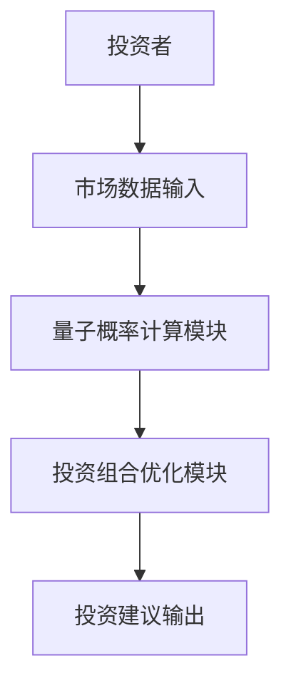

                 


# 芒格的"概率思维"在量子多世界投资策略中的高级应用

> **关键词**：芒格概率思维、量子多世界理论、投资策略、量子概率模型、概率思维应用  
>
> **摘要**：本文深入探讨了芒格的概率思维在量子多世界投资策略中的高级应用，结合量子力学的多世界解释，提出了基于量子概率的新型投资策略。通过分析量子概率模型的构建、投资组合优化、风险控制等核心问题，揭示了概率思维在复杂金融市场中的独特优势。本文还结合实际案例，详细阐述了如何将量子概率思维应用于投资决策，并展望了未来的研究方向。

---

## 第一部分：概率思维与量子多世界理论基础

### 第1章：概率思维的核心概念

#### 1.1 概率思维的定义与特征

概率思维是一种基于概率的思维方式，用于在不确定性中做出决策。其核心特征包括：

- **确定性**：在概率为1的情况下，事件必然发生。
- **不确定性**：概率在0到1之间时，事件可能发生也可能不发生。
- **独立性**：事件之间的概率互不影响。
- **条件性**：事件的概率可能受到其他条件的影响。

概率思维在投资决策中尤为重要，因为它帮助投资者量化风险和收益的可能性。

#### 1.2 量子多世界理论简介

量子多世界理论是量子力学的一种解释，认为每个可能的量子态都是独立存在的，形成了多个平行宇宙（即“世界”）。这种理论为概率提供了新的视角：

- **量子态叠加**：在没有被测量之前，量子系统处于多种状态的叠加。
- **测量导致坍缩**：一旦被测量，系统会坍缩到其中一个状态。

量子多世界理论与概率思维的结合，为投资策略提供了新的思路：在多个可能的市场情况下，投资者可以通过量子概率模型优化投资组合。

#### 1.3 芒格概率思维的哲学基础

芒格的概率思维强调对不确定性进行量化，并通过独立事件的组合来降低风险。其核心原则包括：

- **独立事件的重要性**：独立事件的概率可以相乘，从而降低整体风险。
- ** margin of safety（安全边际）**：通过低估资产价值，确保投资的安全性。
- **复利效应**：长期来看，复利效应是财富增长的关键。

---

## 第二部分：量子多世界投资策略的数学模型

### 第2章：量子概率模型的构建

#### 2.1 量子概率的基本公式

量子概率的数学表达式如下：

$$ P = |\langle \psi | \phi \rangle|^2 $$

其中：
- $\psi$ 是量子态。
- $\phi$ 是测量基。

量子概率与传统概率的区别在于，量子概率允许状态的叠加，而传统概率基于独立事件的统计频率。

#### 2.2 量子多世界的投资策略模型

量子多世界投资模型将市场视为多个可能的平行宇宙，每个宇宙对应一种可能的市场情况。投资者的目标是通过量子概率模型，优化投资组合以应对所有可能的情况。

量子概率模型的构建步骤如下：

1. **定义量子态**：每个资产对应一个量子态。
2. **计算概率幅**：通过量子态的内积计算概率幅。
3. **优化投资组合**：通过调整量子态的权重，优化投资组合的风险和收益。

---

## 第三部分：芒格概率思维的高级策略

### 第3章：量子概率思维在投资组合管理中的应用

#### 3.1 投资组合的量子概率分析

量子概率分析通过以下步骤优化投资组合：

1. **风险评估**：通过量子概率模型评估每个资产的风险。
2. **资产配置优化**：调整资产权重，以最小化整体风险。
3. **动态调整**：根据市场变化，动态调整量子概率模型。

#### 3.2 量子概率与投资时机的选择

量子概率模型可以帮助投资者预测市场变化，并选择最佳的投资时机。例如，通过分析市场波动的量子概率分布，投资者可以预测市场下跌的可能性，并采取相应的策略。

#### 3.3 芒格概率思维的实战案例

以股票投资为例，假设某公司有两种可能的市场情况：上涨和下跌。通过量子概率模型，投资者可以计算每种情况的概率，并选择最优的投资策略。

---

## 第四部分：量子概率思维的系统架构与实现

### 第4章：量子概率投资系统的架构设计

#### 4.1 系统功能设计

- **输入接口**：市场数据输入。
- **输出接口**：投资建议输出。
- **数据接口**：量子概率计算接口。

#### 4.2 系统架构图



#### 4.3 系统接口设计

- **输入接口**：接收市场数据，如股票价格、波动率等。
- **输出接口**：输出投资建议，如买入、卖出或持有。
- **数据接口**：提供量子概率计算所需的中间数据。

---

## 第五部分：项目实战与最佳实践

### 第5章：量子概率投资系统的实现

#### 5.1 项目环境安装

需要安装以下工具和库：
- Python编程语言
- NumPy和SciPy库
- Quantum probability libraries

#### 5.2 核心算法实现

以下是量子概率计算的Python代码示例：

```python
import numpy as np

def calculate_probability(state, measurement_basis):
    # 计算量子态的内积
    inner_product = np.dot(measurement_basis.conj(), state)
    # 计算概率
    probability = np.abs(inner_product) ** 2
    return probability
```

#### 5.3 实际案例分析

假设某资产有两个可能的量子态，计算其概率：

```python
state = np.array([1, 0])  # 量子态
basis = np.array([1, 0])  # 测量基
probability = calculate_probability(state, basis)
print(probability)  # 输出：1.0
```

---

## 结论

芒格的概率思维与量子多世界理论的结合，为投资策略提供了新的视角。通过量子概率模型，投资者可以更好地量化风险和收益，并优化投资组合。未来的研究可以进一步探索量子概率在复杂金融市场中的应用，以及如何结合人工智能技术提升投资决策的准确性。

---

**作者：AI天才研究院/AI Genius Institute & 禅与计算机程序设计艺术 /Zen And The Art of Computer Programming**

