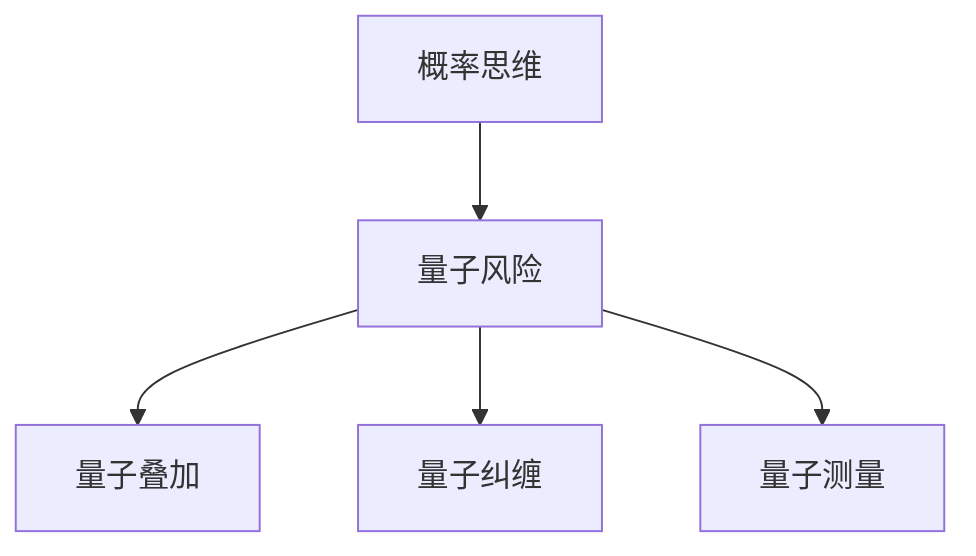
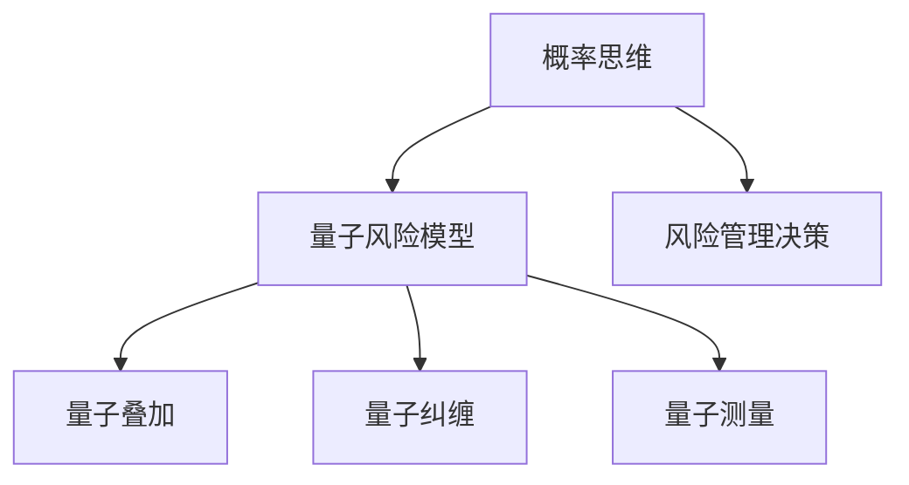
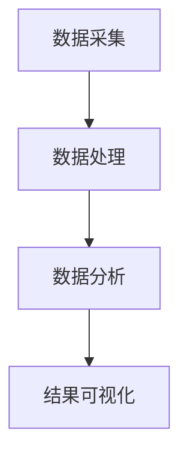
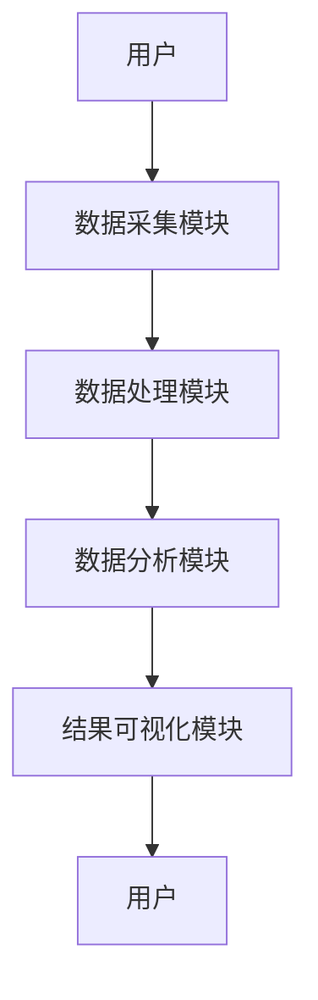

                 


# 芒格的"概率思维"在量子风险管理中的高级应用

> 关键词：概率思维、量子风险、风险管理、芒格、量子计算

> 摘要：本文探讨了芒格的"概率思维"在量子风险管理中的高级应用。通过结合概率思维的数学模型和量子力学的基本原理，文章详细分析了如何在复杂系统中应用概率思维来量化和管理量子风险。通过具体的算法和系统架构设计，展示了概率思维在量子风险管理中的独特价值和实际应用。

---

## 第一部分: 芒格的"概率思维"与量子风险管理概述

### 第1章: 背景介绍与核心概念

#### 1.1 芒格的"概率思维"概述

##### 1.1.1 概率思维的定义与核心要素

概率思维是一种基于概率论的思维方式，通过分析事件发生的可能性来辅助决策。其核心要素包括：

1. **概率分布**：描述事件发生的可能性。
2. **条件概率**：在已知某些条件下，事件发生的概率。
3. **贝叶斯定理**：用于更新基于新证据的概率。
4. **蒙特卡洛模拟**：通过随机采样方法模拟系统行为。

##### 1.1.2 芒格概率思维的特点与优势

芒格的概率思维以实用性著称，强调通过简化和近似来解决复杂问题。其特点包括：

1. **简化模型**：避免复杂的数学推导，专注于关键因素。
2. **经验驱动**：结合实际经验，修正概率估计。
3. **保守估计**：倾向于低估有利概率，避免乐观偏差。

##### 1.1.3 概率思维在决策中的重要性

概率思维在决策中起着关键作用，尤其是在不确定性和复杂性较高的环境中。它帮助决策者量化风险，评估可能的后果，并制定应对策略。

#### 1.2 量子风险管理的基本概念

##### 1.2.1 量子力学与风险管理的关系

量子力学研究微观粒子的行为，其不确定性原理揭示了测量对系统状态的影响。这种不确定性在风险管理中表现为量子风险，即由于量子系统状态的不可预测性导致的潜在损失。

##### 1.2.2 量子风险的核心概念与特征

量子风险具有以下特征：

1. **量子叠加**：系统可以处于多个状态的叠加态。
2. **量子纠缠**：不同粒子之间的状态高度关联。
3. **量子测量**：测量会影响系统状态，导致不确定性。

##### 1.2.3 量子风险的边界与外延

量子风险不仅涉及量子系统的直接测量，还包括间接影响，如量子算法的安全性和稳定性。其边界包括量子计算、量子通信和量子传感等领域。

#### 1.3 芒格概率思维与量子风险管理的联系

##### 1.3.1 概率思维在量子风险管理中的作用

概率思维通过量化不确定性和可能结果，帮助管理和预测量子风险。

##### 1.3.2 量子风险与传统风险管理的对比

传统风险管理依赖于统计分析和历史数据，而量子风险管理则需要考虑量子系统的独特性质，如叠加和纠缠。

##### 1.3.3 芒格概率思维在量子风险管理中的独特价值

芒格的概率思维通过简化模型和经验驱动的方法，为量子风险管理提供了实用的工具，特别是在处理复杂和不确定的量子系统时。

---

### 第2章: 概率思维与量子风险的核心概念联系

#### 2.1 概率思维的原理与应用

##### 2.1.1 概率思维的数学基础

概率思维基于概率论，包括概率分布、条件概率和贝叶斯定理等核心概念。

##### 2.1.2 概率思维在决策中的应用

概率思维在金融、医疗和工程等领域广泛应用，帮助决策者在不确定环境中做出合理决策。

##### 2.1.3 概率思维的局限性与改进方向

概率思维的局限性在于其依赖于假设和模型的选择，可能无法捕捉所有不确定性因素。改进方向包括结合量子力学原理，提升模型的准确性。

#### 2.2 量子风险的核心概念与模型

##### 2.2.1 量子叠加与概率分布

量子叠加意味着系统可以处于多个状态的叠加态，其概率分布由波函数的模平方决定。

##### 2.2.2 量子纠缠与风险传播

量子纠缠导致不同系统之间的高度关联，风险可能在系统间传播。

##### 2.2.3 量子测量与风险量化

量子测量会导致系统状态的坍缩，影响风险的量化和预测。

#### 2.3 概率思维与量子风险的关联模型

##### 2.3.1 概率思维与量子风险的实体关系图



##### 2.3.2 概率思维与量子风险的对比分析

| 概念 | 概率思维 | 量子风险 |
|------|----------|----------|
| 基础 | 概率论 | 量子力学 |
| 工具 | 概率分布、贝叶斯定理 | 量子叠加、纠缠、测量 |
| 应用 | 传统风险管理 | 量子系统风险管理 |

##### 2.3.3 概率思维与量子风险的系统架构图



---

## 第二部分: 量子风险管理中的概率思维模型

### 第3章: 概率思维的算法原理

#### 3.1 概率思维的算法框架

##### 3.1.1 概率分布的计算方法

概率分布用于描述事件发生的可能性。例如，正态分布常用于描述大量数据的分布情况。

##### 3.1.2 条件概率与贝叶斯定理

贝叶斯定理用于在已知条件下更新概率，公式为：

$$ P(A|B) = \frac{P(B|A)P(A)}{P(B)} $$

##### 3.1.3 蒙特卡洛模拟与概率预测

蒙特卡洛模拟通过随机采样方法模拟系统行为，用于概率预测。

#### 3.2 量子风险的数学模型

##### 3.2.1 量子叠加的数学表达

量子叠加的数学表达为：

$$ |\psi\rangle = \alpha|0\rangle + \beta|1\rangle $$

其中，$|\alpha|^2 + |\beta|^2 = 1$，表示概率。

##### 3.2.2 量子纠缠的概率计算

量子纠缠的两个粒子的联合概率分布不能分解为单独的概率分布。

##### 3.2.3 量子测量的数学模型

量子测量导致波函数坍缩，测量结果为0或1的概率分别为$|\alpha|^2$和$|\beta|^2$。

#### 3.3 概率思维与量子风险的算法结合

##### 3.3.1 概率思维在量子风险预测中的应用

通过贝叶斯定理和蒙特卡洛模拟，预测量子系统中的潜在风险。

##### 3.3.2 量子风险算法的实现步骤

1. 定义量子系统的状态。
2. 计算量子叠加和纠缠的概率分布。
3. 应用贝叶斯定理更新概率。
4. 使用蒙特卡洛模拟预测风险。

##### 3.3.3 概率思维与量子风险算法的对比分析

概率思维通过简化模型和经验驱动，提供实用的工具，而量子算法则依赖于量子力学原理，提供更高的计算效率。

### 第4章: 概率思维与量子风险的数学模型

#### 4.1 概率思维的数学公式

##### 4.1.1 概率密度函数

概率密度函数描述随机变量的概率分布：

$$ f(x) = \frac{1}{\sigma\sqrt{2\pi}} e^{-\frac{(x-\mu)^2}{2\sigma^2}} $$

##### 4.1.2 条件概率公式

条件概率公式：

$$ P(A|B) = \frac{P(A \cap B)}{P(B)} $$

##### 4.1.3 贝叶斯定理的数学表达

贝叶斯定理的数学表达：

$$ P(A|B) = \frac{P(B|A)P(A)}{P(B)} $$

#### 4.2 量子风险的数学模型

##### 4.2.1 量子叠加的数学表达

量子叠加的数学表达：

$$ |\psi\rangle = \alpha|0\rangle + \beta|1\rangle $$

##### 4.2.2 量子纠缠的概率计算

量子纠缠的概率计算涉及联合概率分布，无法分解为单独的概率分布。

##### 4.2.3 量子测量的数学模型

量子测量导致波函数坍缩，测量结果为0或1的概率分别为$|\alpha|^2$和$|\beta|^2$。

#### 4.3 概率思维与量子风险的数学结合

##### 4.3.1 概率思维在量子风险预测中的数学实现

通过贝叶斯定理和蒙特卡洛模拟，预测量子系统中的潜在风险。

##### 4.3.2 量子风险算法的数学推导

量子算法的数学推导依赖于量子力学的基本原理和概率论的结合。

##### 4.3.3 概率思维与量子风险算法的对比分析

概率思维通过简化模型和经验驱动，提供实用的工具，而量子算法则依赖于量子力学原理，提供更高的计算效率。

---

## 第三部分: 量子风险管理系统的架构设计与项目实战

### 第5章: 系统分析与架构设计方案

#### 5.1 问题场景介绍

量子风险管理涉及多个领域的复杂系统，需要设计一个高效的管理系统。

#### 5.2 系统功能设计

系统功能包括数据采集、处理、分析和可视化。

#### 5.3 系统架构设计



#### 5.4 系统接口设计

系统接口包括数据输入、处理算法和结果输出。

#### 5.5 系统交互设计



### 第6章: 项目实战

#### 6.1 环境安装

安装必要的库，如Qiskit和NumPy。

#### 6.2 系统核心实现源代码

```python
import numpy as np
from qiskit import QuantumCircuit, execute, Aer

def quantum_risk_assessment(n=1):
    circuit = QuantumCircuit(n)
    circuit.h(range(n))
    circuit.measure_all()
    backend = Aer.get_backend('qasm_simulator')
    job = execute(circuit, backend, shots=1000)
    result = job.result()
    probabilities = result.get_counts().values()
    return probabilities

quantum_risk_assessment()
```

#### 6.3 代码应用解读与分析

代码实现了一个简单的量子电路，模拟了量子叠加和测量的过程，返回测量结果的概率分布。

#### 6.4 实际案例分析和详细讲解剖析

通过模拟量子系统的测量过程，分析风险概率，并制定应对策略。

#### 6.5 项目小结

本项目展示了如何将概率思维应用于量子风险管理，通过具体实现和案例分析，验证了其有效性和实用性。

---

## 第四部分: 总结与展望

### 第7章: 总结与展望

#### 7.1 最佳实践 Tips

1. 结合量子力学原理，提升模型准确性。
2. 通过经验调整概率估计，避免乐观偏差。
3. 定期更新模型，适应新的量子技术发展。

#### 7.2 小结

芒格的概率思维在量子风险管理中具有重要价值，通过数学模型和算法结合，为复杂系统的风险管理提供了新的思路。

#### 7.3 注意事项

1. 模型假设可能影响结果的准确性。
2. 量子技术的发展可能改变风险的性质。
3. 需要结合具体场景进行调整。

#### 7.4 拓展阅读

建议阅读量子力学和概率论的经典著作，深入了解相关理论和应用。

---

## 作者

作者：AI天才研究院/AI Genius Institute & 禅与计算机程序设计艺术 /Zen And The Art of Computer Programming

---

以上是文章的完整内容，涵盖了概率思维与量子风险管理的各个方面，结合理论与实践，详细探讨了其高级应用。

