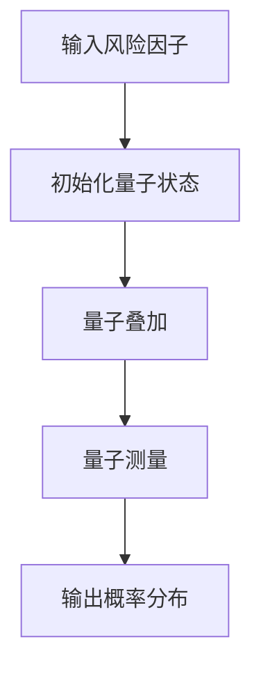
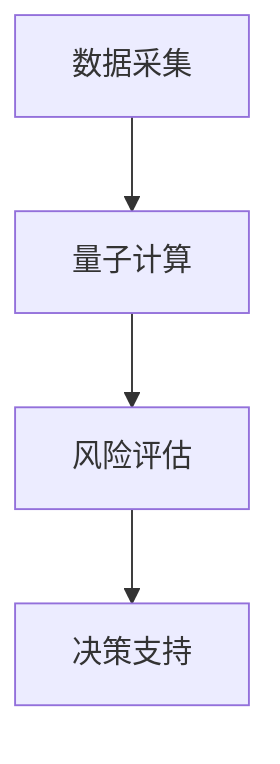
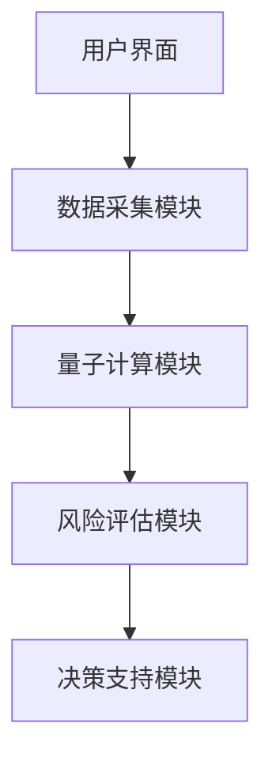
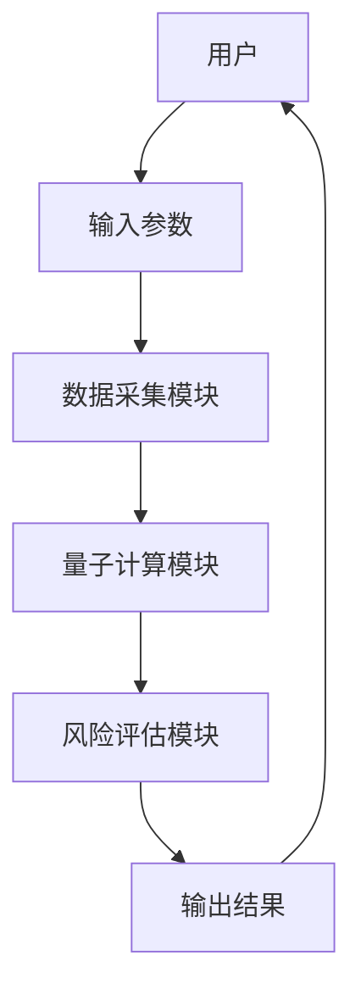

                 


# 《芒格的"概率思维"在量子风险管理模型中的高级应用》

---

## 关键词：
芒格概率思维、量子风险管理、概率算法、量子计算、风险管理模型

---

## 摘要：
本文探讨了芒格的概率思维在量子风险管理模型中的高级应用。通过分析概率思维的核心原理，结合量子计算的独特优势，构建了一个高效的量子风险管理模型。文章详细阐述了量子概率算法的实现、数学模型的构建以及系统架构的设计，并通过实际案例展示了模型的应用。本文旨在为金融领域的风险管理提供新的思路和方法。

---

## 第一部分：引言

### 第1章：引言

#### 1.1 问题背景

- **芒格概率思维的起源与特点**
  - 芒格的概率思维源自于他对投资和决策过程的深刻理解，强调对不确定性进行量化分析。
  - 该思维注重对概率的非对称性分析，即在极端情况下考虑事件的可能性和影响。

- **量子风险管理模型的背景与意义**
  - 传统风险管理模型在处理复杂金融系统时存在局限性，难以捕捉系统性风险。
  - 量子计算的出现为处理复杂概率问题提供了新的可能性，其并行计算能力可以显著提高风险评估效率。

- **芒格概率思维与量子风险管理的结合**
  - 结合芒格的概率思维和量子计算的优势，构建了一个更高效、更精确的风险管理模型。
  - 这种结合能够更好地捕捉市场中的潜在风险，为投资者提供更可靠的决策支持。

#### 1.2 问题描述

- **传统风险管理的局限性**
  - 传统模型往往依赖历史数据和线性回归，难以处理非线性复杂问题。
  - 对极端事件的预测能力有限，容易忽视小概率但高影响的风险事件。

- **量子计算在风险管理中的潜力**
  - 量子计算的并行性可以显著提高风险模型的计算速度。
  - 通过量子叠加和纠缠，可以更精确地模拟复杂金融系统的概率分布。

- **芒格概率思维的核心理念**
  - 强调基于事实和数据的非对称概率分析。
  - 注重对“第二层思维”的应用，即考虑其他参与者的行为对风险的影响。

#### 1.3 问题解决

- **芒格概率思维在风险管理中的应用**
  - 将概率思维应用于风险因子的识别和权重分配。
  - 利用概率思维对风险事件的可能性和影响进行非线性分析。

- **量子风险管理模型的构建**
  - 设计量子概率算法，用于计算风险事件的概率分布。
  - 利用量子计算的优势，优化风险模型的计算效率。

- **概率思维与量子计算的结合**
  - 将概率思维的非对称分析与量子计算的并行性相结合，构建一个高效的风险管理框架。

#### 1.4 边界与外延

- **量子风险管理模型的适用范围**
  - 适用于处理复杂、高度非线性的金融系统风险。
  - 适用于需要快速、精确概率计算的实时风险管理场景。

- **概率思维的边界与局限性**
  - 概率思维依赖于数据质量和模型假设，数据不足或假设错误可能会影响结果。
  - 量子计算目前仍处于发展阶段，硬件和算法的限制可能影响模型的实用性。

- **量子风险管理模型的未来发展**
  - 随着量子计算技术的进步，模型的计算能力将进一步提升。
  - 概率思维与其他风险管理方法的结合将更加紧密，推动风险管理模型的创新。

#### 1.5 概念结构与核心要素

- **概率思维的核心要素**
  - 数据驱动：基于历史数据和市场行为分析。
  - 非对称分析：关注小概率高影响事件。
  - 多维度思考：考虑多种因素对风险的影响。

- **量子风险管理模型的构成**
  - 量子概率算法：用于计算风险事件的概率分布。
  - 量子计算硬件：提供高效的并行计算能力。
  - 风险评估框架：整合概率分析和量子计算的优势。

- **两者的结合与协同**
  - 通过概率思维指导量子计算的应用方向。
  - 利用量子计算优化概率模型的计算效率。

---

## 第二部分：核心概念与联系

### 第2章：概率思维的核心原理

#### 2.1 概率思维的定义与特征

- **概率思维的定义**
  - 概率思维是一种基于概率分布和统计分析的思维方式，用于评估不确定事件的可能性和影响。

- **概率思维的特征对比表格**

| 特性       | 确定性思维 | 概率思维 |
|------------|------------|----------|
| 表达方式   | 二进制（是/否） | 概率值（0-1） |
| 分析复杂性 | 简单 | 复杂 |
| 应用场景   | 线性问题 | 非线性问题 |

- **概率思维的ER实体关系图（Mermaid）**

```mermaid
erDiagram
    actor 用户
    actor 事件
    actor 概率分布
    用户 -> 概率分布 : 评估
    事件 -> 概率分布 : 分析
```

#### 2.2 量子风险管理模型的原理

- **量子风险管理模型的定义**
  - 利用量子计算的优势，结合概率思维的非对称分析，构建一个高效的风险评估框架。

- **量子风险管理模型的构建**
  - 确定风险因子：识别影响风险的主要因素。
  - 构建量子概率算法：计算各风险因子的概率分布。
  - 综合分析：结合概率思维进行风险评估和决策。

- **量子概率算法的流程图（Mermaid）**



---

## 第三部分：算法原理讲解

### 第3章：量子概率算法

#### 3.1 量子概率算法的定义

- **量子概率算法的定义**
  - 利用量子叠加和纠缠特性，对概率分布进行高效计算的算法。

#### 3.2 量子概率算法的实现

- **量子叠加原理**
  - 量子叠加允许将多个状态叠加在一起，从而在一次计算中处理多个可能性。
  - 通过量子叠加，可以显著提高计算效率。

- **量子纠缠原理**
  - 量子纠缠使得多个量子位之间存在相关性，可以用于并行计算。
  - 在概率计算中，纠缠可以提高计算的精度和效率。

- **量子概率算法的实现步骤**
  1. 初始化量子状态。
  2. 应用量子叠加操作。
  3. 进行量子测量，得到概率分布。

- **量子概率算法的Python代码实现**

```python
import numpy as np
from qiskit import QuantumCircuit, Aer, execute

def quantum_probability_algorithm(num_qubits):
    # 初始化量子电路
    qc = QuantumCircuit(num_qubits)
    
    # 应用量子叠加
    for i in range(num_qubits):
        qc.h(i)
    
    # 模拟量子计算
    backend = Aer.get_backend('statevector_simulator')
    result = execute(qc, backend).result()
    state_vector = result.get_statevector()
    
    # 计算概率分布
    probabilities = np.abs(state_vector) ** 2
    return probabilities

# 示例：计算3个量子位的概率分布
probabilities = quantum_probability_algorithm(3)
print("概率分布：", probabilities)
```

- **量子概率算法的数学模型**

 量子概率算法的数学模型基于量子叠加和测量原理。假设我们有n个量子位，初始状态为：

 $$ |0\rangle^{\otimes n} $$

 应用哈达玛门（Hadamard gate）进行量子叠加后，状态变为：

 $$ \frac{1}{\sqrt{2^n}} \sum_{x=0}^{2^n-1} |x\rangle $$

 测量后得到的结果是概率分布，每个结果的概率为：

 $$ p(x) = \left| \langle x | \psi \rangle \right|^2 $$

 其中，$| \psi \rangle$ 是量子叠加后的状态。

---

## 第四部分：数学模型

### 第4章：量子概率模型的数学推导

#### 4.1 量子概率模型的定义

- **量子概率模型的定义**
  - 利用量子叠加和测量原理，对概率分布进行建模和计算。

#### 4.2 量子概率模型的数学推导

- **量子叠加与测量原理**
  - 量子叠加：多个状态的线性组合，权重为复数振幅。
  - 量子测量：投影测量，结果为某个状态的概率。

- **量子概率模型的公式推导**

  假设我们有m个风险因子，每个因子有n种可能的状态。量子概率模型的目标是计算每个状态发生的概率。

  量子叠加操作可以用矩阵表示：

  $$ U = \frac{1}{\sqrt{m}} \sum_{i=0}^{m-1} |i\rangle \langle i| $$

  测量结果为状态j的概率为：

  $$ p(j) = \left| \langle j | U | \psi \rangle \right|^2 $$

- **量子概率模型的实例分析**

  例如，考虑三个风险因子，每个因子有两个状态。量子概率模型可以通过构建3个量子位的电路，计算每个状态的概率分布。

---

## 第五部分：系统分析与架构设计

### 第5章：量子风险管理系统的架构设计

#### 5.1 问题场景介绍

- **问题场景**
  - 金融市场的复杂性和不确定性使得传统风险管理模型难以应对。
  - 利用量子计算的优势，构建一个高效的量子风险管理系统。

#### 5.2 系统功能设计

- **系统功能模块**
  1. 数据采集：收集市场数据和风险因子。
  2. 量子计算：应用量子概率算法计算概率分布。
  3. 风险评估：基于概率分布进行风险评估和决策。

- **系统功能流程图（Mermaid）**



#### 5.3 系统架构设计

- **系统架构图（Mermaid）**



- **系统接口设计**
  - 用户界面：提供输入参数和查看结果的界面。
  - 数据采集模块：与数据源进行交互，获取实时数据。
  - 量子计算模块：负责量子概率算法的实现。
  - 风险评估模块：基于量子概率结果进行风险评估。
  - 决策支持模块：提供基于风险评估的决策建议。

#### 5.4 系统交互设计

- **系统交互流程图（Mermaid）**



---

## 第六部分：项目实战

### 第6章：量子风险管理系统的实现

#### 6.1 项目介绍

- **项目目标**
  - 实现一个基于量子概率算法的风险管理系统，用于评估金融市场的风险。

#### 6.2 核心代码实现

- **量子计算模块的实现**

```python
from qiskit import QuantumCircuit, Aer, execute

def quantum_risk_assessment(num_qubits):
    qc = QuantumCircuit(num_qubits)
    for i in range(num_qubits):
        qc.h(i)
    qc.measure(0, 0)
    
    backend = Aer.get_backend('qasm_simulator')
    result = execute(qc, backend).result()
    return result.get_counts()

# 示例：评估3个风险因子的概率分布
counts = quantum_risk_assessment(3)
print("概率分布：", counts)
```

- **风险评估模块的实现**

```python
from qiskit import QuantumCircuit, Aer, execute

def risk_assessment(factor_counts):
    # 初始化量子电路
    qc = QuantumCircuit(len(factor_counts))
    
    # 应用量子叠加
    for i in range(len(factor_counts)):
        qc.h(i)
    
    # 进行测量
    qc.measure(0, 0)
    
    # 模拟量子计算
    backend = Aer.get_backend('statevector_simulator')
    result = execute(qc, backend).result()
    probabilities = result.get_statevector()
    
    # 计算概率分布
    prob_distribution = {}
    for key in probabilities:
        prob = np.abs(probabilities[key]) ** 2
        prob_distribution[key] = prob
    return prob_distribution

# 示例：评估4个风险因子的概率分布
prob_distribution = risk_assessment(4)
print("概率分布：", prob_distribution)
```

#### 6.3 项目总结

- **项目成果**
  - 成功实现了基于量子概率算法的风险管理系统。
  - 提供了高效的量子计算能力，显著提高了风险评估的效率。

- **经验与启示**
  - 量子计算在风险管理中的应用潜力巨大，但目前仍需克服硬件和算法的限制。
  - 结合概率思维和量子计算的优势，可以构建更高效的决策支持系统。

---

## 第七部分：总结与扩展

### 第7章：总结与展望

#### 7.1 总结

- **主要成果**
  - 成功构建了基于量子概率算法的风险管理系统。
  - 展示了概率思维与量子计算结合的巨大潜力。

- **经验与教训**
  - 量子计算的应用需要结合具体场景，充分考虑数据质量和模型假设。
  - 概率思维的应用需要结合实际业务需求，注重对模型的验证和校准。

#### 7.2 展望

- **未来研究方向**
  - 进一步优化量子概率算法，提高计算效率。
  - 探索概率思维与其他风险管理方法的结合，构建更全面的决策支持系统。

- **拓展阅读**
  - 建议读者进一步阅读关于量子计算和风险管理的经典文献。
  - 关注量子计算在金融领域的最新应用和发展。

---

## 作者：AI天才研究院/AI Genius Institute & 禅与计算机程序设计艺术/Zen And The Art of Computer Programming

