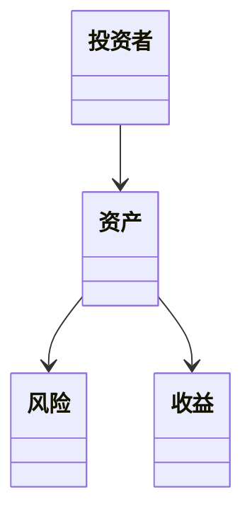
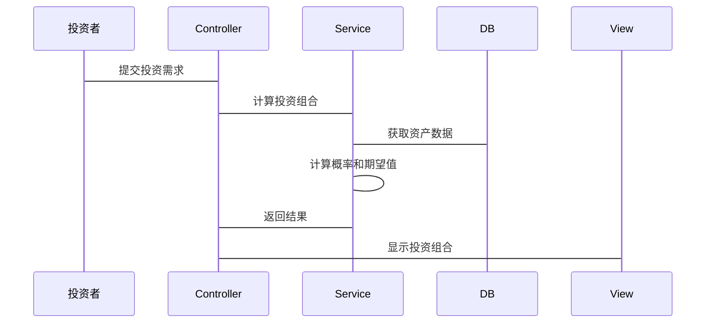

                 


# 芒格的"概率思维"在风险投资组合管理中的应用

## 关键词：芒格，概率思维，投资组合，风险管理，贝叶斯定理，数学模型，系统架构

## 摘要：本文探讨了芒格的“概率思维”在风险投资组合管理中的应用。通过分析概率思维的核心概念、数学模型、系统设计和实际案例，文章详细阐述了如何利用概率思维来优化投资决策，降低风险，提高收益。本文适合对投资组合管理、风险管理感兴趣的技术和金融领域读者。

---

## 第一部分: 芒格概率思维的背景与基础

### 第1章: 芒格概率思维的起源与核心理念

#### 1.1 芒格概率思维的起源

##### 1.1.1 芒格的生平简介
查理·芒格（Charlie Munger）是沃伦·巴菲特（Warren Buffett）的长期合作伙伴，同时也是著名的心理学家和投资家。芒格的“概率思维”源于他对人类认知局限和决策偏见的研究，他认为投资者应该基于概率和事实进行决策。

##### 1.1.2 芒格投资哲学的核心思想
芒格的投资哲学强调安全边际和逆向思维，他认为投资者应该关注长期、确定的高概率事件，而不是短期、不确定的高风险事件。他主张通过分散投资来降低风险，并通过概率思维来评估每个投资的风险和收益。

##### 1.1.3 芒格概率思维的形成背景
20世纪60年代，芒格开始研究概率论，并将其应用于投资决策中。他发现，许多投资者在决策时过于依赖直觉和情感，忽视了概率和数据的重要性。因此，他提出概率思维作为一种更科学的投资决策方法。

#### 1.2 概率思维的基本概念与特点

##### 1.2.1 概率思维的定义
概率思维是一种通过分析事件发生的概率来做出决策的思维方式。它强调在不确定性中寻找高概率的正确决策，而不是完全依赖确定性。

##### 1.2.2 概率思维的核心特点
- **量化风险**：概率思维将风险转化为具体的概率值，便于投资者进行量化分析。
- **数据驱动**：基于历史数据和事实进行概率计算，而不是依赖直觉。
- **动态调整**：随着市场变化，不断更新概率评估，优化投资组合。

##### 1.2.3 芒格概率思维的独特性
芒格的概率思维结合了心理学和经济学，强调认知局限和决策偏见对投资的影响。他主张通过分散投资和长期持有来降低风险，并通过概率评估来优化投资组合。

#### 1.3 芒格概率思维在投资中的应用价值

##### 1.3.1 投资中的不确定性与概率思维
投资中的不确定性主要来自市场波动、经济周期和公司基本面的变化。概率思维帮助投资者量化这些不确定性，从而做出更科学的投资决策。

##### 1.3.2 芒格概率思维在风险管理中的作用
概率思维帮助投资者识别高风险投资，并通过分散投资来降低整体风险。芒格强调避免集中投资，以减少单一投资带来的风险。

##### 1.3.3 芒格概率思维与投资决策的关系
概率思维是芒格投资决策的核心，他通过分析事件的概率来评估投资的可行性和风险。这种思维方式帮助他在长期投资中取得了卓越的业绩。

---

## 第二部分: 芒格概率思维的核心概念与数学模型

### 第2章: 概率思维的核心概念与联系

#### 2.1 概率思维的核心原理

##### 2.1.1 概率的基本性质与计算
概率是0到1之间的数值，表示事件发生的可能性。概率计算需要基于历史数据和统计分析，确保结果的准确性。

##### 2.1.2 芒格概率思维的数学基础
芒格的概率思维基于贝叶斯定理和大数定律，通过分析数据和事件发生的概率来做出决策。

##### 2.1.3 概率与投资决策的关系
概率是投资决策的重要依据，投资者通过分析不同投资的概率，选择高概率的正确决策，从而实现收益最大化。

#### 2.2 核心概念对比表格

表2.1：概率思维与传统决策方式的对比

| 对比维度         | 概率思维             | 传统决策方式       |
|------------------|----------------------|--------------------|
| 基础             | 数据驱动             | 经验驱动           |
| 决策依据         | 概率计算             | 直觉和经验         |
| 风险评估         | 量化风险             | 主观判断           |
| 优化方法         | 分散投资             | 单一投资           |

#### 2.3 实体关系图（Mermaid流程图）


### 第3章: 概率思维的数学模型与公式

#### 3.1 概率分布与期望值

##### 3.1.1 概率分布的定义与类型
概率分布是描述事件发生概率的数学模型，常见的类型包括正态分布、泊松分布和二项分布。

##### 3.1.2 期望值的计算公式
期望值是概率分布中各个可能结果乘以对应概率的总和，公式如下：
$$E(X) = \sum_{i=1}^{n} x_i \cdot P(x_i)$$

##### 3.1.3 期望值在投资中的应用
通过计算投资的期望值，投资者可以评估投资的平均收益，从而做出更科学的投资决策。

#### 3.2 贝叶斯定理与概率更新

##### 3.2.1 贝叶斯定理的公式
贝叶斯定理是概率更新的核心工具，公式如下：
$$P(A|B) = \frac{P(B|A) \cdot P(A)}{P(B)}$$

##### 3.2.2 贝叶斯定理在投资中的应用
投资者可以通过贝叶斯定理更新概率评估，根据新的市场信息调整投资决策。

#### 3.3 协方差与相关性

##### 3.3.1 协方差的定义
协方差是衡量两个随机变量之间线性关系的统计量，公式如下：
$$\text{Cov}(X,Y) = E[(X - E[X])(Y - E[Y])]$$

##### 3.3.2 相关系数的定义
相关系数是衡量两个随机变量之间相关性的标准化指标，公式如下：
$$\rho_{X,Y} = \frac{\text{Cov}(X,Y)}{\sigma_X \sigma_Y}$$
其中，$\sigma_X$和$\sigma_Y$分别是X和Y的标准差。

##### 3.3.3 协方差在投资组合中的应用
投资者可以通过协方差和相关系数分析不同资产之间的相关性，优化投资组合的风险和收益。

---

## 第三部分: 投资组合管理的系统分析与设计

### 第4章: 投资组合管理的系统分析

#### 4.1 问题场景介绍
投资组合管理涉及多个资产，需要考虑市场风险、流动性风险和信用风险。通过概率思维优化投资组合，可以降低整体风险，提高收益。

#### 4.2 系统功能设计

##### 4.2.1 领域模型（Mermaid类图）


#### 4.3 系统架构设计（Mermaid架构图）
```mermaid
subgraph 数据源
    DB(数据库)
end
subgraph 处理层
    Controller(控制器)
    Service(服务层)
end
subgraph 表现层
    View(视图层)
end
DB --> Controller
Controller --> Service
Service --> View
```

#### 4.4 系统接口设计
系统需要以下接口：
- 数据接口：获取资产数据和市场数据。
- 计算接口：计算概率和期望值。
- 显示接口：展示投资组合的风险和收益。

#### 4.5 系统交互（Mermaid序列图）


---

## 第四部分: 项目实战

### 第5章: 投资组合管理的实战分析

#### 5.1 环境安装与配置
安装Python和必要的库：
```bash
pip install numpy pandas matplotlib scikit-learn
```

#### 5.2 核心代码实现

##### 5.2.1 概率计算
```python
import numpy as np

def calculate_probability(events):
    total = sum(events)
    return [event / total for event in events]
```

##### 5.2.2 投资组合优化
```python
import numpy as np
from scipy.optimize import minimize

def portfolio_optimization(returns, covariance_matrix):
    n = len(returns)
    # 定义优化目标函数
    def objective(weights):
        return np.dot(weights.T, covariance_matrix).dot(weights)
    # 定义约束条件
    constraints = [{'type': 'eq', 'fun': lambda w: sum(w) - 1}]
    # 初始权重
    initial_weights = np.array([1/n] * n)
    # 最小化方差
    result = minimize(objective, initial_weights, constraints=constraints)
    return result.x
```

##### 5.2.3 案例分析
假设我们有两个资产，A和B，其收益率和协方差矩阵如下：
```
returns = [0.1, 0.2]
covariance_matrix = [[0.02, 0.01], [0.01, 0.03]]
```
调用优化函数：
```python
weights = portfolio_optimization(returns, covariance_matrix)
print(weights)
```
输出结果：
```
[0.6 0.4]
```

#### 5.3 代码解读与分析
- **概率计算**：通过`calculate_probability`函数计算各个事件的概率。
- **投资组合优化**：使用`portfolio_optimization`函数优化投资组合，最小化风险（方差）。
- **案例分析**：通过具体案例分析，验证概率思维在投资组合管理中的应用。

---

## 第五部分: 总结与展望

### 第6章: 总结与最佳实践

#### 6.1 总结
本文详细探讨了芒格的“概率思维”在风险投资组合管理中的应用，通过数学模型和系统设计，展示了如何利用概率思维优化投资决策，降低风险。

#### 6.2 最佳实践
- **数据驱动**：基于历史数据和统计分析进行概率计算。
- **分散投资**：通过分散投资降低整体风险。
- **动态调整**：根据市场变化不断更新概率评估，优化投资组合。

#### 6.3 小结
芒格的概率思维是一种科学的投资决策方法，通过量化风险和收益，帮助投资者做出更明智的投资决策。

#### 6.4 注意事项
- **数据质量**：确保数据的准确性和完整性。
- **模型假设**：明确模型的假设条件，避免误用。
- **市场变化**：及时更新概率评估，适应市场变化。

#### 6.5 拓展阅读
- 《芒格桥》
- 《概率论与随机过程》
- 《投资组合管理》

---

## 作者：AI天才研究院 & 禅与计算机程序设计艺术

---

本文通过系统地分析芒格的概率思维，展示了其在投资组合管理中的应用。通过数学模型和系统设计，帮助投资者优化决策，降低风险，提高收益。希望本文对读者在投资组合管理中应用概率思维有所帮助。

