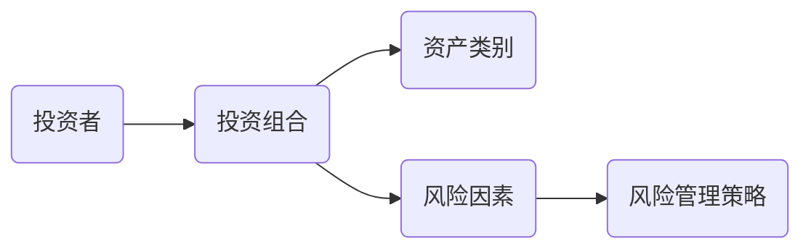
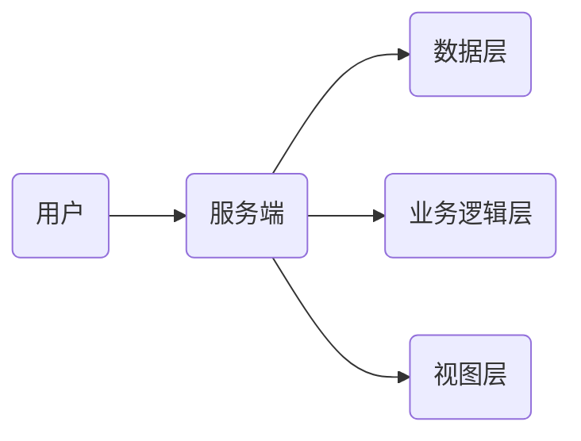

                 


# 芒格的"概率思维"在风险投资组合管理中的高级应用

> 关键词：芒格概率思维，风险投资，投资组合管理，概率模型，蒙特卡洛模拟

> 摘要：本文深入探讨了芒格的概率思维在风险投资组合管理中的应用，结合概率模型、数学公式和实际案例，详细分析了如何通过概率思维优化投资决策，降低风险，提高投资回报。

---

## 第一部分：芒格概率思维的背景与核心概念

### 第1章：芒格概率思维的起源与发展

#### 1.1 芒格的生平简介
查理·芒格是美国著名投资者和伯克希尔·哈撒韦公司的副主席，他以价值投资和理性决策闻名。芒格的概率思维是其投资哲学的重要组成部分，强调通过分析事件发生的可能性来做出决策。

#### 1.2 芒格概率思维的核心思想
芒格认为，投资决策应基于对未来的概率分析，而不是确定性的预测。他强调安全边际的重要性，即在投资中留出足够的安全空间以应对不确定性。

#### 1.3 芒格概率思维的演变历程
芒格的概率思维起源于对保险和投资行业的研究，逐渐发展为一种系统化的风险管理方法。这种方法结合了统计学、心理学和经济学的原理，成为现代投资组合管理的重要理论基础。

### 第2章：芒格概率思维在投资中的应用背景

#### 2.1 风险投资的基本概念与特点
风险投资是指将资金投入到高风险项目中，以期获得高回报的投资方式。其特点是高风险、高回报，且不确定性较大。

#### 2.2 投资组合管理的核心目标
投资组合管理的目标是在风险可控的前提下，最大化投资回报。通过合理配置资产，分散风险，优化投资组合的收益与风险比。

#### 2.3 芒格概率思维在投资组合管理中的独特价值
芒格的概率思维为投资组合管理提供了新的视角，帮助投资者更好地评估和管理风险，优化资产配置，提高整体投资效率。

---

## 第二部分：芒格概率思维的核心概念与联系

### 第3章：芒格概率思维的核心概念与联系

#### 3.1 概率思维的基本原理
概率思维基于概率论，通过分析事件发生的可能性来评估其影响。在投资中，这通常用于评估资产的预期收益和风险。

#### 3.2 核心概念对比分析
| 概念         | 传统投资决策 | 芒格概率思维 |
|--------------|--------------|--------------|
| 决策依据     | 确定性预测   | 概率分析     |
| 风险管理     | 面对已知风险 | 应对未知风险 |
| 投资策略     | 追求高回报   | 优化风险回报 |

#### 3.3 实体关系图与流程图
##### 投资组合管理的ER实体关系图


##### 概率思维在投资组合管理中的流程图


---

## 第三部分：芒格概率思维的数学模型与算法原理

### 第4章：概率模型的数学基础

#### 4.1 概率分布的基本概念
概率分布描述了随机变量可能取值及其对应概率的函数。常见的概率分布包括正态分布、泊松分布等。

#### 4.2 芒格概率模型的核心假设
芒格的概率模型假设市场参与者的行为是理性的，且市场本身具有一定的随机性，可以通过概率分析来预测其走势。

#### 4.3 概率模型的数学表达式
$$ P(A) = \frac{\text{事件A的有利情况数}}{\text{总的情况数}} $$

### 第5章：蒙特卡洛模拟算法

#### 5.1 蒙特卡洛模拟的基本原理
蒙特卡洛模拟是一种通过随机采样来估计概率分布的方法，广泛应用于金融、物理等领域。

#### 5.2 蒙特卡洛模拟的算法流程图


#### 5.3 蒙特卡洛模拟的代码实现
```python
import random

def monte_carlo_simulation(n):
    results = []
    for _ in range(n):
        # 模拟过程
        result = random.random()
        results.append(result)
    return results

# 示例调用
simulations = 1000
data = monte_carlo_simulation(simulations)
print(data)
```

---

## 第四部分：芒格概率思维在投资组合管理中的应用

### 第6章：投资组合的风险评估与优化

#### 6.1 投资组合的风险评估
通过概率模型和蒙特卡洛模拟，可以评估投资组合在不同情景下的表现，识别潜在风险点。

#### 6.2 投资组合的优化策略
基于概率分析，调整资产配置比例，优化风险与回报的平衡，提高整体投资收益。

#### 6.3 实际案例分析
以某投资组合为例，展示如何通过芒格的概率思维进行风险评估和优化配置。

---

## 第五部分：系统分析与架构设计

### 第7章：基于概率思维的投资管理系统设计

#### 7.1 系统功能设计
设计一个包含数据采集、概率分析、风险评估和投资建议等功能的投资管理系统。

#### 7.2 系统架构图


#### 7.3 系统接口设计
定义清晰的接口规范，确保各模块之间的数据交互顺畅。

#### 7.4 系统交互流程图


---

## 第六部分：项目实战

### 第8章：芒格概率思维在实际投资中的应用

#### 8.1 环境安装
安装必要的开发工具和库，如Python、Pandas、Matplotlib等。

#### 8.2 核心代码实现
实现概率模型和蒙特卡洛模拟的代码，展示如何计算投资组合的风险和回报。

#### 8.3 实际案例分析
以具体投资组合为例，展示如何应用芒格的概率思维进行风险评估和优化。

---

## 第七部分：最佳实践与小结

### 第9章：芒格概率思维的应用总结

#### 9.1 最佳实践
- 定期更新概率模型，适应市场变化。
- 结合其他风险管理工具，提高整体投资效率。

#### 9.2 小结
芒格的概率思维为风险投资组合管理提供了强大的理论支持和实践指导，帮助投资者在不确定性中做出更明智的决策。

---

## 作者：AI天才研究院 & 禅与计算机程序设计艺术

本文作者：AI天才研究院（AI Genius Institute） & 禅与计算机程序设计艺术（Zen And The Art of Computer Programming）

