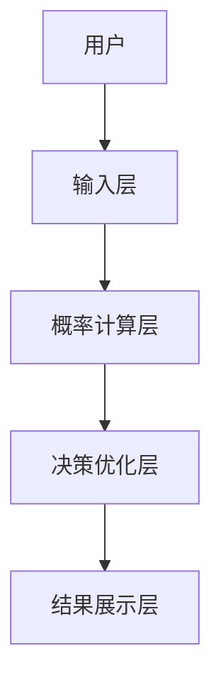
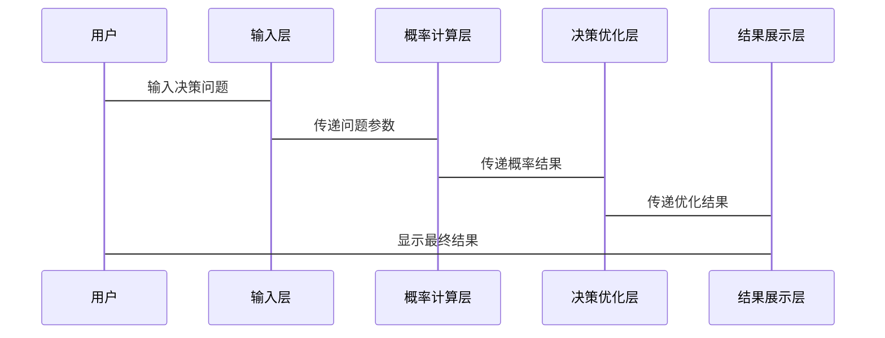

                 


# 芒格的概率思维：在不确定性中做出决策

> 关键词：概率思维，芒格，不确定性，决策模型，贝叶斯定理，蒙特卡洛模拟，决策树

> 摘要：芒格的概率思维是一种通过分析和计算概率来应对不确定性的决策方法。本文从概率思维的基本概念出发，结合芒格的投资哲学，详细讲解了概率计算的核心工具，如贝叶斯定理、蒙特卡洛模拟和决策树分析。通过系统设计和项目实战，展示了概率思维在实际决策中的应用，并总结了最佳实践和注意事项。

---

# 第一部分：芒格的概率思维背景与核心概念

## 第1章：芒格的概率思维概述

### 1.1 芒格的概率思维起源

#### 1.1.1 芒格的投资哲学与决策理念

本章节介绍了芒格的概率思维的起源，探讨了芒格的投资哲学和决策理念。芒格认为，投资的本质是通过分析和计算概率，找到具有安全边际的投资机会。芒格的概率思维不仅仅是对概率的计算，更是一种通过分析和计算概率来应对不确定性的决策方法。

#### 1.1.2 芒格概率思维的核心思想

芒格的概率思维的核心思想是通过分析和计算概率，找到具有安全边际的投资机会。芒格认为，投资的本质是通过分析和计算概率，找到具有安全边际的投资机会。芒格的概率思维不仅仅是对概率的计算，更是一种通过分析和计算概率来应对不确定性的决策方法。

#### 1.1.3 芒格概率思维的现实意义

芒格的概率思维的现实意义在于，它为我们提供了一种在不确定性和复杂性中做出决策的方法。芒格的概率思维不仅仅是对概率的计算，更是一种通过分析和计算概率来应对不确定性的决策方法。

### 1.2 概率思维的基本概念

#### 1.2.1 概率的基本定义与属性

概率是描述某个事件发生的可能性大小的一个数值，其范围在0到1之间。概率的基本属性包括：概率的加法性、概率的乘法性、概率的条件性等。概率的基本定义与属性是概率思维的基础。

#### 1.2.2 芒格概率思维的独特性

芒格的概率思维的独特性在于，他不仅仅关注事件发生的概率，更关注事件发生后的结果和影响。芒格的概率思维不仅仅是对概率的计算，更是一种通过分析和计算概率来应对不确定性的决策方法。

#### 1.2.3 概率思维在决策中的作用

概率思维在决策中的作用是通过分析和计算概率，帮助我们在不确定性和复杂性中做出更明智的决策。概率思维在决策中的作用是通过分析和计算概率，帮助我们在不确定性和复杂性中做出更明智的决策。

---

## 第2章：概率思维的核心工具与方法

### 2.1 基本概率公式与计算

#### 2.1.1 概率乘法规则

概率乘法规则是用来计算两个事件同时发生的概率。其公式为：

$$P(A \cap B) = P(A) \times P(B|A)$$

其中，$P(A)$ 是事件A发生的概率，$P(B|A)$ 是在事件A发生的条件下，事件B发生的概率。

#### 2.1.2 概率加法规则

概率加法规则则是用来计算两个事件至少有一个发生的概率。其公式为：

$$P(A \cup B) = P(A) + P(B) - P(A \cap B)$$

其中，$P(A \cap B)$ 是事件A和B同时发生的概率。

#### 2.1.3 条件概率公式

条件概率公式是概率论中的基本公式，用于计算在已知某个事件发生的情况下，另一个事件发生的概率。其公式为：

$$P(A|B) = \frac{P(A \cap B)}{P(B)}$$

其中，$P(A|B)$ 是在事件B发生的条件下，事件A发生的概率。

### 2.2 贝叶斯定理与应用

#### 2.2.1 贝叶斯定理的公式

贝叶斯定理是概率论中的一个重要定理，用于计算在已知某个事件发生的情况下，另一个事件发生的概率。其公式为：

$$P(A|B) = \frac{P(B|A)P(A)}{P(B)}$$

其中，$P(A)$ 是事件A的先验概率，$P(B|A)$ 是事件A发生的条件下，事件B发生的概率，$P(B)$ 是事件B的先验概率。

#### 2.2.2 贝叶斯定理在决策中的应用

贝叶斯定理在决策中的应用广泛，例如在医疗诊断、金融投资等领域。通过贝叶斯定理，我们可以根据已知信息和数据，不断更新我们的概率估计，从而做出更明智的决策。

#### 2.2.3 贝叶斯网络的基本概念

贝叶斯网络是一种基于概率论的图形化模型，用于表示变量之间的依赖关系。它由节点和边组成，节点代表变量，边代表变量之间的依赖关系。

### 2.3 决策树分析与概率思维

#### 2.3.1 决策树的基本结构

决策树是一种树状图，用于表示决策的可能结果和相关概率。它由决策节点、结果节点和分支组成。

#### 2.3.2 决策树在概率计算中的应用

决策树在概率计算中的应用广泛，例如在投资决策、项目管理等领域。通过决策树，我们可以将复杂的决策问题分解为简单的子问题，并通过计算每个子问题的概率和结果，来做出整体的决策。

#### 2.3.3 决策树的优缺点分析

决策树的优点包括直观、易于理解和计算。其缺点包括计算复杂度高、容易受数据偏差影响等。

---

## 第3章：概率思维与芒格决策模型

### 3.1 芒格决策模型的核心要素

#### 3.1.1 概率估计

概率估计是芒格决策模型的核心要素之一，用于评估每个可能结果发生的概率。

#### 3.1.2 结果评估

结果评估是芒格决策模型的另一个核心要素，用于评估每个可能结果的收益或损失。

#### 3.1.3 决策优化

决策优化是芒格决策模型的最终目标，通过综合考虑概率和结果，选择最优的决策方案。

### 3.2 芒格决策模型的数学表达

#### 3.2.1 概率权重的计算

概率权重的计算是芒格决策模型的关键步骤之一。其公式为：

$$P_i = \frac{P_i}{\sum_{i=1}^{n} P_i}$$

其中，$P_i$ 是事件i的概率，$n$ 是事件的总数。

#### 3.2.2 结果期望值的计算

结果期望值的计算是芒格决策模型的另一个关键步骤。其公式为：

$$E = \sum_{i=1}^{n} P_i R_i$$

其中，$P_i$ 是事件i的概率，$R_i$ 是事件i的结果。

#### 3.2.3 决策优化的数学模型

决策优化的数学模型是芒格决策模型的核心，用于选择最优的决策方案。其公式为：

$$\arg\max_{i} \sum_{i=1}^{n} P_i R_i$$

### 3.3 芒格决策模型的案例分析

#### 3.3.1 投资决策中的概率模型

通过一个具体的投资决策案例，展示了如何应用芒格的概率思维模型进行决策。

#### 3.3.2 日常决策中的概率模型

通过一个日常决策案例，展示了芒格的概率思维模型在实际生活中的应用。

#### 3.3.3 模型的局限性与改进方向

分析了芒格决策模型的局限性，并提出了改进建议。

---

# 第二部分：概率思维的算法原理与系统设计

## 第4章：概率思维的算法原理

### 4.1 蒙特卡洛模拟与概率计算

#### 4.1.1 蒙特卡洛模拟的基本原理

蒙特卡洛模拟是一种通过随机采样来估计概率的方法。其基本原理是通过生成大量的随机样本，来估计事件发生的概率。

#### 4.1.2 蒙特卡洛模拟的实现步骤

实现蒙特卡洛模拟的步骤包括：定义问题、生成随机样本、计算结果、分析结果等。

#### 4.1.3 蒙特卡洛模拟的应用场景

蒙特卡洛模拟广泛应用于金融、物理、工程等领域，用于估计复杂系统的概率和不确定性。

### 4.2 贝叶斯网络的构建与实现

#### 4.2.1 贝叶斯网络的构建方法

贝叶斯网络的构建方法包括：确定变量、定义变量之间的依赖关系、设定概率分布等。

#### 4.2.2 贝叶斯网络的推理算法

贝叶斯网络的推理算法包括：前向推理、反向推理、联合推理等。

#### 4.2.3 贝叶斯网络的优化技巧

贝叶斯网络的优化技巧包括：简化网络结构、合并变量、优化概率计算等。

### 4.3 决策树算法的优化与实现

#### 4.3.1 决策树算法的基本实现

决策树算法的基本实现包括：构建决策树、剪枝、预测等步骤。

#### 4.3.2 决策树算法的优化方法

决策树算法的优化方法包括：选择合适特征、控制树的深度、处理缺失值等。

#### 4.3.3 决策树算法的应用案例

通过一个具体的案例，展示了决策树算法在实际中的应用。

---

## 第5章：概率思维的系统架构设计

### 5.1 系统功能设计

#### 5.1.1 概率计算模块

概率计算模块用于计算每个事件发生的概率。

#### 5.1.2 决策优化模块

决策优化模块用于选择最优的决策方案。

#### 5.1.3 数据可视化模块

数据可视化模块用于将计算结果以图形化的方式展示。

### 5.2 系统架构设计

#### 5.2.1 系统架构图

以下是系统的架构图：



#### 5.2.2 系统接口设计

系统接口设计包括：用户输入接口、概率计算接口、决策优化接口、结果展示接口等。

#### 5.2.3 系统交互流程图

以下是系统的交互流程图：



---

## 第6章：项目实战

### 6.1 项目背景与目标

#### 6.1.1 项目背景

本项目旨在通过芒格的概率思维模型，解决一个具体的决策问题。

#### 6.1.2 项目目标

项目的最终目标是通过芒格的概率思维模型，做出最优的决策。

### 6.2 项目核心实现

#### 6.2.1 环境安装

需要安装的环境包括：Python、NumPy、Matplotlib、Scikit-learn等。

#### 6.2.2 核心代码实现

以下是项目的Python代码实现：

```python
import numpy as np
import matplotlib.pyplot as plt
from sklearn.tree import DecisionTreeClassifier

# 示例数据
X = np.array([[0, 0], [0, 1], [1, 0], [1, 1]])
y = np.array([0, 1, 1, 0])

# 构建决策树模型
model = DecisionTreeClassifier()
model.fit(X, y)

# 进行预测
predicted = model.predict(X)
print(predicted)

# 可视化决策树
import graphviz
from sklearn.tree import export_graphviz

export_graphviz(model, out_file='tree.dot', feature_names=['feature1', 'feature2'])
```

#### 6.2.3 代码应用解读与分析

通过上述代码，我们可以构建一个简单的决策树模型，并进行预测和可视化。通过分析代码，我们可以理解芒格决策模型的实现过程。

### 6.3 项目小结

#### 6.3.1 项目总结

通过本项目的实践，我们了解了芒格概率思维模型的实现过程。

#### 6.3.2 项目经验

项目中的一些经验和教训，例如如何处理数据、如何优化模型等。

#### 6.3.3 项目改进建议

基于项目的实际情况，提出一些改进建议。

---

## 第7章：总结与最佳实践

### 7.1 小结

本章对全文进行了总结，回顾了芒格概率思维的核心概念和应用。

### 7.2 注意事项

在实际应用中，需要注意以下几点：数据的准确性、模型的适用性、结果的解释性等。

### 7.3 拓展阅读

建议读者进一步阅读以下书籍和资料：《芒格的投资思想》、《概率论与数理统计》等。

---

# 作者：AI天才研究院 & 禅与计算机程序设计艺术

---

以上是《芒格的概率思维：在不确定性中做出决策》的技术博客文章的完整内容。

