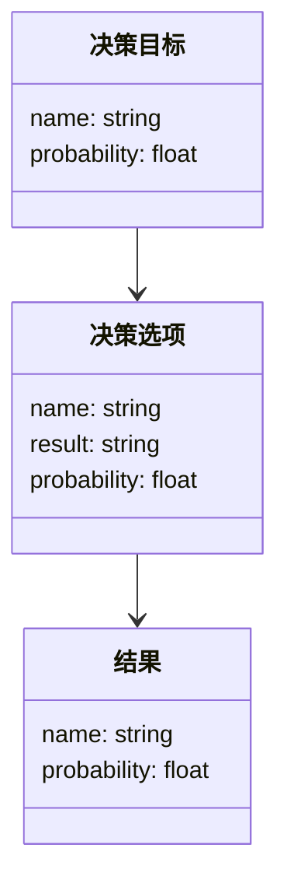
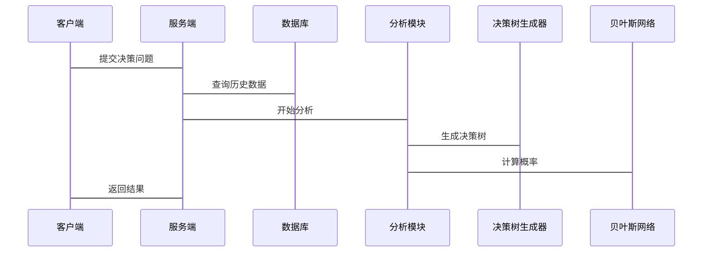

                 


# 芒格的"概率思维"：在不确定性中做出明智决策

---

## 关键词
- 芒格
- 概率思维
- 决策
- 不确定性
- 贝叶斯定理
- 决策树
- 系统分析

---

## 摘要
本文深入探讨了芒格的“概率思维”及其在不确定环境中的应用。通过分析概率思维的核心概念、工具和方法，结合实际案例，展示了如何利用概率思维在复杂决策中做出明智选择。文章涵盖了概率的基本概念、贝叶斯定理、决策树等工具的原理与应用，以及系统分析与架构设计。通过实际项目案例，进一步验证了概率思维在投资、管理和技术决策中的有效性，并总结了最佳实践和注意事项。

---

# 正文

---

## 第一部分: 芒格概率思维的背景与基础

### 第1章: 概率思维的定义与重要性

#### 1.1 概率思维的核心概念
概率思维是一种基于概率论的思维方式，它通过分析事件发生的可能性来帮助我们在不确定性中做出决策。概率思维的核心在于量化不确定性，通过概率分布和概率计算来评估不同选择的潜在结果。

##### 1.1.1 什么是概率思维
概率思维是一种通过概率计算和分析来评估决策的可能结果的方法。它不仅关注结果的绝对确定性，还关注结果发生的可能性。概率思维的关键在于将不确定性转化为可量化的信息，从而帮助我们做出更合理的决策。

##### 1.1.2 概率思维的定义与特点
概率思维的定义是：通过概率论的方法，分析事件发生的可能性，并基于这些可能性做出决策的过程。其特点包括：
- **量化不确定性**：将不确定性转化为可量化的概率值。
- **基于数据驱动**：依赖数据和事实进行分析，而非主观臆断。
- **动态调整**：通过贝叶斯定理等方法，不断更新概率值以反映新信息。

##### 1.1.3 概率思维在决策中的作用
概率思维在决策中的作用主要体现在以下几个方面：
1. **提高决策的准确性**：通过量化不确定性，概率思维能够帮助我们更准确地评估不同选择的结果。
2. **降低决策风险**：通过分析不同结果的可能性，概率思维能够帮助我们提前识别潜在风险，并制定应对策略。
3. **优化决策过程**：概率思维通过数据驱动的方法，能够优化决策过程，减少主观因素的干扰。

#### 1.2 芒格的概率思维思想
查理·芒格（Charlie Munger）是概率思维的杰出倡导者之一。他的概率思维思想深刻影响了投资、管理和决策领域。

##### 1.2.1 芒格的生平与思想体系
查理·芒格是美国著名投资者和伯克希尔·哈撒韦公司副董事长。他的思想体系以“多元思维模型”为核心，强调通过多个学科的交叉应用来分析问题。概率思维是其多元思维模型中的重要组成部分。

##### 1.2.2 芒格概率思维的核心观点
芒格的概率思维的核心观点包括：
- **概率是决策的基础**：芒格认为，概率是决策的核心工具，所有决策都应该基于概率分析。
- **关注大概率事件**：芒格强调，成功的决策往往源于对大概率事件的准确判断。
- **动态调整概率值**：芒格认为，概率值不是一成不变的，应该根据新信息不断调整。

##### 1.2.3 芒格概率思维的实践应用
芒格的概率思维在投资、管理和个人决策中得到了广泛应用。例如，在投资决策中，芒格通过分析公司的财务数据、市场趋势和管理层能力，评估投资成功的概率。

---

### 第2章: 概率思维与传统决策方法的对比

#### 2.1 传统决策方法的局限性
传统决策方法主要依赖于确定性和直观判断，这种方法在面对不确定性时往往显得力不从心。

##### 2.1.1 确定性决策的局限性
确定性决策假设所有信息都是确定的，这在现实中几乎不可能。例如，在投资决策中，市场波动和经济不确定性使得确定性决策难以实现。

##### 2.1.2 非概率决策的缺陷
非概率决策方法通常基于经验或直觉，缺乏数据支持。这种方法在面对复杂问题时，容易受到主观因素的干扰，导致决策失误。

##### 2.1.3 传统决策方法的适用场景
传统决策方法适用于信息充分、不确定性较低的场景。例如，在简单的日常决策中，传统方法仍然有效。

#### 2.2 概率思维的优势与适用场景
概率思维通过量化不确定性，能够更准确地评估决策的可能结果，特别适用于复杂和不确定的环境。

##### 2.2.1 概率思维的优势
- **量化不确定性**：概率思维将不确定性转化为可量化的信息，使决策更加科学。
- **动态调整**：概率值可以根据新信息进行动态调整，使决策更加灵活。
- **降低风险**：通过分析不同结果的可能性，概率思维能够帮助我们提前识别和规避风险。

##### 2.2.2 概率思维的适用场景
概率思维适用于信息不充分、不确定性较高的场景。例如，在投资、医疗诊断和风险管理等领域，概率思维具有重要应用。

---

## 第二部分: 概率思维的核心工具与方法

### 第3章: 概率的基本概念与计算方法

#### 3.1 概率的基本概念
概率的基本概念包括样本空间、事件和概率值。

##### 3.1.1 样本空间与事件
- **样本空间**：所有可能结果的集合。
- **事件**：样本空间中的一个子集，表示某个特定的结果或结果组合。

##### 3.1.2 概率的定义与计算公式
概率是事件发生的可能性，通常用数值在0到1之间表示。概率计算的公式为：
$$ P(A) = \frac{\text{事件A的可能结果数}}{\text{样本空间的总结果数}} $$

##### 3.1.3 概率的性质与基本规则
- **概率的加法规则**：多个互斥事件的概率之和不超过1。
- **条件概率**：在给定其他事件发生的条件下，某个事件发生的概率。

#### 3.2 概率计算的常用方法
概率计算的常用方法包括古典概率法、几何概率法和频率概率法。

##### 3.2.1 古典概率法
古典概率法适用于样本空间有限且每个结果等可能的情况。例如，掷骰子的概率计算。

##### 3.2.2 几何概率法
几何概率法适用于连续型概率分布的情况，例如投点试验。

##### 3.2.3 频率概率法
频率概率法通过大量重复试验，计算事件发生的频率作为概率值。

---

### 第4章: 贝叶斯定理与概率更新

#### 4.1 贝叶斯定理的原理
贝叶斯定理是一种用于更新概率的公式，其核心是根据新信息调整概率值。

##### 4.1.1 条件概率的定义
条件概率是指在给定其他事件发生的条件下，某个事件发生的概率，公式为：
$$ P(A|B) = \frac{P(A \cap B)}{P(B)} $$

##### 4.1.2 贝叶斯定理的公式
贝叶斯定理的公式为：
$$ P(A|B) = \frac{P(B|A) \cdot P(A)}{P(B)} $$

##### 4.1.3 贝叶斯定理的应用场景
贝叶斯定理广泛应用于医疗诊断、spam过滤和投资决策等领域。

#### 4.2 贝叶斯定理的实践应用
##### 4.2.1 贝叶斯定理的计算步骤
1. 确定先验概率：在没有新信息之前的概率。
2. 确定条件概率：新信息出现后，事件发生的条件概率。
3. 应用贝叶斯定理：计算后验概率。

##### 4.2.2 贝叶斯定理的实例分析
例如，在医疗诊断中，可以通过贝叶斯定理计算在出现某种症状的情况下，患病的概率。

##### 4.2.3 贝叶斯定理的优缺点
- **优点**：能够根据新信息动态调整概率值，提高决策的准确性。
- **缺点**：需要准确的条件概率数据，否则可能导致错误结论。

---

### 第5章: 决策树与概率决策工具

#### 5.1 决策树的基本概念
决策树是一种用于表示决策过程的树状图，节点表示决策点，分支表示可能的结果。

##### 5.1.1 决策树的定义
决策树是一种树状结构，用于表示决策过程中的各个可能结果和对应的概率。

##### 5.1.2 决策树的结构与组成部分
- **决策节点**：表示决策点。
- **结果节点**：表示可能的结果及其概率。
- **分支**：表示从决策节点到结果节点的路径。

##### 5.1.3 决策树的绘制方法
绘制决策树的方法包括：
1. 确定决策目标。
2. 列举所有可能的决策选项。
3. 分析每个决策选项的结果及其概率。

#### 5.2 决策树在概率决策中的应用
##### 5.2.1 决策树的构建步骤
1. 确定决策问题。
2. 列举所有可能的决策选项。
3. 分析每个决策选项的结果及其概率。
4. 计算每个结果的期望值。
5. 选择期望值最大的决策选项。

##### 5.2.2 决策树的分析方法
通过计算每个结果的期望值，选择期望值最大的决策选项。

##### 5.2.3 决策树的实例分析
例如，在投资决策中，可以通过决策树分析不同投资方案的期望收益，选择最优方案。

---

## 第三部分: 概率思维的系统分析与架构设计

### 第6章: 系统分析与架构设计方案

#### 6.1 问题场景介绍
在不确定环境中，如何利用概率思维构建一个高效的决策支持系统？

#### 6.2 系统功能设计
##### 6.2.1 领域模型
领域模型是系统的核心概念框架，包括决策目标、决策选项、结果及其概率。

##### 6.2.2 领域模型的Mermaid类图


#### 6.3 系统架构设计
##### 6.3.1 系统架构的Mermaid架构图


#### 6.4 系统接口设计
##### 6.4.1 系统接口的Mermaid序列图


---

## 第四部分: 项目实战

### 第7章: 项目实战

#### 7.1 环境安装
需要安装Python、numpy、pandas、scikit-learn等库。

#### 7.2 系统核心实现源代码
##### 7.2.1 贝叶斯定理的Python实现
```python
def bayes_theorem(P_B_given_A, P_A, P_B):
    return (P_B_given_A * P_A) / P_B
```

##### 7.2.2 决策树的Python实现
```python
from sklearn.tree import DecisionTreeClassifier
from sklearn.datasets import make_classification
from sklearn.model_selection import train_test_split
from sklearn.metrics import accuracy_score

X, y = make_classification(n_samples=100, n_features=2, n_classes=2)
X_train, X_test, y_train, y_test = train_test_split(X, y, test_size=0.2)
clf = DecisionTreeClassifier()
clf.fit(X_train, y_train)
y_pred = clf.predict(X_test)
print("Accuracy:", accuracy_score(y_test, y_pred))
```

#### 7.3 代码应用解读与分析
通过上述代码，我们可以实现贝叶斯定理和决策树的计算，并验证其在实际问题中的应用效果。

#### 7.4 案例分析与详细讲解剖析
以投资决策为例，通过概率思维分析不同投资方案的期望收益，选择最优方案。

#### 7.5 项目小结
本项目通过实际案例，验证了概率思维在投资决策中的有效性，并展示了如何利用Python和机器学习工具实现概率计算和决策分析。

---

## 第五部分: 最佳实践与总结

### 第8章: 最佳实践

#### 8.1 关键点总结
概率思维的关键点包括：
1. 量化不确定性。
2. 动态调整概率值。
3. 综合考虑多种因素。

#### 8.2 小结
通过本文的探讨，我们可以看到，概率思维是一种强大的工具，能够帮助我们在不确定环境中做出明智决策。

#### 8.3 注意事项
- **数据质量**：概率计算依赖于高质量的数据。
- **模型假设**：概率模型的假设需要合理。
- **动态调整**：概率值需要根据新信息动态调整。

#### 8.4 拓展阅读
推荐阅读《概率论与数理统计》和《贝叶斯方法：概率编程与统计推断》等书籍。

---

## 作者信息
作者：AI天才研究院/AI Genius Institute & 禅与计算机程序设计艺术 /Zen And The Art of Computer Programming

