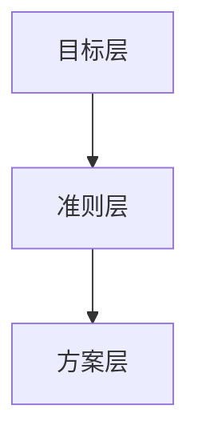
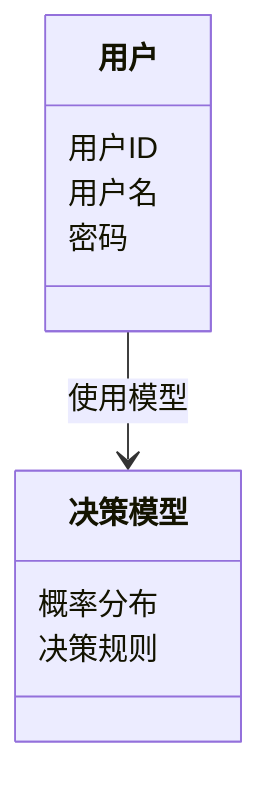
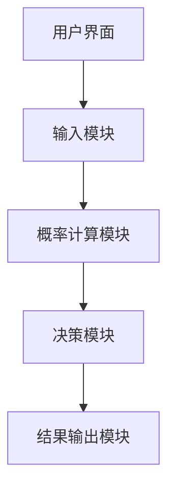

                 


# 芒格的"概率思维"：在不确定性中做出最优决策

> 关键词：芒格，概率思维，决策优化，贝叶斯定理，不确定性决策

> 摘要：芒格的概率思维是一种在不确定性中做出最优决策的哲学和数学方法。本文从概率思维的背景、核心概念、算法原理、系统架构、项目实战到最佳实践，全面解析芒格的概率思维，并结合实际案例，深入探讨如何在复杂决策中应用概率思维，帮助读者在不确定性中做出更明智的决策。

---

## 第一部分: 芒格的概率思维背景与基础

### 第1章: 概率思维的起源与芒格思想

#### 1.1 概率思维的起源

概率思维是一种通过分析随机事件的可能性来做出决策的方法。它的起源可以追溯到17世纪，当时数学家如帕斯卡和费马开始研究概率论的基本原理。芒格将概率思维引入决策科学，提出了著名的“芒格决策框架”，强调在不确定性中利用概率思维进行决策优化。

**关键概念**：
- **概率论**：研究随机事件发生可能性的数学理论。
- **不确定性**：决策过程中存在无法完全预测的因素。

#### 1.2 芒格的概率思维思想

芒格的概率思维思想强调在决策中考虑所有可能的因素，并通过概率分析来评估每种选择的可能结果。他的决策框架包括以下几个核心要素：
- **内部决策变量**：决策者可以控制的因素。
- **外部环境变量**：决策者无法控制的因素。
- **概率期望值**：每种可能结果的概率加权平均值。

**公式**：
$$ P(\text{期望值}) = \sum P(\text{结果}) \times \text{结果值} $$

#### 1.3 概率思维在决策中的应用

概率思维可以帮助决策者在面对不确定性时，通过量化分析来优化决策。例如，在金融投资中，概率思维可以用于评估不同投资组合的风险和收益。

---

### 第2章: 芒格概率思维的核心概念

#### 2.1 概率的基本原理

概率的基本原理包括以下几点：
- **概率的定义**：随机事件发生可能性的度量，范围在0到1之间。
- **条件概率**：在已知某些条件下，事件发生的概率。
- **独立事件**：两个事件的发生互不影响。

**公式**：
$$ P(A \cap B) = P(A) \times P(B) \quad \text{（独立事件）} $$

#### 2.2 芒格决策框架

芒格决策框架是一个层次化的决策模型，包括以下几个层次：
1. **目标层**：决策的最终目标。
2. **准则层**：实现目标的准则。
3. **方案层**：实现准则的具体方案。

**示意图**：


#### 2.3 概率思维与决策的关系

概率思维通过量化分析，帮助决策者在不确定性中找到最优解。例如，在医疗诊断中，概率思维可以帮助医生评估不同诊断方案的准确性和风险。

---

## 第二部分: 概率思维的核心算法与数学模型

### 第3章: 贝叶斯定理与概率推理

#### 3.1 贝叶斯定理的原理

贝叶斯定理是一种基于条件概率的推理方法，其公式如下：

$$ P(A|B) = \frac{P(B|A) \times P(A)}{P(B)} $$

其中：
- \( P(A|B) \)：在事件B发生的条件下，事件A发生的概率。
- \( P(B|A) \)：在事件A发生的条件下，事件B发生的概率。
- \( P(A) \) 和 \( P(B) \)：事件A和事件B的先验概率。

#### 3.2 贝叶斯定理的应用

**案例分析**：假设某疾病在人群中的发病率是1%，检测该疾病的试剂的准确率为99%，但假阳性率为5%。如果一个人测试呈阳性，他实际患病的概率是多少？

**计算步骤**：
1. 发病率 \( P(A) = 0.01 \)。
2. 检测的真阳性率 \( P(B|A) = 0.99 \)。
3. 假阳性率 \( P(B|\neg A) = 0.05 \)。
4. 总体阳性率 \( P(B) = P(B|A)P(A) + P(B|\neg A)P(\neg A) = 0.99 \times 0.01 + 0.05 \times 0.99 = 0.0099 + 0.0495 = 0.0594 \)。
5. 计算 \( P(A|B) = \frac{0.99 \times 0.01}{0.0594} \approx 0.1667 \)。

因此，测试呈阳性的人实际患病的概率约为16.67%。

---

### 第4章: 概率期望值与决策优化

#### 4.1 概率期望值的计算

概率期望值是所有可能结果的加权平均值，公式如下：

$$ E = \sum P_i \times V_i $$

其中：
- \( P_i \)：第i个结果的概率。
- \( V_i \)：第i个结果的值。

#### 4.2 决策树与概率优化

决策树是一种用于描述决策过程的树状图，结合概率分析可以优化决策路径。

**案例分析**：假设一个公司考虑推出新产品，有两种选择：
1. **快速推出**：成功概率为70%，利润为100万。
2. **谨慎推出**：成功概率为50%，利润为150万。

**计算期望值**：
- 快速推出的期望值 \( E_1 = 0.7 \times 100 + 0.3 \times (-50) = 70 - 15 = 55 \) 万。
- 谨慎推出的期望值 \( E_2 = 0.5 \times 150 + 0.5 \times (-75) = 75 - 37.5 = 37.5 \) 万。

因此，快速推出更具期望值优势。

---

## 第三部分: 概率思维的系统分析与架构设计

### 第5章: 系统功能设计

#### 5.1 领域模型

领域模型是系统设计的核心，展示了系统的实体及其关系。以下是一个简单的领域模型类图：



#### 5.2 系统架构设计

系统架构设计展示了系统的模块化结构。以下是一个基于概率思维的决策系统的架构图：



---

## 第四部分: 项目实战与最佳实践

### 第6章: 项目实战

#### 6.1 环境安装

安装必要的Python库：
```bash
pip install numpy matplotlib
```

#### 6.2 核心实现代码

```python
import numpy as np
import matplotlib.pyplot as plt

# 示例：计算掷骰子的期望值
def calculate_expected_value(sides):
    probabilities = np.array([1/6] * sides)
    values = np.arange(1, sides+1)
    expected_value = np.sum(probabilities * values)
    return expected_value

sides = 6
print(f"期望值为：{calculate_expected_value(sides)}")
```

#### 6.3 案例分析

假设我们掷一个公平的六面骰子，计算其期望值：
$$ E = \frac{1 + 2 + 3 + 4 + 5 + 6}{6} = 3.5 $$

---

### 第7章: 最佳实践与小结

#### 7.1 关键要点

- **数据质量**：概率分析依赖于数据的准确性和完整性。
- **模型选择**：选择合适的概率模型可以提高决策的准确性。
- **可解释性**：概率模型的可解释性对实际应用至关重要。

#### 7.2 注意事项

- **避免过度依赖概率**：概率只是工具，不能完全替代人类的判断。
- **动态调整**：根据实际情况动态调整概率模型。

#### 7.3 拓展阅读

- 《概率论与数理统计》
- 《贝叶斯方法：概率编程与图形模型导引》

---

## 作者：AI天才研究院 & 禅与计算机程序设计艺术

本文作者：AI天才研究院（AI Genius Institute）和“禅与计算机程序设计艺术”（Zen And The Art of Computer Programming）联合团队。我们致力于将人工智能与计算机科学的深刻洞见分享给全球读者，帮助您在复杂决策中找到最优解。

---

**感谢您的阅读！希望本文能帮助您更好地理解和应用芒格的概率思维，在不确定性中做出更明智的决策。**

