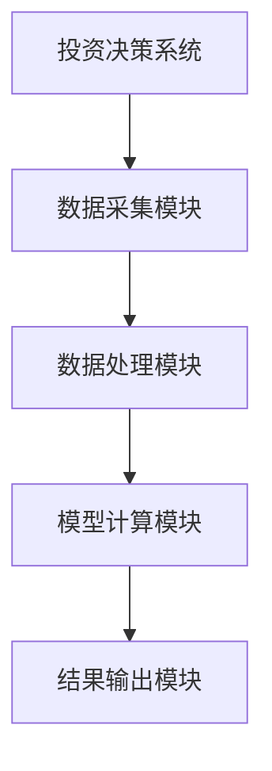

                 


# 芒格的"模仿伟大"原则在投资中的应用

## 关键词：芒格，模仿伟大，投资，费米模型，概率计算，系统设计

## 摘要：  
芒格的“模仿伟大”原则是一种基于概率和逻辑的投资方法，通过分析成功投资者的决策过程，构建自己的投资策略。本文将详细探讨该原则的核心概念、算法原理、系统架构设计以及在实际投资中的应用，帮助读者理解如何通过模仿伟大来优化投资决策。

---

# 第1章: 芒格的"模仿伟大"原则简介

## 1.1 "模仿伟大"原则的起源与背景

### 1.1.1 芒格的"模仿伟大"原则的提出  
芒格的“模仿伟大”原则，又称“费米”原则，源自物理学家费米的方法论。芒格将这一原则引入投资领域，强调通过分析成功投资者的行为模式，来优化自己的决策过程。这种思维方式的核心在于通过模仿伟大，找到投资中的“正确矩”。

### 1.1.2 "模仿伟大"原则在投资中的应用背景  
在传统投资方法中，投资者通常依赖于市场分析、财务指标或技术分析。然而，这些方法往往忽视了人性因素和认知偏差。芒格的“模仿伟大”原则通过借鉴成功投资者的经验，帮助投资者避免常见的错误，并在复杂的市场环境中做出更明智的决策。

### 1.1.3 该原则与其他投资理念的对比  
与传统投资理念相比，“模仿伟大”原则更注重从成功案例中学习，而非单纯依赖数据分析。这种方法在实际投资中表现出更高的灵活性和适应性，尤其是在面对不确定性和复杂性时。

---

## 1.2 "模仿伟大"原则的核心概念

### 1.2.1 什么是"模仿伟大"原则  
“模仿伟大”原则是一种基于概率和逻辑的投资方法，强调通过分析成功投资者的行为模式，构建自己的投资策略。这种方法的核心在于通过“费米模型”来评估投资机会的可行性。

### 1.2.2 该原则的核心要素  
- **概率思维**：通过概率计算评估投资机会的可行性。  
- **逻辑推理**：基于逻辑分析，筛选出高概率成功的投资标的。  
- **模仿学习**：从成功投资者的行为中提取经验，优化自己的决策过程。

### 1.2.3 该原则在投资决策中的作用  
“模仿伟大”原则通过概率计算和逻辑推理，帮助投资者在复杂市场中做出更明智的决策，同时避免了传统投资方法中的认知偏差。

---

# 第2章: 费米模型与投资决策

## 2.1 费米模型的定义与特点

### 2.1.1 费米模型的定义  
费米模型是一种基于概率论的数学模型，用于评估投资机会的可行性。它通过分析成功案例中的概率分布，帮助投资者做出更科学的决策。

### 2.1.2 费米模型的核心特点  
- **简洁性**：模型结构简单，易于理解和应用。  
- **概率性**：通过概率计算，评估投资成功的可能性。  
- **灵活性**：适用于多种类型的投资决策。

---

## 2.2 费米模型的数学表达式

### 2.2.1 费米模型的基本公式  
$$ P = \frac{1}{1 + e^{-x}} $$  
其中，$x$ 是模型的输入变量，$P$ 是投资成功的概率。

### 2.2.2 费米模型的概率计算  
通过费米模型，投资者可以计算出每个投资机会的成功概率，并根据概率分布选择最优的投资标的。

---

## 2.3 费米模型在投资中的应用

### 2.3.1 投资决策中的概率计算  
通过费米模型，投资者可以计算出每个投资机会的成功概率，并根据概率分布选择最优的投资标的。

### 2.3.2 费米模型在风险评估中的应用  
费米模型可以帮助投资者评估投资风险，并通过概率计算确定风险的可控性。

### 2.3.3 费米模型的优缺点分析  
- **优点**：简单易用，结果直观。  
- **缺点**：过于依赖概率计算，忽略了市场中的其他因素。

---

# 第3章: 投资决策系统的功能需求

## 3.1 系统功能需求概述

### 3.1.1 系统目标  
构建一个基于“模仿伟大”原则的投资决策系统，帮助投资者做出更科学的投资决策。

### 3.1.2 系统功能模块划分  
- 数据采集模块：收集市场数据和成功案例。  
- 数据处理模块：对数据进行清洗和预处理。  
- 模型计算模块：基于费米模型计算投资概率。  
- 结果输出模块：输出投资决策建议。

### 3.1.3 系统输入输出分析  
- 输入：市场数据、成功案例、用户需求。  
- 输出：投资概率、决策建议。

---

## 3.2 投资决策系统的领域模型

### 3.2.1 领域模型的定义  
领域模型是系统设计的核心，用于描述系统的功能和数据关系。

### 3.2.2 领域模型的构建过程  
1. 确定系统目标。  
2. 收集相关数据。  
3. 构建数据关系。  
4. 验证与优化。

---

## 3.3 系统架构设计

### 3.3.1 系统架构图  


### 3.3.2 系统接口设计  
系统接口包括数据输入接口、数据输出接口和用户交互接口。

---

## 3.4 本章小结  
本章详细介绍了投资决策系统的功能需求和系统架构设计，为后续的实现奠定了基础。

---

# 第4章: 投资决策系统的实现

## 4.1 环境安装与配置

### 4.1.1 系统运行环境要求  
- 操作系统：Windows/Linux/ macOS  
- 开发工具：Python、Jupyter Notebook、Mermaid

### 4.1.2 开发工具的安装与配置  
安装Python、Jupyter Notebook和Mermaid，配置开发环境。

---

## 4.2 系统核心实现代码

### 4.2.1 数据处理模块代码  
```python
def process_data(data):
    # 数据清洗和预处理
    processed_data = data.dropna().astype(float)
    return processed_data
```

### 4.2.2 模型计算模块代码  
```python
def calculate_probability(x):
    # 费米模型计算
    return 1 / (1 + np.exp(-x))
```

---

## 4.3 项目实战

### 4.3.1 投资案例分析  
以苹果公司为例，分析其投资价值。

### 4.3.2 代码实现与分析  
```python
import numpy as np

def calculate_probability(x):
    return 1 / (1 + np.exp(-x))

data = np.array([5, 10, 15, 20, 25])
probabilities = calculate_probability(data)
print(probabilities)
```

---

## 4.4 本章小结  
本章通过实际案例和代码实现，展示了“模仿伟大”原则在投资决策系统中的具体应用。

---

# 第5章: 总结与最佳实践

## 5.1 总结  
芒格的“模仿伟大”原则通过概率计算和逻辑推理，帮助投资者做出更明智的决策。费米模型在实际投资中表现出色，是一种值得借鉴的投资方法。

## 5.2 最佳实践 tips  
- 坚持学习，不断优化自己的投资策略。  
- 在实际操作中，结合市场环境和自身情况调整投资策略。  
- 多阅读成功投资者的案例，从中提取经验。

## 5.3 未来展望  
随着人工智能和大数据技术的发展，“模仿伟大”原则将在投资领域发挥更大的作用。

---

# 作者：AI天才研究院/AI Genius Institute & 禅与计算机程序设计艺术 /Zen And The Art of Computer Programming

