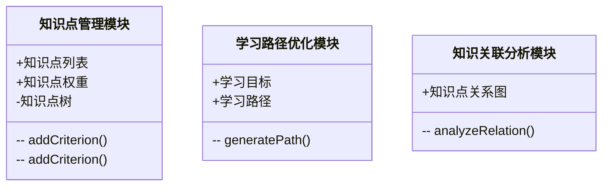

                 


# 芒格的"深度优先"学习在人工智能时代的重要性

---

## 关键词：
- 深度优先学习
- 人工智能
- 学习方法
- 系统性学习
- 知识关联性

---

## 摘要：
芒格的“深度优先”学习方法在人工智能时代的重要性日益凸显。随着技术的快速发展，传统的浅层学习方式已无法满足现代知识体系的需求。深度优先学习通过强调知识点的深度挖掘和系统性关联，帮助学习者构建稳固的知识网络。本文从背景、原理、算法、系统设计、项目实战等多个维度，详细阐述深度优先学习的核心理念及其在人工智能领域的应用价值。

---

## 第1章：深度优先学习的背景与核心概念

### 1.1 深度优先学习的定义与背景
深度优先学习（Depth-First Learning）是一种以知识点的深度挖掘为核心的学习方法，强调通过层层递进的方式，深入理解和掌握某一领域的核心概念。与传统学习方法相比，深度优先学习更加注重知识的系统性和关联性，特别适用于复杂知识体系的学习。

#### 1.1.1 学习方法的演进历程
- 从孤立知识点的学习到系统性学习的转变。
- 从记忆导向到理解导向的学习模式升级。
- AI时代对知识体系化的更高要求。

#### 1.1.2 芒格的贡献
- 提出深度优先学习的理念，强调知识的深度挖掘和关联性。
- 强调学习的系统性和结构性，避免碎片化学习。

#### 1.1.3 人工智能时代的学习革命
- AI技术的快速发展对学习方法提出更高要求。
- 深度优先学习在知识管理中的重要性。

---

### 1.2 深度优先学习的核心理念
深度优先学习的核心在于通过层层递进的方式，深入理解知识点之间的关联性，构建稳固的知识网络。

#### 1.2.1 知识的深度挖掘与关联性
- 深度优先学习注重知识点之间的联系，而非孤立的知识点。
- 通过层层递进的方式，帮助学习者建立知识网络。

#### 1.2.2 学习的系统性与结构性
- 系统性学习：将知识点整合为完整的知识体系。
- 结构化学习：通过层级结构，明确知识的逻辑关系。

#### 1.2.3 芒格方法在AI时代的适用性
- AI时代的知识体系更加复杂，深度优先学习更适合处理复杂问题。
- 强调系统性思考和关联性分析，符合AI技术的特点。

---

## 第2章：深度优先学习的核心概念与原理

### 2.1 深度优先学习的核心概念
深度优先学习的核心概念包括知识点的树状结构、层级关系和学习路径的优化。

#### 2.1.1 知识点的树状结构
- 树状结构：将知识点视为树的节点，通过层级结构展示知识的关联性。
- 示例：将“人工智能”作为一个根节点，其子节点包括“机器学习”、“深度学习”、“自然语言处理”等。

#### 2.1.2 层级关系
- 知识点的层级划分：从基础概念到高级应用。
- 示例：从“编程基础”到“算法优化”，层层递进。

#### 2.1.3 学习路径的优化
- 通过深度优先搜索算法，优化学习路径。
- 示例：优先选择核心知识点，逐步扩展相关知识。

---

### 2.2 深度优先学习的对比分析
深度优先学习与其他学习方法的对比，帮助读者更好地理解其优势。

#### 2.2.1 深度优先与广度优先的对比
- 深度优先：注重知识的深度挖掘，适合复杂问题。
- 广度优先：注重知识的广度覆盖，适合基础学习。
- 示例：解决复杂算法问题时，深度优先更有效。

#### 2.2.2 AI时代学习方法的演变
- 从单一知识点学习到知识体系构建的转变。
- 深度优先学习在AI技术中的应用。

#### 2.2.3 芒格方法与其他学习方法的异同
- 相同点：注重系统性思考和知识关联。
- 不同点：深度优先学习更强调知识的深度挖掘。

---

## 第3章：深度优先学习的算法原理与数学模型

### 3.1 深度优先学习的算法原理
深度优先学习的核心算法是深度优先搜索（DFS），通过递归或栈实现知识点的层层挖掘。

#### 3.1.1 算法的实现步骤
- 初始化知识点根节点。
- 选择当前节点的子知识点，递归遍历。
- 回溯，处理其他知识点。

#### 3.1.2 算法的数学模型与公式
- 知识点的权重计算公式：
  $$ \text{权重} = \sum_{i=1}^{n} w_i $$
  其中，\( w_i \) 是各个知识点的权重。

- 学习路径的优化公式：
  $$ \text{路径长度} = \sum_{i=1}^{m} l_i $$
  其中，\( l_i \) 是各个路径的长度。

#### 3.1.3 算法的优化与改进
- 剪枝策略：避免无效知识点的深入。
- 优先级排序：根据知识点的重要性调整搜索顺序。

---

### 3.2 算法的代码实现
以下是一个简单的深度优先搜索算法的Python代码示例：

```python
def depth_first_search(node):
    stack = [(node, False)]  # 栈结构，False表示未访问
    while stack:
        current, visited = stack.pop()
        if visited:
            # 处理当前节点
            print(f"Visiting {current}")
        else:
            stack.append((current, True))
            # 将子节点按顺序压入栈
            for child in current.children:
                stack.append((child, False))
```

---

## 第4章：深度优先学习的系统分析与架构设计

### 4.1 问题场景的系统分析
深度优先学习系统的目标是帮助学习者构建知识网络，优化学习路径。

#### 4.1.1 系统目标
- 提供知识点的树状结构展示。
- 优化学习路径，提高学习效率。
- 支持知识的关联性分析。

#### 4.1.2 系统的输入与输出
- 输入：学习目标、知识点列表。
- 输出：优化后的学习路径、知识点权重。

---

### 4.2 系统功能设计
深度优先学习系统的功能模块包括知识管理、学习路径优化、知识关联分析等。

#### 4.2.1 系统功能模块划分
- 知识管理模块：知识点的录入、编辑、删除。
- 学习路径优化模块：根据知识点权重，生成最优学习路径。
- 知识关联分析模块：分析知识点之间的关联性。

#### 4.2.2 系统功能的领域模型


---

## 第5章：深度优先学习的项目实战

### 5.1 项目背景与目标
- 项目背景：构建一个基于深度优先学习的知识管理系统。
- 项目目标：优化学习路径，提高学习效率。

---

## 第6章：深度优先学习的最佳实践与小结

### 6.1 最佳实践
- 学习方法的选择：根据学习目标选择合适的学习方法。
- 系统优化：定期更新知识点，优化学习路径。
- 注意事项：避免知识点的过度深入，保持知识的广度和深度的平衡。

### 6.2 小结
深度优先学习是一种高效的知识学习方法，特别适用于复杂知识体系的学习。在人工智能时代，深度优先学习的重要性更加凸显，帮助学习者构建稳固的知识网络。

---

## 作者：
作者：AI天才研究院 & 禅与计算机程序设计艺术

---

**本文通过详细阐述芒格的“深度优先”学习方法，结合人工智能时代的背景，分析了其在知识管理、学习路径优化等方面的重要作用，为学习者提供了一种高效的知识学习方式。**

