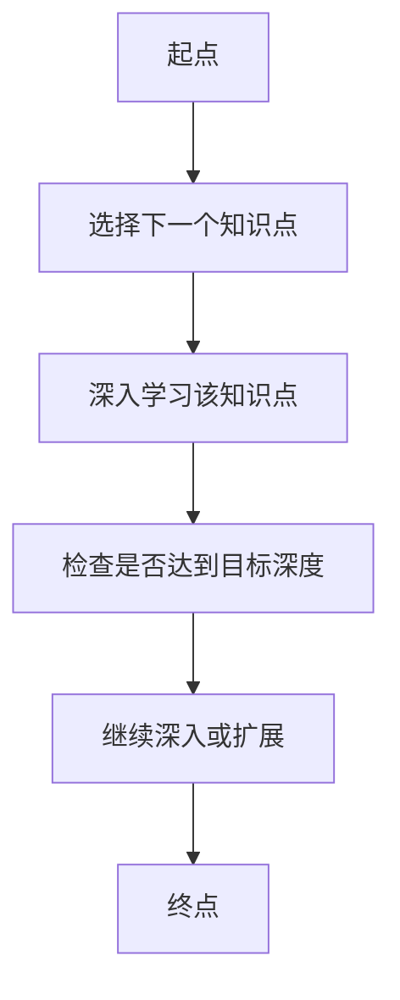
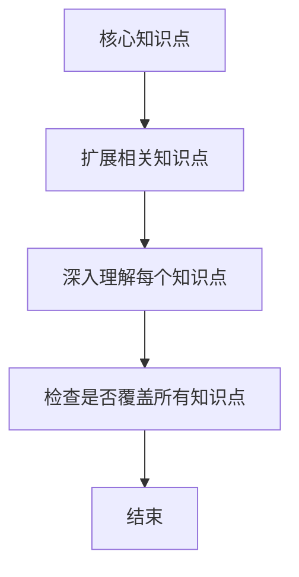
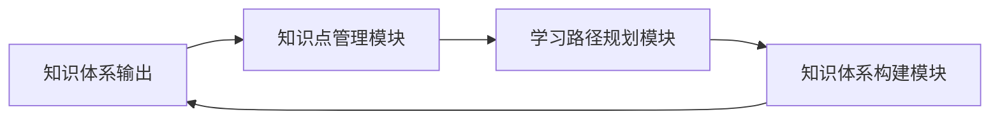

                 


# 芒格的"深度优先"学习在快速迭代技术环境中的重要性

## 关键词：
深度优先学习, 技术快速迭代, 知识体系构建, 系统架构设计, 算法实现, 技术环境

## 摘要：
在技术快速迭代的今天，传统的学习方法往往难以跟上技术的发展步伐。芒格的"深度优先"学习方法强调深入理解核心概念，建立系统的知识体系，这在快速迭代的技术环境中尤为重要。本文将从深度优先学习的起源、核心概念、算法实现、系统架构设计以及项目实战等方面，全面解析其在技术环境中的重要性，并通过实际案例展示其应用价值。

---

# 第一部分: 芒格"深度优先"学习的背景与核心概念

## 第1章: 深度优先学习的起源与发展

### 1.1 芒格的学习理念

#### 1.1.1 芒格的"深度优先"学习方法
芒格的"深度优先"学习方法源于他对知识的深刻理解和对效率的追求。这种方法强调在学习过程中，优先选择一个核心领域进行深入研究，而不是广泛涉猎多个领域。通过这种方式，学习者能够建立坚实的知识基础，并在快速迭代的技术环境中保持竞争力。

#### 1.1.2 芒格学习方法的哲学基础
芒格的哲学思想强调"知识的深度"而非"知识的广度"。他认为，只有通过深入理解核心概念，才能在复杂的环境中做出明智的决策。这种思想在技术领域尤为重要，因为技术的快速变化要求学习者具备扎实的基础和灵活的应对能力。

#### 1.1.3 "深度优先"与"广度优先"的对比
传统的"广度优先"学习方法注重广泛涉猎多个领域，适合快速了解技术的整体框架。然而，在技术快速迭代的环境中，这种方法往往难以应对复杂的技术挑战。相比之下，"深度优先"学习方法注重在一个领域内深入挖掘，建立坚实的知识体系，从而在技术变化中保持优势。

### 1.2 技术快速迭代环境下的学习挑战

#### 1.2.1 技术快速迭代的现状
当前，技术的发展速度空前加快，新技术、新工具层出不穷。在这种环境下，技术从业者需要不断更新知识储备，以应对新的挑战。然而，传统的学习方法往往难以满足这种需求。

#### 1.2.2 学习者面临的挑战
学习者在技术快速迭代的环境中面临以下挑战：
- **知识更新速度快**：新技术的出现要求学习者不断调整学习方向。
- **知识体系不系统**：零散的知识点难以形成有效的知识体系，影响实际应用。
- **学习效率低下**：传统学习方法可能导致学习效率低下，难以跟上技术发展的步伐。

#### 1.2.3 "深度优先"学习的优势
"深度优先"学习方法在技术快速迭代的环境中具有显著优势：
- **知识体系的深度构建**：通过深入理解核心概念，形成坚实的知识基础。
- **快速适应能力**：在技术变化时，能够基于已有知识体系快速调整。
- **提高学习效率**：通过系统化的学习方法，减少无效学习时间。

## 第2章: "深度优先"学习的核心概念

### 2.1 深度优先学习的定义与特点

#### 2.1.1 深度优先学习的定义
深度优先学习是一种以核心概念为中心的学习方法。它强调通过深入理解一个领域，逐步扩展相关知识，形成系统化的知识体系。

#### 2.1.2 深度优先学习的核心特点
- **核心导向**：以核心概念为起点，逐步扩展相关知识。
- **系统化构建**：注重知识之间的关联性，形成系统化的知识体系。
- **深度挖掘**：深入理解每个知识点，确保掌握其本质。

#### 2.1.3 深度优先学习与其他学习方法的对比
| 学习方法 | 核心理念 | 优点 | 缺点 |
|----------|----------|------|------|
| 广度优先 | 广泛涉猎 | 快速了解整体框架 | 知识点分散，难以深入 |
| 深度优先 | 深入核心 | 知识体系扎实 | 短期见效慢 |

### 2.2 深度优先学习的知识体系构建

#### 2.2.1 知识体系的结构化
知识体系的结构化是深度优先学习的核心步骤。通过将知识点按照逻辑关系进行分类，形成层次分明的知识框架。

#### 2.2.2 核心概念的深度挖掘
核心概念的深度挖掘是建立知识体系的关键。通过反复思考和实践，确保对每个核心概念有透彻的理解。

#### 2.2.3 知识体系的动态更新
知识体系的动态更新是适应技术变化的重要手段。随着新技术的出现，及时调整知识体系，确保其与实际需求保持一致。

---

## 第3章: 深度优先学习的数学模型与算法

### 3.1 图论中的深度优先搜索

#### 3.1.1 图的表示与遍历
图的表示通常采用邻接矩阵或邻接表。深度优先搜索（DFS）是一种常见的图遍历算法，适用于寻找路径或检测环路。

#### 3.1.2 深度优先搜索算法
深度优先搜索算法的基本思想是：从起点开始，尽可能深入地访问每个节点，直到无法深入为止，然后回溯。

#### 3.1.3 深度优先搜索的应用场景
深度优先搜索适用于以下场景：
- 寻找路径：如迷宫中的路径寻找。
- 检测环路：在有向图中检测是否存在环路。

#### 3.1.4 深度优先搜索的mermaid流程图


### 3.2 深度优先学习的算法实现

#### 3.2.1 算法原理
深度优先学习的算法原理类似于图的深度优先搜索。通过选择一个核心知识点，逐步扩展相关知识点，形成知识体系。

#### 3.2.2 算法流程图


#### 3.2.3 Python代码实现
```python
def depth_first_search(start_node):
    visited = set()
    stack = [start_node]
    while stack:
        node = stack.pop()
        if node not in visited:
            visited.add(node)
            for neighbor in graph[node]:
                if neighbor not in visited:
                    stack.append(neighbor)
    return visited
```

### 3.3 数学模型与公式

#### 3.3.1 知识体系构建的数学模型
$$ 知识体系深度 = \sum_{i=1}^{n} \text{知识点}_i \times \text{深度权重}_i $$

#### 3.3.2 知识点关联度计算公式
$$ \text{关联度}(A,B) = \frac{\text{共同知识点数}}{\sqrt{\text{知识点A总数} \times \text{知识点B总数}}} $$

---

## 第4章: 深度优先学习的系统架构设计

### 4.1 系统功能设计

#### 4.1.1 系统目标
系统的目标是通过深度优先学习方法，帮助学习者建立系统化的知识体系，并在快速迭代的环境中保持竞争力。

#### 4.1.2 系统核心功能模块
- 知识点管理模块：用于管理和分类知识点。
- 学习路径规划模块：根据学习目标，制定学习路径。
- 知识体系构建模块：通过深度优先方法，构建知识体系。

#### 4.1.3 系统交互流程
学习者通过选择核心知识点，逐步扩展相关知识点，最终形成系统化的知识体系。

### 4.2 系统架构设计

#### 4.2.1 系统架构图


#### 4.2.2 模块交互设计
- 学习者选择核心知识点，发送给知识点管理模块。
- 知识点管理模块将知识点分类，并传递给学习路径规划模块。
- 学习路径规划模块制定学习路径，并传递给知识体系构建模块。
- 知识体系构建模块生成知识体系，并返回给学习者。

---

## 第5章: 深度优先学习的项目实战

### 5.1 项目背景与目标

#### 5.1.1 项目背景
在快速迭代的技术环境中，学习者需要通过深度优先学习方法，快速掌握核心技术。

#### 5.1.2 项目目标
构建一个基于深度优先学习的知识管理系统，帮助学习者建立系统化的知识体系。

### 5.2 环境配置与代码实现

#### 5.2.1 环境配置
- 操作系统：Windows 10 或 macOS
- 开发工具：Python 3.8+，Jupyter Notebook
- 第三方库：networkx、matplotlib

#### 5.2.2 知识点管理模块实现
```python
import networkx as nx
from matplotlib import pyplot as plt

def build_knowledge_graph(node_list, edge_list):
    G = nx.DiGraph()
    G.add_nodes_from(node_list)
    G.add_edges_from(edge_list)
    return G

def visualize_graph(G):
    nx.draw(G, node_color='red', edge_color='blue', with_labels=True)
    plt.show()

node_list = ['知识点1', '知识点2', '知识点3']
edge_list = [('知识点1', '知识点2'), ('知识点2', '知识点3')]
G = build_knowledge_graph(node_list, edge_list)
visualize_graph(G)
```

#### 5.2.3 学习路径规划模块实现
```python
def plan_learning_path(start_node, target_node, G):
    visited = {}
    stack = [(start_node, [])]
    while stack:
        node, path = stack.pop()
        if node not in visited:
            visited[node] = path
            if node == target_node:
                return path + [node]
            for neighbor in G.neighbors(node):
                new_path = path + [node]
                stack.append((neighbor, new_path))
    return None

learning_path = plan_learning_path('知识点1', '知识点3', G)
print(learning_path)
```

---

## 第6章: 总结与最佳实践

### 6.1 总结
芒格的"深度优先"学习方法在快速迭代的技术环境中具有重要价值。通过深入理解核心概念，建立系统化的知识体系，学习者能够更好地应对技术变化，提高学习效率。

### 6.2 最佳实践

#### 6.2.1 小结
- 选择一个核心领域进行深入学习。
- 建立系统化的知识体系。
- 定期更新知识体系，适应技术变化。

#### 6.2.2 注意事项
- 避免过于追求深度，忽略广度。
- 确保学习内容与实际需求结合。
- 定期回顾和调整学习计划。

#### 6.2.3 拓展阅读
- 《深度优先搜索算法》
- 《知识管理与知识体系构建》
- 《技术快速迭代环境下的学习策略》

---

## 作者：AI天才研究院/AI Genius Institute & 禅与计算机程序设计艺术 /Zen And The Art of Computer Programming

---

希望这篇文章能够为您提供有价值的见解和启发！

