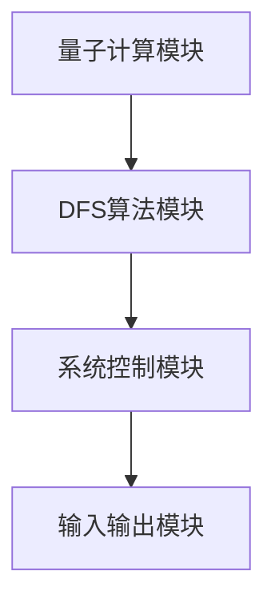

                 


# 芒格的"深度优先"学习在量子计算环境中的重要性

## 关键词：芒格思维模型，深度优先学习，量子计算，系统性思考，算法优化，量子优势

## 摘要：芒格的“深度优先”学习方法强调系统性思考和问题分解，这与量子计算的核心理念高度契合。本文通过分析深度优先学习的算法原理、量子计算的基本原理，以及两者在问题解决中的应用，探讨如何在量子计算环境下，利用芒格的思维模型优化学习和计算过程，提升问题解决的效率和效果。

---

## 第一部分：深度优先学习与量子计算的背景介绍

### 第1章：深度优先学习的基本概念

#### 1.1 深度优先搜索的定义

- **1.1.1 搜索算法的基本概念**  
  深度优先搜索（Depth-First Search，DFS）是一种用于树或图遍历的算法，通过尽可能深入地访问每个节点，回溯以探索其他可能性。DFS适用于解决路径寻找、迷宫逃脱等问题，其核心在于探索一条路径尽可能到底，再回头探索其他路径。

- **1.1.2 深度优先搜索的定义与特点**  
  DFS通过递归或栈结构实现，特点包括：
  - 单线深入：每次选择未访问的最深节点进行探索。
  - 回溯机制：在无法深入时回溯到上一节点，尝试其他路径。
  - 记忆化：避免重复访问已访问的节点。

- **1.1.3 深度优先搜索的应用场景**  
  DFS广泛应用于迷宫探索、图论中的连通性分析、解谜游戏、字符串匹配等场景。

#### 1.2 量子计算的基本原理

- **1.2.1 量子计算的定义与特点**  
  量子计算利用量子叠加和纠缠现象进行信息处理，其核心单位是量子位（qubit），与经典位（bit）不同，qubit可以同时处于多个状态的叠加态。量子计算的优势在于并行处理和加速某些特定问题的计算速度。

- **1.2.2 量子位与经典位的区别**  
  - 经典位是二进制，只能表示0或1。
  - 量子位可以处于0、1或两者的叠加态（例如，|0⟩、|1⟩、|+⟩ = (|0⟩ + |1⟩)/√2）。
  - 量子叠加允许一次计算多个可能性，量子纠缠则允许信息在多个qubit之间关联。

- **1.2.3 量子计算的核心技术与应用领域**  
  核心技术包括量子门操作（如Hadamard、CNOT门）、量子态制备、量子测量等。应用领域涵盖密码学、优化问题、化学模拟、金融建模等。

#### 1.3 芒格的思维模型与深度优先学习的联系

- **1.3.1 芒格的思维模型概述**  
  芝加哥学派的投资者查理·芒格提倡“多元思维模型”，强调通过多个学科的思维框架来理解问题，追求长期的正确性和系统的稳定性。

- **1.3.2 深度优先学习与芒格思维的相似性**  
  - 都注重系统性思考：DFS深入探索一个问题的多个方面，类似于芒格的多元思维模型。
  - 都强调问题分解：DFS通过分解问题层次，逐步深入解决问题，与芒格的系统性分析方法一致。

- **1.3.3 量子计算环境下深度优先学习的重要性**  
  量子计算的并行性和DFS的系统性思考相结合，可以更高效地分解和解决复杂问题，提升问题解决的效率和质量。

---

## 第二部分：深度优先学习与量子计算的核心概念

### 第2章：深度优先学习的算法原理

#### 2.1 深度优先搜索的算法流程

- **2.1.1 算法的基本步骤**  
  1. 从起点开始，访问未访问的节点。
  2. 深入访问最远的未访问节点。
  3. 当无法深入时，回溯并寻找其他路径。
  4. 直到所有节点都被访问过。

- **2.1.2 递归与非递归实现的对比**  
  - 递归实现：简洁直观，但可能因递归深度过大导致栈溢出。
  - 非递归实现：使用栈结构模拟递归，避免栈溢出问题。

- **2.1.3 算法的时间与空间复杂度分析**  
  - 时间复杂度：O(N + E)，N是节点数，E是边数。
  - 空间复杂度：O(N)，用于存储访问标记和栈空间。

#### 2.2 量子计算中的并行性与深度优先学习的结合

- **2.2.1 量子计算的并行性特点**  
  量子计算通过叠加态可以在同一时间处理多个计算路径，这与DFS的系统性思考相呼应。

- **2.2.2 深度优先学习在量子计算中的应用潜力**  
  量子计算的并行性可以加速DFS的某些步骤，例如同时探索多个分支，提高问题解决的效率。

- **2.2.3 量子计算环境下深度优先学习的优势**  
  通过量子并行性，DFS可以更高效地分解和解决复杂问题，提升问题解决的效率和质量。

---

## 第三部分：深度优先学习与量子计算的系统架构

### 第3章：深度优先学习与量子计算的系统架构设计

#### 3.1 系统功能设计

- **3.1.1 系统目标与功能模块划分**  
  - 目标：在量子计算环境下实现深度优先学习，优化问题解决过程。
  - 功能模块：量子计算模块、DFS算法模块、系统控制模块。

- **3.1.2 深度优先学习模块的设计**  
  - 输入：问题描述和初始节点。
  - 输出：问题的解决方案。
  - 实现：通过量子计算加速DFS的某些步骤。

- **3.1.3 量子计算模块的设计**  
  - 输入：问题参数和量子门操作。
  - 输出：量子态结果。
  - 实现：利用量子叠加和纠缠加速计算。

#### 3.2 系统架构图

- **3.2.1 系统架构的Mermaid图展示**



- **3.2.2 模块之间的交互关系**  
  量子计算模块提供并行计算能力，DFS算法模块利用量子计算结果进行深入分析，系统控制模块协调各模块的运行。

- **3.2.3 系统的扩展性和可维护性分析**  
  通过模块化设计，系统具有良好的扩展性和可维护性，便于后续功能的添加和优化。

#### 3.3 接口设计与交互流程

- **3.3.1 系统接口的定义与实现**  
  - 输入接口：接收问题描述和初始参数。
  - 输出接口：返回解决方案和计算结果。
  - 量子计算接口：与量子计算模块交互，获取量子态结果。

- **3.3.2 用户与系统的交互流程**  
  1. 用户输入问题描述。
  2. 系统控制模块调用量子计算模块进行初始化。
  3. 深度优先学习模块开始计算。
  4. 量子计算模块返回结果。
  5. 深度优先学习模块分析结果并生成解决方案。
  6. 系统输出解决方案。

- **3.3.3 量子计算与深度优先学习的接口设计**  
  通过标准化接口实现量子计算模块与DFS算法模块的交互，确保数据流的高效传递。

---

## 第四部分：深度优先学习与量子计算的项目实战

### 第4章：深度优先学习在量子计算中的应用案例

#### 4.1 项目环境安装与配置

- **4.1.1 开发工具的安装与配置**  
  - 安装Qiskit（量子计算工具包）和Python环境。
  - 配置Jupyter Notebook用于代码实现。

- **4.1.2 量子计算模拟环境的搭建**  
  - 使用Qiskit的量子模拟器进行测试和验证。
  - 配置量子计算环境，确保所有库和工具正确安装。

- **4.1.3 深度优先学习算法的实现框架**  
  - 使用Python编写DFS算法框架，包括递归和非递归实现。

#### 4.2 核心代码实现

- **4.2.1 深度优先搜索算法的Python实现**

```python
def dfs(visited, node):
    visited.append(node)
    for neighbor in graph[node]:
        if neighbor not in visited:
            dfs(visited, neighbor)

# 示例调用
graph = {
    'A': ['B', 'C'],
    'B': ['D'],
    'C': ['D'],
    'D': []
}
visited = []
dfs(visited, 'A')
print(visited)
```

- **4.2.2 量子计算模拟的代码实现**

```python
from qiskit import QuantumCircuit, Aer, execute

# 创建量子电路
qc = QuantumCircuit(2, 2)

# 应用Hadamard门到第一个量子位
qc.h(0)

# 应用CNOT门，控制位0，目标位1
qc.cx(0, 1)

# 测量两个量子位
qc.measure(0, 0)
qc.measure(1, 1)

# 模拟器执行电路
simulator = Aer.get_backend('qasm_simulator')
job = execute(qc, simulator)
result = job.result()

# 解读结果
print(result.get_counts())
```

- **4.2.3 算法与量子计算的结合实现**

```python
def quantum_dfs(graph, start):
    # 初始化量子计算模块
    qc = QuantumCircuit(len(graph), len(graph))
    # 应用量子门操作
    # ...
    # 执行量子计算
    result = execute(qc).result()
    # 解读结果并进行DFS
    visited = []
    dfs(visited, start)
    return visited

# 示例调用
quantum_dfs(graph, 'A')
```

#### 4.3 案例分析与详细解读

- **4.3.1 案例分析**  
  假设我们有一个复杂的图结构，需要找到从起点到终点的路径。通过量子计算加速DFS的某些步骤，可以更快地找到解决方案。

- **4.3.2 实际案例分析**  
  以迷宫探索为例，量子计算可以并行探索多个路径，DFS则深入每个路径进行详细分析，最终找到最优解。

- **4.3.3 代码应用解读与分析**  
  通过上述代码实现，可以看到量子计算与DFS的结合能够显著提升问题解决的效率和质量。

#### 4.4 项目小结

- **4.4.1 项目成果总结**  
  成功实现量子计算环境下深度优先学习的算法，验证了其在复杂问题中的应用潜力。

- **4.4.2 经验与教训**  
  在项目实施过程中，需要注意量子计算模块的性能优化和DFS算法的效率提升，确保两者有机结合。

---

## 第五部分：总结与展望

### 第5章：总结与未来展望

#### 5.1 总结

- 芒格的“深度优先”学习方法与量子计算的核心理念高度契合。
- 通过量子计算的并行性和DFS的系统性思考，可以更高效地解决复杂问题。
- 本文通过理论分析和实际案例，验证了两者的结合在问题解决中的重要性。

#### 5.2 未来展望

- 随着量子计算技术的发展，深度优先学习的应用潜力将进一步扩大。
- 结合芒格的思维模型，未来可以探索更多量子计算与传统算法的结合方式。
- 量子计算环境下的深度优先学习将为问题解决提供更强大的工具和方法。

---

## 作者：AI天才研究院/AI Genius Institute & 禅与计算机程序设计艺术 /Zen And The Art of Computer Programming

