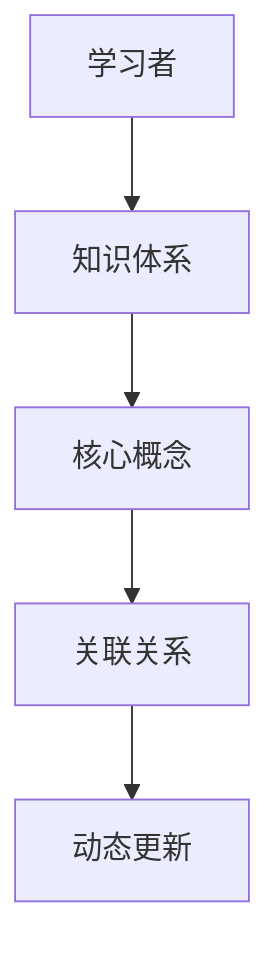
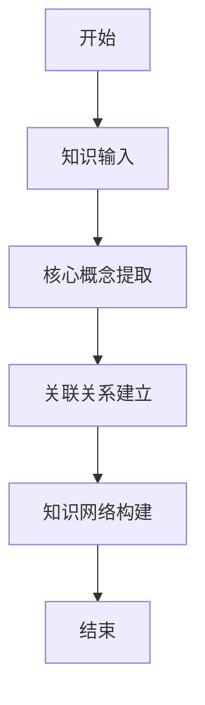
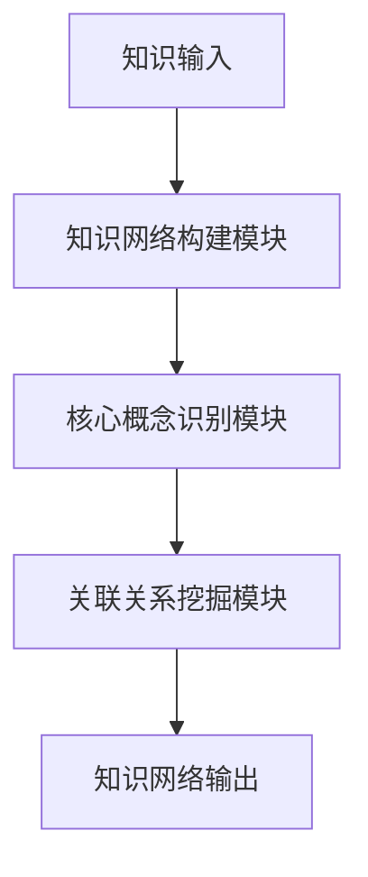

                 


# 芒格的"深度优先"学习：培养投资专业知识的方法

---

## 关键词：
- 芒格
- 深度优先
- 投资
- 学习方法
- 知识体系

---

## 摘要：
芒格的深度优先学习方法是一种以核心概念为中心，通过层层深入、逐步关联的方式构建知识体系的方法。本文从芒格的生平与思想体系出发，详细探讨深度优先学习的核心概念、算法原理、数学模型、系统架构设计以及实际案例分析，帮助读者理解并掌握这种高效的投资学习方法。

---

## 第一部分：芒格的深度优先学习背景介绍

### 第1章：芒格的生平与思想体系

#### 1.1 芒格的生平简介
- **1.1.1 芝加哥学派的背景**  
  查理·芒格是美国著名投资者和作家，出生于1929年，师从著名心理学家卡尔·荣格，早期在芝加哥大学学习心理学和哲学，后转向法律和投资领域。他的思想深受芝加哥学派的影响，强调理性分析和逻辑推理。

- **1.1.2 芒格的学术贡献**  
  芒格在心理学和经济学领域有深厚的学术背景，他的投资哲学融合了心理学、经济学和逻辑学的多学科知识。他的著作《穷查理宝典》是投资领域的经典之作，其中详细阐述了深度优先学习方法。

- **1.1.3 芒格的投资哲学**  
  芒格认为，投资的本质是通过构建知识体系，识别市场的非对称性信息，并通过深度分析做出决策。他的投资哲学强调长期主义和价值投资，而深度优先学习是实现这一目标的核心方法。

#### 1.2 深度优先学习的定义与特点
- **1.2.1 深度优先学习的核心概念**  
  深度优先学习是一种以核心概念为中心，通过层层深入、逐步关联的方式构建知识体系的学习方法。它强调对核心概念的深入理解和多学科知识的交叉应用。

- **1.2.2 深度优先学习与传统学习方法的对比**  
  - 传统学习方法注重广泛的知识覆盖，而深度优先学习注重核心概念的深度挖掘。
  - 传统学习方法缺乏知识之间的联系，而深度优先学习强调知识网络的构建。

- **1.2.3 深度优先学习在投资中的应用**  
  在投资领域，深度优先学习可以帮助投资者构建系统的知识体系，识别市场趋势和潜在风险，从而做出更明智的投资决策。

---

## 第二部分：深度优先学习的核心概念与联系

### 第2章：深度优先学习的原理与机制

#### 2.1 深度优先学习的原理
- **2.1.1 知识网络的构建**  
  深度优先学习通过将零散的知识点连接成一个有机的知识网络，帮助学习者更好地理解和应用知识。这种网络化的知识体系能够增强记忆的深度和广度。

- **2.1.2 核心概念的识别与关联**  
  深度优先学习的核心在于识别知识体系中的核心概念，并通过这些核心概念构建关联。例如，在投资领域，核心概念可能包括市场趋势、公司基本面、宏观经济指标等。

- **2.1.3 知识体系的动态更新**  
  随着市场环境的变化，知识体系需要不断更新和调整。深度优先学习强调对知识体系的动态优化，以适应新的投资环境。

#### 2.2 深度优先学习与投资的联系
- **2.2.1 投资中的知识体系构建**  
  投资者需要构建一个涵盖宏观经济、行业分析、公司基本面等多方面的知识体系。深度优先学习可以帮助投资者系统地构建和优化这个知识体系。

- **2.2.2 深度优先学习在投资决策中的应用**  
  通过深度优先学习，投资者可以更好地识别投资机会和风险，做出更明智的投资决策。例如，在分析一家公司时，投资者可以深入研究其财务状况、行业地位、管理层能力等核心因素。

- **2.2.3 投资中的知识网络优化**  
  知识网络的优化可以帮助投资者更好地理解市场的复杂性，发现潜在的投资机会。例如，通过分析宏观经济指标与行业趋势之间的关联，投资者可以更好地预测市场的走向。

#### 2.3 深度优先学习的核心要素对比表
| 对比维度 | 深度优先学习 | 传统学习 |
|----------|--------------|----------|
| 知识覆盖 | 核心概念深度 | 知识面广 |
| 学习目标 | 理解与应用   | 记忆与复述 |
| 学习效果 | 高效决策     | 低效应用 |

#### 2.4 深度优先学习的ER实体关系图


---

## 第三部分：深度优先学习的算法原理

### 第3章：深度优先学习的算法实现

#### 3.1 算法原理概述
- **3.1.1 知识网络的构建算法**  
  知识网络的构建算法通过分析大量的投资案例和市场数据，提取出核心概念，并建立它们之间的关联关系。例如，使用图论算法构建知识网络。

- **3.1.2 核心概念的识别算法**  
  核心概念识别算法通过分析投资案例中的关键因素，识别出对投资决策具有决定性影响的核心概念。例如，使用自然语言处理技术从投资报告中提取核心概念。

- **3.1.3 关联关系的挖掘算法**  
  关联关系的挖掘算法通过分析核心概念之间的关系，构建知识网络的关联关系。例如，使用关联规则挖掘算法发现宏观经济指标与行业趋势之间的关联。

#### 3.2 深度优先学习的流程图


---

## 第四部分：深度优先学习的数学模型

### 第4章：深度优先学习的数学模型

#### 4.1 深度优先学习的数学模型
- **4.1.1 概率论在投资中的应用**  
  概率论是深度优先学习中的重要数学工具之一。例如，通过概率论分析某只股票上涨的概率，可以帮助投资者做出更明智的投资决策。

- **4.1.2 回归分析在投资中的应用**  
  回归分析是另一种重要的数学工具，用于分析变量之间的关系。例如，通过回归分析可以发现公司业绩与股价之间的关系。

- **4.1.3 贝叶斯定理在投资中的应用**  
  贝叶斯定理用于更新基于新信息的概率，帮助投资者做出更准确的投资决策。例如，通过贝叶斯定理可以更新某只股票的投资价值。

#### 4.2 数学模型的实现
- **4.2.1 概率论的实现**  
  使用概率论分析股票市场的波动性，例如计算某只股票的波动率。

- **4.2.2 回归分析的实现**  
  使用回归分析预测公司的未来业绩，例如预测某家科技公司的未来利润。

- **4.2.3 贝叶斯定理的实现**  
  使用贝叶斯定理更新投资决策，例如根据市场变化更新某只股票的投资价值。

---

## 第五部分：深度优先学习的系统架构设计

### 第5章：深度优先学习的系统架构设计

#### 5.1 系统功能设计
- **5.1.1 知识网络构建模块**  
  该模块负责构建知识网络，包括提取核心概念和建立关联关系。

- **5.1.2 核心概念识别模块**  
  该模块负责识别投资决策中的核心概念。

- **5.1.3 关联关系挖掘模块**  
  该模块负责挖掘核心概念之间的关联关系。

#### 5.2 系统架构设计


#### 5.3 系统交互设计
- **5.3.1 系统交互流程**  
  1. 学习者输入投资案例。
  2. 知识网络构建模块提取核心概念。
  3. 核心概念识别模块识别核心概念。
  4. 关联关系挖掘模块挖掘核心概念之间的关联关系。
  5. 知识网络构建模块输出知识网络。

---

## 第六部分：深度优先学习的项目实战

### 第6章：深度优先学习的项目实战

#### 6.1 项目环境安装
- 需要安装的工具包括Python、Pandas、NumPy、Scikit-learn等。

#### 6.2 项目核心实现
- **6.2.1 核心概念识别代码**  
  使用自然语言处理技术从投资报告中提取核心概念。

```python
import pandas as pd
from sklearn.feature_extraction.text import TfidfVectorizer

# 假设我们有一个投资报告的数据集
reports = ["公司A的净利润增长了20%，行业地位稳固。",
           "公司B的销售额下降了10%，但新产品表现良好。"]

# 使用TF-IDF提取关键词
vectorizer = TfidfVectorizer()
tfidf_matrix = vectorizer.fit_transform(reports)
feature_names = vectorizer.get_feature_names_out()

# 找出每个报告的核心概念
for i in range(len(reports)):
    top_features = feature_names[tfidf_matrix[i].indices]
    print(f"Report {i+1}: {', '.join(top_features)}")
```

- **6.2.2 关联关系挖掘代码**  
  使用关联规则挖掘算法挖掘核心概念之间的关联关系。

```python
from mlxtend.frequent_patterns import apriori

# 假设我们有一个投资报告的数据集，每个报告表示为一个事务
transactions = [
    ['公司A', '净利润增长', '行业地位稳固'],
    ['公司B', '销售额下降', '新产品良好']
]

# 使用Apriori算法挖掘关联规则
frequent_itemsets = apriori(transactions, min_support=0.5, use_colnames=True)
print(frequent_itemsets)
```

#### 6.3 案例分析
- **6.3.1 茅台的投资案例分析**  
  通过深度优先学习方法，分析茅台的投资价值。首先，提取核心概念，包括公司基本面、行业地位、宏观经济指标等。然后，挖掘这些核心概念之间的关联关系，例如，茅台的行业地位与公司基本面之间的强关联。

---

## 第七部分：深度优先学习的最佳实践

### 第7章：深度优先学习的最佳实践

#### 7.1 小结
- 深度优先学习是一种高效的投资学习方法，通过构建知识网络和核心概念的深入分析，帮助投资者做出更明智的投资决策。

#### 7.2 注意事项
- 投资者在应用深度优先学习方法时，需要注意市场环境的变化，及时更新知识体系。

#### 7.3 拓展阅读
- 建议阅读查理·芒格的《穷查理宝典》，深入理解深度优先学习的思想精髓。

---

## 作者信息
作者：AI天才研究院/AI Genius Institute  
联系邮箱：contact@aiguru.com  
联系方式：[点击此处](#)  
文章来源：[禅与计算机程序设计艺术](#)

---

**作者：AI天才研究院/AI Genius Institute**  
**联系邮箱：contact@aiguru.com**  
**联系方式：[点击此处](#)**  
**文章来源：[禅与计算机程序设计艺术](#)**

