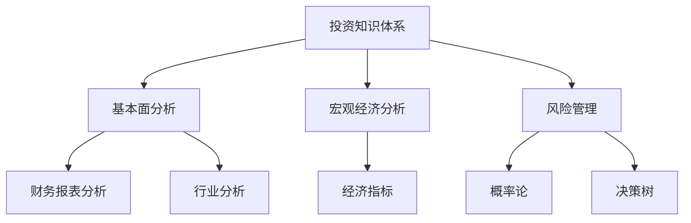
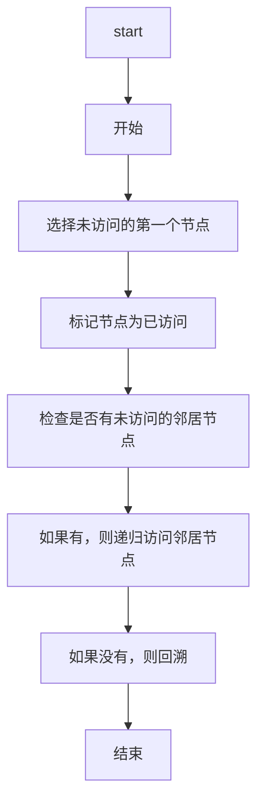
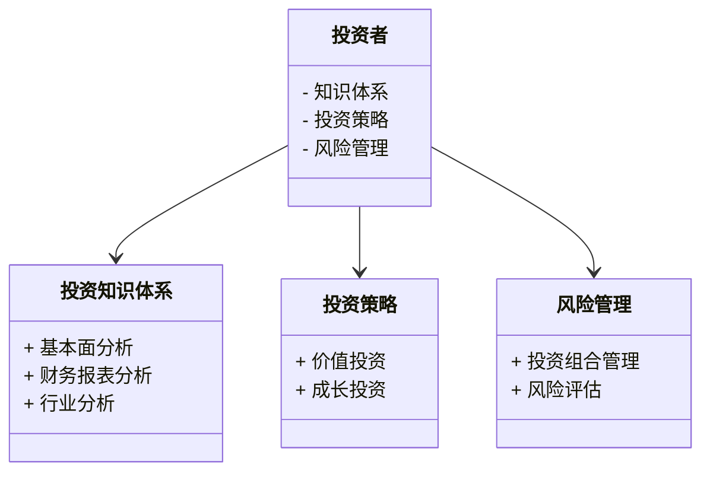

                 


# 芒格的"深度优先"学习：培养投资专业知识的方法

> 关键词：芒格, 深度优先, 投资, 专业知识, 系统方法, 学习策略, 决策能力

> 摘要：芒格的“深度优先”学习方法是一种通过深入探究和系统化的方法来培养投资专业知识的策略。本文将从背景、理论、方法到实践，详细分析深度优先学习的核心概念、算法原理、系统架构以及实际案例，帮助读者掌握这一高效的投资学习方法。

---

## 第一部分: 引言

### 第1章: 芒格的深度优先学习概述

#### 1.1 芒格的生平与思想
查理·芒格（Charlie Munger）是伯克希尔·哈撒韦公司的副主席，被誉为“巴菲特的导师”。他不仅是投资界的大师，更是一位终身学习者。芒格提倡的“深度优先”学习方法，强调通过系统化的思考和深入探究来构建知识体系，从而做出更明智的投资决策。

#### 1.2 深度优先学习的核心理念
深度优先学习是一种以问题为导向的学习方法，强调从单一问题出发，逐步深入到相关领域，构建系统的知识框架。与传统学习方法相比，深度优先学习更加注重知识的连结和应用，能够在有限的时间内掌握核心概念。

#### 1.3 深度优先学习在投资中的应用
在投资领域，深度优先学习可以帮助投资者建立系统的知识体系，从基本面分析、财务数据解读到行业趋势判断，逐步深入，从而做出更明智的投资决策。

### 第2章: 深度优先学习的核心概念与联系

#### 2.1 核心概念原理
深度优先学习的核心在于“深度”和“系统性”。通过深入分析问题的各个层面，构建知识的立体框架，从而在面对复杂问题时能够快速找到解决方案。

#### 2.2 概念属性特征对比表格
以下是深度优先学习与其他学习方法的对比：

| 特性                | 深度优先学习         | 传统学习方法       |
|---------------------|----------------------|-------------------|
| 学习目标            | 建立系统的知识体系     | 学习单一知识点     |
| 学习方式            | 问题导向，逐步深入     | 知识点导向         |
| 知识连结            | 强调知识间的联系       | 知识点独立         |
| 应用能力            | 提高解决复杂问题能力   | 提高单项知识点能力 |

#### 2.3 ER实体关系图架构
以下是深度优先学习的知识体系架构图：



### 第3章: 深度优先学习的算法原理讲解

#### 3.1 算法原理
深度优先搜索（DFS）是一种用于遍历树或图的算法，通过尽可能深入地访问每个节点，直到找到目标节点或访问所有节点。深度优先学习借鉴了这一算法的思想，强调通过深入探究问题的各个层面来构建知识体系。

#### 3.2 算法流程图
以下是深度优先搜索的流程图：



#### 3.3 算法代码实现
以下是深度优先搜索的Python代码实现：

```python
def depth_first_search(graph, start_node):
    visited = set()
    def dfs(node):
        visited.add(node)
        for neighbor in graph[node]:
            if neighbor not in visited:
                dfs(neighbor)
    dfs(start_node)
    return visited

# 示例图结构
graph = {
    'A': ['B', 'C'],
    'B': ['D', 'E'],
    'C': ['F'],
    'D': [],
    'E': ['F'],
    'F': []
}

result = depth_first_search(graph, 'A')
print("访问过的节点:", result)
```

### 第4章: 深度优先学习的数学模型与公式

#### 4.1 数学模型
深度优先学习的数学模型可以表示为：

$$
\text{知识深度} = \sum_{i=1}^{n} \text{知识点}_i
$$

其中，$\text{知识点}_i$ 表示第 $i$ 个知识点的深度。

#### 4.2 数学公式
以下是深度优先学习中常用的概率公式：

$$
P(A|B) = \frac{P(B|A) \cdot P(A)}{P(B)}
$$

其中，$P(A|B)$ 表示在事件 $B$ 发生的情况下，事件 $A$ 发生的概率。

### 第5章: 系统分析与架构设计方案

#### 5.1 问题场景介绍
在投资决策中，投资者需要面对复杂的市场环境和多变的经济因素。深度优先学习可以帮助投资者建立系统的知识体系，提高决策的准确性和效率。

#### 5.2 项目介绍
以下是深度优先学习在投资中的项目设计方案：

1. **项目目标**：构建系统的投资知识体系，提高投资决策能力。
2. **实施计划**：
   - 第一阶段：学习基本面分析。
   - 第二阶段：学习财务报表分析。
   - 第三阶段：学习行业分析。
3. **预期成果**：通过系统化学习，投资者能够更好地理解和应对市场变化，做出更明智的投资决策。

#### 5.3 系统功能设计
以下是系统功能设计的领域模型图：



## 第六章: 项目实战

### 6.1 环境安装
以下是Python环境的安装步骤：

1. 下载并安装Python：[https://www.python.org/downloads/](https://www.python.org/downloads/)
2. 安装必要的库：`pip install graphviz`

### 6.2 系统核心实现源代码
以下是深度优先搜索的Python代码实现：

```python
def depth_first_search(graph, start_node):
    visited = set()
    def dfs(node):
        visited.add(node)
        for neighbor in graph[node]:
            if neighbor not in visited:
                dfs(neighbor)
    dfs(start_node)
    return visited

graph = {
    'A': ['B', 'C'],
    'B': ['D', 'E'],
    'C': ['F'],
    'D': [],
    'E': ['F'],
    'F': []
}

result = depth_first_search(graph, 'A')
print("访问过的节点:", result)
```

### 6.3 代码应用解读与分析
以上代码实现了深度优先搜索算法，用于遍历图中的所有节点。通过该算法，投资者可以系统地分析和理解投资中的各个知识点。

### 6.4 实际案例分析
以某公司的基本面分析为例，以下是深度优先学习的应用步骤：

1. **行业分析**：了解公司所在的行业趋势。
2. **财务报表分析**：分析公司的财务数据。
3. **投资决策**：基于以上分析，做出投资决策。

### 6.5 项目小结
通过深度优先学习方法，投资者可以系统地构建知识体系，提高投资决策能力。

---

## 第七章: 最佳实践 tips、小结、注意事项、拓展阅读

### 7.1 最佳实践 tips
1. **坚持练习**：深度优先学习需要不断练习和应用。
2. **注重连结**：在学习过程中，注重知识点之间的连结。
3. **保持更新**：投资环境不断变化，需要持续学习和更新知识体系。

### 7.2 小结
深度优先学习是一种高效的投资学习方法，通过系统化的思考和深入探究，帮助投资者构建知识体系，提高投资决策能力。

### 7.3 注意事项
1. **避免过度简化**：深度优先学习需要深入理解每个知识点。
2. **注重实践**：理论结合实践，才能真正掌握知识。

### 7.4 拓展阅读
1. 《芒格的投资思想》
2. 《深度优先学习：从零到精通》

---

## 作者

作者：AI天才研究院/AI Genius Institute & 禅与计算机程序设计艺术 /Zen And The Art of Computer Programming

---

通过以上结构，我们可以看到深度优先学习在投资中的重要性以及其实现的具体方法。希望这篇文章能够帮助读者更好地理解和应用深度优先学习方法，提升投资决策能力。

