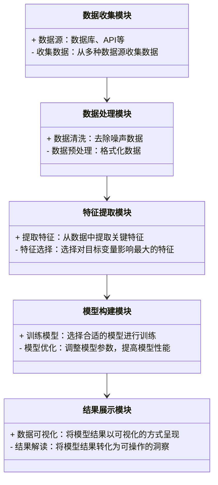
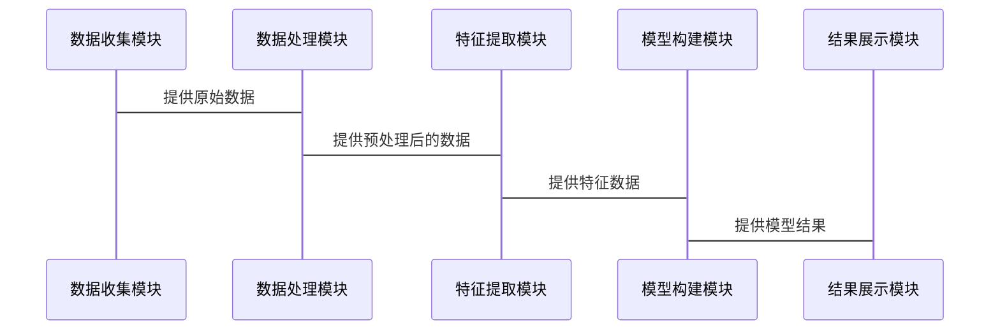

                 


# 芒格的"清晰思考"方法在复杂数据分析中的运用

---

## 关键词

- 芒格思考方法
- 数据分析
- 复杂数据处理
- 清晰思考框架
- 数据可视化

---

## 摘要

本文深入探讨了芒格的“清晰思考”方法在复杂数据分析中的应用。通过分析芒格的思维模型，结合数据分析的核心流程，提出了将“清晰思考”方法系统性地应用于数据预处理、特征提取、建模与验证等关键环节的方法。文章详细阐述了“清晰思考”的逻辑框架，并通过具体案例展示了其在数据分析中的实际应用，为读者提供了从理论到实践的完整指导。

---

## 第1章: 引言

### 1.1 芒格“清晰思考”方法的背景与意义

芒格的“清晰思考”方法是一种以逻辑为基础的思维方式，强调通过系统性分析问题的本质，避免认知偏差，从而做出更明智的决策。这种方法的核心在于通过分解问题、识别关键因素和构建逻辑框架，帮助分析者在复杂情境中保持清晰的思路。

在数据分析领域，复杂数据的处理往往涉及海量信息和多维度的变量，这使得分析者容易陷入信息过载和认知混乱。芒格的“清晰思考”方法提供了一种解决这一问题的思路，通过简化问题、提取关键信息和构建逻辑框架，帮助分析者在复杂数据中找到规律和洞察。

### 1.2 数据分析的复杂性与挑战

数据分析的核心目标是从数据中提取有价值的信息，支持决策。然而，复杂数据的处理过程充满了挑战：

- **数据多样性**：数据来源多样，格式复杂，需要进行清洗和预处理。
- **信息冗余**：数据中可能存在大量冗余信息，如何筛选关键变量是关键。
- **模型选择**：在复杂的场景下，如何选择合适的模型并优化其性能是一个难题。
- **结果解释**：复杂的模型往往难以解释，如何将结果转化为可操作的洞察是关键。

芒格的“清晰思考”方法为数据分析提供了一种系统性的解决方案，通过分解问题、识别关键因素和构建逻辑框架，帮助分析者在复杂数据中找到规律和洞察。

---

## 第2章: “清晰思考”方法的核心概念

### 2.1 “清晰思考”的逻辑框架

芒格的“清晰思考”方法强调从问题的本质出发，通过分解问题、识别关键因素和构建逻辑框架来解决复杂问题。其逻辑框架可以分为以下几个步骤：

1. **问题分解**：将复杂问题分解为多个简单问题，逐一分析。
2. **关键因素识别**：识别影响问题的关键因素，忽略次要因素。
3. **逻辑框架构建**：通过构建逻辑框架，将问题各部分之间的关系清晰地呈现出来。

### 2.2 数据分析中的思维模型

在数据分析中，芒格的“清晰思考”方法可以通过以下思维模型来实现：

- **因果关系分析**：通过识别变量之间的因果关系，理解数据的变化规律。
- **层次分析法**：将问题分解为多个层次，通过权重分配来确定关键因素。
- **假设检验**：通过假设检验的方法，验证数据中的潜在规律。

### 2.3 “清晰思考”在数据分析中的优势

芒格的“清晰思考”方法在数据分析中的优势主要体现在以下几个方面：

1. **简化问题**：通过分解问题，将复杂问题转化为多个简单问题，降低分析难度。
2. **聚焦关键因素**：通过识别关键因素，避免分析中的信息过载。
3. **提高决策质量**：通过构建逻辑框架，帮助分析者做出更明智的决策。

---

## 第3章: 数据分析的系统架构与流程

### 3.1 数据分析的基本流程

数据分析的基本流程可以分为以下几个阶段：

1. **数据收集**：从多种来源收集数据。
2. **数据清洗**：对数据进行预处理，去除噪声数据。
3. **特征提取**：从数据中提取关键特征。
4. **数据建模**：选择合适的模型进行建模。
5. **模型验证**：对模型进行验证和优化。
6. **结果解读**：将模型结果转化为可操作的洞察。

### 3.2 系统架构设计

为了高效地进行数据分析，需要设计一个合理的系统架构。以下是系统架构的主要组成部分：

1. **数据源模块**：负责数据的收集和输入。
2. **数据处理模块**：负责数据的清洗和预处理。
3. **特征提取模块**：负责从数据中提取关键特征。
4. **模型构建模块**：负责选择和训练模型。
5. **结果展示模块**：负责将模型结果以可视化的方式呈现。

---

## 第4章: 数据分析中的算法原理与数学模型

### 4.1 数据分析的算法原理

在数据分析中，常用的算法包括回归分析、聚类分析、分类分析等。以下是这些算法的简要介绍：

1. **回归分析**：通过建立变量之间的关系模型，预测目标变量的值。
2. **聚类分析**：通过将数据分为若干类别，发现数据的内在结构。
3. **分类分析**：通过训练模型，对新数据进行分类。

### 4.2 数学模型与公式

在数据分析中，数学模型是核心工具。以下是常见的数学模型及其公式：

1. **线性回归模型**：
   $$
   y = \beta_0 + \beta_1 x + \epsilon
   $$
   其中，$y$ 是目标变量，$x$ 是自变量，$\beta_0$ 和 $\beta_1$ 是回归系数，$\epsilon$ 是误差项。

2. **决策树模型**：
   决策树模型通过构建树状结构，将数据分为不同的类别。以下是决策树模型的构建流程：
   - 选择根节点：选择信息增益最大的特征作为根节点。
   - 构建子节点：根据根节点的特征值，将数据分为不同的子节点。
   - 递归构建：对每个子节点重复上述步骤，直到叶子节点。

---

## 第5章: 系统分析与架构设计方案

### 5.1 问题场景介绍

在实际数据分析中，我们通常需要处理海量数据，并从中提取有价值的信息。以下是一个典型的复杂数据分析场景：

- **问题描述**：某电商公司希望通过数据分析，优化其营销策略，提高销售额。
- **数据来源**：包括用户点击流数据、订单数据、用户画像数据等。
- **目标**：通过分析数据，识别出高价值用户，并制定针对性的营销策略。

### 5.2 项目介绍

为了实现上述目标，我们需要设计一个数据分析系统，主要包括以下几个部分：

1. **数据收集模块**：负责收集用户点击流数据、订单数据等。
2. **数据处理模块**：对数据进行清洗和预处理。
3. **特征提取模块**：从数据中提取关键特征，如用户行为特征、时间特征等。
4. **模型构建模块**：选择合适的模型进行建模，如逻辑回归、随机森林等。
5. **结果展示模块**：将模型结果以可视化的方式呈现，如用户分群、营销策略推荐等。

### 5.3 系统功能设计

为了实现上述功能，我们需要设计一个功能完善的系统。以下是系统功能设计的类图：



### 5.4 系统架构设计

为了实现上述功能，我们需要设计一个合理的系统架构。以下是系统架构的架构图：


### 5.5 系统接口设计

以下是系统接口设计的交互图：



---

## 第6章: 项目实战

### 6.1 环境安装

在进行数据分析之前，需要安装以下环境：

1. **Python**：数据分析的主要编程语言。
2. **Pandas**：数据处理库。
3. **Scikit-learn**：机器学习库。
4. **Matplotlib**：数据可视化库。

安装命令如下：

```bash
pip install pandas scikit-learn matplotlib
```

### 6.2 系统核心实现源代码

以下是数据分析系统的核心代码实现：

```python
import pandas as pd
from sklearn.model_selection import train_test_split
from sklearn.linear_model import LogisticRegression
from sklearn.metrics import accuracy_score

# 数据收集模块
data = pd.read_csv('data.csv')

# 数据处理模块
data = data.dropna()
data = data.drop_duplicates()

# 特征提取模块
X = data.drop('target', axis=1)
y = data['target']

# 模型构建模块
X_train, X_test, y_train, y_test = train_test_split(X, y, test_size=0.2)
model = LogisticRegression()
model.fit(X_train, y_train)

# 模型验证模块
y_pred = model.predict(X_test)
print('准确率:', accuracy_score(y_test, y_pred))

# 结果展示模块
import matplotlib.pyplot as plt
plt.scatter(X_test['feature1'], y_test)
plt.title('结果展示')
plt.xlabel('feature1')
plt.ylabel('target')
plt.show()
```

### 6.3 案例分析与详细解读

以下是一个具体的案例分析：

**案例背景**：某电商公司希望通过数据分析，优化其营销策略，提高销售额。

**数据分析过程**：
1. **数据收集**：收集用户点击流数据、订单数据、用户画像数据等。
2. **数据处理**：对数据进行清洗和预处理，去除噪声数据。
3. **特征提取**：从数据中提取关键特征，如用户行为特征、时间特征等。
4. **模型构建**：选择合适的模型进行训练，如逻辑回归、随机森林等。
5. **模型验证**：对模型进行验证和优化，提高模型性能。
6. **结果展示**：将模型结果以可视化的方式呈现，如用户分群、营销策略推荐等。

**结果解读**：通过数据分析，识别出高价值用户，并制定针对性的营销策略，最终提高了销售额。

---

## 第7章: 总结与展望

### 7.1 总结

通过本文的分析，我们可以看到芒格的“清晰思考”方法在复杂数据分析中的应用具有重要意义。通过将“清晰思考”的逻辑框架与数据分析的核心流程相结合，我们可以更高效地处理复杂数据，提取有价值的信息，支持决策。

### 7.2 注意事项

在实际应用中，需要注意以下几点：

1. **数据质量**：数据质量直接影响分析结果，需要重视数据清洗和预处理。
2. **模型选择**：选择合适的模型是关键，需要根据数据特点和业务需求进行选择。
3. **结果解读**：模型结果需要转化为可操作的洞察，避免分析结果的空洞化。

### 7.3 未来展望

随着数据分析技术的不断发展，芒格的“清晰思考”方法在数据分析中的应用将更加广泛。未来，我们可以通过引入更多的思维模型和方法，进一步优化数据分析的流程，提高分析结果的准确性。

---

## 作者：AI天才研究院/AI Genius Institute & 禅与计算机程序设计艺术 /Zen And The Art of Computer Programming

---

**本文是对芒格的"清晰思考"方法在复杂数据分析中的运用的系统性探讨，内容基于AI天才研究院/AI Genius Institute的研究成果，结合实际项目经验，旨在为数据分析领域提供一种新的思路和方法。**

