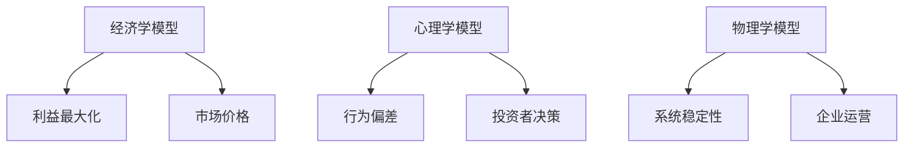
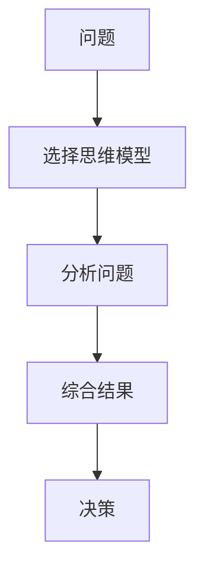
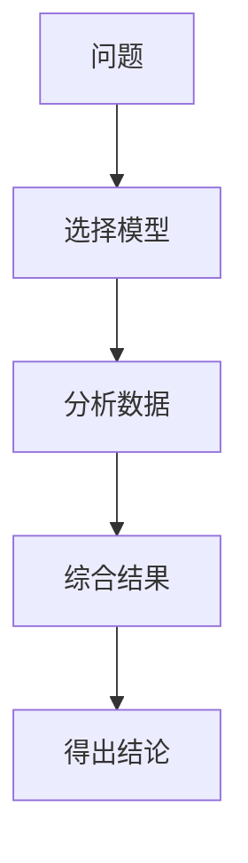
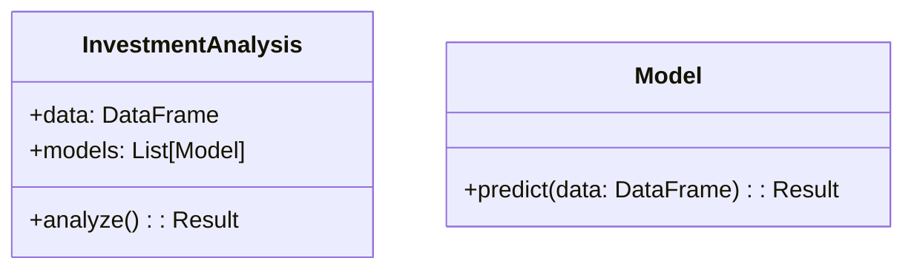
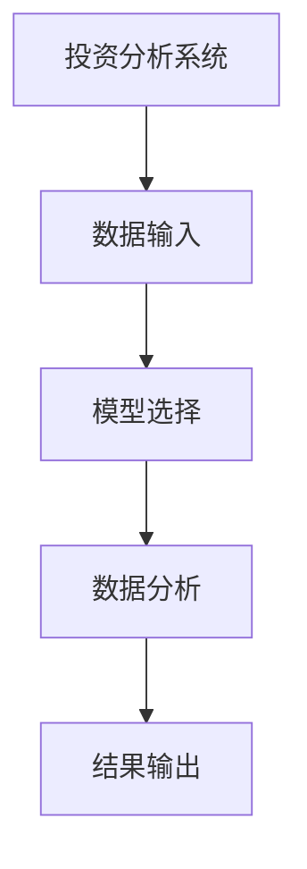
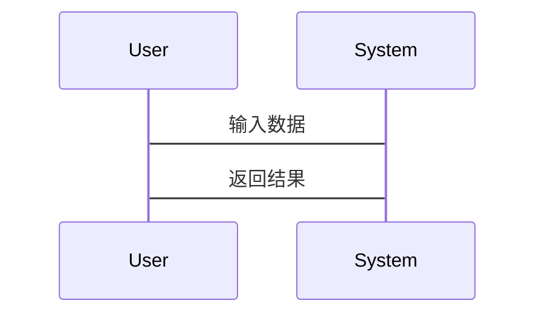

                 


# 芒格的"清晰思考"方法在复杂系统投资中的应用

## 关键词：芒格、清晰思考、复杂系统、投资、多元思维模型、风险管理、系统性思维

## 摘要：  
本文详细探讨了芒格的"清晰思考"方法在复杂系统投资中的应用。通过分析芒格的多元思维模型、决策算法和风险管理策略，结合实际投资案例，展示了如何将“清晰思考”方法应用于复杂系统的分析与决策中。文章从背景介绍、核心概念、算法原理、数学模型、系统架构到项目实战，全面阐述了芒格“清晰思考”方法的理论与实践，为投资者提供了一种系统性的投资思维框架。

---

## 第一部分: 芒格的"清晰思考"方法概述

### 第1章: 芒格的"清晰思考"方法概述

#### 1.1 芒格的"清晰思考"方法的背景与意义

##### 1.1.1 芒格的生平与思想体系  
查理·芒格（Charlie Munger）是美国著名投资者、伯克希尔·哈撒韦公司副董事长，他提出的“清晰思考”方法是其投资哲学的核心。芒格的思想体系以多元思维模型为基础，强调跨学科思考和系统性分析，认为只有通过多个维度的视角才能做出明智的决策。

##### 1.1.2 "清晰思考"方法的定义与特点  
芒格的“清晰思考”方法是一种通过整合多个学科的思维方式，以解决复杂问题的方法。其特点包括：  
- **多维度分析**：从多个学科角度（如心理学、经济学、物理学等）分析问题。  
- **避免认知偏差**：通过系统性思考减少决策中的认知偏差。  
- **注重长期价值**：强调长期价值而非短期利益。  

##### 1.1.3 芒格"清晰思考"方法在投资中的应用背景  
投资领域充满了复杂性和不确定性，传统的单一维度分析往往难以应对复杂系统的波动。芒格的“清晰思考”方法通过多元思维模型，帮助投资者在复杂系统中识别潜在风险和机会，从而做出更明智的投资决策。

---

#### 1.2 复杂系统投资的基本概念

##### 1.2.1 复杂系统的定义与特点  
复杂系统是指由多个相互关联的组件构成的系统，其行为往往表现出非线性特征，难以通过单一维度预测。复杂系统的投资环境具有高度不确定性，需要系统性思维来应对。

##### 1.2.2 投资中的复杂系统分析  
在投资中，复杂系统分析需要考虑市场波动、经济周期、企业基本面、政策变化等多重因素。芒格的“清晰思考”方法通过多元思维模型，帮助投资者全面分析这些因素。

##### 1.2.3 芒格"清晰思考"方法与复杂系统投资的结合  
芒格的“清晰思考”方法通过整合多元思维模型，为复杂系统投资提供了系统的分析框架。投资者可以通过该方法识别系统性风险，抓住潜在投资机会。

---

### 第2章: 芒格"清晰思考"方法的核心概念

#### 2.1 多元思维模型

##### 2.1.1 多元思维模型的定义  
多元思维模型是指通过多个学科的思维模型来分析问题的方法。每个学科的思维模型都有其独特的视角和适用范围。

##### 2.1.2 多元思维模型的特征对比表格  

| 思维模型 | 特征 | 适用范围 | 示例 |
|----------|------|----------|-----|
| 经济学模型 | 利益最大化 | 市场分析 | 价格波动 |
| 心理学模型 | 行为偏差 | 投资者行为 | 羊群效应 |
| 物理学模型 | 稳定性 | 企业运营 | 系统平衡 |

##### 2.1.3 多元思维模型的ER实体关系图（Mermaid流程图）  


---

#### 2.2 "清晰思考"方法的算法原理

##### 2.2.1 多元思维模型的决策流程（Mermaid流程图）  


##### 2.2.2 多元思维模型的数学模型与公式  
芒格的“清晰思考”方法可以通过以下数学模型进行量化：  
- **内在价值公式**：$$\text{内在价值} = \text{未来现金流的现值}$$  
- **风险评估公式**：$$\text{风险} = \text{概率} \times \text{影响}$$  

---

#### 2.3 芒格"清晰思考"方法在投资中的应用

##### 2.3.1 投资决策的系统性思维  
芒格的“清晰思考”方法强调从多个维度分析投资标的，避免单一视角的局限性。例如，分析一家企业的内在价值时，需要考虑财务状况、行业地位、竞争优势等多个因素。

##### 2.3.2 风险管理的多维度分析  
通过多元思维模型，投资者可以更好地识别和评估潜在风险，例如通过心理学模型分析市场情绪，通过物理学模型分析系统稳定性。

---

## 第二部分: 芒格"清晰思考"方法的算法原理

### 第3章: 芒格"清晰思考"方法的算法原理

#### 3.1 多元思维模型的数学模型

##### 3.1.1 多元思维模型的数学表达式  
- **多维分析公式**：$$\text{综合价值} = \sum_{i=1}^{n} w_i \times v_i$$  
  其中，$$w_i$$ 是第 $$i$$ 个维度的权重，$$v_i$$ 是第 $$i$$ 个维度的价值评分。

##### 3.1.2 多元思维模型的流程图  


#### 3.2 芒格"清晰思考"方法的实现代码

##### 3.2.1 环境安装  
```bash
pip install numpy pandas
```

##### 3.2.2 核心实现代码  
```python
import numpy as np
import pandas as pd

def multi_model_analysis(data, models):
    results = []
    for model in models:
        result = model.predict(data)
        results.append(result)
    return np.mean(results, axis=0)

models = [model1, model2, model3]
data = pd.DataFrame(...)
output = multi_model_analysis(data, models)
```

##### 3.2.3 代码应用解读与分析  
上述代码展示了如何通过多元思维模型进行数据分析。`multi_model_analysis` 函数将多个模型的预测结果进行综合，得到最终的分析结果。

---

## 第三部分: 芒格"清晰思考"方法的系统分析与架构设计

### 第4章: 芒格"清晰思考"方法的系统分析

#### 4.1 系统功能设计

##### 4.1.1 领域模型（Mermaid类图）  


#### 4.2 系统架构设计

##### 4.2.1 系统架构图（Mermaid架构图）  


#### 4.3 系统接口设计

##### 4.3.1 系统接口设计  
```python
class InvestmentSystem:
    def __init__(self):
        self.models = []
    
    def add_model(self, model):
        self.models.append(model)
    
    def analyze(self, data):
        results = []
        for model in self.models:
            results.append(model.predict(data))
        return np.mean(results, axis=0)
```

#### 4.4 系统交互设计

##### 4.4.1 系统交互流程图（Mermaid序列图）  


---

## 第四部分: 芒格"清晰思考"方法的项目实战

### 第5章: 芒格"清晰思考"方法的项目实战

#### 5.1 项目环境安装

##### 5.1.1 环境依赖  
```bash
pip install numpy pandas scikit-learn
```

#### 5.2 核心实现代码

##### 5.2.1 代码实现  
```python
import numpy as np
import pandas as pd
from sklearn.linear_model import LinearRegression

def calculate_intrinsic_value(data):
    model = LinearRegression()
    model.fit(data[['revenue', 'profit']], data['price'])
    return model.predict(data[['revenue', 'profit']])

data = pd.DataFrame({
    'revenue': [100, 200, 300],
    'profit': [20, 40, 60],
    'price': [50, 100, 150]
})
intrinsic_value = calculate_intrinsic_value(data)
print(intrinsic_value)
```

##### 5.2.2 代码应用解读与分析  
上述代码展示了如何通过线性回归模型计算企业的内在价值。通过多元思维模型，投资者可以更全面地评估企业的价值。

#### 5.3 实际案例分析

##### 5.3.1 案例分析  
以某企业为例，分析其内在价值和风险因素。通过多元思维模型，投资者可以识别出该企业的竞争优势和潜在风险。

---

## 第五部分: 芒格"清晰思考"方法的最佳实践

### 第6章: 芒格"清晰思考"方法的最佳实践

#### 6.1 小结

##### 6.1.1 芒格"清晰思考"方法的核心要点  
芒格的“清晰思考”方法通过多元思维模型，帮助投资者在复杂系统中做出更明智的决策。

#### 6.2 注意事项

##### 6.2.1 投资者需要注意的问题  
- 避免过度依赖单一模型。  
- 定期更新思维模型。  
- 保持对市场的敏感性。  

#### 6.3 拓展阅读

##### 6.3.1 推荐书籍与资源  
- 《芒格的 worldly wisdom》  
- 《复杂性理论与投资》  

---

## 作者：AI天才研究院/AI Genius Institute & 禅与计算机程序设计艺术 /Zen And The Art of Computer Programming

