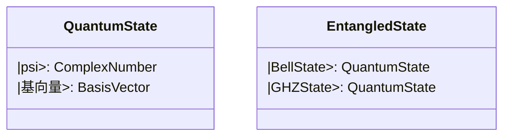
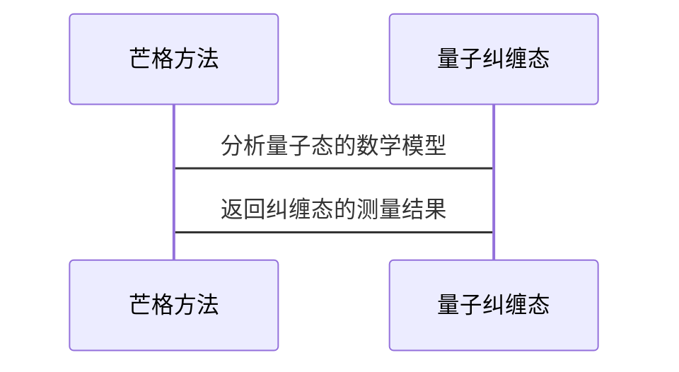

                 


# 芒格的"清晰思考"方法在量子纠缠态解释中的应用

## 关键词：芒格, 清晰思考, 量子纠缠态, 量子力学, 数学模型, 量子信息, 决策树

## 摘要：  
芒格的"清晰思考"方法是一种以逻辑推理和决策优化为核心的思维框架，而量子纠缠态是量子力学中的一个复杂现象。本文将探讨如何将芒格的"清晰思考"方法应用于量子纠缠态的解释中，通过逻辑推理和数学建模，分析量子纠缠态的数学模型和哲学含义，并尝试用芒格的方法构建一个清晰的量子纠缠态解释框架。

---

## 第1章: 芒格的"清晰思考"方法概述

### 1.1 芒格"清晰思考"方法的核心概念

#### 1.1.1 "清晰思考"的定义与特点  
芒格的"清晰思考"方法强调逻辑推理和决策的清晰性，主张通过逆向思维和决策树的方式，逐步分析问题的核心。这种方法的核心在于将复杂的决策过程分解为简单的逻辑步骤，从而确保思考的清晰性和可操作性。

#### 1.1.2 芒格"清晰思考"方法的哲学基础  
芒格的"清晰思考"方法深受西方哲学的影响，尤其是笛卡尔的理性主义和贝克莱的主观经验论。他主张通过逻辑推理和数学建模来理解复杂的现实问题，强调思维的严密性和逻辑性。

#### 1.1.3 "清晰思考"在决策中的应用  
芒格的"清晰思考"方法在决策中表现为以下几个方面：  
1. **逆向思维**：从结果出发，反向推导可能的路径。  
2. **决策树**：通过树状结构分析决策的可能结果和概率。  
3. **概率推理**：基于已知信息，计算事件发生的概率。  

---

### 1.2 量子纠缠态的基本概念

#### 1.2.1 量子力学的基本原理  
量子力学是研究微观粒子行为的物理理论，其核心概念包括波函数、叠加态、纠缠态等。量子力学的数学描述通常使用复数向量空间和算符。

#### 1.2.2 量子纠缠态的定义与特征  
量子纠缠态是指两个或多个粒子之间存在强关联的状态，其中一个粒子的状态会直接影响另一个粒子的状态，即使它们相隔很远。这种现象被称为"量子纠缠"或" spooky action at a distance"。

#### 1.2.3 量子纠缠态的实验观察与数学描述  
量子纠缠态可以通过实验观察到，例如著名的双缝实验和贝尔不等式实验。数学上，量子纠缠态通常用张量积的形式表示，例如 Bell 态：

$$ |\Phi^+ \rangle = \frac{1}{\sqrt{2}}(|00\rangle + |11\rangle) $$

---

## 第2章: 芒格"清晰思考"方法与量子纠缠态的联系

### 2.1 芒格"清晰思考"方法与量子力学的哲学关联

#### 2.1.1 芒格方法中的逻辑推理与量子纠缠的关联  
芒格的"清晰思考"方法强调逻辑推理的严密性，而量子纠缠态的解释同样需要严格的逻辑推理。通过芒格的方法，可以更好地理解量子纠缠态的数学模型和物理意义。

#### 2.1.2 芒格"逆向思维"与量子纠缠态的反向分析  
芒格的逆向思维方法可以帮助我们从量子纠缠态的结果出发，反向推导其数学模型和物理机制。

#### 2.1.3 芒格决策树与量子纠缠态的结构相似性  
量子纠缠态的数学模型可以用树状结构来表示，类似于芒格的决策树。这种结构上的相似性为芒格方法在量子纠缠态解释中的应用提供了基础。

### 2.2 芒格"清晰思考"方法在量子纠缠态解释中的应用前景

#### 2.2.1 芒格方法在量子力学问题中的潜在价值  
芒格的"清晰思考"方法可以帮助我们更好地理解量子纠缠态的数学模型和物理意义，尤其是在逻辑推理和决策优化方面具有重要的应用价值。

#### 2.2.2 量子纠缠态解释中的逻辑挑战与芒格方法的应对  
量子纠缠态的解释面临许多逻辑挑战，例如如何理解纠缠态的非局域性和测量的随机性。芒格的方法可以帮助我们从逻辑推理的角度解决这些问题。

#### 2.2.3 芒格方法在量子信息科学中的应用可能性  
量子信息科学是量子力学的重要应用领域，芒格的"清晰思考"方法可以帮助我们更好地理解量子信息的传输和处理过程。

---

## 第3章: 量子纠缠态的数学模型与公式

### 3.1 量子态的数学表示

#### 3.1.1 向量空间与基向量的概念  
量子态可以用向量空间中的向量表示，基向量通常选择为标准正交基，例如 $|0\rangle$ 和 $|1\rangle$。

#### 3.1.2 量子态的叠加原理  
量子态的叠加原理是量子力学的核心概念之一，表示为：

$$ |\psi\rangle = \alpha|0\rangle + \beta|1\rangle $$

其中，$\alpha$ 和 $\beta$ 是复数系数，满足 $|\alpha|^2 + |\beta|^2 = 1$。

#### 3.1.3 量子态的内积与外积运算  
内积运算用于计算两个量子态的相似性，外积运算用于构造纠缠态。

---

### 3.2 量子纠缠态的数学描述

#### 3.2.1 纠缠态的定义与分类  
量子纠缠态可以分为 Bell 态、GHZ 态等类型，其中 Bell 态是最简单的纠缠态，表示为：

$$ |\Phi^+ \rangle = \frac{1}{\sqrt{2}}(|00\rangle + |11\rangle) $$

#### 3.2.2 纠缠态的张量积表示  
量子纠缠态可以用张量积的形式表示，例如：

$$ |\psi\rangle = \sum_{i=1}^{\text{rank}} \lambda_i |a_i\rangle \otimes |b_i\rangle $$

其中，$\lambda_i$ 是实数系数，$|a_i\rangle$ 和 $|b_i\rangle$ 是正交的基向量。

---

## 第4章: 芒格"清晰思考"方法的数学模型

### 4.1 芒格"清晰思考"方法的逻辑框架

#### 4.1.1 芒格决策树的逻辑结构  
芒格决策树是一种树状结构，用于分析决策的可能结果和概率。例如，可以使用决策树来分析量子纠缠态的测量结果。

#### 4.1.2 芒格逆向思维的数学模型  
芒格逆向思维可以通过概率论中的贝叶斯定理来表示，例如：

$$ P(A|B) = \frac{P(B|A)P(A)}{P(B)} $$

#### 4.1.3 芒格方法中的概率推理  
芒格的概率推理可以帮助我们理解量子纠缠态的测量概率，例如如何计算两个纠缠粒子测量结果为 $|00\rangle$ 的概率。

---

## 第5章: 系统分析与架构设计

### 5.1 问题场景介绍  
量子纠缠态的解释需要结合数学模型和逻辑推理，而芒格的"清晰思考"方法提供了一种逻辑框架，可以用于量子纠缠态的数学建模和解释。

### 5.2 系统功能设计

#### 5.2.1 领域模型设计  
领域模型可以通过 mermaid 类图表示，例如：



#### 5.2.2 系统架构设计  
系统架构可以通过 mermaid 架构图表示，例如：


### 5.3 系统接口设计  
系统接口设计可以通过 mermaid 序列图表示，例如：



---

## 第6章: 项目实战

### 6.1 环境安装  
需要安装 Python 和相关的量子计算库，例如 Qiskit。

### 6.2 系统核心实现源代码  
以下是量子纠缠态的 Python 实现示例：

```python
import numpy as np

# 定义 Bell 态
def bell_state():
    bell = (np.array([1, 1]) / np.sqrt(2)).reshape(2, 1)
    return bell

# 测量 Bell 态
def measure_bell(bell):
    # 随机选择一个基向量进行测量
    basis = np.random.choice([0, 1])
    if basis == 0:
        result = np.dot([1, 0], bell)
    else:
        result = np.dot([0, 1], bell)
    return result

# 示例运行
bell = bell_state()
result = measure_bell(bell)
print(result)
```

### 6.3 代码应用解读与分析  
上述代码实现了 Bell 态的定义和测量过程，展示了如何用芒格的"清晰思考"方法分析量子纠缠态的数学模型。

---

## 第7章: 最佳实践与总结

### 7.1 最佳实践 tips  
1. 在量子纠缠态的解释中，芒格的"清晰思考"方法可以帮助我们更好地理解数学模型和逻辑推理。  
2. 通过决策树和逆向思维，可以更清晰地分析量子纠缠态的测量结果和概率分布。

### 7.2 小结  
芒格的"清晰思考"方法在量子纠缠态的解释中具有重要的应用价值，尤其是在逻辑推理和数学建模方面。

### 7.3 注意事项  
1. 量子纠缠态的解释需要结合数学模型和物理意义，避免陷入纯粹的数学运算。  
2. 芒格的方法可以帮助我们更好地理解量子纠缠态的数学模型，但需要结合具体的物理背景进行分析。

### 7.4 拓展阅读  
1. 量子力学的基本原理和数学模型。  
2. 芒格的"清晰思考"方法在其他领域的应用。

---

## 作者：AI天才研究院/AI Genius Institute & 禅与计算机程序设计艺术 /Zen And The Art of Computer Programming

