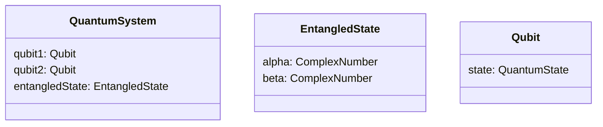
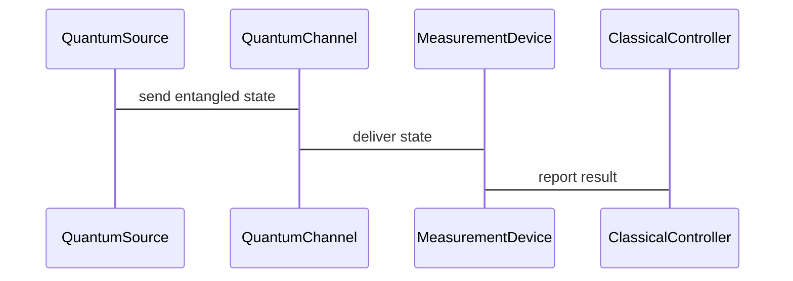

                 


# 芒格的"清晰思考"方法在量子纠缠通信策略制定中的运用

> **关键词**: 芒格、清晰思考、量子纠缠、通信策略、决策模型

> **摘要**: 本文探讨了芒格的“清晰思考”方法在量子纠缠通信策略制定中的应用。通过分析芒格的多元思维模型和决策框架，结合量子纠缠通信的基本原理和实际应用场景，提出了一种将芒格方法与量子通信技术相结合的策略制定方法。文章详细阐述了量子纠缠的数学模型、算法原理以及系统架构设计，并通过实际案例分析了芒格方法在量子通信中的具体应用，为量子通信领域提供了新的思路和解决方案。

---

## 第1章: 芒格的"清晰思考"方法概述

### 1.1 芒格的多元思维模型

#### 1.1.1 多元思维模型的定义
芒格的多元思维模型是一种将多个学科的基本原理融会贯通的方法。它强调通过跨学科的视角来理解问题，避免单一学科的局限性。例如，物理学中的能量守恒定律、经济学中的成本收益分析、心理学中的认知偏差等，都是芒格思维模型的重要组成部分。

#### 1.1.2 多元思维模型的核心要素
- **物理学原理**: 包括能量守恒、热力学定律等，帮助我们理解系统的运作机制。
- **经济学原理**: 包括成本收益分析、市场均衡等，帮助我们在决策中考虑经济因素。
- **心理学原理**: 包括认知偏差、行为模式等，帮助我们理解人类行为的影响。
- **数学原理**: 包括概率论、统计学等，帮助我们在不确定环境中进行决策。

#### 1.1.3 多元思维模型在决策中的应用
芒格认为，通过多元思维模型，我们可以更好地理解问题的本质，并在复杂环境中做出更明智的决策。例如，在商业决策中，结合物理学的杠杆原理和经济学的成本分析，可以帮助我们找到更高效的解决方案。

### 1.2 芒格的决策框架

#### 1.2.1 决策框架的构成
芒格的决策框架包括以下几个关键步骤：
1. **明确目标**: 确定决策的核心目标，避免偏离主题。
2. **分析关键因素**: 识别影响决策的关键因素，进行深入分析。
3. **权衡利弊**: 在多个选项中权衡利弊，选择最优解。
4. **持续验证**: 在决策实施后，持续跟踪结果，进行反馈和调整。

#### 1.2.2 决策框架的特点
- **系统性**: 强调从整体角度分析问题，避免局部优化。
- **实用性**: 适用于各种复杂场景，包括商业、技术等领域。
- **可调整性**: 在实施过程中，能够根据实际情况进行动态调整。

#### 1.2.3 决策框架的优缺点
优点：芒格的决策框架能够帮助我们系统地分析问题，避免遗漏关键因素，提高决策的准确性。
缺点：在复杂场景中，可能需要投入更多时间和资源，导致决策周期较长。

### 1.3 芒格的"清晰思考"方法

#### 1.3.1 清晰思考的定义
清晰思考是指通过逻辑推理和系统分析，准确理解问题本质，并制定合理解决方案的过程。

#### 1.3.2 清晰思考的核心步骤
1. **问题分解**: 将复杂问题分解为多个简单问题，逐一分析。
2. **逻辑推理**: 通过逻辑推理，找到问题之间的联系和影响因素。
3. **系统分析**: 从整体角度分析问题，识别关键因素和相互关系。
4. **决策制定**: 在系统分析的基础上，制定合理的解决方案。

#### 1.3.3 清晰思考与问题解决的关系
清晰思考是问题解决的核心方法。通过清晰思考，我们可以更深入地理解问题，找到更有效的解决方案。例如，在量子通信中，清晰思考可以帮助我们更好地理解量子纠缠的原理，并制定更有效的通信策略。

---

## 第2章: 量子纠缠通信概述

### 2.1 量子纠缠的基本概念

#### 2.1.1 量子纠缠的定义
量子纠缠是指两个或多个量子系统之间的特殊关联，使得其中一个系统的状态会直接影响另一个系统的状态，即使两者相隔很远。

#### 2.1.2 量子纠缠的科学基础
量子纠缠是量子力学中的基本现象，其核心在于量子态的叠加性和纠缠性。例如，两个量子比特可以处于一种纠缠态，使得它们的状态相互关联，无法单独描述。

#### 2.1.3 量子纠缠的实验验证
通过实验，如贝尔不等式测试，科学家验证了量子纠缠的存在，并证明了量子力学的正确性。

### 2.2 量子纠缠通信的应用场景

#### 2.2.1 量子通信的基本原理
量子通信利用量子纠缠的特性，通过量子态的传输实现信息的传递。其核心在于利用量子纠缠的不可分割性和安全性。

#### 2.2.2 量子纠缠在通信中的作用
量子纠缠可以用于实现量子密钥分发（QKD）和量子隐形传态等通信技术，确保通信的安全性和高效性。

#### 2.2.3 量子纠缠通信的优势
- **安全性**: 量子纠缠的不可分割性使得通信的安全性得到极大提升。
- **高效性**: 通过量子纠缠，可以实现信息的高效传输。
- **远距离传输**: 量子纠缠可以在远距离上传输信息，适用于全球通信。

### 2.3 量子纠缠通信的挑战

#### 2.3.1 技术实现的难点
量子纠缠的实现需要极高的技术精度，包括量子态的生成、传输和测量等。

#### 2.3.2 通信环境的影响
量子纠缠对环境条件非常敏感，任何外界干扰都可能影响通信的效果。

#### 2.3.3 安全性问题
尽管量子纠缠提供了更高的安全性，但在实际应用中，仍然需要解决潜在的安全漏洞和攻击手段。

---

## 第3章: 芒格的"清晰思考"方法与量子纠缠通信的结合

### 3.1 芒格方法在量子通信中的应用

#### 3.1.1 多元思维模型在量子通信中的应用
通过多元思维模型，我们可以从物理学、数学、信息科学等多个角度理解量子纠缠的原理和应用，从而制定更全面的通信策略。

#### 3.1.2 决策框架在量子通信中的作用
芒格的决策框架可以帮助我们在量子通信的策略制定中，系统地分析各种因素，确保决策的科学性和可行性。

#### 3.1.3 清晰思考方法在量子通信中的应用
通过清晰思考方法，我们可以更深入地理解量子纠缠的原理，并制定更有效的通信策略。

### 3.2 量子纠缠通信策略的制定

#### 3.2.1 量子通信策略的定义
量子通信策略是指为实现量子通信目标而制定的一系列行动计划和资源分配方案。

#### 3.2.2 量子通信策略的核心要素
- **技术实现**: 包括量子态的生成、传输和测量等技术。
- **安全性保障**: 确保通信的安全性和抗干扰能力。
- **资源分配**: 合理分配资源，确保通信的高效性。

#### 3.2.3 量子通信策略的制定步骤
1. **明确目标**: 确定通信的目标和需求。
2. **分析因素**: 识别影响通信的关键因素，如技术实现、环境条件等。
3. **权衡利弊**: 在多个方案中进行比较，选择最优解。
4. **持续验证**: 在实施过程中，持续跟踪效果，进行反馈和调整。

### 3.3 芒格方法在量子通信策略中的具体应用

#### 3.3.1 多元思维模型在策略制定中的应用
通过多元思维模型，我们可以从多个角度分析量子通信的问题，例如，从物理学的角度理解量子纠缠的原理，从信息科学的角度分析通信的技术实现。

#### 3.3.2 决策框架在策略制定中的作用
芒格的决策框架可以帮助我们系统地分析量子通信的策略，确保决策的科学性和可行性。

#### 3.3.3 清晰思考方法在策略制定中的应用
通过清晰思考方法，我们可以更深入地理解量子通信的原理，并制定更有效的通信策略。

---

## 第4章: 量子纠缠通信的数学模型与算法原理

### 4.1 量子纠缠的数学表示

#### 4.1.1 量子态的表示方法
量子态可以用Ket符号表示，例如，两个量子比特的纠缠态可以表示为：
$$|\psi\rangle = \frac{|0\rangle \otimes |1\rangle + |1\rangle \otimes |0\rangle}{\sqrt{2}}$$

#### 4.1.2 纠缠态的数学表达
纠缠态的数学表达式可以描述两个或多个量子系统之间的特殊关联。例如，两个量子比特的纠缠态可以表示为：
$$|\psi\rangle = \alpha|0\rangle \otimes |1\rangle + \beta|1\rangle \otimes |0\rangle$$
其中，$\alpha$ 和 $\beta$ 是复数系数，满足 $|\alpha|^2 + |\beta|^2 = 1$。

#### 4.1.3 量子纠缠的度量方法
量子纠缠的度量可以通过计算量子态的纯度和纠缠度来实现。例如，纯度的计算公式为：
$$P(\rho) = \text{Tr}(\rho^2)$$
其中，$\rho$ 是量子态的密度矩阵。

### 4.2 量子纠缠通信的算法原理

#### 4.2.1 量子通信的基本算法
量子通信的基本算法包括量子密钥分发（QKD）和量子隐形传态。例如，QKD的实现可以通过量子态的测量和经典信息的交换来完成。

#### 4.2.2 纠缠态生成的算法
纠缠态的生成可以通过量子电路来实现。例如，使用CNOT门和Hadamard门可以生成两个量子比特的纠缠态。

#### 4.2.3 纠缠态传输的算法
纠缠态的传输可以通过量子信道来实现。例如，利用光纤传输纠缠态的量子信息，并通过测量设备进行信息的提取。

### 4.3 芒格方法在算法设计中的应用
通过芒格的多元思维模型，我们可以从多个角度分析量子纠缠的算法设计，例如，从数学的角度理解量子态的表示，从信息科学的角度分析通信的技术实现。

---

## 第5章: 量子纠缠通信的系统分析与架构设计

### 5.1 问题场景介绍
量子纠缠通信的系统设计需要考虑多个因素，例如，量子态的生成、传输和测量，通信的安全性和高效性等。

### 5.2 系统功能设计

#### 5.2.1 领域模型Mermaid类图


### 5.3 系统架构设计

#### 5.3.1 Mermaid架构图


### 5.4 系统接口设计
量子通信系统需要设计多个接口，例如，量子源与量子信道之间的接口，测量设备与经典控制器之间的接口等。

### 5.5 系统交互设计

#### 5.5.1 Mermaid序列图


---

## 第6章: 项目实战

### 6.1 环境安装
需要安装量子计算库，例如，Qiskit库和Qutip库。

### 6.2 系统核心实现源代码

#### 6.2.1 量子态生成代码
```python
import numpy as np
from qiskit import QuantumCircuit, Aer, execute

def create_entangled_state(n_qubits):
    qc = QuantumCircuit(n_qubits)
    qc.h(0)
    qc.cx(0, 1)
    return qc

# 生成两个量子比特的纠缠态
qc = create_entangled_state(2)
backend = Aer.get_backend('statevector_simulator')
job = execute(qc, backend)
result = job.result()
state = result.get_statevector(qc)
print(state)
```

#### 6.2.2 量子态测量代码
```python
import numpy as np
from qiskit import QuantumCircuit, Aer, execute
from qiskit.visualization import plot_histogram

def measure_entangled_state(qc):
    # 添加测量部分
    qc.measure_all()
    backend = Aer.get_backend('qasm_simulator')
    job = execute(qc, backend)
    result = job.result()
    counts = result.get_counts(qc)
    return counts

qc = create_entangled_state(2)
counts = measure_entangled_state(qc)
print(counts)
plot_histogram(counts)
```

### 6.3 代码应用解读与分析
通过上述代码，我们可以生成和测量量子纠缠态，从而验证量子通信的基本原理。

### 6.4 实际案例分析和详细讲解剖析
通过实际案例分析，我们可以更好地理解量子纠缠通信的应用场景和实现过程。

### 6.5 项目小结
在实际项目中，需要综合考虑量子纠缠的生成、传输和测量等多个方面，确保通信的高效性和安全性。

---

## 第7章: 总结与展望

### 7.1 总结
本文探讨了芒格的“清晰思考”方法在量子纠缠通信策略制定中的应用。通过分析芒格的多元思维模型和决策框架，结合量子纠缠通信的基本原理和实际应用场景，提出了一种将芒格方法与量子通信技术相结合的策略制定方法。

### 7.2 展望
未来的研究方向可以包括：
- 进一步优化量子纠缠通信的算法设计。
- 探索芒格方法在量子通信中的更广泛应用。
- 研究量子决策科学的发展方向。

---

## 作者：AI天才研究院 & 禅与计算机程序设计艺术

---

通过以上结构，我们可以看到芒格的“清晰思考”方法在量子纠缠通信策略制定中的广泛应用和重要性。希望本文能够为量子通信领域的研究和实践提供新的思路和解决方案。

