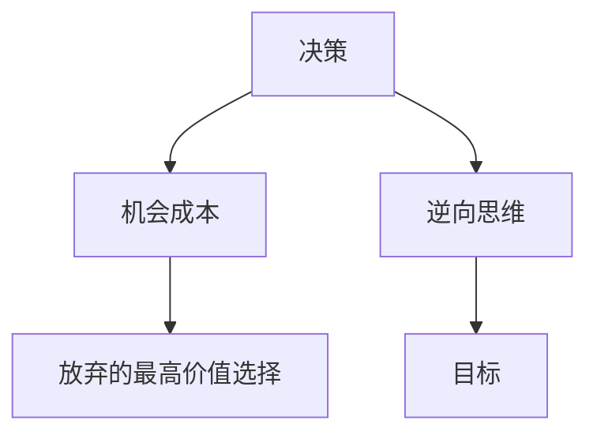
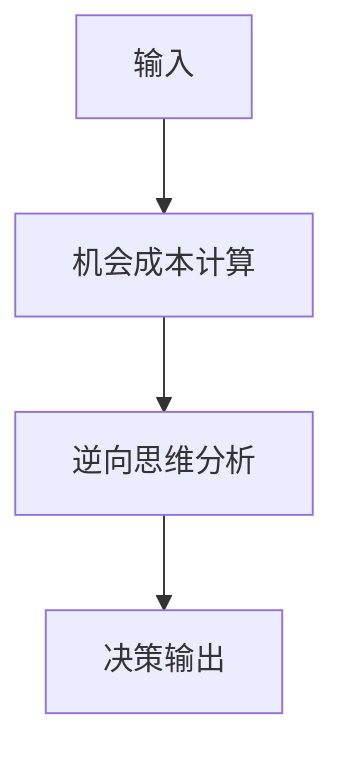
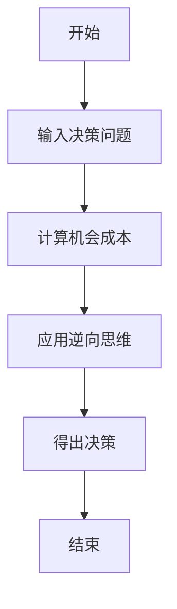

                 


# 芒格的清晰思考方法：提高决策质量

## 关键词
芒格、决策模型、机会成本、逆向思维、系统性思考

## 摘要
芒格以其独特的思考方法闻名，他的决策模型和系统性思维在多个领域被广泛应用。本文将深入探讨芒格的思考方法，分析其核心概念，并通过实际案例展示其在技术领域中的应用。通过本文，读者将学会如何运用芒格的方法来提高决策质量。

---

## 第一部分：芒格的思考方法概述

### 第1章：芒格的生平与思想体系

#### 1.1 芒格的生平简介
- **早年经历与教育背景**
  查理·芒格出生于美国密苏里州，早年在哈佛大学学习法律，后转学到加州大学伯克利分校，获得政治学学士学位。
- **职业生涯**
  芒格是伯克希尔哈撒韦公司的副主席，主要投资于价值低估的公司，注重长期价值。
- **思想成就**
  芒格以“ inversion”思维闻名，强调通过反向思考问题的本质。

#### 1.2 芒格的决策模型
- **机会成本**
  机会成本是指选择某项决策时放弃的其他可能收益。
  - **公式**：机会成本 = 放弃的最高价值选择
- **逆向思维**
  逆向思维是通过反向思考问题，从结果推导原因。
  - **步骤**：
    1. 确定目标
    2. 分析路径
    3. 制定行动
- **边际主义**
  边际分析帮助评估决策的增量价值。
  - **边际成本**：每增加一单位成本
  - **边际收益**：每增加一单位收益

#### 1.3 思考方法的特点
- **系统性思维**
  强调全局分析，避免局部最优。
- **非对称性思维**
  突出结果的不对称性，注重高概率事件。

#### 1.4 现实意义
- **提高决策质量**
  芒格的方法帮助避免错误，提升决策效率。
- **应用领域**
  适用于投资、管理、技术等领域。
- **局限性**
  需结合具体情况，不能机械应用。

### 第2章：芒格思考方法的核心概念

#### 2.1 机会成本的数学模型
- **定义与公式**
  机会成本是放弃的最高价值选择，公式化为：
  $$ \text{机会成本} = \max(\text{可选方案}) $$
- **应用实例**
  投资者选择股票时，放弃债券的机会成本需考虑。

#### 2.2 逆向思维的原理
- **目标导向**
  从结果出发，反向推导路径。
- **数学模型**
  $$ \text{逆向思维} = \text{目标} \rightarrow \text{路径} \rightarrow \text{行动} $$

#### 2.3 边际主义的应用
- **边际分析**
  通过分析边际成本和收益，优化决策。
  - **公式**：
    $$ \text{边际收益} = \text{额外收益} $$
    $$ \text{边际成本} = \text{额外成本} $$

#### 2.4 ER实体关系图


### 第3章：系统分析

#### 3.1 系统分析原理
- **定义**
  系统分析是将问题分解为子系统，分析各部分的相互作用。
- **步骤**
  1. 明确目标
  2. 分解问题
  3. 分析子系统
  4. 综合结果

#### 3.2 决策模型的架构设计
- **输入**
  决策问题、可选方案
- **处理逻辑**
  计算机会成本，应用逆向思维
- **输出**
  优化决策方案

#### 3.3 系统架构图


### 第4章：算法实现

#### 4.1 算法原理
- **机会成本计算**
  选择放弃的最高价值方案。
- **逆向思维**
  从目标反推行动方案。

#### 4.2 算法流程图


#### 4.3 Python实现
```python
def calculate_opportunity_cost(options):
    return max(options)

def reverse_thinking(goal):
    path = [step for step in reversed(goal)]
    return path
```

---

## 第二部分：芒格思考方法的实际应用

### 第5章：技术领域的应用

#### 5.1 投资决策
- **案例分析**
  通过分析一家科技公司的财务状况，应用芒格的方法进行投资决策。

#### 5.2 项目管理
- **流程优化**
  使用逆向思维优化项目流程，确保按时交付。

#### 5.3 软件开发
- **架构设计**
  系统性分析，确保代码的可维护性和扩展性。

### 第6章：培养清晰思考的能力

#### 6.1 训练思维
- **每日练习**
  每日进行逆向思维训练，提升分析能力。

#### 6.2 避免认知偏差
- **确认偏差**
  多角度验证，避免过度依赖单一信息。

### 第7章：最佳实践与注意事项

#### 7.1 实用技巧
- **记录思考过程**
  通过记录反思，优化决策过程。

#### 7.2 注意事项
- **结合实际情况**
  芒格方法需灵活应用，不能生搬硬套。

---

## 结论

芒格的思考方法为决策提供了系统化的框架，帮助我们在复杂环境中做出更明智的选择。通过实践这些方法，我们能够显著提升决策质量。

---

## 作者：AI天才研究院 & 禅与计算机程序设计艺术

---

这篇博客文章系统地介绍了芒格的思考方法，结合了技术领域的实际应用，提供了丰富的案例和详细的分析，帮助读者理解和应用这些方法。

