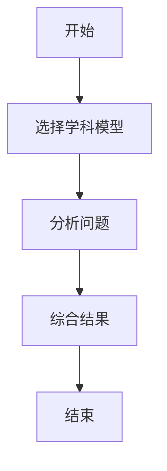
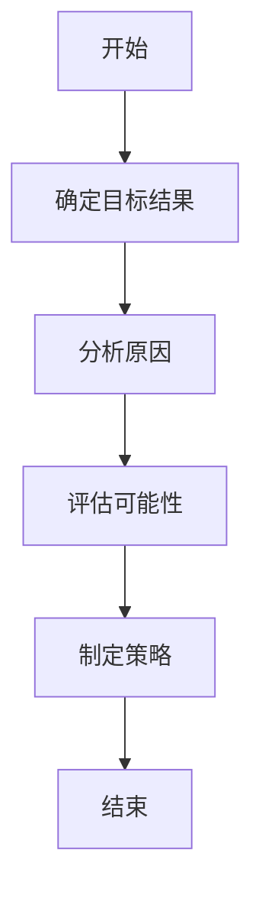
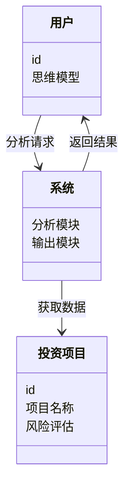

                 


# 芮格的"清晰思考"方法：提高投资分析的准确性

## 关键词
芒格，清晰思考，投资分析，决策框架，多元思维模型

## 摘要
本文详细介绍了芒格的“清晰思考”方法，探讨其在投资分析中的应用。通过分析芒格的核心概念、算法原理、数学模型和系统设计，结合实际案例，展示了如何通过清晰思考提高投资决策的准确性。

---

## 第一部分: 芮格的"清晰思考"方法概述

### 第1章: 芮格的"清晰思考"方法的背景介绍

#### 1.1 芮格"清晰思考"方法的起源

##### 1.1.1 芮格的生平简介
查理·芒格是著名投资者和伯克希尔哈撒韦公司副主席，以其投资理念和思维方式闻名。他的“清晰思考”方法结合了心理学、经济学和决策科学。

##### 1.1.2 芮格"清晰思考"方法的提出背景
传统投资分析常忽视认知偏差，芒格提出的方法旨在通过系统性思维减少错误，提高决策质量。

##### 1.1.3 芮格方法在投资分析中的应用
芒格的方法强调多元思维模型和逆向思维，帮助投资者全面分析问题。

#### 1.2 芮格"清晰思考"方法的核心概念

##### 1.2.1 "清晰思考"的定义
清晰思考是通过多角度分析问题，避免认知偏差，确保决策的准确性。

##### 1.2.2 "清晰思考"的特点
系统性、全面性、避免简化思维。

##### 1.2.3 "清晰思考"与传统思考方式的区别
传统思考常单一视角，芒格方法强调多维度分析。

#### 1.3 芮格"清晰思考"方法在投资分析中的应用

##### 1.3.1 投资分析中的问题背景
传统分析常忽略心理因素，导致决策失误。

##### 1.3.2 芮格方法如何解决投资分析中的问题
通过多元思维模型和逆向思维，全面评估投资标的。

##### 1.3.3 芮格方法的边界与外延
适用于长期投资，需结合市场变化调整策略。

---

## 第2章: 芮格"清晰思考"方法的核心概念与联系

### 2.1 芮格"清晰思考"方法的原理

#### 2.1.1 多元思维模型的解释
多元思维模型整合多个学科的思维方式，帮助全面分析问题。

#### 2.1.2 "倒置思维"的概念与应用
逆向思维，从结果出发，寻找原因，识别潜在风险。

#### 2.1.3 "第二性思维"的定义与作用
第二性思维关注问题的本质，而非表象，帮助识别关键因素。

### 2.2 芮格"清晰思考"方法的核心要素对比

#### 2.2.1 多元思维模型与单一思维模型的对比
| 特性 | 单一思维 | 多元思维 |
|------|---------|---------|
| 视角 | 单一     | 多维     |
| 优点 | 简单     | 全面     |
| 缺点 | 片面     | 复杂     |

#### 2.2.2 倒置思维与正向思维的对比
| 特性 | 正向思维 | 倒置思维 |
|------|---------|---------|
| 方向 | 原因→结果 | 结果→原因 |
| 优点 | 直观     | 深入     |
| 缺点 | 可能忽视反向影响 | 需更多数据支持 |

#### 2.2.3 第二性思维与第一性原理的对比
第一性原理从基础开始分析，第二性思维从现有情况反推，两者相辅相成。

### 2.3 芮格"清晰思考"方法的ER实体关系图
```mermaid
erDiagram
    user[投资者] {
        <属性>
        id : int
        思维模型 : varchar
        分析结果 : bool
    }
    investment[投资项目] {
        <属性>
        id : int
        项目名称 : varchar
        风险评估 : varchar
    }
    relationship(投资者--分析--投资项目)
```

---

## 第3章: 芮格"清晰思考"方法的算法原理

### 3.1 多元思维模型的算法原理

#### 3.1.1 多元思维模型的定义
整合多个学科的思维方式，全面分析问题。

#### 3.1.2 多元思维模型的实现步骤
1. 确定分析目标。
2. 选择相关学科模型。
3. 分析问题，识别关键因素。
4. 综合结果，得出结论。

#### 3.1.3 多元思维模型的mermaid流程图


### 3.2 倒置思维的算法原理

#### 3.2.1 倒置思维的定义
从结果出发，逆向分析问题。

#### 3.2.2 倒置思维的实现步骤
1. 确定目标结果。
2. 分析导致结果的原因。
3. 评估原因的可能性。
4. 制定应对策略。

#### 3.2.3 倒置思维的mermaid流程图


---

## 第4章: 芮格"清晰思考"方法的数学模型和公式

### 4.1 投资分析的数学模型

#### 4.1.1 投资回报率的计算
$$ ROI = \frac{净利润}{投资成本} \times 100\% $$

#### 4.1.2 风险评估的公式
$$ 风险 = \sum (概率 \times 影响) $$

### 4.2 决策过程的数学模型

#### 4.2.1 多元因素评估
$$ 总体评分 = \sum (权重_i \times 评分_i) $$

---

## 第5章: 芮格"清晰思考"方法的系统分析与架构设计

### 5.1 投资分析系统的功能需求

#### 5.1.1 系统功能模块
- 用户界面：输入投资标的。
- 分析模块：应用多元思维模型和逆向思维进行分析。
- 输出模块：显示分析结果。

#### 5.1.2 系统功能设计的mermaid类图


### 5.2 系统架构设计的mermaid架构图
```mermaid
archi
    节点 投资者
    节点 投资项目
    节点 系统
    投资者 --> 系统
    投资项目 --> 系统
```

---

## 第6章: 芮格"清晰思考"方法的项目实战

### 6.1 项目环境安装

#### 6.1.1 安装工具
安装Python和必要的库，如pandas、numpy。

#### 6.1.2 环境配置
设置虚拟环境，安装依赖。

### 6.2 系统核心实现源代码

#### 6.2.1 多元思维模型实现
```python
def multi_perspective_analysis(factor_list):
    results = []
    for factor in factor_list:
        results.append(analyze(factor))
    return results
```

#### 6.2.2 倒置思维实现
```python
def reverse_thinking(target):
    causes = identify_causes(target)
    return assess_impact(causes)
```

### 6.3 案例分析与结果解读

#### 6.3.1 分析苹果公司
分析苹果公司的财务状况、市场地位、技术创新等因素，应用芒格的方法评估投资价值。

#### 6.3.2 结果解读
分析结果表明，苹果公司在技术创新和市场地位方面具有优势，但需关注竞争压力和市场变化。

---

## 第7章: 芮格"清晰思考"方法的最佳实践

### 7.1 小结

芒格的“清晰思考”方法通过系统性和全面性分析，帮助投资者提高决策准确性。

### 7.2 注意事项

- 定期更新知识库。
- 结合市场变化调整策略。
- 注意数据质量和分析深度。

### 7.3 拓展阅读

推荐书籍：《芒格的决策智慧》、《投资的思维模型》。

---

## 作者
作者：AI天才研究院 & 禅与计算机程序设计艺术

---

通过以上结构，文章详细讲解了芒格的“清晰思考”方法，并结合实际案例和系统设计，帮助读者掌握投资分析的准确性。

