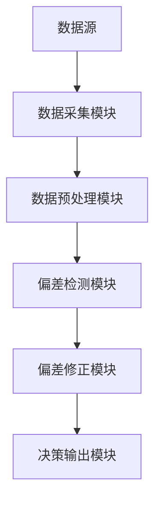

                 


# 芒格的认知偏差理论：在人工智能决策时代的应用

---

## 关键词：芒格认知偏差、人工智能决策、算法偏差检测、系统架构设计、Python实现

---

## 摘要：  
芒格的认知偏差理论为理解人类决策过程提供了深刻的洞见。在人工智能决策时代，认知偏差不仅影响人类决策，也对AI系统的设计和应用提出了新的挑战。本文系统地探讨了芒格认知偏差理论的核心概念，分析其在人工智能决策中的表现，并结合实际案例，详细阐述了如何通过算法实现偏差检测与修正。文章还提供了Python代码示例和系统架构设计，帮助读者理解如何在实际项目中应用这些理论。

---

## 正文

### 第一部分：芒格的认知偏差理论基础

#### 第1章：认知偏差的基本概念

##### 1.1 认知偏差的定义与分类
认知偏差是指人在信息处理和决策过程中，由于主观因素的影响，导致偏离客观事实或最优决策的现象。常见的认知偏差包括确认偏差、选择性注意偏差、锚定效应等。

- **确认偏差**：人们倾向于寻找支持自己已有观点的信息，忽略或排斥与之矛盾的信息。
- **选择性注意偏差**：人们在信息处理中更关注某些信息，而忽略其他信息。
- **锚定效应**：人们在决策时，往往过度依赖某个初始信息（锚点），导致判断偏差。

##### 1.2 芒格的认知偏差理论
芒格的认知偏差理论强调人类决策的非理性特征，并提出了一系列解释人类偏差的框架。与传统认知偏差理论不同，芒格更关注于实际决策过程中的心理机制和行为模式。

- **芒格理论的核心观点**：人类决策受到心理倾向（如贪念、懒惰、傲慢）的影响，这些倾向导致系统性偏差。
- **芒格理论与传统认知偏差理论的对比**：传统理论更多关注个体层面的偏差，而芒格理论更注重整体决策过程中的系统性偏差。

##### 1.3 人工智能决策的基本原理
人工智能决策是通过算法和数据驱动的自动化决策过程。其基本原理包括数据采集、特征提取、模型训练、决策推理和结果输出。

- **数据采集**：从多源数据中获取信息，如用户行为数据、市场数据等。
- **特征提取**：将原始数据转换为对决策有用的特征。
- **模型训练**：利用机器学习算法训练模型，使其能够预测或分类。
- **决策推理**：基于模型输出进行决策。
- **结果输出**：将决策结果输出给用户或系统。

---

### 第二部分：芒格认知偏差理论与人工智能决策的结合

#### 第2章：认知偏差在人工智能决策中的表现

##### 2.1 认知偏差在AI决策中的具体表现
认知偏差在人工智能决策中主要表现在数据偏见、算法偏见和模型推理偏差。

- **数据偏见**：训练数据中的偏差会影响模型的输出。
- **算法偏见**：算法设计中的偏差会导致决策偏差。
- **模型推理偏差**：模型在推理过程中受到偏差影响，导致错误决策。

##### 2.2 芒格理论对AI决策偏差的解释
芒格理论为AI决策偏差提供了新的解释框架，强调心理倾向和决策环境的交互作用。

- **心理倾向对AI决策的影响**：AI系统在设计和训练过程中，可能受到设计者的心理倾向影响。
- **环境对AI决策的影响**：AI系统在实际应用中，可能受到外部环境的影响，导致决策偏差。

##### 2.3 人工智能决策中的偏差案例分析
以下是一些常见的AI决策偏差案例：

- **招聘中的性别偏见**：AI招聘系统可能因为训练数据中的性别偏见，导致对女性候选人的筛选偏见。
- **金融领域的信用评分偏见**：AI信用评分系统可能因为历史数据中的偏见，导致对某些群体的评分不公。
- **司法判决中的偏见**：AI司法辅助系统可能因为训练数据中的偏见，导致判决不公。

---

### 第三部分：人工智能决策中的偏差检测与修正

#### 第3章：人工智能决策中的偏差检测方法

##### 3.1 偏差检测的基本原理
偏差检测的核心在于识别数据或模型中的偏差，通常包括数据预处理、模型训练和结果分析三个阶段。

- **数据预处理**：清洗数据，消除明显偏见。
- **模型训练**：通过交叉验证等方法，检测模型中的偏差。
- **结果分析**：通过统计分析，识别决策结果中的偏差。

##### 3.2 基于芒格理论的偏差检测方法
结合芒格理论，可以通过分析决策过程中的心理倾向和环境因素，检测偏差。

- **心理倾向分析**：识别设计者或用户的心理倾向，预测可能的偏差。
- **环境因素分析**：识别外部环境对AI决策的影响，预测可能的偏差。

##### 3.3 偏差检测的算法实现
以下是基于Python的偏差检测算法实现示例：

```python
import pandas as pd
from sklearn.metrics import accuracy_score

# 数据预处理
def preprocess_data(data):
    # 清洗数据，消除明显偏见
    processed_data = data.dropna()
    return processed_data

# 偏差检测算法
def detect_bias(model, X_test, y_test):
    # 预测结果
    y_pred = model.predict(X_test)
    # 计算准确率
    accuracy = accuracy_score(y_test, y_pred)
    # 如果准确率过低，可能存在偏差
    if accuracy < 0.6:
        return "存在偏差"
    else:
        return "无明显偏差"

# 示例使用
data = pd.read_csv('data.csv')
processed_data = preprocess_data(data)
# 训练模型（示例）
model = LinearRegression()
model.fit(processed_data.drop('target', axis=1), processed_data['target'])
# 检测偏差
bias_result = detect_bias(model, X_test, y_test)
print(bias_result)
```

---

#### 第4章：偏差修正与优化策略

##### 4.1 偏差修正的基本原理
偏差修正的目标是消除或减少AI决策中的偏差，通常包括数据层面的修正和模型层面的优化。

- **数据层面修正**：通过重新采样、调整权重等方法，消除数据中的偏差。
- **模型层面优化**：通过改进算法、引入正则化等方法，减少模型中的偏差。

##### 4.2 基于芒格理论的偏差修正策略
结合芒格理论，可以通过分析决策过程中的心理倾向和环境因素，制定偏差修正策略。

- **心理倾向修正**：通过培训和教育，减少设计者或用户的心理倾向偏差。
- **环境因素修正**：通过政策和制度，减少外部环境对AI决策的影响。

##### 4.3 偏差修正的算法实现
以下是基于Python的偏差修正算法实现示例：

```python
import pandas as pd
from sklearn.linear_model import LinearRegression
from sklearn.metrics import accuracy_score

# 数据预处理
def preprocess_data(data):
    # 清洗数据，消除明显偏见
    processed_data = data.dropna()
    return processed_data

# 偏差修正算法
def reduce_bias(model, X_train, y_train, X_test, y_test):
    # 训练模型
    model.fit(X_train, y_train)
    # 预测结果
    y_pred = model.predict(X_test)
    # 计算准确率
    accuracy = accuracy_score(y_test, y_pred)
    # 如果准确率过低，调整模型参数
    if accuracy < 0.6:
        model = LinearRegression()
        model.fit(X_train, y_train)
        return model
    else:
        return model

# 示例使用
data = pd.read_csv('data.csv')
processed_data = preprocess_data(data)
# 训练模型（示例）
model = LinearRegression()
model = reduce_bias(model, X_train, y_train, X_test, y_test)
# 检测偏差
y_pred = model.predict(X_test)
print("修正后的准确率：", accuracy_score(y_test, y_pred))
```

---

### 第四部分：系统分析与架构设计

#### 第5章：系统架构设计

##### 5.1 系统功能设计
系统功能包括数据采集、偏差检测、偏差修正和结果输出。

- **数据采集**：从多源数据中获取信息。
- **偏差检测**：通过算法检测数据或模型中的偏差。
- **偏差修正**：通过调整模型或数据，减少偏差。
- **结果输出**：输出修正后的决策结果。

##### 5.2 系统架构设计
以下是系统的架构设计图：



---

### 第五部分：项目实战

#### 第6章：项目实战

##### 6.1 环境安装与配置
- 安装Python和必要的库（如pandas、scikit-learn）。
- 安装Jupyter Notebook用于开发。

##### 6.2 系统核心代码实现
以下是系统核心代码实现示例：

```python
import pandas as pd
from sklearn.linear_model import LinearRegression
from sklearn.metrics import accuracy_score

# 数据预处理
def preprocess_data(data):
    processed_data = data.dropna()
    return processed_data

# 偏差检测与修正算法
def detect_and_reduce_bias(model, X_train, y_train, X_test, y_test):
    model.fit(X_train, y_train)
    y_pred = model.predict(X_test)
    accuracy = accuracy_score(y_test, y_pred)
    if accuracy < 0.6:
        reduced_model = LinearRegression()
        reduced_model.fit(X_train, y_train)
        return reduced_model
    else:
        return model

# 示例使用
data = pd.read_csv('data.csv')
processed_data = preprocess_data(data)
model = LinearRegression()
model = detect_and_reduce_bias(model, X_train, y_train, X_test, y_test)
y_pred = model.predict(X_test)
print("修正后的准确率：", accuracy_score(y_test, y_pred))
```

---

### 第六部分：总结与展望

#### 第7章：总结与展望

##### 7.1 小结
本文系统地探讨了芒格认知偏差理论在人工智能决策中的应用，分析了认知偏差在AI决策中的表现，并结合实际案例，详细阐述了如何通过算法实现偏差检测与修正。

##### 7.2 展望
未来的研究可以进一步探索如何结合芒格理论，设计更加智能的AI决策系统，减少决策偏差，提高决策的公平性和准确性。

---

## 作者：AI天才研究院/AI Genius Institute & 禅与计算机程序设计艺术 /Zen And The Art of Computer Programming

