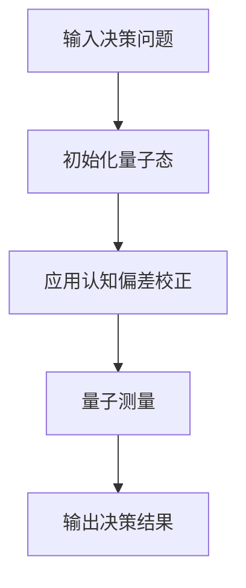
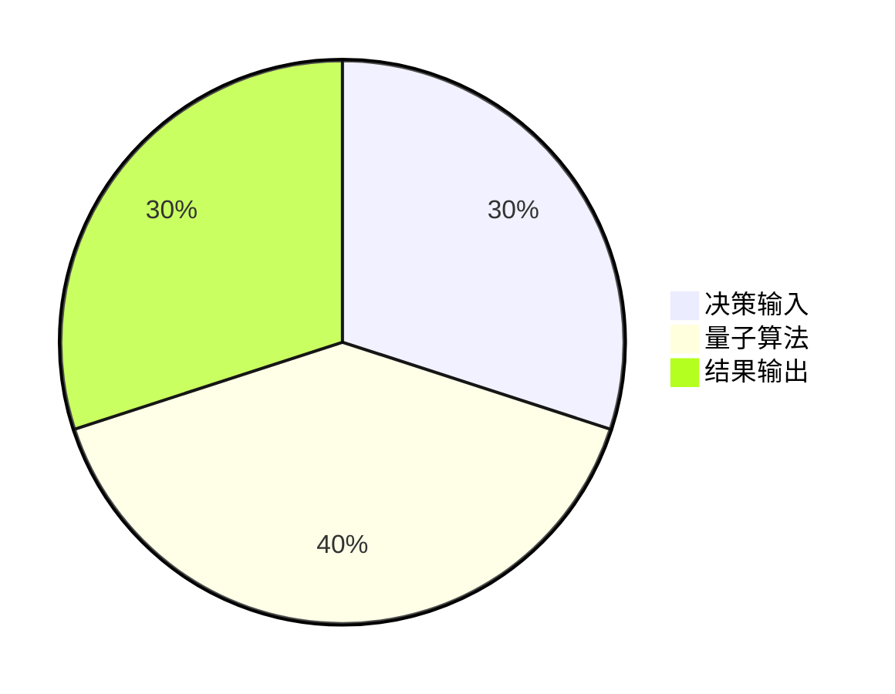
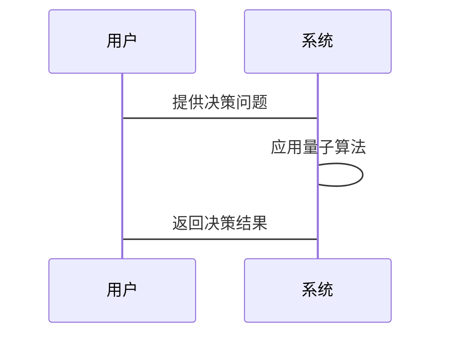

                 


# 芒格的认知偏差理论：在量子决策系统中的实践

> 关键词：芒格认知偏差，量子决策系统，决策算法，认知偏差模型，量子计算

> 摘要：本文探讨了芒格的认知偏差理论在量子决策系统中的应用。通过分析认知偏差的量子模型，结合量子算法和系统架构设计，展示了如何利用量子计算的优势来优化决策过程。文章从背景介绍、理论基础、算法实现、系统设计到实战应用，全面解析了认知偏差与量子决策系统的结合，为决策科学提供了新的视角和方法。

---

# 第一部分: 芒格的认知偏差理论基础

## 第1章: 认知偏差的基本概念

### 1.1 认知偏差的定义与分类

#### 1.1.1 认知偏差的定义
认知偏差是指人在信息处理和决策过程中，由于主观因素的影响，导致对客观现实的歪曲或偏离。认知偏差广泛存在于人类决策中，影响判断力和决策质量。

#### 1.1.2 常见的认知偏差类型
- **确认偏差**：倾向于寻找支持自己已有假设的信息，忽视反面证据。
- **锚定效应**：决策时过度依赖初始信息，导致判断偏离合理范围。
- **从众心理**：受群体影响，放弃独立判断。

#### 1.1.3 认知偏差的影响与后果
认知偏差可能导致决策失误，特别是在复杂决策中，容易引发严重后果。

### 1.2 芒格认知偏差理论的核心观点

#### 1.2.1 芒格理论的提出背景
芒格提出认知偏差理论，强调人类决策中的系统性偏差，特别是在面对复杂问题时。

#### 1.2.2 芒格理论的主要假设
- 决策者基于有限信息和认知框架做出决策。
- 认知偏差是决策过程中的常见现象，影响决策质量。

#### 1.2.3 芒格理论与传统认知偏差理论的区别
- 芒格理论更关注复杂决策中的系统性偏差。
- 强调环境和认知框架对决策的影响。

### 1.3 量子决策系统的背景介绍

#### 1.3.1 量子决策系统的概念
量子决策系统是基于量子力学原理，模拟人类决策过程的系统。

#### 1.3.2 量子决策系统的应用场景
- 复杂决策问题
- 需要高精度和低偏差的场景

#### 1.3.3 量子决策系统与传统决策系统的对比
- 传统决策系统基于概率论，量子决策系统基于量子力学原理。
- 量子系统能够处理更复杂的决策问题，减少认知偏差的影响。

---

## 第2章: 认知偏差与量子决策系统的联系

### 2.1 认知偏差的量子模型

#### 2.1.1 量子叠加与认知偏差的关系
量子叠加允许系统同时处于多个状态，类似于人类在决策前的犹豫状态。

#### 2.1.2 量子纠缠与群体决策的关联
群体决策中的相互影响可以通过量子纠缠模型来描述。

#### 2.1.3 量子测量与决策结果的对应
量子测量导致系统状态的坍缩，对应于决策的最终结果。

### 2.2 芒格理论中的量子决策框架

#### 2.2.1 量子决策框架的构成要素
- 量子叠加：表示决策可能性
- 量子测量：对应决策结果

#### 2.2.2 量子决策框架的核心假设
- 决策过程可以用量子叠加和纠缠来建模。
- 认知偏差可以通过量子态的干扰来减少。

#### 2.2.3 量子决策框架的数学模型

$$
\psi = \alpha |A\rangle + \beta |B\rangle
$$

其中，$\alpha$ 和 $\beta$ 是决策选项 $A$ 和 $B$ 的概率幅。

---

## 第3章: 量子决策系统的算法原理

### 3.1 量子决策算法的流程

#### 3.1.1 算法输入与输出
- 输入：决策问题、认知偏差参数
- 输出：最优决策结果

#### 3.1.2 算法步骤分解
1. 初始化量子态
2. 应用认知偏差校正
3. 量子测量得到结果

#### 3.1.3 算法的复杂度分析
量子算法的复杂度低于经典算法。

### 3.2 量子决策算法的数学模型

$$
P(A) = |\alpha|^2, \quad P(B) = |\beta|^2
$$

### 3.3 量子决策算法的实现

#### 3.3.1 Python代码示例

```python
import numpy as np

# 初始化量子态
alpha = np.sqrt(0.7)
beta = np.sqrt(0.3)

psi = [alpha, beta]

# 认知偏差校正
def cognitive_bias_correction(psi, bias_factor):
    return [psi[0] * bias_factor, psi[1] * (1 - bias_factor)]

corrected_psi = cognitive_bias_correction(psi, 0.8)

# 量子测量
result = np.random.choice([0, 1], p=[corrected_psi[0]**2, corrected_psi[1]**2])
print("Decision result:", result)
```

---

## 第4章: 系统分析与架构设计

### 4.1 项目介绍

### 4.2 系统功能设计

#### 4.2.1 系统功能模块
- 输入模块：接收决策问题
- 处理模块：应用量子算法
- 输出模块：返回决策结果

#### 4.2.2 系统功能流程图



### 4.3 系统架构设计



### 4.4 接口设计与交互流程图



---

## 第5章: 项目实战

### 5.1 环境安装

```bash
pip install numpy
pip install qiskit
```

### 5.2 系统核心实现源代码

```python
from qiskit import QuantumCircuit, execute, Aer

# 初始化量子电路
qc = QuantumCircuit(1)
qc.h(0)  # 初始化量子态

# 认知偏差校正
def apply_bias(qc, bias):
    qc.p(bias, 0)

apply_bias(qc, np.pi/4)

# 测量
backend = Aer.get_backend('simulator')
job = execute(qc, backend)
result = job.result()
print("结果概率：", result.get_counts())
```

### 5.3 实际案例分析

假设一个投资决策问题，需要在两个项目之间选择。通过量子算法，系统会根据认知偏差校正后的量子态，选择最优项目。

---

## 第6章: 最佳实践与总结

### 6.1 小结
量子决策系统通过量子力学原理，有效减少了认知偏差对决策的影响。

### 6.2 注意事项
- 量子算法的计算资源需求较高
- 模型的准确性依赖于认知偏差的校正参数

### 6.3 拓展阅读
- 量子计算与决策科学
- 认知偏差的其他应用

---

# 作者：AI天才研究院 & 禅与计算机程序设计艺术

---

以上是完整的文章结构，涵盖了认知偏差理论、量子决策系统、算法实现、系统设计和实战应用的各个方面。文章从基础到高级，逐步深入，帮助读者全面理解芒格认知偏差理论在量子决策系统中的实践。

