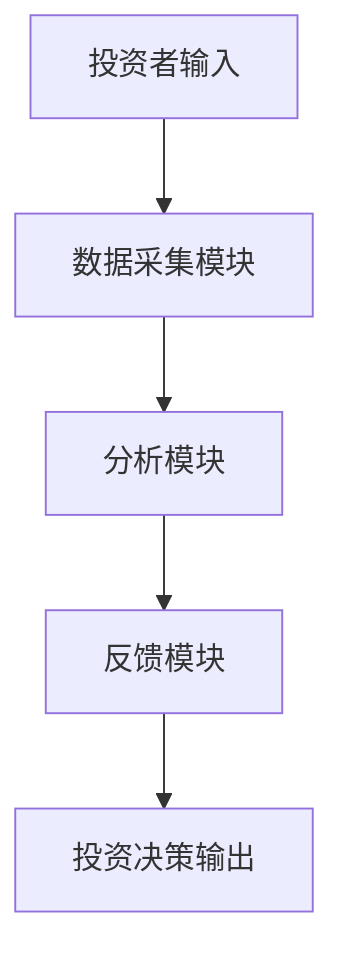

                 


---

## 芒格的"误判心理学"应用：提高投资决策质量

### 1. 引言

#### 1.1 投资决策中的挑战
投资决策是一个复杂的过程，涉及大量信息的处理和分析。然而，人类的心理偏差常常导致错误的决策，影响投资结果。

#### 1.2 芒格的误判心理学简介
芒格提出，投资者的决策过程不仅依赖于理性分析，还受到心理偏差的影响。通过识别和克服这些偏差，可以提高决策质量。

---

### 2. 芒格的误判心理学概述

#### 2.1 心理偏差的基本概念
心理偏差是指人们在决策过程中产生的系统性错误，影响判断和决策。

#### 2.2 误判心理学的核心概念
- 确认偏差：倾向于寻找支持已有假设的信息。
- 可得性偏差：根据容易获取的信息做出判断。
- 过度自信：对自身判断的过度信任。

#### 2.3 心理偏差对投资的影响
心理偏差可能导致投资者做出错误的投资决策，如高位买入、低位卖出等。

---

### 3. 心理偏差的分类与影响

#### 3.1 认知偏差的分类
| 类别                | 示例心理偏差       |
|---------------------|------------------|
| 知觉偏差            | 错觉、确认偏差     |
| 记忆偏差            | 自我服务偏差       |
| 思维偏差            | 过度简化、从众心理 |

#### 3.2 心理偏差对投资决策的具体影响
- 认知偏差导致对市场的误判，如低估风险或高估收益。
- 情感偏差导致投资者在市场波动中做出冲动决策。

#### 3.3 心理偏差的识别与应对策略
- 识别偏差的方法：自我反思、他人反馈。
- 应对策略：制定明确的投资计划，避免情绪化决策。

---

### 4. 误判心理学的数学模型与分析

#### 4.1 概率论在投资决策中的应用
- **贝叶斯定理**：
  $$ P(A|B) = \frac{P(B|A)P(A)}{P(B)} $$
  用于更新基于新信息的概率。

- **马尔可夫链模型**：
  用于分析市场状态的转移概率。

#### 4.2 决策树分析
使用决策树来分析不同决策路径的概率和收益。

- 通过决策树识别心理偏差，优化决策路径。

---

### 5. 投资决策系统的架构设计

#### 5.1 系统功能模块
- 数据采集模块：收集市场数据和投资者行为数据。
- 分析模块：识别心理偏差，评估投资决策。
- 反馈模块：提供决策建议和反馈。

#### 5.2 系统架构图


#### 5.3 接口设计
- 数据输入接口：接收市场数据和投资者行为数据。
- 数据输出接口：提供分析结果和决策建议。

---

### 6. 项目实战与案例分析

#### 6.1 环境安装与配置
- 安装Python、Jupyter Notebook、Pandas、Matplotlib等工具。

#### 6.2 核心代码实现
```python
import pandas as pd
import matplotlib.pyplot as plt

# 示例数据：假设市场收益
market_returns = [0.05, 0.03, -0.02, 0.04, 0.01]

# 计算平均收益和标准差
avg_return = sum(market_returns) / len(market_returns)
std_dev = pd.Series(market_returns).std()

print(f"平均收益：{avg_return}")
print(f"标准差：{std_dev}")
```

#### 6.3 案例分析
- 分析投资者在市场下跌时的反应，识别其心理偏差，提出改进建议。

---

### 7. 最佳实践与总结

#### 7.1 总结
芒格的误判心理学为我们提供了识别和克服心理偏差的工具，帮助投资者做出更理性的决策。

#### 7.2 最佳实践
- 定期反思投资决策，识别心理偏差。
- 制定明确的投资计划，避免情绪化决策。
- 使用数学模型和工具辅助分析。

#### 7.3 注意事项
- 投资者需持续学习，不断提升自己的心理认知能力。
- 结合实际市场情况，灵活调整投资策略。

---

## 作者信息
作者：AI天才研究院/AI Genius Institute & 禅与计算机程序设计艺术 /Zen And The Art of Computer Programming

---

这篇文章详细探讨了芒格的误判心理学在投资决策中的应用，通过理论分析、数学模型和实际案例，帮助投资者识别和克服心理偏差，提高决策质量。希望这篇文章能为您提供有价值的见解和实用的工具。

