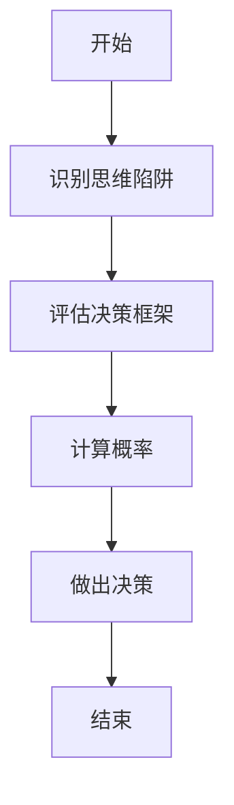
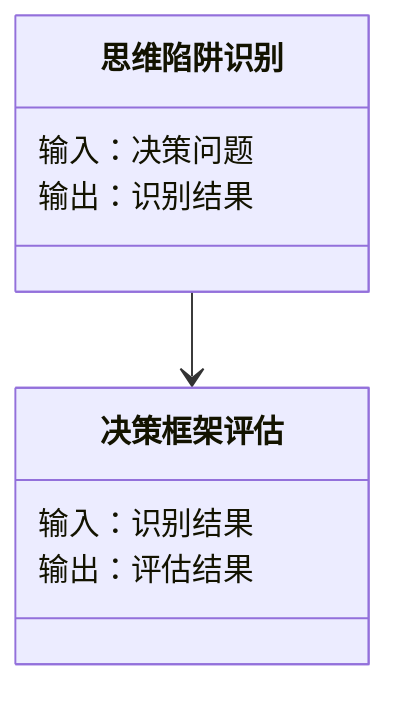
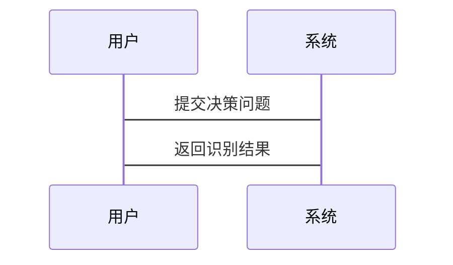

                 


# 芒格的"误判心理学"：避免常见的思维陷阱

> 关键词：芒格，误判心理学，思维陷阱，决策框架，系统防御机制

> 摘要：本文深入探讨芒格的误判心理学，帮助读者识别和避免常见的思维陷阱，提升决策能力。通过理论分析、算法实现和项目实战，结合系统设计和最佳实践，详细解读芒格的决策框架，提供实用的策略和工具。

---

# 第一部分：芒格的误判心理学概述

## 第1章：芒格的误判心理学背景介绍

### 1.1 问题背景与问题描述

#### 1.1.1 人类决策中的常见问题
在决策过程中，人类常常面临各种心理偏差，如确认偏差、从众心理、锚定效应等，这些偏差可能导致错误的决策。芒格的误判心理学为我们提供了一种系统的方法来识别和避免这些陷阱。

#### 1.1.2 误判心理学的核心概念
误判心理学研究的是人类在决策过程中因心理偏差而导致的错误判断。芒格总结了多种常见的思维陷阱，并提出了系统的解决方案。

#### 1.1.3 芒格思想的现实意义
芒格的思想不仅在投资领域，还在商业、个人决策等领域具有广泛的应用。通过理解这些心理偏差，我们可以更理性地做出决策。

### 1.2 问题解决与边界分析

#### 1.2.1 误判心理学的解决路径
芒格提出了一系列方法，如“清单式决策框架”，帮助人们系统地识别和避免思维陷阱。

#### 1.2.2 问题的边界与外延
误判心理学的研究范围不仅限于个体决策，还包括团队和组织层面的决策偏差。

#### 1.2.3 核心概念的结构与组成
误判心理学的核心概念包括认知偏差、决策框架、系统性思维等。

### 1.3 本章小结
本章介绍了芒格误判心理学的背景和核心概念，为后续章节的深入分析奠定了基础。

---

## 第2章：芒格的误判心理学核心概念与联系

### 2.1 核心概念原理

#### 2.1.1 心理误判的定义与特征
心理误判是指因心理偏差导致的错误判断。常见的偏差包括确认偏差、锚定效应等。

#### 2.1.2 芒格的决策框架
芒格的决策框架强调系统性和多维度思考，避免单一视角导致的误判。

### 2.2 常见思维陷阱对比表格

| 思维陷阱 | 描述 | 示例 |
|----------|------|------|
| 确认偏差 | 过度关注支持自己观点的信息 | 投资者只关注支持自己决策的信息 |
| 锚定效应 | 过度依赖初始信息 | 价格谈判中对第一个报价的过度关注 |

### 2.3 ER实体关系图

```mermaid
er
  class 芒格决策框架 {
    id
    名称
    描述
  }
  class 思维陷阱 {
    id
    名称
    类型
  }
  class 决策偏差 {
    id
    名称
    影响
  }
  芒格决策框架 --> 思维陷阱: 包含
  思维陷阱 --> 决策偏差: 引发
```

### 2.4 本章小结
本章通过定义和对比，详细分析了心理误判的核心概念，并通过图表展示了它们之间的关系。

---

## 第3章：芒格的决策框架与算法原理

### 3.1 决策框架的数学模型

芒格的决策框架可以表示为一个概率模型，其中每个决策节点的概率影响最终的决策结果。

$$ P(正确决策) = \sum_{i=1}^{n} P(正确|思维框架_i) \cdot P(\text{选择框架}_i) $$

### 3.2 算法原理流程图



### 3.3 算法实现与代码示例

```python
def m芒格决策框架(决策问题):
    思维陷阱 = 识别思维陷阱(决策问题)
    框架评估 = 评估决策框架(思维陷阱)
    概率计算 = 计算概率(框架评估)
    return 做出决策(概率计算)

def 识别思维陷阱(问题):
    # 实现识别思维陷阱的逻辑
    pass

def 评估决策框架(陷阱):
    # 实现评估决策框架的逻辑
    pass

def 计算概率(评估):
    # 实现计算概率的逻辑
    pass

def 做出决策(概率):
    # 实现做出决策的逻辑
    pass
```

### 3.4 本章小结
本章通过数学模型和算法流程图，详细解释了芒格决策框架的实现过程。

---

## 第4章：系统的心理防御机制

### 4.1 心理防御机制的系统分析

#### 4.1.1 系统功能设计
心理防御机制的设计目标是识别和纠正决策中的偏差。

#### 4.1.2 系统架构设计


#### 4.1.3 系统接口设计
系统接口包括输入接口（决策问题）和输出接口（识别结果）。

#### 4.1.4 系统交互设计


### 4.2 本章小结
本章通过系统设计和交互图，展示了如何构建心理防御机制。

---

## 第5章：项目实战——芒格决策框架的应用

### 5.1 项目环境与工具安装

#### 5.1.1 环境配置
安装Python和必要的数据分析库（如Pandas、NumPy）。

### 5.2 核心功能实现

#### 5.2.1 代码实现
```python
def 识别思维陷阱(问题):
    # 示例代码
    return "确认偏差"

def 评估决策框架(陷阱):
    return "高风险"

def 计算概率(评估):
    return 0.8

def 做出决策(概率):
    return "避免该决策"
```

### 5.3 案例分析与解读

#### 5.3.1 投资决策中的误判分析
通过分析实际案例，识别潜在的思维陷阱，并应用芒格框架进行决策。

### 5.4 本章小结
本章通过实战案例，展示了芒格决策框架的应用过程。

---

## 第6章：最佳实践

### 6.1 小结与注意事项
- 定期反思决策过程，识别潜在的思维陷阱。
- 结合芒格的决策框架，系统性地分析问题。

### 6.2 拓展阅读
推荐阅读芒格的著作《穷查理宝典》，深入理解其思想。

### 6.3 练习与思考
通过练习题巩固所学知识，提升决策能力。

---

# 作者：AI天才研究院 & 禅与计算机程序设计艺术

---

这篇文章系统地介绍了芒格的误判心理学，结合理论分析和实际应用，帮助读者提升决策能力。通过详细的章节划分和丰富的示例，文章内容详实，逻辑清晰，为读者提供了实用的决策工具和方法。

