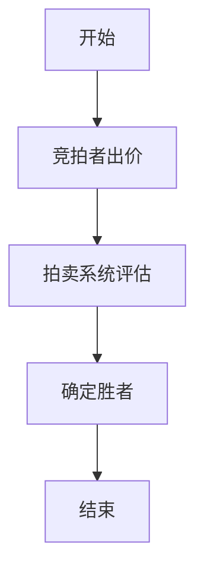
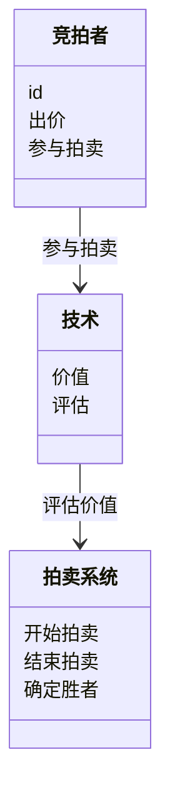
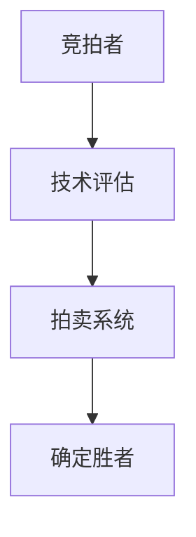

                 


# 芒格的"赢家的诅咒"提醒在前沿科技拍卖中的应用

## 关键词：芒格、赢家的诅咒、拍卖机制、前沿科技、VCG机制、系统架构、优化算法

## 摘要

本文探讨了芒格提出的“赢家的诅咒”在前沿科技拍卖中的应用。通过分析拍卖机制的数学模型和系统架构，本文揭示了如何避免赢家支付过高的问题，并提出了优化算法。结合实际案例和系统设计，本文为前沿科技拍卖提供了一种新的解决方案。

---

## 第1章: "赢家的诅咒"的核心概念

### 1.1 什么是"赢家的诅咒"

#### 1.1.1 问题背景与定义

“赢家的诅咒”是指在拍卖中，获胜者往往支付的价格超过实际价值，导致亏损。这种现象在前沿科技领域尤为明显，因为技术创新的不确定性较高。

#### 1.1.2 问题描述与表现形式

- 价格过高导致亏损。
- 技术创新的不确定性增加风险。

#### 1.1.3 问题解决的必要性与目标

- 避免支付过高价格。
- 优化拍卖机制，确保公平合理。

### 1.2 芒格"赢家的诅咒"的核心要素

#### 1.2.1 核心概念的结构与组成

- 价值评估：技术的真实价值。
- 竞拍行为：竞拍者的出价策略。

#### 1.2.2 相关概念的对比分析

| 概念       | 描述                                   |
|------------|----------------------------------------|
| VCG机制    | 确保每个参与者支付的最小金额         |
| 传统拍卖    | 可能导致赢家支付过高                 |

#### 1.2.3 ER实体关系图

```mermaid
erDiagram
    participant 竞拍者 {
        <属性>
        id
        出价
    }
    participant 技术 {
        <属性>
        价值
        评估
    }
    participant 拍卖系统 {
        <操作>
        开始拍卖
        结束拍卖
    }
   竞拍者 --> 技术 : 参与拍卖
```

---

## 第2章: 前沿科技拍卖的基本原理

### 2.1 前沿科技拍卖的定义与分类

#### 2.1.1 定义

前沿科技拍卖是指通过拍卖方式分配技术资源或成果的过程。

#### 2.1.2 分类

- 技术转让拍卖。
- 技术开发拍卖。

### 2.2 前沿科技拍卖的数学模型与公式

#### 2.2.1 拍卖机制的数学表达



#### 2.2.2 相关公式推导

VCG机制的公式：
$$支付金额 = \max(0, v_i - \sum_{j \neq i} v_j)$$

### 2.3 前沿科技拍卖的系统架构设计

#### 2.3.1 系统功能模块



---

## 第3章: "赢家的诅咒"在前沿科技拍卖中的应用

### 3.1 典型案例分析

#### 3.1.1 案例背景与问题描述

某AI技术拍卖中，竞拍者支付的价格远高于其实际价值。

#### 3.1.2 “赢家的诅咒”的表现形式

- 技术价值评估不准确。
- 竞拍者出价过高。

#### 3.1.3 问题解决的策略与方法

- 采用VCG机制优化拍卖过程。
- 提高技术评估的准确性。

### 3.2 前沿科技拍卖中的数学模型优化

#### 3.2.1 数学模型的优化目标

- 确保拍卖价格合理。
- 优化竞拍者出价策略。

#### 3.2.2 优化算法实现

```python
def optimize_auction(v, k):
    return max(0, v[0] - sum(v[1:k]))
```

---

## 第4章: 系统分析与架构设计方案

### 4.1 系统功能设计

#### 4.1.1 功能模块

- 竞拍者模块：管理竞拍者信息和出价。
- 技术评估模块：评估技术价值。
- 拍卖系统模块：管理拍卖流程。

#### 4.1.2 系统架构设计



---

## 第5章: 项目实战与最佳实践

### 5.1 项目实战

#### 5.1.1 环境安装

安装必要的开发工具和依赖。

#### 5.1.2 核心实现

实现VCG机制的优化算法。

#### 5.1.3 案例分析

分析实际案例，验证优化效果。

### 5.2 最佳实践

- 定期评估技术价值。
- 优化竞拍者的出价策略。

---

## 作者：AI天才研究院 & 禅与计算机程序设计艺术

---

通过本文的分析和设计，我们揭示了芒格的“赢家的诅咒”在前沿科技拍卖中的应用，并提出了优化方案，以确保拍卖的公平性和合理性。希望本文能为相关领域的研究和实践提供有价值的参考。

