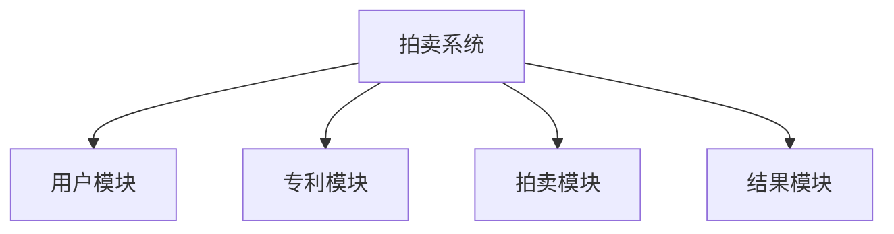

                 


# 芒格的"赢家的诅咒"提醒在量子计算专利拍卖中的应用

---

## 关键词：芒格, 赢家的诅咒, 量子计算, 专利拍卖, 技术博客

---

## 摘要：  
芒格的“赢家的诅咒”是一种深刻的心理学和经济学现象，它提醒我们在竞争激烈的市场中，胜利者往往可能因为过度自信或信息不对称而付出高昂代价。本文将探讨这一理论在量子计算专利拍卖中的具体应用，分析其对参与者、拍卖设计者以及技术发展的影响。通过结合量子计算的技术特性与拍卖机制，我们揭示了“赢家的诅咒”在这一领域的独特表现，并提出了相应的应对策略。

---

# 第一部分：芒格的"赢家的诅咒"与量子计算专利拍卖的背景

## 第1章：芒格的"赢家的诅咒"概述

### 1.1 芒格的"赢家的诅咒"核心概念  
芒格的“赢家的诅咒”理论指出，在竞争激烈的市场中，获胜者往往因为过度自信或信息不完整，而低估了竞争对手的强度或市场的复杂性。这种心理偏差可能导致他们支付过高的代价，最终反而成为“输家”。这一理论在商业、投资和科技领域都有广泛应用。

### 1.2 量子计算的基本原理  
量子计算是一种基于量子力学原理的计算方式，其核心在于利用量子叠加和量子纠缠的特性，实现比经典计算机更高效的计算能力。量子计算机在处理某些特定问题（如大数分解和优化问题）时，表现出远超经典计算机的能力。

### 1.3 专利拍卖的基本机制  
专利拍卖是一种通过市场机制分配知识产权的交易方式。它通常包括以下几个步骤：  
1. **拍卖公告**：明确拍卖的专利范围、拍卖规则和时间。  
2. **竞拍者资格审查**：确保参与者符合相关条件。  
3. **竞价过程**：竞拍者通过出价竞争，最终价高者得。  
4. **成交与交割**：拍卖成功后，买方获得专利权，卖方收到拍卖价款。

---

## 第2章：芒格的"赢家的诅咒"与量子计算专利拍卖的联系

### 2.1 量子计算专利拍卖的特殊性  
量子计算专利的拍卖具有以下特点：  
- **高价值性**：量子计算被视为未来科技的核心技术，专利价值巨大。  
- **高风险性**：量子计算技术尚未完全成熟，专利的商业价值存在不确定性。  
- **技术复杂性**：量子计算涉及复杂的物理和数学原理，专利拍卖的技术门槛较高。  

### 2.2 "赢家的诅咒"在量子计算专利拍卖中的体现  
在量子计算专利拍卖中，“赢家的诅咒”主要表现为：  
- **过度自信**：某些竞拍者可能因为对自身技术能力的过度自信，而忽视了量子计算技术的不确定性和风险。  
- **信息不对称**：拍卖过程中，买方可能因为信息不全或技术理解不足，而支付过高的价格。  
- **竞争压力**：竞拍者为了击败对手，可能不惜抬高出价，最终导致“赢家”反成“输家”。

---

## 第3章：量子计算专利拍卖的算法原理

### 3.1 量子计算专利拍卖的基本算法  
在量子计算专利拍卖中，通常采用“ Vickrey Auction”（维克里拍卖）机制，即赢家支付的是次高报价，而不是自己的报价。这种机制可以有效降低“赢家的诅咒”的影响。

### 3.2 芒格的"赢家的诅咒"对拍卖算法的影响  
为了应对“赢家的诅咒”，我们可以对拍卖算法进行优化：  
- **动态调整出价上限**：根据竞拍者的出价历史和市场反馈，动态调整拍卖的最高限价。  
- **信息共享机制**：在拍卖过程中引入信息共享机制，帮助竞拍者更全面地了解专利的技术价值和市场前景。  

### 3.3 量子计算专利拍卖的数学模型  
我们可以通过以下数学模型，量化“赢家的诅咒”对拍卖结果的影响：  
$$ \text{拍卖价格} = \max(\text{所有出价}) $$  
$$ \text{赢家成本} = \text{拍卖价格} \times \text{中标概率} $$  
通过分析上述模型，我们可以发现，当中标概率较低时，赢家的成本可能远高于预期。

---

# 第二部分：量子计算专利拍卖的系统架构与实战

## 第4章：量子计算专利拍卖的系统架构设计

### 4.1 系统功能设计  
量子计算专利拍卖系统主要包括以下功能模块：  
- **用户注册与登录**：竞拍者需要注册并登录系统。  
- **专利展示与查询**：竞拍者可以查看待拍卖的专利信息。  
- **出价与竞价**：竞拍者在规定时间内提交出价。  
- **拍卖结果公示**：系统自动公示拍卖结果。  

### 4.2 系统架构设计  
量子计算专利拍卖系统的架构如下：  



### 4.3 系统接口设计  
系统主要接口包括：  
- **API接口**：用于与其他系统（如专利数据库）对接。  
- **用户接口**：供竞拍者提交出价和查询结果。  

---

## 第5章：量子计算专利拍卖的实战分析

### 5.1 项目环境与安装  
为了实现量子计算专利拍卖系统，我们需要以下环境：  
- **编程语言**：Python 3.8+  
- **框架**：Django 或 Flask  
- **数据库**：MySQL 或 PostgreSQL  
- **开发工具**：PyCharm 或 VS Code  

### 5.2 核心算法实现  
以下是量子计算专利拍卖的核心算法实现：  

```python
def vickrey_auction(bids):
    max_bid = max(bids)
    second_max_bid = sorted(bids)[-2]
    winner_cost = second_max_bid
    return winner_cost
```

### 5.3 实际案例分析  
以某次量子计算专利拍卖为例，假设出价为：[100, 90, 80, 70]。根据维克里拍卖机制，最终成交价为90，赢家成本为90。

---

## 第6章：最佳实践与总结

### 6.1 最佳实践  
- **信息透明化**：拍卖方应尽可能提供详细的技术信息，降低竞拍者的不确定性。  
- **动态调整机制**：根据市场反馈，动态调整拍卖规则和参数。  
- **风险管理**：竞拍者应充分评估专利的技术风险和市场价值，避免盲目出价。  

### 6.2 小结  
芒格的“赢家的诅咒”提醒我们在量子计算专利拍卖中，胜利者可能因为过度自信或信息不对称而付出高昂代价。通过优化拍卖机制和算法设计，我们可以有效降低“赢家的诅咒”的影响，实现更公平和高效的专利分配。

### 6.3 注意事项  
- 量子计算专利拍卖具有高度的技术复杂性，竞拍者需充分了解技术细节。  
- 拍卖设计者应结合市场反馈，不断优化拍卖规则。  

### 6.4 拓展阅读  
- 查看更多关于量子计算的技术资料。  
- 研究其他类型的专利拍卖机制。  

---

# 作者：AI天才研究院 & 禅与计算机程序设计艺术

