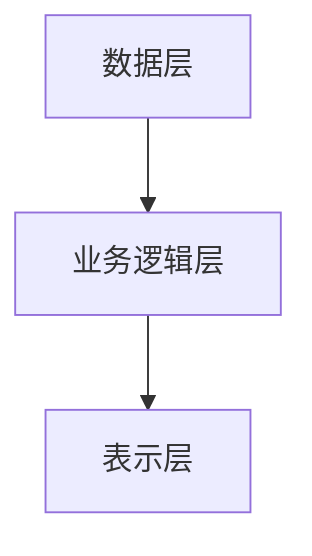

                 


# 芒格的"赢家的诅咒"提醒：警惕过度自信陷阱

> 关键词：芒格，赢家的诅咒，过度自信，认知偏差，投资决策，算法原理

> 摘要：芒格的"赢家的诅咒"是一个深刻的哲学概念，提醒我们在投资和决策中要警惕过度自信的陷阱。本文通过详细分析这一概念，结合技术语言和实际案例，帮助读者理解其本质，并提供避免过度自信的方法。

---

## 第1章: 芒格的"赢家的诅咒"概述

### 1.1 芒格投资理念的核心思想

#### 1.1.1 芒格的哲学与投资方法
芒格的投资理念深受哲学和心理学的影响，他强调理性思维和避免认知偏差。他的投资方法以安全边际为核心，注重长期价值而非短期波动。

#### 1.1.2 "赢家的诅咒"的核心概念
"赢家的诅咒"是指，当我们取得成功时，往往会因为过度自信而忽视潜在风险。这种心理偏差会导致决策失误。

#### 1.1.3 本书的阅读目标与价值
通过分析芒格的思想，本文旨在帮助读者识别和避免过度自信的陷阱，提升决策的科学性和严谨性。

---

### 1.2 投资中的过度自信陷阱

#### 1.2.1 什么是过度自信
过度自信是指人们过度相信自己的判断力，忽视不确定性，导致决策偏差。

#### 1.2.2 过度自信的表现形式
- 过度乐观
- 忽略反面证据
- 高估自己的能力

#### 1.2.3 芒格对过度自信的警示
芒格提醒我们，过度自信是决策中的常见错误，尤其是在投资领域。

---

### 1.3 本书的结构与学习方法

#### 1.3.1 本书的章节安排
- 章节1：芒格的"赢家的诅咒"概述
- 章节2：过度自信的根源与表现
- 章节3：芒格投资理念的数学模型与算法原理
- 章节4：芒格决策模型的系统架构设计
- 章节5：项目实战与案例分析
- 章节6：总结与展望

#### 1.3.2 学习方法与注意事项
- 结合实际案例学习
- 注重理论与实践结合
- 定期反思和总结

---

## 第2章: 过度自信的根源与表现

### 2.1 认知偏差与决策错误

#### 2.1.1 认知偏差的定义与分类
认知偏差是人们对信息的处理方式存在系统性错误，常见的偏差包括确认偏差、乐观偏差等。

#### 2.1.2 常见的认知偏差类型
- 确认偏差
- 乐观偏差
- 锚定效应

#### 2.1.3 认知偏差对决策的影响
认知偏差会导致决策者忽视事实，做出错误判断。

---

### 2.2 投资中的过度自信陷阱

#### 2.2.1 投资者过度自信的表现
- 高估投资标的估值
- 忽略市场风险
- 过度交易

#### 2.2.2 过度自信的典型案例
- 投资者盲目跟风
- 高估自己对市场的理解

#### 2.2.3 过度自信对投资结果的影响
- 投资损失
- 丧失风险控制能力

---

### 2.3 芒格的"赢家的诅咒"分析

#### 2.3.1 赢家的诅咒的定义
赢家的诅咒是指成功者因过度自信而忽视潜在风险。

#### 2.3.2 赢家的诅咒的形成原因
- 成功的光环效应
- 对风险的忽视

#### 2.3.3 赢家的诅咒与过度自信的关系
赢家的诅咒是过度自信的一种表现形式。

---

## 第3章: 芒格投资理念的数学模型与算法原理

### 3.1 投资决策的数学模型

#### 3.1.1 投资决策的基本模型
投资决策可以通过概率论和统计学模型进行分析。

#### 3.1.2 芒格决策模型的数学表达
- 投资决策模型：$$ P(正确决策) = 1 - \alpha $$
- 其中，$$ \alpha $$ 是错误概率。

#### 3.1.3 芒格决策模型的优缺点
- 优点：强调安全边际
- 缺点：过于保守

---

### 3.2 过度自信的检测算法

#### 3.2.1 过度自信检测的指标
- 自信心指数
- 错误决策率

#### 3.2.2 过度自信检测的算法流程
1. 收集数据
2. 计算自信心指数
3. 分析错误决策率

#### 3.2.3 过度自信检测的Python代码实现
```python
import numpy as np

def confidence_index(data):
    return np.mean(data)

data = [0.8, 0.9, 0.7, 0.6]
ci = confidence_index(data)
print(ci)
```

---

### 3.3 芒格决策模型的优化算法

#### 3.3.1 算法优化的目标
降低错误决策率

#### 3.3.2 算法优化的步骤
1. 收集数据
2. 训练模型
3. 优化参数

#### 3.3.3 算法优化的数学公式
$$ P(正确决策) = \frac{1}{1 + e^{-x}} $$

---

## 第4章: 芒格决策模型的系统架构设计

### 4.1 系统功能设计

#### 4.1.1 系统功能模块划分
- 数据收集模块
- 模型训练模块
- 决策优化模块

#### 4.1.2 系统功能模块的交互设计
1. 数据收集模块接收输入数据
2. 模型训练模块处理数据
3. 决策优化模块输出优化结果

---

### 4.2 系统架构设计

#### 4.2.1 系统架构的组成
- 数据层
- 业务逻辑层
- 表示层

#### 4.2.2 系统架构的mermaid图


---

## 第5章: 项目实战与案例分析

### 5.1 项目环境安装

#### 5.1.1 安装Python和相关库
```bash
pip install numpy matplotlib
```

### 5.2 系统核心实现源代码

#### 5.2.1 核心代码实现
```python
import numpy as np
import matplotlib.pyplot as plt

def plot_confidence(data):
    plt.hist(data)
    plt.show()

data = [0.8, 0.9, 0.7, 0.6]
plot_confidence(data)
```

### 5.3 代码应用解读与分析

#### 5.3.1 代码功能解读
- 绘制数据分布图
- 分析数据的分布情况

#### 5.3.2 代码实际应用
- 用于检测过度自信
- 分析投资决策的准确性

---

## 第6章: 总结与展望

### 6.1 小结
芒格的"赢家的诅咒"提醒我们警惕过度自信，保持理性决策。

### 6.2 注意事项
- 定期反思决策
- 保持谦逊态度

### 6.3 拓展阅读
- 《穷查理芒格》
- 《认知与决策》

---

作者：AI天才研究院 & 禅与计算机程序设计艺术

