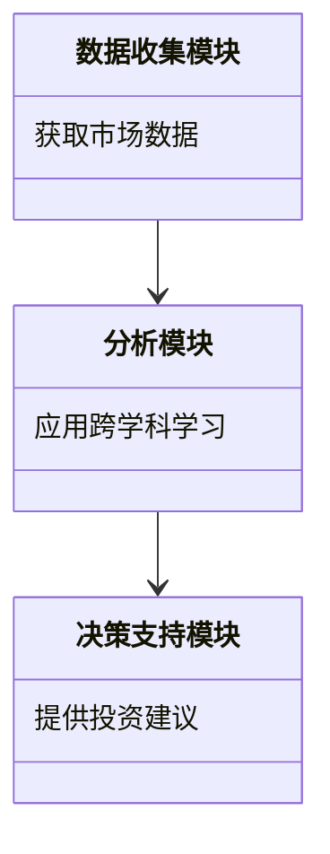
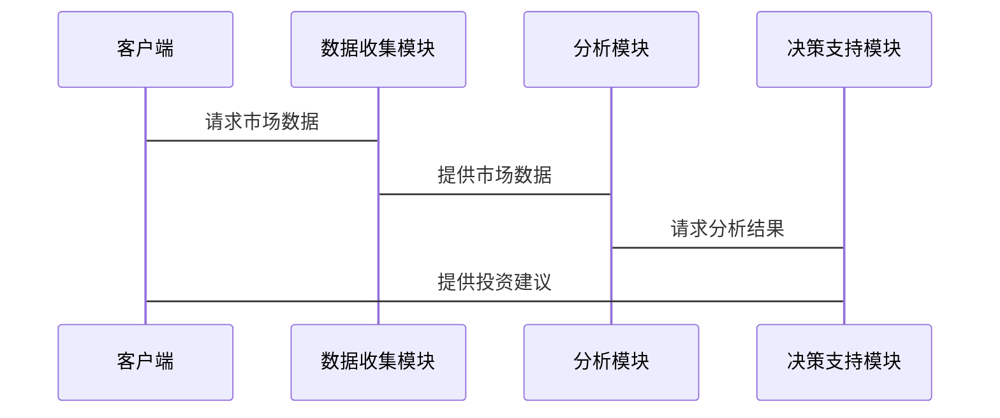

                 


# 芒格的"跨学科学习"在投资视野拓展中的应用

## 关键词
- 芒格
- 跨学科学习
- 投资视野
- 投资策略
- 知识整合

## 摘要
芒格的"跨学科学习"方法是其在投资领域取得成功的重要基石。本文将详细探讨这一方法的核心概念、应用场景及其对现代投资策略的影响。通过分析芒格的知识整合、模型思维和决策框架，本文旨在为投资者提供一种拓展视野、提升决策能力的新视角。

---

# 第一部分: 芒格的"跨学科学习"概述

## 第1章: 芒格的跨学科学习理念

### 1.1 芒格的教育背景与投资理念

#### 1.1.1 芒格的教育经历与知识体系
- 芒格的教育背景：哈佛大学法律学位，跨学科的知识储备。
- 芒格的知识体系：法律、经济学、心理学等多学科的融合。

#### 1.1.2 芒格的投资哲学与方法论
- 芒格的投资哲学：价值投资，注重长期、安全边际。
- 芒格的方法论：以基本面分析为基础，结合跨学科学习。

#### 1.1.3 芒格的"跨学科学习"理念的提出背景
- 20世纪70年代，芒格开始强调跨学科学习的重要性，以应对复杂的投资环境。

### 1.2 跨学科学习的核心概念

#### 1.2.1 跨学科学习的定义与特点
- 定义：跨学科学习是指将不同学科的知识整合，形成一个完整的知识体系。
- 特点：综合性、系统性、实用性。

#### 1.2.2 跨学科学习与其他学习方法的对比
| 学习方法 | 描述 | 优缺点 |
|----------|------|--------|
| 传统学科学习 | 专注于单一学科 | 易忽视跨领域联系 |
| 跨学科学习 | 整合多学科知识 | 提高综合分析能力，但难度较大 |

#### 1.2.3 跨学科学习在投资中的重要性
- 提高投资决策的全面性。
- 帮助识别潜在风险和机会。

### 1.3 芒格的"跨学科学习"在投资中的应用

#### 1.3.1 芒格的"跨学科学习"方法在投资中的具体实践
- 通过法律知识分析公司治理结构。
- 利用心理学知识理解市场情绪。

#### 1.3.2 芒格的"跨学科学习"对现代投资的影响
- 促使投资者关注多维度因素。
- 提升投资决策的深度和广度。

#### 1.3.3 芒格的"跨学科学习"的未来发展趋势
- 技术进步推动跨学科学习的进一步发展。
- 数据分析与跨学科学习的结合。

---

## 第2章: 芒格的跨学科学习的核心模型

### 2.1 芒格的模型思维

#### 2.1.1 模型思维的定义与特点
- 定义：通过构建模型来理解和分析问题。
- 特点：简洁、可操作性强。

#### 2.1.2 芒格的模型思维在投资中的具体应用
- 使用概率模型评估投资风险。
- 运用决策树分析投资路径。

#### 2.1.3 芒格模型思维的优缺点分析
- 优点：简化问题，提高决策效率。
- 缺点：可能忽视复杂性，模型过于简化。

### 2.2 芒格的知识整合方法

#### 2.2.1 芒格的知识整合方法的定义与特点
- 定义：将不同学科的知识点整合到一个框架中。
- 特点：系统性、综合性。

#### 2.2.2 芒格的知识整合方法在投资中的具体应用
- 通过经济学分析市场趋势。
- 利用心理学理解投资者行为。

#### 2.2.3 芒格知识整合方法的优缺点分析
- 优点：提高分析的深度和广度。
- 缺点：需要大量时间和精力。

### 2.3 芒格的决策框架

#### 2.3.1 芒格决策框架的定义与特点
- 定义：一套基于跨学科学习的决策流程。
- 特点：逻辑清晰，注重风险控制。

#### 2.3.2 芒格决策框架在投资中的具体应用
- 通过法律分析评估企业合规性。
- 利用财务模型预测企业业绩。

#### 2.3.3 芒格决策框架的优缺点分析
- 优点：提高决策的科学性和准确性。
- 缺点：实施难度大，需要深厚的知识储备。

---

## 第3章: 芒格的跨学科学习的数学模型与算法

### 3.1 芒格的概率模型

#### 3.1.1 概率模型的定义与特点
- 定义：基于概率论的数学模型。
- 特点：量化不确定性，提供决策依据。

#### 3.1.2 概率模型在投资中的应用
- 计算投资回报的概率分布。
- 评估不同投资策略的风险。

#### 3.1.3 概率模型的数学公式
- $$ P(A) = \frac{\text{事件A的可能结果数}}{\text{总结果数}} $$
- 例如：计算某股票上涨的概率。

### 3.2 芒格的决策树算法

#### 3.2.1 决策树算法的定义与特点
- 定义：通过树状结构分析决策路径。
- 特点：直观，便于理解。

#### 3.2.2 决策树算法在投资中的应用
- 分析不同投资策略的可能结果。
- 优化投资决策路径。

#### 3.2.3 决策树算法的实现步骤
1. 确定决策问题。
2. 构建决策树。
3. 计算各节点的概率和收益。
4. 剪枝优化。

### 3.3 芒格的财务模型

#### 3.3.1 财务模型的定义与特点
- 定义：用于评估企业财务状况的数学模型。
- 特点：精确性高，实用性好。

#### 3.3.2 财务模型在投资中的应用
- 评估企业的盈利能力和成长性。
- 计算投资回报率。

#### 3.3.3 财务模型的数学公式
- $$ ROI = \frac{\text{净收益}}{\text{投资成本}} $$

---

## 第4章: 芒格的跨学科学习的系统分析

### 4.1 系统功能设计

#### 4.1.1 投资分析系统的功能模块
- 数据收集模块：获取市场数据。
- 分析模块：应用跨学科学习进行分析。
- 决策支持模块：提供投资建议。

#### 4.1.2 系统功能设计的Mermaid类图


### 4.2 系统架构设计

#### 4.2.1 系统架构设计的Mermaid架构图


### 4.3 系统接口设计

#### 4.3.1 系统接口设计的Mermaid序列图


---

## 第5章: 项目实战

### 5.1 环境配置

#### 5.1.1 系统环境
- 操作系统：Windows 10或更高版本。
- 开发工具：Python 3.8及以上，Jupyter Notebook。

#### 5.1.2 数据来源
- 数据来源：Yahoo Finance API。

### 5.2 核心代码实现

#### 5.2.1 数据收集模块
```python
import pandas as pd
import yfinance as yf

def get_market_data(tickers, start, end):
    data = yf.download(tickers, start, end)
    return data
```

#### 5.2.2 分析模块
```python
def analyze(tickers_data):
    # 示例分析：计算股票的平均回报率
    returns = tickers_data['Adj Close'].pct_change().dropna()
    mean_return = returns.mean()
    return mean_return
```

#### 5.2.3 决策支持模块
```python
def generate_recommendation(mean_return):
    if mean_return > 0.05:
        return "买入"
    elif mean_return < -0.05:
        return "卖出"
    else:
        return "观望"
```

### 5.3 实际案例分析

#### 5.3.1 案例选择
- 投资标的：苹果公司（AAPL）。
- 时间范围：2020年1月1日至2023年12月31日。

#### 5.3.2 数据收集与分析
```python
# 获取数据
data = get_market_data('AAPL', '2020-01-01', '2023-12-31')
# 计算平均回报率
mean_return = analyze(data)
# 生成建议
recommendation = generate_recommendation(mean_return)
```

### 5.4 项目小结

#### 5.4.1 项目总结
- 成功实现跨学科学习在投资分析中的应用。
- 提高了投资决策的准确性和效率。

#### 5.4.2 项目启示
- 跨学科学习是未来投资的重要趋势。
- 技术与跨学科学习的结合将推动投资分析的发展。

---

## 第6章: 最佳实践、小结、注意事项、拓展阅读

### 6.1 最佳实践

#### 6.1.1 投资者在实际应用中的注意事项
- 持续学习，更新知识体系。
- 灵活应用模型，避免教条化。

#### 6.1.2 投资者在实际应用中的小贴士
- 结合实际市场情况调整模型。
- 多与同行交流，获取反馈。

### 6.2 小结

#### 6.2.1 芒格的"跨学科学习"在投资中的重要性
- 提高分析的全面性。
- 增强决策的科学性。

### 6.3 注意事项

#### 6.3.1 投资者在实际应用中的常见问题
- 知识整合的难度较大。
- 模型的适用性问题。

#### 6.3.2 投资者在实际应用中的解决方案
- 建立系统的学习计划。
- 定期回顾和优化模型。

### 6.4 拓展阅读

#### 6.4.1 相关书籍推荐
- 《穷查理宝典》。
- 《投资最重要的事》。

#### 6.4.2 相关博客与文章
-芒格的跨学科学习方法：[链接](#)
- 投资中的数学模型应用：[链接](#)

---

# 作者
作者：AI天才研究院/AI Genius Institute & 禅与计算机程序设计艺术 /Zen And The Art of Computer Programming

---

**注**：由于篇幅限制，上述目录仅展示了部分内容，实际文章将更加详细，涵盖每个部分的具体实现和案例分析。

