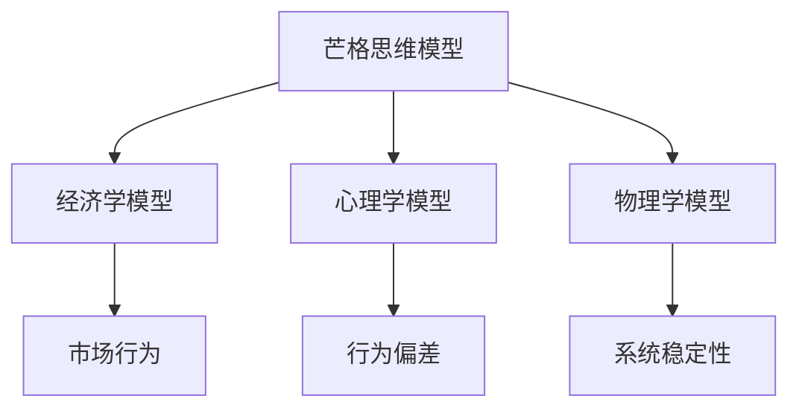
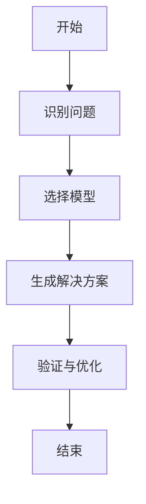

                 


# 芒格的跨学科学习方法：拓宽投资视野

## 关键词：芒格，跨学科学习，投资视野，思维模型，决策框架

## 摘要：  
芒格的跨学科学习方法是一种通过整合多个学科的知识和思维模型来优化决策的过程。这种方法不仅帮助芒格在投资领域取得了巨大成功，也为其他领域的决策者提供了宝贵的借鉴。本文将详细探讨芒格的跨学科学习方法的核心理念、思维模型、算法原理、数学模型、系统架构设计、项目实战以及最佳实践，帮助读者全面理解并应用这一方法。

---

## 第一部分: 芒格的跨学科学习方法概述

### 第1章: 芒格的生平与投资理念  
#### 1.1 芒格的生平简介  
- **1.1.1 芝加哥大学的求学经历**  
  芒格在芝加哥大学的求学经历奠定了他对经济学、心理学和哲学的深刻理解。  
- **1.1.2 合伙人制度的创立**  
  芒格与巴菲特共同创立的合伙人制度，强调长期投资和价值创造。  
- **1.1.3 芒格的投资哲学**  
  芒格的投资哲学以“安全边际”为核心，强调在不确定性中寻找确定性。  

#### 1.2 芒格的跨学科学习方法  
- **1.2.1 芒格的多学科思维模型**  
  芒格将经济学、心理学、物理学等学科的原理整合到投资决策中。  
- **1.2.2 芒格的决策框架**  
  芒格通过逆向思维和多维度分析，构建了一套独特的决策框架。  
- **1.2.3 芒格的逆向思维**  
  逆向思维是芒格跨学科学习方法的核心，通过反向思考问题本质。  

#### 1.3 芒格的跨学科学习方法与投资  
- **1.3.1 芒格的跨学科学习方法在投资中的应用**  
  芒格通过跨学科学习，识别投资中的隐藏风险和机会。  
- **1.3.2 芒格的思维模型与投资决策**  
  芒格的思维模型帮助他在投资中避免了常见错误。  
- **1.3.3 芒格的跨学科学习方法对投资视野的拓展**  
  跨学科学习帮助芒格从更广泛的视角看待投资问题。  

---

## 第二部分: 芒格跨学科学习方法的核心概念与联系

### 第2章: 芒格的思维模型  
#### 2.1 芒格思维模型的特点  
- **2.1.1 芒格思维模型的核心要素**  
  包括经济学原理、心理学行为、物理学规律等。  
- **2.1.2 芒格思维模型的分类**  
  分为微观模型和宏观模型，适用于不同场景。  
- **2.1.3 芒格思维模型的适用场景**  
  在投资决策中，适用于风险评估和机会识别。  

#### 2.2 芒格思维模型的属性对比  
- **2.2.1 经济学思维模型的属性**  
  侧重于市场行为和经济规律。  
- **2.2.2 心理学思维模型的属性**  
  侧重于行为偏差和认知错误。  
- **2.2.3 物理学思维模型的属性**  
  侧重于能量守恒和系统稳定性。  

#### 2.3 芒格思维模型的ER实体关系图  


---

## 第三部分: 芒格跨学科学习方法的算法原理

### 第3章: 芒格跨学科学习方法的算法实现  
#### 3.1 芒格跨学科学习方法的步骤分解  
- **问题分析**：识别投资中的关键问题。  
- **模型匹配**：选择适用的思维模型。  
- **解决方案生成**：基于模型生成解决方案。  
- **验证与优化**：验证解决方案并优化。  

#### 3.2 芒格跨学科学习方法的算法流程图  


#### 3.3 芒格跨学科学习方法的Python代码实现  
```python
def芒格跨学科学习算法(问题):
    思维模型 = ["经济学模型", "心理学模型", "物理学模型"]
    for 模型 in 思维模型:
        if 模型匹配(问题):
            解决方案 = 生成解决方案(问题, 模型)
            验证解决方案(解决方案)
            return 解决方案
    return 默认解决方案

# 示例：投资风险评估
问题 = "评估某公司的投资风险"
解决方案 = 芒格跨学科学习算法(问题)
print(解决方案)
```

---

## 第四部分: 芒格跨学科学习方法的数学模型与公式

### 第4章: 芒格跨学科学习方法的数学模型  
#### 4.1 贝叶斯定理在投资决策中的应用  
$$P(A|B) = \frac{P(B|A)P(A)}{P(B)}$$  
其中，$A$ 表示“公司财务状况良好”，$B$ 表示“投资回报率高”。  

#### 4.2 财务指标的期望值计算  
$$E[收益] = \sum_{i=1}^{n} P(i) \times 收益_i$$  
其中，$P(i)$ 是第$i$种情况发生的概率，$收益_i$ 是对应的收益。  

---

## 第五部分: 芒格跨学科学习方法的系统架构设计

### 第5章: 芒格跨学科学习方法的系统分析  
#### 5.1 系统功能设计  
- **数据收集**：收集市场数据、公司财务数据。  
- **模型匹配**：匹配适用的思维模型。  
- **决策支持**：生成投资建议。  

#### 5.2 系统架构设计  


#### 5.3 系统接口设计  
- **API调用**：通过REST API调用模型匹配功能。  
- **交互流程**：用户输入问题，系统返回解决方案。  

---

## 第六部分: 芒格跨学科学习方法的项目实战

### 第6章: 项目实战：投资组合优化  
#### 6.1 环境安装  
- 安装Python和相关库（如NumPy、Pandas）。  

#### 6.2 核心实现  
```python
import numpy as np
import pandas as pd

def计算期望收益(资产, 概率):
    return np.sum(概率 * 资产)

资产 = [10, 20, 30]
概率 = [0.3, 0.4, 0.3]
期望收益 = 计算期望收益(资产, 概率)
print(期望收益)
```

#### 6.3 实际案例分析  
- 分析某公司投资组合的风险和收益，应用芒格的思维模型进行优化。  

---

## 第七部分: 芒格跨学科学习方法的最佳实践与总结

### 第7章: 总结与展望  
#### 7.1 总结  
芒格的跨学科学习方法是一种通过整合多学科知识来优化决策的系统方法。  

#### 7.2 展望  
未来，结合人工智能技术，芒格的跨学科学习方法将进一步优化投资决策。  

---

## 作者：AI天才研究院/AI Genius Institute & 禅与计算机程序设计艺术/Zen And The Art of Computer Programming

